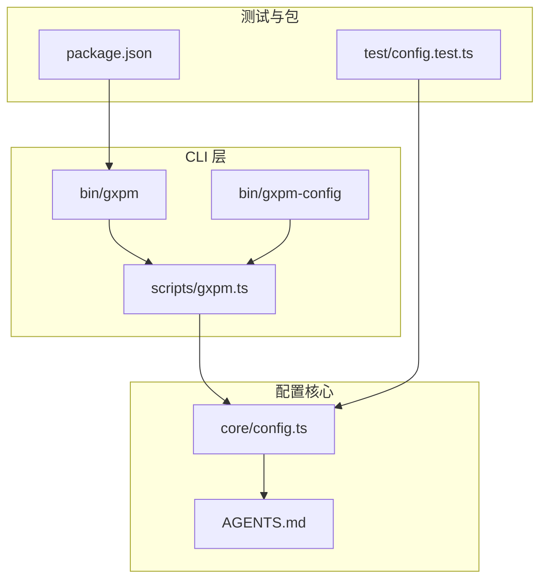
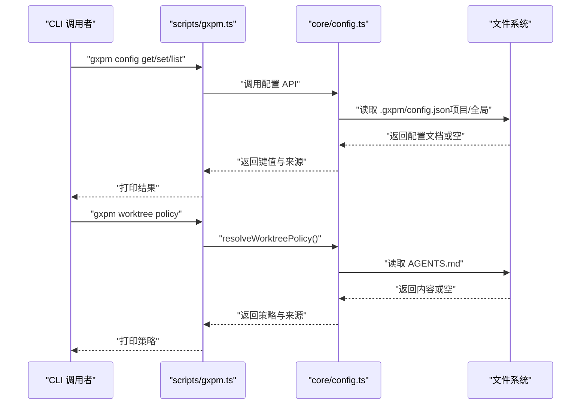
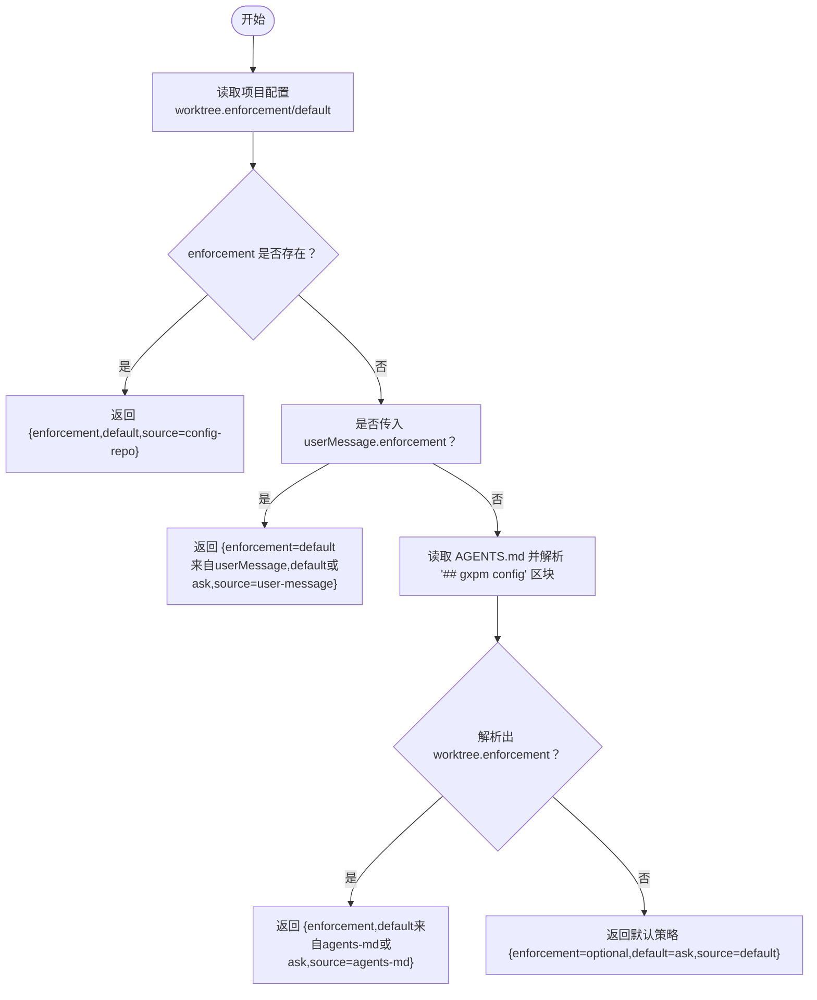
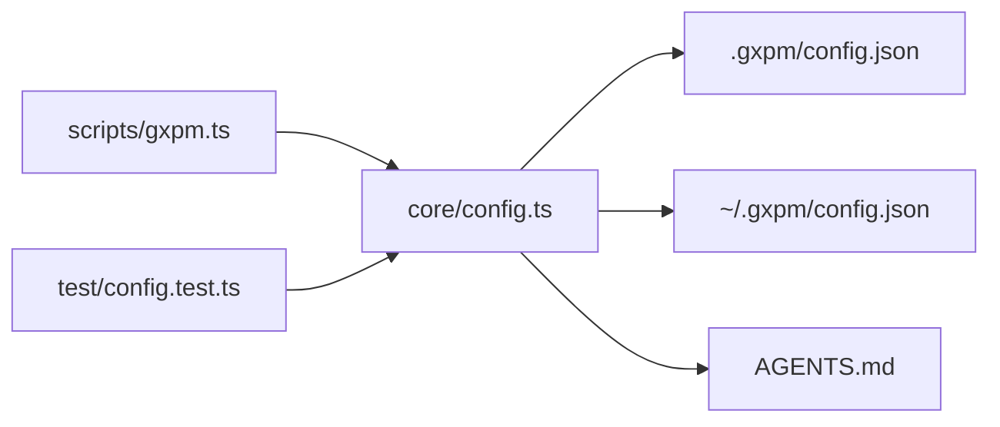

# 配置系统

<cite>
**本文引用的文件**
- [core/config.ts](file://core/config.ts)
- [AGENTS.md](file://AGENTS.md)
- [scripts/gxpm.ts](file://scripts/gxpm.ts)
- [test/config.test.ts](file://test/config.test.ts)
- [bin/gxpm](file://bin/gxpm)
- [bin/gxpm-config](file://bin/gxpm-config)
- [package.json](file://package.json)
</cite>

## 目录
1. [简介](#简介)
2. [项目结构](#项目结构)
3. [核心组件](#核心组件)
4. [架构总览](#架构总览)
5. [详细组件分析](#详细组件分析)
6. [依赖关系分析](#依赖关系分析)
7. [性能考量](#性能考量)
8. [故障排查指南](#故障排查指南)
9. [结论](#结论)
10. [附录](#附录)

## 简介
本文件系统性阐述 gxpm 的配置系统，重点包括：
- 多层配置结构：全局配置、项目配置与工作树策略的优先级
- 工作树策略解析机制：AGENTS.md 配置块的格式与解析规则
- 配置加载流程：配置文件的查找顺序与合并策略
- 环境变量支持与配置覆盖规则
- 配置管理的代码示例与结构图、解析流程图

## 项目结构
配置系统围绕以下文件展开：
- 核心实现：core/config.ts
- 仓库约定配置：AGENTS.md
- CLI 入口与配置子命令：scripts/gxpm.ts
- 测试用例：test/config.test.ts
- 可执行入口：bin/gxpm、bin/gxpm-config
- 包元信息：package.json



图表来源
- [bin/gxpm](file://bin/gxpm)
- [bin/gxpm-config](file://bin/gxpm-config)
- [scripts/gxpm.ts](file://scripts/gxpm.ts)
- [core/config.ts](file://core/config.ts)
- [AGENTS.md](file://AGENTS.md)
- [test/config.test.ts](file://test/config.test.ts)
- [package.json](file://package.json)

章节来源
- [core/config.ts](file://core/config.ts)
- [AGENTS.md](file://AGENTS.md)
- [scripts/gxpm.ts](file://scripts/gxpm.ts)
- [test/config.test.ts](file://test/config.test.ts)
- [bin/gxpm](file://bin/gxpm)
- [bin/gxpm-config](file://bin/gxpm-config)
- [package.json](file://package.json)

## 核心组件
- 配置文档模型与键访问：支持点号分隔的嵌套键，提供读取与赋值工具函数
- 配置文件位置：
  - 项目级：仓库根下的 .gxpm/config.json
  - 全局级：用户主目录下的 ~/.gxpm/config.json
- 工作树策略类型与来源：
  - enforcement：required | forbidden | optional | unset
  - default：use | skip | ask
  - 来源：config-repo | config-global | user-message | agents-md | default
- AGENTS.md 解析：识别 “## gxpm config” 区块，提取键值对，支持布尔、数字与字符串

章节来源
- [core/config.ts](file://core/config.ts)
- [AGENTS.md](file://AGENTS.md)

## 架构总览
配置系统采用“多层优先级 + 约定式配置”的设计：
- 优先级（从高到低）：项目配置 > 全局配置 > 用户消息（当前对话覆盖） > AGENTS.md 约定 > 默认值
- 项目配置与全局配置通过 JSON 文件存储，键空间支持嵌套
- 工作树策略解析贯穿上述优先级链路，并在解析后返回策略来源



图表来源
- [scripts/gxpm.ts](file://scripts/gxpm.ts)
- [core/config.ts](file://core/config.ts)

## 详细组件分析

### 组件一：配置文档与键访问
- 设计要点
  - 使用点号键（如 worktree.enforcement）表达嵌套配置
  - lookup 支持按路径逐层取值，assign 支持按路径创建中间对象
  - normalizeValue 将字符串字面量转换为布尔/数字/字符串
- 键空间与来源
  - 项目配置：.gxpm/config.json
  - 全局配置：~/.gxpm/config.json
  - 来源标注：config-repo | config-global | unset

```mermaid
flowchart TD
Start(["开始"]) --> ReadRepo["读取项目配置<br/>.gxpm/config.json]
ReadRepo --> RepoFound{"存在且可解析？"}
RepoFound --> |是| LookupRepo["按 key 查找嵌套值"]
RepoFound --> |否| ReadGlobal["读取全局配置<br/>~/.gxpm/config.json"]
LookupRepo --> FoundRepo{"找到值？"}
FoundRepo --> |是| ReturnRepo["返回值与来源 config-repo"]
FoundRepo --> |否| ReadGlobal
ReadGlobal --> GlobalFound{"存在且可解析？"}
GlobalFound --> |是| LookupGlobal["按 key 查找嵌套值"]
GlobalFound --> |否| ReturnUnset["返回值为 undefined，来源 unset"]
LookupGlobal --> FoundGlobal{"找到值？"}
FoundGlobal --> |是| ReturnGlobal["返回值与来源 config-global"]
FoundGlobal --> |否| ReturnUnset
```

图表来源
- [core/config.ts](file://core/config.ts)

章节来源
- [core/config.ts](file://core/config.ts)

### 组件二：工作树策略解析
- 解析优先级链路
  1) 项目配置（repo）：若存在 worktree.enforcement，则直接返回，default 若缺失则回退为 "ask"
  2) 用户消息（userMessage）：若传入 enforcement，则覆盖 AGENTS.md
  3) AGENTS.md：解析 “## gxpm config” 区块，提取 worktree.* 键
  4) 默认：enforcement="optional"，default="ask"，source="default"
- 输入参数
  - root：仓库根（默认当前工作目录）
  - home：用户主目录（默认 OS home）
  - userMessage：当前对话中用户声明的工作树偏好
  - agentsMdContent：显式传入 AGENTS.md 内容（用于测试）



图表来源
- [core/config.ts](file://core/config.ts)

章节来源
- [core/config.ts](file://core/config.ts)

### 组件三：AGENTS.md 配置块解析
- 规则
  - 识别标题 “## gxpm config”
  - 提取该节内的键值行（支持无前缀横线的行）
  - 键必须包含点号（如 worktree.enforcement）
  - 值进行规范化（布尔、数字、字符串）
- 示例键
  - worktree.enforcement
  - worktree.default

章节来源
- [AGENTS.md](file://AGENTS.md)
- [core/config.ts](file://core/config.ts)

### 组件四：CLI 配置子命令
- config get：读取指定键，输出值与来源
- config set：写入指定键（支持 --global 切换作用域）
- config list：列出项目与全局配置文档
- worktree policy：输出工作树策略与来源

章节来源
- [scripts/gxpm.ts](file://scripts/gxpm.ts)
- [bin/gxpm](file://bin/gxpm)

## 依赖关系分析
- CLI 依赖 core/config.ts 提供的配置 API
- AGENTS.md 作为约定式配置来源参与策略解析
- 测试用例覆盖配置读写、解析与策略优先级



图表来源
- [scripts/gxpm.ts](file://scripts/gxpm.ts)
- [core/config.ts](file://core/config.ts)
- [AGENTS.md](file://AGENTS.md)
- [test/config.test.ts](file://test/config.test.ts)

章节来源
- [scripts/gxpm.ts](file://scripts/gxpm.ts)
- [core/config.ts](file://core/config.ts)
- [test/config.test.ts](file://test/config.test.ts)

## 性能考量
- 配置读取为轻量级文件 I/O，解析复杂度与键深度线性相关
- 建议：
  - 避免频繁重复读取同一配置
  - 在批量场景下缓存已解析的配置文档
  - 控制嵌套键深度，保持配置简洁可维护

## 故障排查指南
- 键不存在
  - 表现：config get 返回 <unset>，source 为 unset
  - 处理：确认键名正确（包含点号）、作用域（repo/global）
- JSON 解析错误
  - 表现：读取配置时捕获异常并返回空文档
  - 处理：检查 .gxpm/config.json 语法，确保为合法 JSON
- AGENTS.md 未生效
  - 表现：策略未按预期
  - 处理：确认标题为 “## gxpm config”，键符合 worktree.*，值可被规范化
- 优先级不符合预期
  - 表现：repo 配置未覆盖 global
  - 处理：检查 repo 配置文件是否存在且键正确；测试用例可参考

章节来源
- [core/config.ts](file://core/config.ts)
- [test/config.test.ts](file://test/config.test.ts)

## 结论
gxpm 的配置系统以清晰的多层优先级与约定式配置为核心，既保证了灵活性（可通过 AGENTS.md 约定工作流），又提供了强约束（项目配置可覆盖全局）。通过 CLI 子命令与核心 API，用户可以便捷地读取、设置与诊断配置。

## 附录

### 配置加载与覆盖规则
- 加载顺序
  1) 项目配置（.gxpm/config.json）
  2) 全局配置（~/.gxpm/config.json）
  3) 用户消息（当前对话覆盖）
  4) AGENTS.md 约定
  5) 默认值
- 覆盖规则
  - 项目配置覆盖全局配置
  - 用户消息覆盖 AGENTS.md（在无项目配置时）
  - AGENTS.md 覆盖默认值

章节来源
- [core/config.ts](file://core/config.ts)
- [AGENTS.md](file://AGENTS.md)

### 配置管理代码示例（路径指引）
- 读取配置值
  - 路径：[core/config.ts](file://core/config.ts)
  - 函数：getConfigValue
- 设置配置值
  - 路径：[core/config.ts](file://core/config.ts)
  - 函数：setConfigValue
- 列出配置
  - 路径：[core/config.ts](file://core/config.ts)
  - 函数：listConfig
- 解析 AGENTS.md 配置块
  - 路径：[core/config.ts](file://core/config.ts)
  - 函数：parseAgentsMdConfig
- 解析工作树策略
  - 路径：[core/config.ts](file://core/config.ts)
  - 函数：resolveWorktreePolicy
- CLI 配置子命令
  - 路径：[scripts/gxpm.ts](file://scripts/gxpm.ts)
  - 子命令：config get / set / list
- CLI 工作树策略
  - 路径：[scripts/gxpm.ts](file://scripts/gxpm.ts)
  - 子命令：worktree policy

章节来源
- [core/config.ts](file://core/config.ts)
- [scripts/gxpm.ts](file://scripts/gxpm.ts)
- [test/config.test.ts](file://test/config.test.ts)