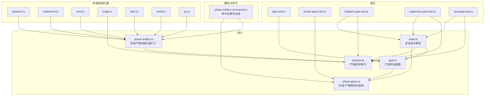
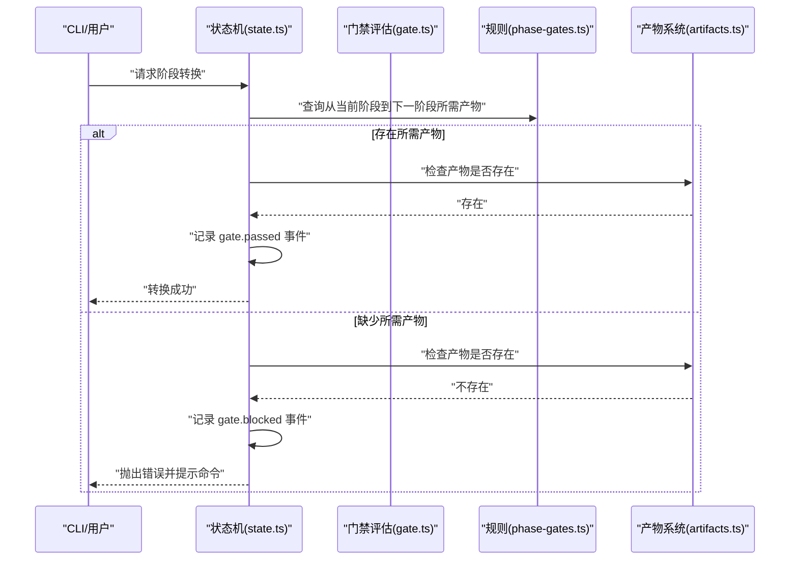
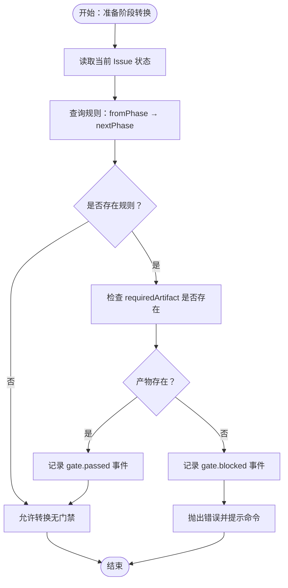
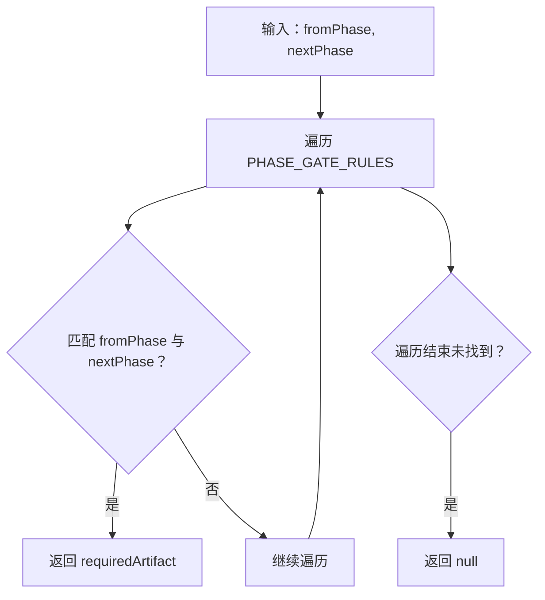
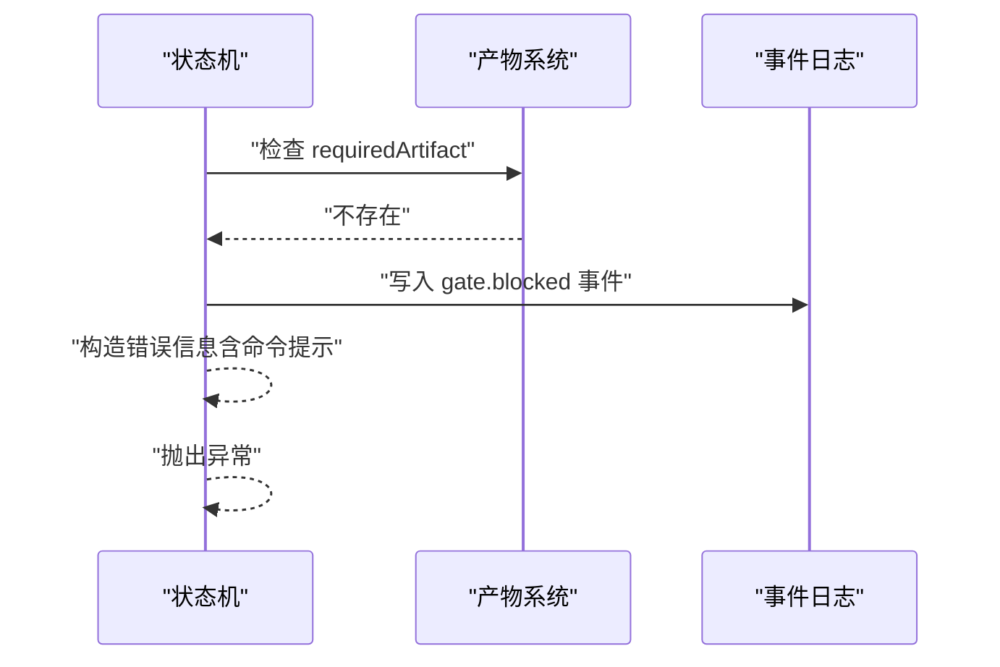
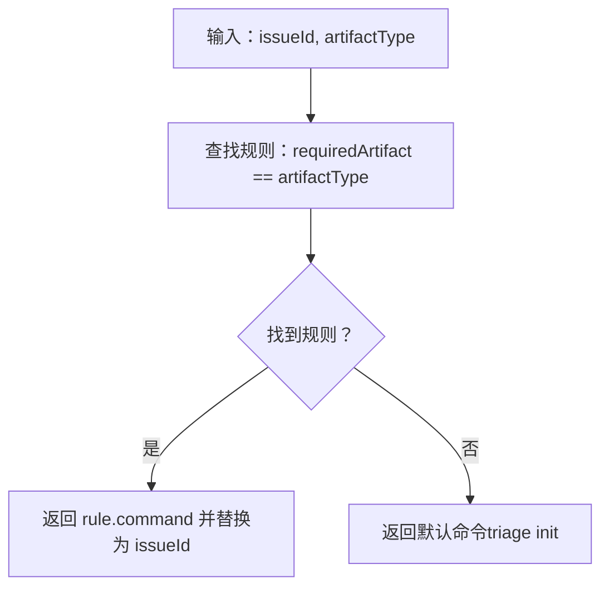
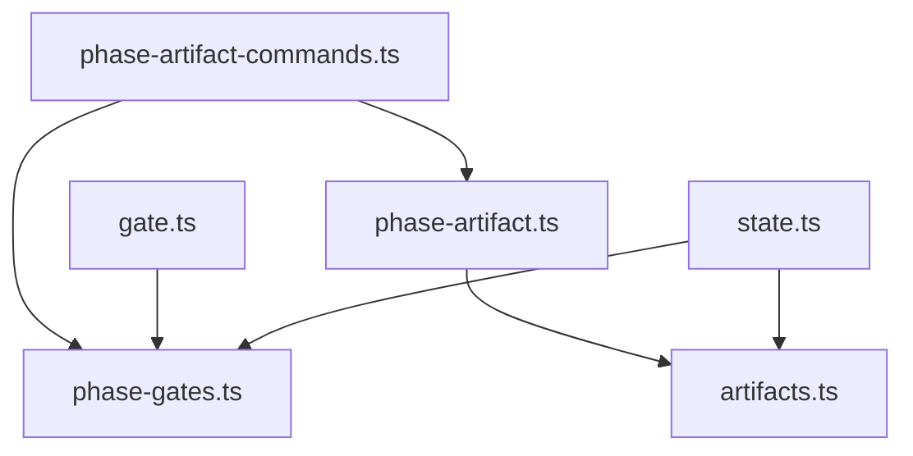

# 门禁机制

<cite>
**本文引用的文件**
- [core/gate.ts](file://core/gate.ts)
- [core/phase-gates.ts](file://core/phase-gates.ts)
- [core/artifacts.ts](file://core/artifacts.ts)
- [core/state.ts](file://core/state.ts)
- [core/phase-artifact.ts](file://core/phase-artifact.ts)
- [scripts/phase-artifact-commands.ts](file://scripts/phase-artifact-commands.ts)
- [test/gate.test.ts](file://test/gate.test.ts)
- [test/phase-gates.test.ts](file://test/phase-gates.test.ts)
- [test/dispatch-gate.test.ts](file://test/dispatch-gate.test.ts)
- [test/implement-gate.test.ts](file://test/implement-gate.test.ts)
- [test/land-gate.test.ts](file://test/land-gate.test.ts)
- [core/dispatch.ts](file://core/dispatch.ts)
- [core/implement.ts](file://core/implement.ts)
- [core/land.ts](file://core/land.ts)
- [core/triage.ts](file://core/triage.ts)
- [core/plan.ts](file://core/plan.ts)
- [core/verify.ts](file://core/verify.ts)
- [core/qa.ts](file://core/qa.ts)
</cite>

## 目录
1. [简介](#简介)
2. [项目结构](#项目结构)
3. [核心组件](#核心组件)
4. [架构总览](#架构总览)
5. [详细组件分析](#详细组件分析)
6. [依赖关系分析](#依赖关系分析)
7. [性能考量](#性能考量)
8. [故障排查指南](#故障排查指南)
9. [结论](#结论)
10. [附录](#附录)

## 简介
本文件系统化阐述 gxpm 的门禁机制，重点覆盖以下方面：
- 阶段转换的强制性验证原理：何时触发门禁检查、如何判定是否允许转换。
- 必需产物（artifact）的定义与查找机制：getRequiredArtifactForTransition 的工作原理与调用链。
- 门禁失败的处理流程：gate.blocked 事件记录、错误信息生成与提示。
- 门禁命令的自动生成机制：getGateCommand 的实现与 CLI 命令对齐。
- 具体的门禁检查示例：展示如何验证阶段转换的合法性。
- 门禁规则图与转换验证流程说明。

## 项目结构
门禁机制涉及的核心模块如下：
- 核心逻辑与规则：core/gate.ts、core/phase-gates.ts
- 产物读写与索引：core/artifacts.ts、core/phase-artifact.ts
- 状态机与门禁断言：core/state.ts
- CLI 命令注册与生成：scripts/phase-artifact-commands.ts
- 测试用例：test/gate.test.ts、test/phase-gates.test.ts、test/dispatch-gate.test.ts、test/implement-gate.test.ts、test/land-gate.test.ts
- 各阶段初始化器：core/dispatch.ts、core/implement.ts、core/land.ts、core/triage.ts、core/plan.ts、core/verify.ts、core/qa.ts

**图表来源**
- [core/gate.ts:1-144](file://core/gate.ts#L1-L144)
- [core/phase-gates.ts:1-118](file://core/phase-gates.ts#L1-L118)
- [core/artifacts.ts:1-169](file://core/artifacts.ts#L1-L169)
- [core/state.ts:1-302](file://core/state.ts#L1-L302)
- [core/phase-artifact.ts:1-33](file://core/phase-artifact.ts#L1-L33)
- [scripts/phase-artifact-commands.ts:1-84](file://scripts/phase-artifact-commands.ts#L1-L84)
- [test/gate.test.ts:1-128](file://test/gate.test.ts#L1-L128)
- [test/phase-gates.test.ts:1-118](file://test/phase-gates.test.ts#L1-L118)
- [test/dispatch-gate.test.ts:1-92](file://test/dispatch-gate.test.ts#L1-L92)
- [test/implement-gate.test.ts:1-92](file://test/implement-gate.test.ts#L1-L92)
- [test/land-gate.test.ts:1-90](file://test/land-gate.test.ts#L1-L90)
- [core/dispatch.ts:1-17](file://core/dispatch.ts#L1-L17)
- [core/implement.ts:1-16](file://core/implement.ts#L1-L16)
- [core/land.ts:1-16](file://core/land.ts#L1-L16)
- [core/triage.ts:1-20](file://core/triage.ts#L1-L20)
- [core/plan.ts:1-15](file://core/plan.ts#L1-L15)
- [core/verify.ts:1-16](file://core/verify.ts#L1-L16)
- [core/qa.ts:1-16](file://core/qa.ts#L1-L16)

**章节来源**
- [core/gate.ts:1-144](file://core/gate.ts#L1-L144)
- [core/phase-gates.ts:1-118](file://core/phase-gates.ts#L1-L118)
- [core/artifacts.ts:1-169](file://core/artifacts.ts#L1-L169)
- [core/state.ts:1-302](file://core/state.ts#L1-L302)
- [scripts/phase-artifact-commands.ts:1-84](file://scripts/phase-artifact-commands.ts#L1-L84)

## 核心组件
- 门禁类型与结果
  - 门禁类型：pre-commit、commit-msg、pre-push、post-merge
  - 门禁结果：allowed、code、reason、details
- 阶段门禁规则
  - 规则集合：fromPhase、nextPhase、requiredArtifact、command
  - 受保护路径模式：禁止直接提交的目录前缀
  - 允许代码提交的阶段集合
- 产物系统
  - 产物类型枚举与校验
  - 产物写入、读取、列表、存在性判断
  - 产物索引维护与事件记录
- 状态机与断言
  - 阶段转换合法性断言
  - 门禁通过/阻塞事件记录
  - 自动合并后阶段回退或自动推进

**章节来源**
- [core/gate.ts:8-32](file://core/gate.ts#L8-L32)
- [core/phase-gates.ts:25-105](file://core/phase-gates.ts#L25-L105)
- [core/artifacts.ts:10-169](file://core/artifacts.ts#L10-L169)
- [core/state.ts:28-56](file://core/state.ts#L28-L56)

## 架构总览
门禁机制围绕“阶段-产物”规则展开，核心流程：
- 在状态机进行阶段转换时，根据规则查询下一阶段所需的产物类型。
- 若规则要求产物且产物不存在，则记录 gate.blocked 事件并抛出错误；若存在则记录 gate.passed 事件。
- 门禁命令通过 getGateCommand 自动生成，与 CLI 命令保持一致。

**图表来源**
- [core/state.ts:252-301](file://core/state.ts#L252-L301)
- [core/phase-gates.ts:107-117](file://core/phase-gates.ts#L107-L117)
- [core/gate.ts:102-130](file://core/gate.ts#L102-L130)
- [core/artifacts.ts:120-125](file://core/artifacts.ts#L120-L125)

## 详细组件分析

### 阶段转换的强制性验证原理
- 触发时机
  - 在执行阶段转换时触发断言，确保只允许按顺序进入下一阶段。
- 验证规则
  - 通过规则表匹配 fromPhase → nextPhase，确定 requiredArtifact。
  - 若存在 requiredArtifact 且产物文件不存在，则判定为阻塞；否则放行。
- 事件记录
  - 通过事件流记录 gate.blocked 或 gate.passed，便于审计与回溯。

**图表来源**
- [core/state.ts:252-301](file://core/state.ts#L252-L301)
- [core/phase-gates.ts:107-117](file://core/phase-gates.ts#L107-L117)
- [core/artifacts.ts:120-125](file://core/artifacts.ts#L120-L125)

**章节来源**
- [core/state.ts:149-204](file://core/state.ts#L149-L204)
- [core/state.ts:252-301](file://core/state.ts#L252-L301)

### 必需产物的定义与查找机制
- 定义
  - 每条规则明确 fromPhase、nextPhase、requiredArtifact 与建议命令。
- 查找
  - getRequiredArtifactForTransition(from, next) 返回对应规则的 requiredArtifact，若无则返回空。
- 使用
  - 状态机在断言阶段调用该函数决定是否需要检查产物。

**图表来源**
- [core/phase-gates.ts:107-112](file://core/phase-gates.ts#L107-L112)

**章节来源**
- [core/phase-gates.ts:25-99](file://core/phase-gates.ts#L25-L99)
- [core/phase-gates.ts:107-112](file://core/phase-gates.ts#L107-L112)
- [core/state.ts:258-261](file://core/state.ts#L258-L261)

### 门禁失败的处理流程
- 事件记录
  - 记录 gate.blocked 事件，包含 fromPhase、toPhase、缺失产物名等。
- 错误信息生成
  - 组合提示信息，指导用户运行 getGateCommand 生成所需产物。
- 测试验证
  - 多个测试覆盖 gate.blocked 事件写入、错误消息与 CLI 提示。

**图表来源**
- [core/state.ts:283-301](file://core/state.ts#L283-L301)

**章节来源**
- [core/state.ts:283-301](file://core/state.ts#L283-L301)
- [test/dispatch-gate.test.ts:34-61](file://test/dispatch-gate.test.ts#L34-L61)
- [test/implement-gate.test.ts:33-61](file://test/implement-gate.test.ts#L33-L61)
- [test/land-gate.test.ts:33-61](file://test/land-gate.test.ts#L33-L61)

### 门禁命令的自动生成机制
- getGateCommand(issueId, artifactType)
  - 根据 artifactType 查找规则，返回对应 command，并将占位符替换为 issueId。
- CLI 命令一致性
  - scripts/phase-artifact-commands.ts 将规则中的 command 映射为可执行命令，保证命令与规则一致。

**图表来源**
- [core/phase-gates.ts:114-117](file://core/phase-gates.ts#L114-L117)
- [scripts/phase-artifact-commands.ts:72-76](file://scripts/phase-artifact-commands.ts#L72-L76)

**章节来源**
- [core/phase-gates.ts:114-117](file://core/phase-gates.ts#L114-L117)
- [scripts/phase-artifact-commands.ts:72-83](file://scripts/phase-artifact-commands.ts#L72-L83)
- [test/dispatch-gate.test.ts:64-90](file://test/dispatch-gate.test.ts#L64-L90)
- [test/implement-gate.test.ts:63-90](file://test/implement-gate.test.ts#L63-L90)
- [test/land-gate.test.ts:63-88](file://test/land-gate.test.ts#L63-L88)

### 门禁检查的具体代码示例（以路径代替代码）
- 验证阶段转换合法性（状态机断言）
  - 路径参考：[core/state.ts:252-301](file://core/state.ts#L252-L301)
- 预提交门禁（阻止受保护路径变更）
  - 路径参考：[core/gate.ts:48-80](file://core/gate.ts#L48-L80)
- 提交信息门禁（必须包含问题编号）
  - 路径参考：[core/gate.ts:82-100](file://core/gate.ts#L82-L100)
- 推送前门禁（检查产物）
  - 路径参考：[core/gate.ts:102-130](file://core/gate.ts#L102-L130)
- 合并后自动阶段推进
  - 路径参考：[core/gate.ts:132-143](file://core/gate.ts#L132-L143)

**章节来源**
- [core/state.ts:252-301](file://core/state.ts#L252-L301)
- [core/gate.ts:48-143](file://core/gate.ts#L48-L143)

### 门禁规则图表与转换验证流程
- 阶段顺序与产物映射
  - 从 triage 到 plan 需要验收合同
  - 从 plan 到 dispatch 需要实施计划
  - 从 dispatch 到 implement 需要派发交接
  - 依此类推，直至 land
- 规则一致性校验
  - 测试确保规则顺序与 CLI 命令一致

```mermaid
graph LR
T["triage"] --> P["plan"]
P --> D["dispatch"]
D --> I["implement"]
I --> L1V["local-verify"]
L1V --> AC["ac-check"]
AC --> SR["self-review"]
SR --> SH["ship"]
SH --> PC["pr-check"]
PC --> VF["verify"]
VF --> QA["qa"]
QA --> LD["land"]
T -.->|"验收合同"| P
P -.->|"实施计划"| D
D -.->|"派发交接"| I
I -.->|"本地验证"| L1V
L1V -.->|"验收检查"| AC
AC -.->|"自审"| SR
SR -.->|"上船准备"| SH
SH -.->|"PR 检查"| PC
PC -.->|"验证发现"| VF
VF -.->|"QA 发现"| QA
QA -.->|"上岸发现"| LD
```

**图表来源**
- [core/phase-gates.ts:32-99](file://core/phase-gates.ts#L32-L99)
- [test/phase-gates.test.ts:14-82](file://test/phase-gates.test.ts#L14-L82)

**章节来源**
- [core/phase-gates.ts:32-99](file://core/phase-gates.ts#L32-L99)
- [test/phase-gates.test.ts:14-117](file://test/phase-gates.test.ts#L14-L117)

## 依赖关系分析
- 模块耦合
  - state.ts 依赖 phase-gates.ts（查询规则）、artifacts.ts（检查产物）、gate.ts（部分门禁类型）
  - gate.ts 依赖 phase-gates.ts（规则与受保护路径）
  - phase-artifact.ts 依赖 artifacts.ts（写入产物）
  - scripts/phase-artifact-commands.ts 依赖 phase-gates.ts 与各阶段初始化器
- 关键依赖链
  - 规则表 → 产物类型 → 初始化器 → 产物文件 → 状态机断言
- 循环依赖
  - 未见循环依赖迹象

**图表来源**
- [core/state.ts:9](file://core/state.ts#L9)
- [core/gate.ts:1-5](file://core/gate.ts#L1-L5)
- [core/phase-artifact.ts:1](file://core/phase-artifact.ts#L1)
- [scripts/phase-artifact-commands.ts:6](file://scripts/phase-artifact-commands.ts#L6)

**章节来源**
- [core/state.ts:9](file://core/state.ts#L9)
- [core/gate.ts:1-5](file://core/gate.ts#L1-L5)
- [core/phase-artifact.ts:1](file://core/phase-artifact.ts#L1)
- [scripts/phase-artifact-commands.ts:6](file://scripts/phase-artifact-commands.ts#L6)

## 性能考量
- 门禁评估复杂度
  - 规则表线性扫描，规则数量有限，时间复杂度 O(n)，空间复杂度 O(1)。
- 产物检查
  - 文件存在性检查为 O(1) 操作，I/O 成本低。
- 建议
  - 规则数量稳定，无需额外优化；如扩展规则规模，可考虑缓存规则映射。

[本节为通用性能讨论，不直接分析具体文件]

## 故障排查指南
- 常见错误与定位
  - “缺少必需产物”：检查 requiredArtifact 是否已生成，查看 gate.blocked 事件。
  - “阶段转换无效”：确认当前阶段是否允许进入下一阶段。
  - “命令提示不正确”：核对 getGateCommand 生成的命令与 PHASE_GATE_RULES 是否一致。
- 事件与日志
  - gate.blocked 与 gate.passed 事件写入事件文件，便于审计。
- 测试参考
  - 通过测试用例验证门禁行为与命令生成的一致性。

**章节来源**
- [core/state.ts:283-301](file://core/state.ts#L283-L301)
- [test/dispatch-gate.test.ts:34-61](file://test/dispatch-gate.test.ts#L34-L61)
- [test/implement-gate.test.ts:33-61](file://test/implement-gate.test.ts#L33-L61)
- [test/land-gate.test.ts:33-61](file://test/land-gate.test.ts#L33-L61)
- [test/phase-gates.test.ts:95-116](file://test/phase-gates.test.ts#L95-L116)

## 结论
gxpm 的门禁机制以“阶段-产物”规则为核心，通过状态机断言与事件记录保障流程合规性。getRequiredArtifactForTransition 与 getGateCommand 提供了清晰的规则查询与命令生成能力，配合 artifacts.ts 的产物生命周期管理，实现了从规则到执行的闭环。测试用例覆盖关键场景，确保机制稳定可靠。

[本节为总结性内容，不直接分析具体文件]

## 附录
- 产物类型与阶段初始化器
  - triage：验收合同
  - plan：实施计划
  - dispatch：派发交接
  - implement：本地验证
  - ac-check：验收检查
  - self-review：自审
  - ship：上船准备
  - pr-check：PR 检查
  - verify：验证发现
  - qa：QA 发现
  - land：上岸发现

**章节来源**
- [core/triage.ts:8-19](file://core/triage.ts#L8-L19)
- [core/plan.ts:3-14](file://core/plan.ts#L3-L14)
- [core/dispatch.ts:3-16](file://core/dispatch.ts#L3-L16)
- [core/implement.ts:3-15](file://core/implement.ts#L3-L15)
- [core/verify.ts:3-15](file://core/verify.ts#L3-L15)
- [core/qa.ts:3-15](file://core/qa.ts#L3-L15)
- [core/land.ts:3-15](file://core/land.ts#L3-L15)