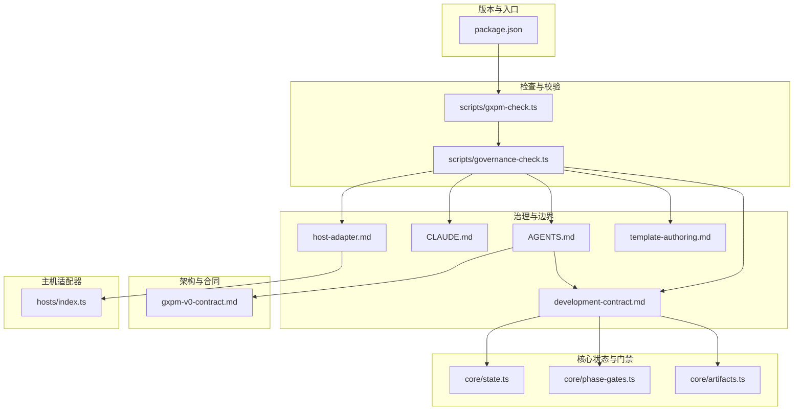
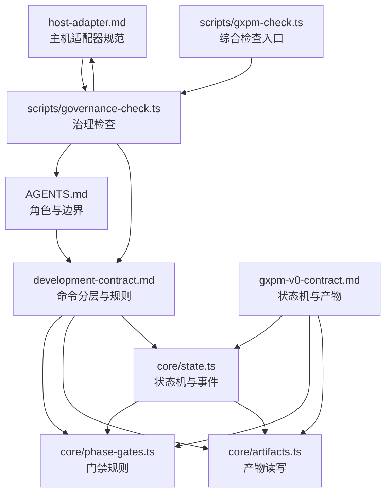
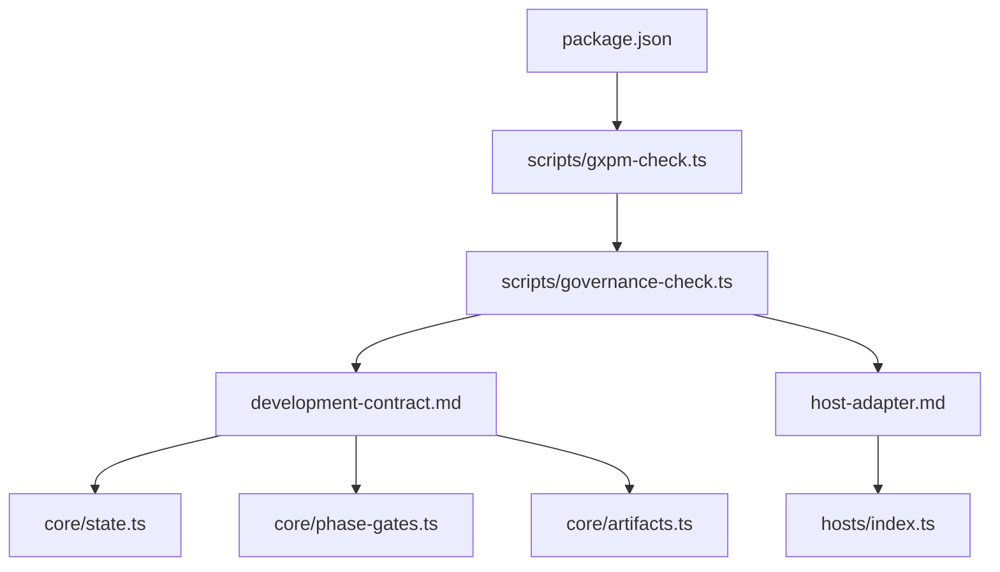
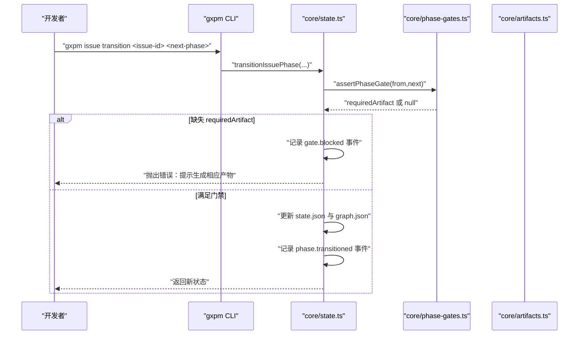
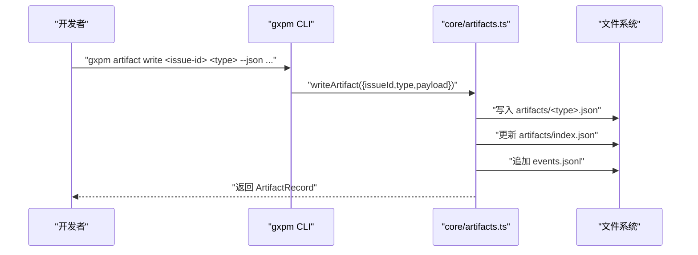
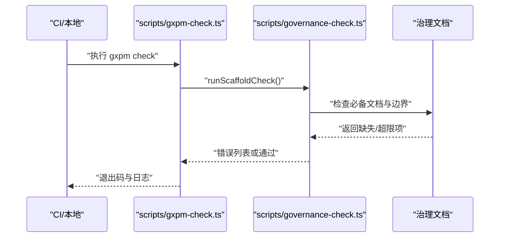
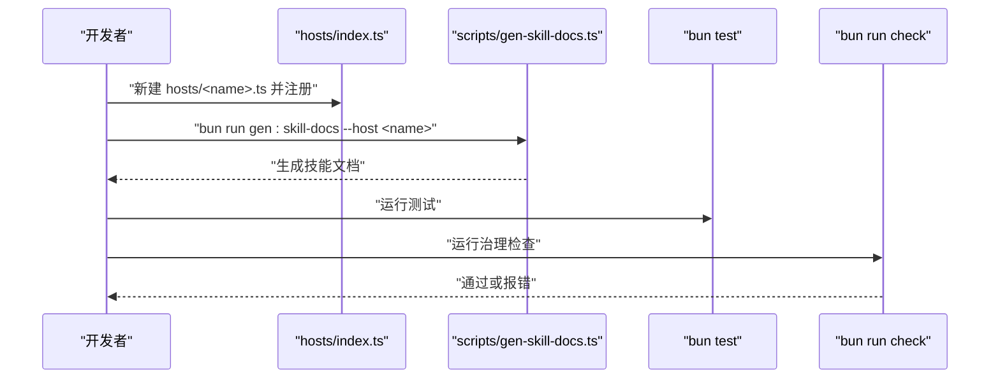

# 治理和合规

<cite>
**本文引用的文件**
- [AGENTS.md](file://AGENTS.md)
- [CLAUDE.md](file://CLAUDE.md)
- [docs/governance/development-contract.md](file://docs/governance/development-contract.md)
- [docs/governance/host-adapter.md](file://docs/governance/host-adapter.md)
- [docs/governance/template-authoring.md](file://docs/governance/template-authoring.md)
- [docs/architecture/gxpm-v0-contract.md](file://docs/architecture/gxpm-v0-contract.md)
- [scripts/governance-check.ts](file://scripts/governance-check.ts)
- [scripts/gxpm-check.ts](file://scripts/gxpm-check.ts)
- [core/state.ts](file://core/state.ts)
- [core/phase-gates.ts](file://core/phase-gates.ts)
- [core/artifacts.ts](file://core/artifacts.ts)
- [core/dispatch.ts](file://core/dispatch.ts)
- [core/ship.ts](file://core/ship.ts)
- [hosts/index.ts](file://hosts/index.ts)
- [package.json](file://package.json)
</cite>

## 目录
1. [简介](#简介)
2. [项目结构](#项目结构)
3. [核心组件](#核心组件)
4. [架构总览](#架构总览)
5. [详细组件分析](#详细组件分析)
6. [依赖分析](#依赖分析)
7. [性能考虑](#性能考虑)
8. [故障排查指南](#故障排查指南)
9. [结论](#结论)
10. [附录](#附录)

## 简介
本文件面向 gxpm 的治理与合规，系统化阐述开发契约、失败归因协议、主机适配器规范、治理流程与执行指南、合规性检查与审计要求、变更管理与版本控制治理、以及争议解决与决策流程。内容以仓库内的权威文档与核心实现为依据，确保可追溯、可执行、可审计。

## 项目结构
围绕治理与合规的相关文件分布如下：
- 治理与边界：AGENTS.md、CLAUDE.md、docs/governance/development-contract.md、docs/governance/host-adapter.md、docs/governance/template-authoring.md
- 架构与合同：docs/architecture/gxpm-v0-contract.md
- 检查与校验：scripts/governance-check.ts、scripts/gxpm-check.ts
- 核心状态与门禁：core/state.ts、core/phase-gates.ts、core/artifacts.ts
- 主机适配器注册：hosts/index.ts
- 版本与入口：package.json

图表来源
- [AGENTS.md:1-85](file://AGENTS.md#L1-L85)
- [docs/governance/development-contract.md:1-75](file://docs/governance/development-contract.md#L1-L75)
- [docs/governance/host-adapter.md:1-57](file://docs/governance/host-adapter.md#L1-L57)
- [docs/governance/template-authoring.md:1-43](file://docs/governance/template-authoring.md#L1-L43)
- [docs/architecture/gxpm-v0-contract.md:1-226](file://docs/architecture/gxpm-v0-contract.md#L1-L226)
- [scripts/governance-check.ts:1-70](file://scripts/governance-check.ts#L1-L70)
- [scripts/gxpm-check.ts:1-13](file://scripts/gxpm-check.ts#L1-L13)
- [core/state.ts:1-302](file://core/state.ts#L1-L302)
- [core/phase-gates.ts:1-118](file://core/phase-gates.ts#L1-L118)
- [core/artifacts.ts:1-169](file://core/artifacts.ts#L1-L169)
- [hosts/index.ts:1-16](file://hosts/index.ts#L1-L16)
- [package.json:1-25](file://package.json#L1-L25)

章节来源
- [AGENTS.md:1-85](file://AGENTS.md#L1-L85)
- [docs/governance/development-contract.md:1-75](file://docs/governance/development-contract.md#L1-L75)
- [docs/governance/host-adapter.md:1-57](file://docs/governance/host-adapter.md#L1-L57)
- [docs/governance/template-authoring.md:1-43](file://docs/governance/template-authoring.md#L1-L43)
- [docs/architecture/gxpm-v0-contract.md:1-226](file://docs/architecture/gxpm-v0-contract.md#L1-L226)
- [scripts/governance-check.ts:1-70](file://scripts/governance-check.ts#L1-L70)
- [scripts/gxpm-check.ts:1-13](file://scripts/gxpm-check.ts#L1-L13)
- [core/state.ts:1-302](file://core/state.ts#L1-L302)
- [core/phase-gates.ts:1-118](file://core/phase-gates.ts#L1-L118)
- [core/artifacts.ts:1-169](file://core/artifacts.ts#L1-L169)
- [hosts/index.ts:1-16](file://hosts/index.ts#L1-L16)
- [package.json:1-25](file://package.json#L1-L25)

## 核心组件
- 开发契约与命令分层：定义从实现到提交的多层级命令与职责边界，确保可验证、可回归、可审计。
- 失败归因协议：对失败进行证据化判定，避免模糊归因。
- 主机适配器规范：以声明式配置扩展不同 host，避免在生成器与检查脚本中散落分支。
- 治理检查与审计：通过脚本校验治理文档完整性与边界限制。
- 状态机与门禁：以 phase/artifact 为核心的状态图与门禁规则，保障阶段推进的确定性与可追溯性。
- 模板作者规范：约束模板编写方式，确保生成物一致性与可验证性。

章节来源
- [docs/governance/development-contract.md:7-75](file://docs/governance/development-contract.md#L7-L75)
- [docs/governance/host-adapter.md:1-57](file://docs/governance/host-adapter.md#L1-L57)
- [scripts/governance-check.ts:1-70](file://scripts/governance-check.ts#L1-L70)
- [core/state.ts:1-302](file://core/state.ts#L1-L302)
- [core/phase-gates.ts:1-118](file://core/phase-gates.ts#L1-L118)
- [docs/governance/template-authoring.md:1-43](file://docs/governance/template-authoring.md#L1-L43)

## 架构总览
下图展示了治理与合规在系统中的位置：以 AGENTS.md 为边界与角色定义，development-contract.md 为执行契约，host-adapter.md 为扩展规范，v0 合同定义了状态机与产物类型，治理检查脚本保证文档与边界合规，核心状态与门禁模块确保阶段推进的确定性。

图表来源
- [AGENTS.md:1-85](file://AGENTS.md#L1-L85)
- [docs/governance/development-contract.md:1-75](file://docs/governance/development-contract.md#L1-L75)
- [docs/governance/host-adapter.md:1-57](file://docs/governance/host-adapter.md#L1-L57)
- [docs/architecture/gxpm-v0-contract.md:1-226](file://docs/architecture/gxpm-v0-contract.md#L1-L226)
- [scripts/governance-check.ts:1-70](file://scripts/governance-check.ts#L1-L70)
- [scripts/gxpm-check.ts:1-13](file://scripts/gxpm-check.ts#L1-L13)
- [core/state.ts:1-302](file://core/state.ts#L1-L302)
- [core/phase-gates.ts:1-118](file://core/phase-gates.ts#L1-L118)
- [core/artifacts.ts:1-169](file://core/artifacts.ts#L1-L169)

## 详细组件分析

### 开发契约与执行机制
- 命令分层与职责
  - fast 层：实现后、提交前的免费静态验证与单元测试。
  - gate 层：提交前、生成器或治理文档改动后的 host config、文档与治理检查。
  - generated 层：修改模板、host config、preamble 后刷新生成的 skill surface。
  - state 层：state graph 或 phase 规则改动后，本地真值写回与恢复验证。
  - artifact 层：artifact store 或 phase gate 改动后，产物写入、读取、索引与 gate 验证。
- 生成物规则
  - 模板为真值，生成物为产物；模板改动后必须生成并提交两者，冲突通过模板与生成器解决。
  - 检查流程真值由 scaffold 检查脚本提供，CLI 仅调用该脚本。
  - 生成物必须与 phase gate 注册表一致，README 仅展示稳定入口命令。
- Phase Artifact 规则
  - 使用统一 initializer 创建 phase artifact，避免样板代码重复。
  - 非 gate artifact 可包含在 ARTIFACT_TYPES，但 gate artifact 必须绑定 phase gate 命令与 initializer。
  - 测试需证明 CLI 顺序与 gate 规则顺序一致，测试基座从 phase gate 注册表派生。
- 提交规则与长任务规则
  - 单提交单一逻辑变化；模板与生成物可同提交但不混入无关重构。
  - Live Install 风险需评估 symlink/copy、并行会话与隔离策略。
  - 长时间任务必须持续轮询，以新进展、失败与下一步为汇报节奏。
- 文档边界
  - AGENTS.md 仅放不可推断的执行边界；CLAUDE.md 仅放启动差异；专项规则放入 docs/governance。

章节来源
- [docs/governance/development-contract.md:7-75](file://docs/governance/development-contract.md#L7-L75)

### 失败归因协议与责任分配
- 归因证据要求
  - 同一命令在 base/main 上也失败；
  - 有仓库记录证明该失败为基线噪声；
  - 无法验证时标记“未验证，可能相关”，并把风险写进汇报。
- 责任分配原则
  - 以证据链为准，避免“旧问题/无关”等模糊归因；
  - gate 被阻塞时，责任在于未满足前置 artifact 要求，需按提示生成相应产物。

章节来源
- [docs/governance/development-contract.md:43-49](file://docs/governance/development-contract.md#L43-L49)
- [core/state.ts:252-301](file://core/state.ts#L252-L301)

### 主机适配器规范与标准流程
- 目的与设计
  - 新增代理 host 应主要新增配置，而非在生成器、setup 或检查脚本中散落分支。
- 当前 host 与注册入口
  - 支持 claude、codex；注册入口包括 hosts/<name>.ts、hosts/index.ts、scripts/host-config.ts。
- 新增 host 流程
  - 新建 hosts/<name>.ts 导出 HostConfig；
  - 在 hosts/index.ts 注册；
  - 在 .gitignore 增加生成目录；
  - 运行生成技能文档与测试检查；
  - 若 host 需要不同工具语义，先设计 adapter 再接入生成器。
- Config 最小字段
  - name、displayName、cliCommand、hostSubdir、globalRoot、localSkillRoot、usesEnvVars、frontmatter、install.strategy。
- 设计规则
  - path/frontmatter/tool rewrite/suppressed section 来自主机配置；
  - 生成器不应包含散落的 if host === ... 分支；
  - 输出避免泄漏其他 host 路径；
  - 参数化测试应自动覆盖新增 host。
- 验证目标
  - validateAllConfigs() 至少检查 host name 格式、CLI 命令格式、路径安全性、frontmatter 合法性、名称/子目录/根路径不重复。

章节来源
- [docs/governance/host-adapter.md:1-57](file://docs/governance/host-adapter.md#L1-L57)
- [hosts/index.ts:1-16](file://hosts/index.ts#L1-L16)

### 治理流程与执行指南
- 治理检查
  - 必备文档清单与边界限制（AGENTS.md、CLAUDE.md、治理文档、模板作者规范）；
  - AGENTS.md 与 CLAUDE.md 行数上限与标题结构要求；
  - CLAUDE.md 必须指向 AGENTS.md。
- 综合检查入口
  - gxpm-check.ts 作为统一入口调用 scaffold 检查脚本，失败时退出非零码。

章节来源
- [scripts/governance-check.ts:1-70](file://scripts/governance-check.ts#L1-L70)
- [scripts/gxpm-check.ts:1-13](file://scripts/gxpm-check.ts#L1-L13)

### 合规性检查与审计要求
- 文档合规
  - 治理文档完整性检查；
  - AGENTS.md 与 CLAUDE.md 的长度与结构约束；
  - CLAUDE.md 回指 AGENTS.md。
- 生成物合规
  - 模板与生成物一致性；
  - 生成器从 phase gate 注册表派生命令与断言；
  - README 仅展示稳定入口命令。
- 状态与门禁合规
  - 阶段推进必须满足门禁规则；
  - 产物缺失时 gate 被阻塞并记录事件；
  - 真值优先级：phase artifacts → state.json → resume packet → 渲染报告 → 外部系统。

章节来源
- [scripts/governance-check.ts:8-52](file://scripts/governance-check.ts#L8-L52)
- [docs/governance/development-contract.md:19-42](file://docs/governance/development-contract.md#L19-L42)
- [core/state.ts:118-136](file://core/state.ts#L118-L136)
- [core/state.ts:252-301](file://core/state.ts#L252-L301)
- [docs/architecture/gxpm-v0-contract.md:118-129](file://docs/architecture/gxpm-v0-contract.md#L118-L129)

### 变更管理与版本控制治理
- 变更范围
  - 每个提交只表达一个逻辑变化；
  - 模板改动与生成物刷新可同提交，但不混入无关重构；
  - 测试基础设施、host adapter、产品文档变更尽量独立，便于回滚。
- 提交前检查
  - 至少运行单元测试、治理检查、diff 校验。
- 版本与入口
  - 包管理器与二进制入口由 package.json 定义；
  - gxpm 作为主命令入口，配套工具命令与检查脚本统一收敛。

章节来源
- [docs/governance/development-contract.md:51-56](file://docs/governance/development-contract.md#L51-L56)
- [package.json:1-25](file://package.json#L1-L25)

### 争议解决与决策流程
- 争议来源
  - 来源冲突时，先指出冲突并建议最小安全路径。
- 决策边界
  - Always/Ask First/Never 作为不可推断的边界与优先级；
  - 对破坏性操作、发布、合并、远端写操作、引入运行时依赖、付费评估、外部 API、长时间验证等事项，必须“先请示”。
- 失败归因
  - 不得声称历史失败与本次无关，除非有 base/main 对照证据；
  - 无法验证时明确标记并写明风险。

章节来源
- [AGENTS.md:22-69](file://AGENTS.md#L22-L69)
- [docs/governance/development-contract.md:45-49](file://docs/governance/development-contract.md#L45-L49)

## 依赖分析
- 组件耦合
  - development-contract.md 依赖 core/state.ts、core/phase-gates.ts、core/artifacts.ts 的状态与门禁规则；
  - host-adapter.md 依赖 hosts/index.ts 的注册与配置；
  - scripts/governance-check.ts 依赖治理文档与边界文件；
  - scripts/gxpm-check.ts 依赖 scaffold 检查脚本。
- 外部依赖
  - 包管理器与引擎版本由 package.json 约束。

图表来源
- [docs/governance/development-contract.md:1-75](file://docs/governance/development-contract.md#L1-L75)
- [core/state.ts:1-302](file://core/state.ts#L1-L302)
- [core/phase-gates.ts:1-118](file://core/phase-gates.ts#L1-L118)
- [core/artifacts.ts:1-169](file://core/artifacts.ts#L1-L169)
- [docs/governance/host-adapter.md:1-57](file://docs/governance/host-adapter.md#L1-L57)
- [hosts/index.ts:1-16](file://hosts/index.ts#L1-L16)
- [scripts/governance-check.ts:1-70](file://scripts/governance-check.ts#L1-L70)
- [scripts/gxpm-check.ts:1-13](file://scripts/gxpm-check.ts#L1-L13)
- [package.json:1-25](file://package.json#L1-L25)

章节来源
- [docs/governance/development-contract.md:1-75](file://docs/governance/development-contract.md#L1-L75)
- [core/state.ts:1-302](file://core/state.ts#L1-L302)
- [core/phase-gates.ts:1-118](file://core/phase-gates.ts#L1-L118)
- [core/artifacts.ts:1-169](file://core/artifacts.ts#L1-L169)
- [docs/governance/host-adapter.md:1-57](file://docs/governance/host-adapter.md#L1-L57)
- [hosts/index.ts:1-16](file://hosts/index.ts#L1-L16)
- [scripts/governance-check.ts:1-70](file://scripts/governance-check.ts#L1-L70)
- [scripts/gxpm-check.ts:1-13](file://scripts/gxpm-check.ts#L1-L13)
- [package.json:1-25](file://package.json#L1-L25)

## 性能考虑
- 检查与验证的粒度
  - fast 层轻量快速反馈，减少提交前等待；
  - gate 层集中收敛检查入口，避免重复执行；
  - 生成物刷新与状态回写在必要时触发，避免频繁 IO。
- 长任务轮询
  - 长时间测试、E2E、浏览器验证与部署验证需持续轮询，避免“后台通知”作为完成证据。

章节来源
- [docs/governance/development-contract.md:11-17](file://docs/governance/development-contract.md#L11-L17)
- [docs/governance/development-contract.md:66-69](file://docs/governance/development-contract.md#L66-L69)

## 故障排查指南
- 治理文档缺失或超限
  - 检查治理文档清单与行数限制，确保 CLAUDE.md 回指 AGENTS.md。
- 阶段推进被阻塞
  - 查看 gate 被阻塞事件与缺失 artifact，按提示生成相应产物；
  - 确认 phase 顺序与门禁规则一致。
- 生成物漂移
  - 模板改动后必须重新生成并提交模板与生成物；
  - 测试需覆盖生成物一致性。
- 主机适配器异常
  - 校验配置字段与路径安全性；
  - 确保注册入口与生成流程正确执行。

章节来源
- [scripts/governance-check.ts:16-52](file://scripts/governance-check.ts#L16-L52)
- [core/state.ts:252-301](file://core/state.ts#L252-L301)
- [docs/governance/development-contract.md:19-28](file://docs/governance/development-contract.md#L19-L28)
- [docs/governance/host-adapter.md:48-57](file://docs/governance/host-adapter.md#L48-L57)

## 结论
本治理与合规文档以开发契约、失败归因协议、主机适配器规范、治理流程与检查机制为核心，结合状态机与门禁规则，形成从命令分层到产物写入、从文档边界到争议解决的完整闭环。通过 scripts 与 core 模块的协同，确保变更可控、证据可溯、责任清晰、风险受控。

## 附录

### 关键流程时序：阶段推进与门禁验证

图表来源
- [core/state.ts:149-204](file://core/state.ts#L149-L204)
- [core/state.ts:252-301](file://core/state.ts#L252-L301)
- [core/phase-gates.ts:107-117](file://core/phase-gates.ts#L107-L117)

### 关键流程时序：产物写入与索引更新

图表来源
- [core/artifacts.ts:57-91](file://core/artifacts.ts#L57-L91)
- [core/artifacts.ts:106-146](file://core/artifacts.ts#L106-L146)

### 关键流程时序：治理检查与合规校验

图表来源
- [scripts/gxpm-check.ts:1-13](file://scripts/gxpm-check.ts#L1-L13)
- [scripts/governance-check.ts:16-52](file://scripts/governance-check.ts#L16-L52)

### 关键流程时序：新增主机适配器

图表来源
- [docs/governance/host-adapter.md:18-26](file://docs/governance/host-adapter.md#L18-L26)
- [hosts/index.ts:1-16](file://hosts/index.ts#L1-L16)