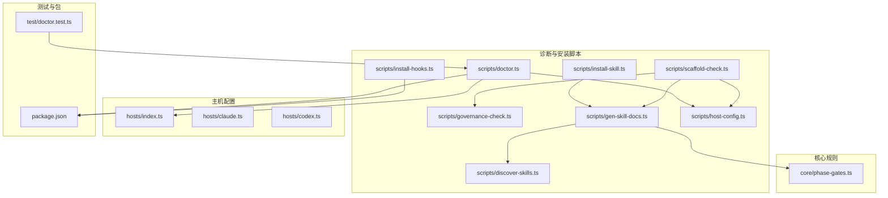
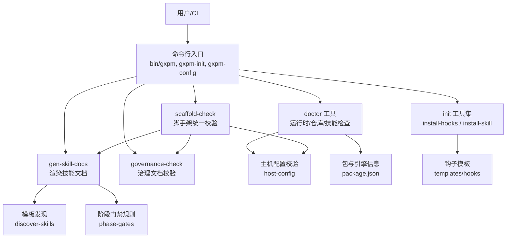
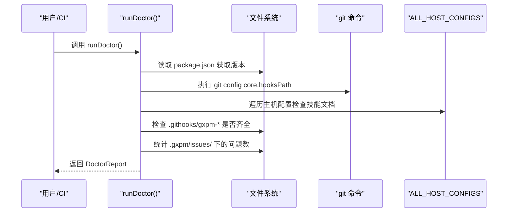
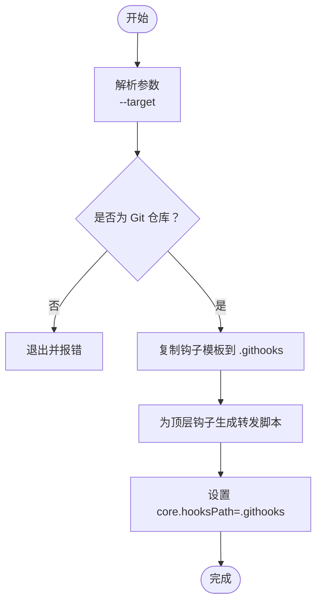
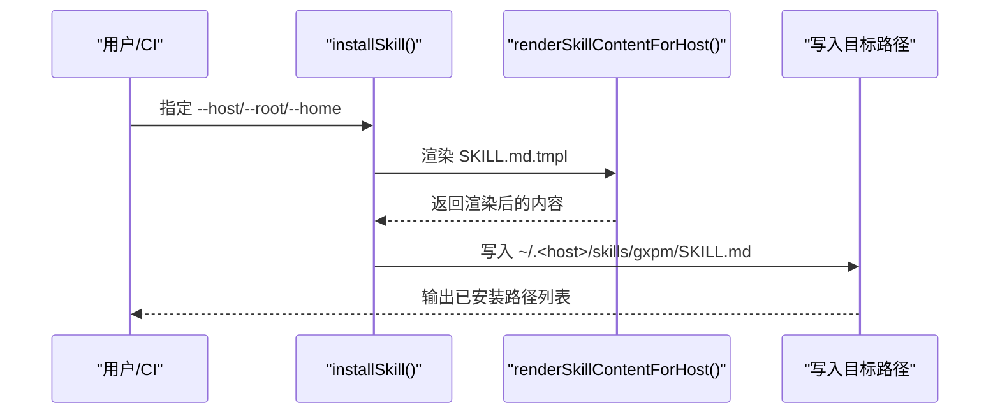
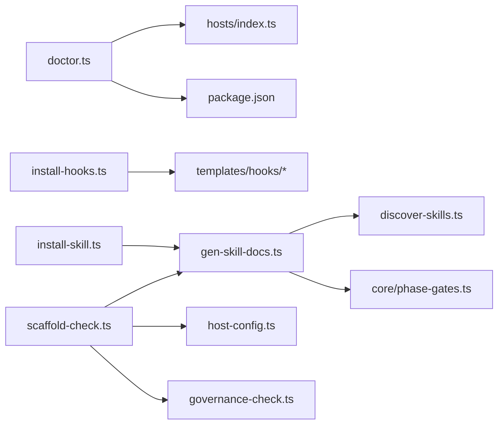

# 诊断和故障排除

<cite>
**本文引用的文件**
- [scripts/doctor.ts](file://scripts/doctor.ts)
- [scripts/install-hooks.ts](file://scripts/install-hooks.ts)
- [scripts/install-skill.ts](file://scripts/install-skill.ts)
- [scripts/governance-check.ts](file://scripts/governance-check.ts)
- [scripts/scaffold-check.ts](file://scripts/scaffold-check.ts)
- [scripts/host-config.ts](file://scripts/host-config.ts)
- [scripts/gen-skill-docs.ts](file://scripts/gen-skill-docs.ts)
- [scripts/discover-skills.ts](file://scripts/discover-skills.ts)
- [hosts/index.ts](file://hosts/index.ts)
- [hosts/claude.ts](file://hosts/claude.ts)
- [hosts/codex.ts](file://hosts/codex.ts)
- [core/phase-gates.ts](file://core/phase-gates.ts)
- [package.json](file://package.json)
- [test/doctor.test.ts](file://test/doctor.test.ts)
</cite>

## 目录
1. [简介](#简介)
2. [项目结构](#项目结构)
3. [核心组件](#核心组件)
4. [架构总览](#架构总览)
5. [详细组件分析](#详细组件分析)
6. [依赖关系分析](#依赖关系分析)
7. [性能考虑](#性能考虑)
8. [故障排除指南](#故障排除指南)
9. [结论](#结论)
10. [附录](#附录)

## 简介
本指南聚焦于“诊断与故障排除”，围绕以下目标展开：  
- 系统诊断工具的使用方法与诊断报告解读  
- 常见问题的识别与解决路径  
- 日志分析方法与性能监控技巧  
- 系统健康检查的自动化流程与告警机制  
- 调试工具使用指南与最佳实践  
- 性能优化建议与资源使用监控方法  

在该代码库中，诊断与故障排除主要由一组脚本工具完成：运行时环境检查、仓库与 Git 钩子状态检查、治理文档校验、技能文档生成与模板发现、主机配置校验等。这些工具共同构成了一套可重复、可自动化的健康检查与排障流程。

## 项目结构
该仓库采用按功能域划分的组织方式：  
- 核心业务逻辑位于 core 目录（如阶段门禁规则、工件类型、状态机等）  
- 诊断与安装脚本位于 scripts 目录（doctor、install-hooks、install-skill、governance-check、scaffold-check、gen-skill-docs、discover-skills、host-config）  
- 主机适配器配置位于 hosts 目录（claude、codex 及索引）  
- 测试位于 test 目录，覆盖 doctor 等关键流程  
- 文档与路线图位于 docs 目录（与治理相关）  
- 包管理与二进制入口位于根目录（package.json）

图表来源
- [scripts/doctor.ts:1-216](file://scripts/doctor.ts#L1-L216)
- [scripts/install-hooks.ts:1-106](file://scripts/install-hooks.ts#L1-L106)
- [scripts/install-skill.ts:1-112](file://scripts/install-skill.ts#L1-L112)
- [scripts/governance-check.ts:1-70](file://scripts/governance-check.ts#L1-L70)
- [scripts/scaffold-check.ts:1-32](file://scripts/scaffold-check.ts#L1-L32)
- [scripts/gen-skill-docs.ts:1-165](file://scripts/gen-skill-docs.ts#L1-L165)
- [scripts/discover-skills.ts:1-58](file://scripts/discover-skills.ts#L1-L58)
- [scripts/host-config.ts:1-83](file://scripts/host-config.ts#L1-L83)
- [hosts/index.ts:1-16](file://hosts/index.ts#L1-L16)
- [hosts/claude.ts:1-18](file://hosts/claude.ts#L1-L18)
- [hosts/codex.ts:1-19](file://hosts/codex.ts#L1-L19)
- [core/phase-gates.ts:1-118](file://core/phase-gates.ts#L1-L118)
- [package.json:1-25](file://package.json#L1-L25)
- [test/doctor.test.ts:1-100](file://test/doctor.test.ts#L1-L100)

章节来源
- [package.json:1-25](file://package.json#L1-L25)

## 核心组件
- 运行时与仓库健康检查：通过 doctor 工具收集运行时环境、技能安装状态、Git 仓库与钩子状态、问题跟踪目录信息，并输出结构化报告。  
- 安装与初始化：install-hooks 将钩子模板复制到 .githooks 并设置 core.hooksPath；install-skill 将渲染后的技能文档写入用户主目录对应主机的全局技能根目录。  
- 治理与脚手架校验：governance-check 校验治理文档存在性与内容规范；scaffold-check 统一校验主机配置、治理文档与技能文档生成一致性。  
- 模板与生成：discover-skills 发现所有 SKILL.md.tmpl 模板；gen-skill-docs 渲染模板并写回或进行干跑检测过期。  
- 主机配置校验：host-config 对主机配置进行正则与唯一性约束校验，避免冲突与不安全路径。  
- 阶段门禁规则：phase-gates 定义了严格的阶段转换与所需工件，是诊断“是否可推进”的关键依据。

章节来源
- [scripts/doctor.ts:1-216](file://scripts/doctor.ts#L1-L216)
- [scripts/install-hooks.ts:1-106](file://scripts/install-hooks.ts#L1-L106)
- [scripts/install-skill.ts:1-112](file://scripts/install-skill.ts#L1-L112)
- [scripts/governance-check.ts:1-70](file://scripts/governance-check.ts#L1-L70)
- [scripts/scaffold-check.ts:1-32](file://scripts/scaffold-check.ts#L1-L32)
- [scripts/gen-skill-docs.ts:1-165](file://scripts/gen-skill-docs.ts#L1-L165)
- [scripts/discover-skills.ts:1-58](file://scripts/discover-skills.ts#L1-L58)
- [scripts/host-config.ts:1-83](file://scripts/host-config.ts#L1-L83)
- [core/phase-gates.ts:1-118](file://core/phase-gates.ts#L1-L118)

## 架构总览
下图展示了诊断与故障排除相关组件之间的交互关系，以及它们如何共同保障系统健康。

图表来源
- [scripts/doctor.ts:1-216](file://scripts/doctor.ts#L1-L216)
- [scripts/install-hooks.ts:1-106](file://scripts/install-hooks.ts#L1-L106)
- [scripts/install-skill.ts:1-112](file://scripts/install-skill.ts#L1-L112)
- [scripts/gen-skill-docs.ts:1-165](file://scripts/gen-skill-docs.ts#L1-L165)
- [scripts/discover-skills.ts:1-58](file://scripts/discover-skills.ts#L1-L58)
- [scripts/host-config.ts:1-83](file://scripts/host-config.ts#L1-L83)
- [core/phase-gates.ts:1-118](file://core/phase-gates.ts#L1-L118)
- [package.json:1-25](file://package.json#L1-L25)

## 详细组件分析

### 运行时与仓库健康检查（doctor）
- 功能要点
  - 检查 Bun 是否可用、版本号与仓库根路径  
  - 遍历 ALL_HOST_CONFIGS，检查每个主机的技能文档是否存在及大小  
  - 判断当前目录是否为 Git 仓库，读取 core.hooksPath  
  - 检查 .githooks 下四个 gxpm 钩子是否全部存在  
  - 检查 .gxpm/issues/ 目录是否存在并统计问题数量  
- 报告格式
  - 包含“运行时”“技能安装”“当前仓库”三部分，逐项列出检查结果与修复建议  
- 典型问题定位
  - 缺少技能文档：提示使用安装命令  
  - 未设置 core.hooksPath 或钩子不全：提示安装钩子并设置 core.hooksPath  
  - 无问题跟踪目录：提示先创建问题再跟踪  
- 自动化建议
  - 在 CI 中调用 doctor 并将输出作为制品或告警源  
  - 将报告中的“缺失钩子/技能”作为失败条件

图表来源
- [scripts/doctor.ts:51-154](file://scripts/doctor.ts#L51-L154)
- [hosts/index.ts:1-16](file://hosts/index.ts#L1-L16)

章节来源
- [scripts/doctor.ts:1-216](file://scripts/doctor.ts#L1-L216)
- [test/doctor.test.ts:1-100](file://test/doctor.test.ts#L1-L100)

### 安装钩子（install-hooks）
- 功能要点
  - 将模板钩子复制到 .githooks，并为每个顶层钩子生成转发脚本（dispatcher），避免覆盖已有钩子  
  - 设置或修正 core.hooksPath 为 .githooks  
  - 对于已存在的顶层钩子给出提示，指导手动接入 gxpm 钩子  
- 故障排除
  - 若 core.hooksPath 不是 .githooks：会自动设置  
  - 若顶层钩子已存在：不会覆盖，需手动追加调用 gxpm 钩子的逻辑  
- 最佳实践
  - 在团队内统一约定 core.hooksPath 为 .githooks  
  - 保留现有钩子时，确保转发脚本正确执行 gxpm 钩子

图表来源
- [scripts/install-hooks.ts:50-103](file://scripts/install-hooks.ts#L50-L103)

章节来源
- [scripts/install-hooks.ts:1-106](file://scripts/install-hooks.ts#L1-L106)

### 安装技能（install-skill）
- 功能要点
  - 读取模板 SKILL.md.tmpl，渲染后根据主机 frontmatter 策略过滤或保留元数据  
  - 写入用户主目录的主机全局技能根目录  
  - 支持指定主机或安装全部主机  
- 故障排除
  - 若 frontmatter 为 allowlist，但 keys 为空：会报错  
  - 若主机名不存在：抛出未知主机错误  
- 最佳实践
  - 在 CI 中以 dry-run 方式预检，确保生成内容与模板一致  
  - 保持模板更新频率，避免技能文档过期

图表来源
- [scripts/install-skill.ts:20-38](file://scripts/install-skill.ts#L20-L38)
- [scripts/gen-skill-docs.ts:17-56](file://scripts/gen-skill-docs.ts#L17-L56)

章节来源
- [scripts/install-skill.ts:1-112](file://scripts/install-skill.ts#L1-L112)
- [scripts/gen-skill-docs.ts:1-165](file://scripts/gen-skill-docs.ts#L1-L165)

### 治理文档校验（governance-check）
- 功能要点
  - 校验必需治理文档是否存在  
  - 对 AGENTS.md 与 CLAUDE.md 的行数与内容边界进行限制与断言  
- 故障排除
  - 缺失文档：返回具体缺失项  
  - 行数超限或缺少边界标题：返回相应错误  
- 最佳实践
  - 将该检查纳入 CI，保证治理文档最小可用且清晰

章节来源
- [scripts/governance-check.ts:1-70](file://scripts/governance-check.ts#L1-L70)

### 脚手架统一校验（scaffold-check）
- 功能要点
  - 校验主机配置、治理文档、并进行技能文档生成的干跑（dry-run）以检测过期  
- 故障排除
  - 任一校验失败：抛出汇总错误  
  - 干跑发现过期：提示更新技能文档  
- 最佳实践
  - 在 PR 合并前运行该检查，确保脚手架一致性

章节来源
- [scripts/scaffold-check.ts:1-32](file://scripts/scaffold-check.ts#L1-L32)

### 主机配置校验（host-config）
- 功能要点
  - 正则校验主机名称、CLI 命令、相对路径的安全性  
  - 校验 frontmatter.allowlist 至少包含一个键  
  - 校验安装策略仅支持 copy/symlink  
  - 检测 name/hostSubdir/globalRoot 的重复值  
- 故障排除
  - 重复字段：返回重复项与冲突主机  
  - 非法模式：返回不支持的策略  
- 最佳实践
  - 在 CI 中对 hosts 配置进行静态校验

章节来源
- [scripts/host-config.ts:1-83](file://scripts/host-config.ts#L1-L83)
- [hosts/index.ts:1-16](file://hosts/index.ts#L1-L16)
- [hosts/claude.ts:1-18](file://hosts/claude.ts#L1-L18)
- [hosts/codex.ts:1-19](file://hosts/codex.ts#L1-L19)

### 模板发现与技能文档生成（discover-skills / gen-skill-docs）
- 功能要点
  - discover-skills 递归扫描根目录，跳过隐藏/构建/缓存等目录，收集 SKILL.md.tmpl  
  - gen-skill-docs 渲染模板变量（前置说明、工件读取命令、阶段门禁命令、阶段转换摘要），插入自动生成标记  
- 故障排除
  - 模板过期：dry-run 抛出过期列表，需重新生成  
  - 未找到模板：确认路径与忽略规则  
- 最佳实践
  - 将生成过程纳入 CI，确保每次模板变更后同步更新生成物

章节来源
- [scripts/discover-skills.ts:1-58](file://scripts/discover-skills.ts#L1-L58)
- [scripts/gen-skill-docs.ts:1-165](file://scripts/gen-skill-docs.ts#L1-L165)
- [core/phase-gates.ts:1-118](file://core/phase-gates.ts#L1-L118)

## 依赖关系分析
- 组件耦合
  - doctor 依赖 hosts 索引与主机配置、package.json、git 命令  
  - install-hooks 依赖 templates/hooks 模板与 git 配置  
  - install-skill 依赖 gen-skill-docs 与 discover-skills  
  - scaffold-check 统一依赖 host-config、governance-check、gen-skill-docs  
- 外部依赖
  - Bun 引擎要求（package.json engines）  
  - Git 仓库与 core.hooksPath 配置  
- 循环依赖
  - 未发现直接循环依赖；各脚本职责清晰，通过函数调用解耦

图表来源
- [scripts/doctor.ts:1-216](file://scripts/doctor.ts#L1-L216)
- [scripts/install-hooks.ts:1-106](file://scripts/install-hooks.ts#L1-L106)
- [scripts/install-skill.ts:1-112](file://scripts/install-skill.ts#L1-L112)
- [scripts/gen-skill-docs.ts:1-165](file://scripts/gen-skill-docs.ts#L1-L165)
- [scripts/discover-skills.ts:1-58](file://scripts/discover-skills.ts#L1-L58)
- [scripts/scaffold-check.ts:1-32](file://scripts/scaffold-check.ts#L1-L32)
- [scripts/host-config.ts:1-83](file://scripts/host-config.ts#L1-L83)
- [scripts/governance-check.ts:1-70](file://scripts/governance-check.ts#L1-L70)
- [package.json:1-25](file://package.json#L1-L25)

章节来源
- [package.json:1-25](file://package.json#L1-L25)

## 性能考虑
- I/O 与扫描
  - doctor 在仓库根目录与用户主目录进行多次文件系统访问，建议在 CI 中缓存工作区以减少重复扫描  
  - discover-skills 会遍历整个根目录，建议在大型仓库中限定扫描范围或使用更精确的根路径  
- 子进程调用
  - install-hooks 与 doctor 使用 git 子进程，建议在 CI 中预装 git 并固定版本，避免网络波动导致的不稳定  
- 生成与渲染
  - gen-skill-docs 在 dry-run 模式下会比较生成内容，建议在 PR 中启用 dry-run，避免不必要的磁盘写入  
- 资源监控建议
  - 在 CI 日志中记录关键步骤耗时（如钩子安装、技能生成、治理校验），用于定位瓶颈  
  - 使用操作系统层面的资源监控工具（CPU、内存、I/O）观察异常峰值

## 故障排除指南
- 运行时环境
  - 现象：Bun 不可用或版本不满足  
  - 排查：确认 engines.bun 版本要求；在 CI 中显式安装 Bun  
  - 参考：[package.json:21-23](file://package.json#L21-L23)  
- 技能文档缺失
  - 现象：doctor 报告技能未安装  
  - 排查：使用 install-skill 安装指定主机或全部主机；核对 frontmatter 策略  
  - 参考：[scripts/install-skill.ts:20-38](file://scripts/install-skill.ts#L20-L38)  
- Git 钩子未就绪
  - 现象：doctor 报告缺少 gxpm 钩子或 core.hooksPath 非 .githooks  
  - 排查：使用 install-hooks 安装钩子并设置 core.hooksPath；若已有顶层钩子，按提示追加转发逻辑  
  - 参考：[scripts/install-hooks.ts:50-103](file://scripts/install-hooks.ts#L50-L103)  
- 治理文档问题
  - 现象：governance-check 报告缺失或内容不合规  
  - 排查：补齐缺失文档，控制行数与边界标题，确保 CLAUDE.md 指向 AGENTS.md  
  - 参考：[scripts/governance-check.ts:16-52](file://scripts/governance-check.ts#L16-L52)  
- 脚手架不一致
  - 现象：scaffold-check 报告主机配置或技能文档过期  
  - 排查：修复主机配置重复或非法字段；运行 gen-skill-docs 更新技能文档  
  - 参考：[scripts/scaffold-check.ts:15-31](file://scripts/scaffold-check.ts#L15-L31)  
- 阶段推进受阻
  - 现象：无法从某阶段进入下一阶段  
  - 排查：根据 phase-gates 规则，确认所需工件是否已生成；使用 gate 命令初始化  
  - 参考：[core/phase-gates.ts:32-99](file://core/phase-gates.ts#L32-L99)

章节来源
- [package.json:21-23](file://package.json#L21-L23)
- [scripts/install-skill.ts:20-38](file://scripts/install-skill.ts#L20-L38)
- [scripts/install-hooks.ts:50-103](file://scripts/install-hooks.ts#L50-L103)
- [scripts/governance-check.ts:16-52](file://scripts/governance-check.ts#L16-L52)
- [scripts/scaffold-check.ts:15-31](file://scripts/scaffold-check.ts#L15-L31)
- [core/phase-gates.ts:32-99](file://core/phase-gates.ts#L32-L99)

## 结论
本指南梳理了该代码库中诊断与故障排除的关键工具与流程：通过 doctor 快速掌握运行时、仓库与技能状态；借助 install-hooks 与 install-skill 完成钩子与技能的安装与维护；通过 governance-check 与 scaffold-check 保障治理与脚手架的一致性；借助 discover-skills 与 gen-skill-docs 实现模板驱动的技能文档生成与校验。结合阶段门禁规则，可以有效定位“为何无法推进”的问题。建议在 CI 中集成上述工具，形成自动化健康检查与告警机制，持续提升系统稳定性与可维护性。

## 附录
- 常用命令与用途
  - gxpm-init：安装钩子与技能（配合 install-hooks、install-skill）  
  - gxpm-config：配置相关（与 doctor 协同检查配置有效性）  
  - gxpm：主命令入口（与 phase-gates 规则配合进行阶段推进）  
- 建议的自动化流程
  - PR 提交：运行 scaffold-check 与 doctor，失败即阻断合并  
  - 合并后：运行 gen-skill-docs 干跑，确保模板与生成物一致  
  - 定期巡检：在 CI 中周期性运行 doctor，输出报告并触发告警  
- 告警机制建议
  - 将 doctor 报告中的“缺失钩子/技能/治理文档”映射为不同严重级别  
  - 对“阶段推进受阻”（基于 gate 规则）建立可观测指标，异常时触发通知