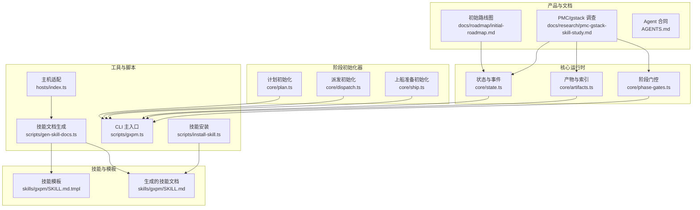
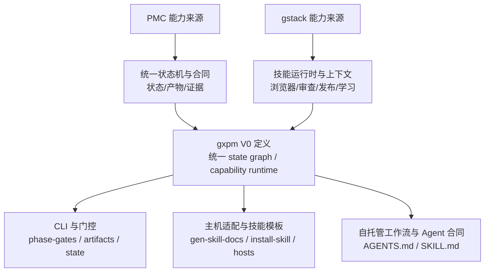
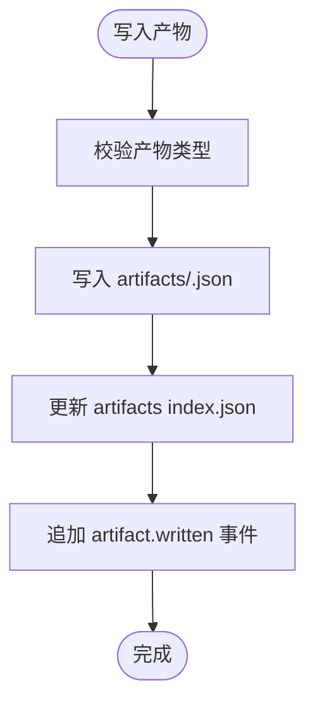
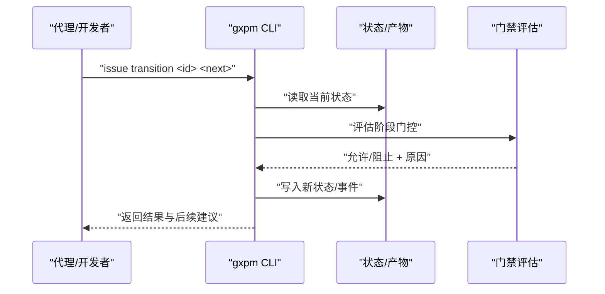
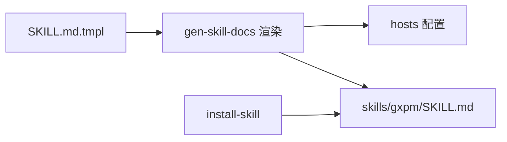
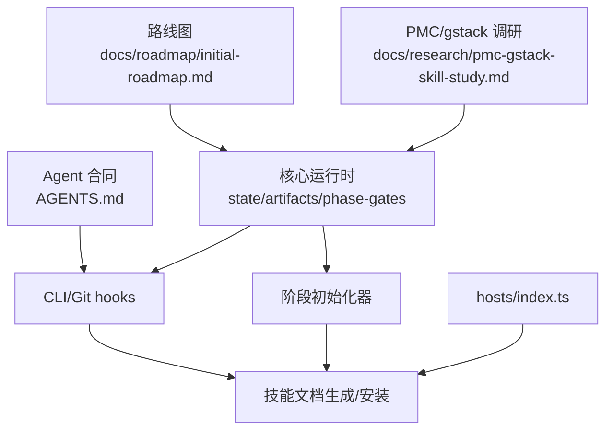

# 路线图和研究

<cite>
**本文引用的文件**
- [docs/roadmap/initial-roadmap.md](file://docs/roadmap/initial-roadmap.md)
- [docs/research/pmc-gstack-skill-study.md](file://docs/research/pmc-gstack-skill-study.md)
- [AGENTS.md](file://AGENTS.md)
- [package.json](file://package.json)
- [core/state.ts](file://core/state.ts)
- [core/artifacts.ts](file://core/artifacts.ts)
- [core/phase-gates.ts](file://core/phase-gates.ts)
- [core/plan.ts](file://core/plan.ts)
- [core/dispatch.ts](file://core/dispatch.ts)
- [core/ship.ts](file://core/ship.ts)
- [scripts/gxpm.ts](file://scripts/gxpm.ts)
- [scripts/gen-skill-docs.ts](file://scripts/gen-skill-docs.ts)
- [scripts/install-skill.ts](file://scripts/install-skill.ts)
- [hosts/index.ts](file://hosts/index.ts)
- [skills/gxpm/SKILL.md](file://skills/gxpm/SKILL.md)
</cite>

## 目录
1. [引言](#引言)
2. [项目结构](#项目结构)
3. [核心组件](#核心组件)
4. [架构总览](#架构总览)
5. [详细组件分析](#详细组件分析)
6. [依赖关系分析](#依赖关系分析)
7. [性能考量](#性能考量)
8. [故障排查指南](#故障排查指南)
9. [结论](#结论)
10. [附录](#附录)

## 引言
本文件面向 gxpm 的路线图与研究文档，系统阐述初始路线图的发展方向与里程碑目标，解释 PMC 与 gstack 的研究背景与迁移策略，给出未来发展的战略规划与优先级排序，提供技术演进预测与趋势分析，并说明研究与开发的结合方式、创新机会以及社区参与与反馈机制。

## 项目结构
gxpm 是一个以“统一状态图、能力运行时、证据存储与治理策略”为核心的产品，旨在替代 PMC 与 gstack 的组合式能力，形成独立闭环。项目采用模块化组织，围绕 issue 生命周期与阶段门控展开，同时提供 CLI、Git hooks、主机适配层与技能模板生成能力。



图表来源
- [docs/roadmap/initial-roadmap.md:1-54](file://docs/roadmap/initial-roadmap.md#L1-L54)
- [docs/research/pmc-gstack-skill-study.md:1-123](file://docs/research/pmc-gstack-skill-study.md#L1-L123)
- [core/state.ts:1-302](file://core/state.ts#L1-L302)
- [core/artifacts.ts:1-169](file://core/artifacts.ts#L1-L169)
- [core/phase-gates.ts:1-118](file://core/phase-gates.ts#L1-L118)
- [core/plan.ts:1-15](file://core/plan.ts#L1-L15)
- [core/dispatch.ts:1-17](file://core/dispatch.ts#L1-L17)
- [core/ship.ts:1-17](file://core/ship.ts#L1-L17)
- [scripts/gxpm.ts:1-611](file://scripts/gxpm.ts#L1-L611)
- [scripts/gen-skill-docs.ts:1-165](file://scripts/gen-skill-docs.ts#L1-L165)
- [scripts/install-skill.ts:1-112](file://scripts/install-skill.ts#L1-L112)
- [hosts/index.ts:1-16](file://hosts/index.ts#L1-L16)
- [skills/gxpm/SKILL.md:1-357](file://skills/gxpm/SKILL.md#L1-L357)

章节来源
- [package.json:1-25](file://package.json#L1-L25)
- [AGENTS.md:1-85](file://AGENTS.md#L1-L85)

## 核心组件
- 统一状态图与事件：定义 issue 生命周期阶段、状态变更与事件记录，确保可审计、可恢复、可复核。
- 产物与证据：以标准化 JSON 产物作为阶段真相，配套事件流与索引，支撑跨阶段证据链。
- 阶段门控：以“必需产物”为阶段推进条件，保证质量门与治理策略落地。
- 阶段初始化器：为关键阶段提供标准化草稿模板，降低心智负担与偏差。
- CLI 与 Git hooks：提供命令行控制、自动门禁与钩子防御，保障执行一致性。
- 主机适配与技能模板：抽象主机差异，通过模板生成技能文档，避免命令漂移。

章节来源
- [core/state.ts:11-302](file://core/state.ts#L11-L302)
- [core/artifacts.ts:10-169](file://core/artifacts.ts#L10-L169)
- [core/phase-gates.ts:25-118](file://core/phase-gates.ts#L25-L118)
- [core/plan.ts:3-15](file://core/plan.ts#L3-L15)
- [core/dispatch.ts:3-17](file://core/dispatch.ts#L3-L17)
- [core/ship.ts:3-17](file://core/ship.ts#L3-L17)
- [scripts/gxpm.ts:32-611](file://scripts/gxpm.ts#L32-L611)
- [scripts/gen-skill-docs.ts:28-165](file://scripts/gen-skill-docs.ts#L28-L165)
- [scripts/install-skill.ts:20-112](file://scripts/install-skill.ts#L20-L112)
- [hosts/index.ts:9-16](file://hosts/index.ts#L9-L16)
- [skills/gxpm/SKILL.md:1-357](file://skills/gxpm/SKILL.md#L1-L357)

## 架构总览
下图展示从调查研究到产品实现的关键路径：PMC/gstack 的能力被拆解为“状态机/合同/证据”与“技能运行时/浏览器运行时/上下文持久化”两类来源，gxpm 将其抽象为统一 state graph、capability runtime、evidence store、policy engine 与产品 CLI/skill surface。



图表来源
- [docs/research/pmc-gstack-skill-study.md:73-123](file://docs/research/pmc-gstack-skill-study.md#L73-L123)
- [docs/roadmap/initial-roadmap.md:108-123](file://docs/roadmap/initial-roadmap.md#L108-L123)
- [core/state.ts:11-302](file://core/state.ts#L11-L302)
- [core/artifacts.ts:10-169](file://core/artifacts.ts#L10-L169)
- [core/phase-gates.ts:25-118](file://core/phase-gates.ts#L25-L118)
- [scripts/gen-skill-docs.ts:28-165](file://scripts/gen-skill-docs.ts#L28-L165)
- [scripts/install-skill.ts:20-112](file://scripts/install-skill.ts#L20-L112)
- [AGENTS.md:3-85](file://AGENTS.md#L3-L85)
- [skills/gxpm/SKILL.md:17-357](file://skills/gxpm/SKILL.md#L17-L357)

## 详细组件分析

### 初始路线图与里程碑
- V0：替代型核心合同
  - 定义 issue 状态、产物与证据存储。
  - 输出 gxpm 原生 phase guide 最小集合。
  - 建立 PMC/gstack replacement map。
  - 输出 capability runtime 接口文档。
  - 使 SKILL.md 能指导代理按 gxpm state graph 路由。
- V0.1：Issue Runtime
  - 线性 issue 读取、同步、写回策略。
  - 本地 state 优先级与冲突补偿。
  - checkpoint 辅助工具。
  - issue index 与 resume packet。
  - PMC `.omc/pm` 迁移/import 策略。
- V0.2：Execution 与 Verification Runtime
  - local-verify/ac-check/verify/qa 产物 schema。
  - worker dispatch、worktree、claim、handoff。
  - review/self-review/adversarial review 合同。
  - QA evidence bundle：截图、console、network、route、commit。
- V0.3：Browser Runtime
  - gstack browse daemon 能力重构为 gxpm browser runtime。
  - token、state file、tab/ref、console/network/screenshot 证据模型。
  - browser QA 与 issue phase 的统一写回。
- V0.4：Release Runtime
  - PR body、changelog、version、branch hygiene。
  - ship、pr-check、land 的统一 release policy。
  - merge/deploy handoff gate。
- V1：gxpm skill runtime
  - 模板生成 SKILL.md。
  - host abstraction：Codex、Claude、OpenClaw/其他 agent。
  - context recovery、timeline、learn。
  - 配置系统与 team init。
  - gstack skill preamble 能力重构为 gxpm preflight/runtime。
- 长期方向
  - 项目级 dashboard。
  - 多 issue dependency graph。
  - 自动 overlap/directional scan。
  - 验证 profile 与风险级别自适应。
  - 跨工具/跨 agent 的统一 artifact viewer。
  - PMC/gstack 迁移命令与弃用计划。

章节来源
- [docs/roadmap/initial-roadmap.md:1-54](file://docs/roadmap/initial-roadmap.md#L1-L54)

### PMC 与 gstack 调研与替代方向
- PMC 的价值在于状态驱动的 Linear issue 交付编排，强调 artifact-first truth 与可恢复执行；限制在于缺少浏览器 QA 能力与框架化的能力发现/上下文恢复等。
- gstack 的价值在于技能运行时、持久浏览器、上下文恢复/学习与完整交付链覆盖；限制在于强绑定 Claude Code 语境与完整性导向导致在跨宿主/跨项目场景需要进一步抽象。
- gxpm 的替代方向是“重新抽象后的统一产品架构”，将 PMC 的状态机与合同、gstack 的运行时与上下文能力整合为统一 state graph、capability runtime、evidence store、policy engine 与 skill surface。

章节来源
- [docs/research/pmc-gstack-skill-study.md:11-123](file://docs/research/pmc-gstack-skill-study.md#L11-L123)

### 状态图与阶段门控
- 状态图包含从 triage 到 land 的严格阶段序列，阶段推进受门控规则约束。
- 门控规则以“必需产物”为条件，缺失时阻止阶段推进并记录事件。
- CLI 提供“下一动作”推荐，帮助代理按最小引用面推进。

```mermaid
stateDiagram-v2
[*] --> triage
triage --> plan : "acceptance-contract 存在"
plan --> dispatch : "implementation-plan 存在"
dispatch --> implement : "dispatch-handoff 存在"
implement --> local-verify : "local-verify 存在"
local-verify --> ac-check : "acceptance-check 存在"
ac-check --> self-review : "self-review 存在"
self-review --> ship : "ship-readiness 存在"
ship --> pr-check : "pr-check 存在"
pr-check --> verify : "verify-findings 存在"
verify --> qa : "qa-findings 存在"
qa --> land : "land-findings 存在"
land --> [*]
```

图表来源
- [core/state.ts:11-24](file://core/state.ts#L11-L24)
- [core/phase-gates.ts:32-99](file://core/phase-gates.ts#L32-L99)

章节来源
- [core/state.ts:149-204](file://core/state.ts#L149-L204)
- [core/phase-gates.ts:107-118](file://core/phase-gates.ts#L107-L118)

### 产物与证据模型
- 产物类型覆盖从 triage 到 land 的关键阶段，每个产物以 JSON 结构存储并维护索引。
- 写入产物即产生事件，支持审计与回放。
- 通过 CLI 读取/编辑产物，保证可追溯与可复核。



图表来源
- [core/artifacts.ts:57-91](file://core/artifacts.ts#L57-L91)
- [core/artifacts.ts:127-146](file://core/artifacts.ts#L127-L146)

章节来源
- [core/artifacts.ts:10-169](file://core/artifacts.ts#L10-L169)

### 阶段初始化器与最小引用面
- 计划初始化：为 plan 阶段提供标准化草稿模板。
- 派发初始化：为 dispatch 阶段提供工作树/手offs/验证清单等模板。
- 上船准备初始化：为 ship 阶段提供发布准备清单与风险评估模板。

章节来源
- [core/plan.ts:3-15](file://core/plan.ts#L3-L15)
- [core/dispatch.ts:3-17](file://core/dispatch.ts#L3-L17)
- [core/ship.ts:3-17](file://core/ship.ts#L3-L17)

### CLI 工作流与门禁
- CLI 主入口负责 issue 管理、artifact 管理、阶段推进、门禁评估与历史审计。
- Git hooks 与 gate 命令提供物理层面的门禁防御，防止违规提交/推送。
- 通过“下一动作”推荐与事件审计，帮助代理与人类维持一致的执行节奏。



图表来源
- [scripts/gxpm.ts:176-184](file://scripts/gxpm.ts#L176-L184)
- [core/state.ts:149-204](file://core/state.ts#L149-L204)
- [core/phase-gates.ts:107-118](file://core/phase-gates.ts#L107-L118)

章节来源
- [scripts/gxpm.ts:32-611](file://scripts/gxpm.ts#L32-L611)

### 主机适配与技能模板
- 主机适配层抽象不同宿主的环境变量与前置要求。
- 通过模板渲染生成技能文档，避免命令漂移，便于跨宿主一致性。
- 安装脚本将生成的 SKILL.md 安装到各宿主目录，支持全量/按宿主安装。



图表来源
- [scripts/gen-skill-docs.ts:17-56](file://scripts/gen-skill-docs.ts#L17-L56)
- [scripts/install-skill.ts:20-38](file://scripts/install-skill.ts#L20-L38)
- [hosts/index.ts:9-16](file://hosts/index.ts#L9-L16)

章节来源
- [scripts/gen-skill-docs.ts:84-133](file://scripts/gen-skill-docs.ts#L84-L133)
- [scripts/install-skill.ts:47-71](file://scripts/install-skill.ts#L47-L71)
- [hosts/index.ts:1-16](file://hosts/index.ts#L1-L16)
- [skills/gxpm/SKILL.md:1-357](file://skills/gxpm/SKILL.md#L1-L357)

## 依赖关系分析
- 文档层：路线图与调研为产品设计提供方向与依据，Agent 合同与技能文档为执行提供约束与参考。
- 运行时层：状态/产物/门控构成核心执行契约，阶段初始化器提供最小可用模板。
- 工具层：CLI 与 Git hooks 形成“软+硬”双保险，确保阶段推进与质量门不被绕过。
- 生态层：主机适配与模板生成保证跨宿主一致性，减少重复劳动与漂移。



图表来源
- [docs/roadmap/initial-roadmap.md:1-54](file://docs/roadmap/initial-roadmap.md#L1-L54)
- [docs/research/pmc-gstack-skill-study.md:73-123](file://docs/research/pmc-gstack-skill-study.md#L73-L123)
- [AGENTS.md:40-85](file://AGENTS.md#L40-L85)
- [core/state.ts:11-302](file://core/state.ts#L11-L302)
- [core/artifacts.ts:10-169](file://core/artifacts.ts#L10-L169)
- [core/phase-gates.ts:25-118](file://core/phase-gates.ts#L25-L118)
- [scripts/gxpm.ts:32-611](file://scripts/gxpm.ts#L32-L611)
- [scripts/gen-skill-docs.ts:28-165](file://scripts/gen-skill-docs.ts#L28-L165)
- [scripts/install-skill.ts:20-112](file://scripts/install-skill.ts#L20-L112)
- [hosts/index.ts:1-16](file://hosts/index.ts#L1-L16)

章节来源
- [package.json:7-12](file://package.json#L7-L12)

## 性能考量
- 状态与产物均以本地 JSON 文件形式存储，I/O 成本低、可审计性强，适合中小规模团队与中小型项目。
- 门控评估与事件写入为轻量操作，对 CI/本地执行影响有限。
- 建议在大型仓库中：
  - 合理划分 issue 与分支，避免单一 issue 过大导致 artifacts 索引膨胀。
  - 使用 Git hooks 与 gate 命令在本地尽早拦截问题，减少无效提交与回滚成本。
  - 在 CI 中启用门禁检查，确保线上分支质量。

## 故障排查指南
- 无法推进阶段
  - 检查当前阶段所需产物是否存在，使用“下一动作”推荐与事件审计定位缺失项。
  - 使用门禁命令手动评估，确认原因与修复建议。
- 产物写入失败
  - 确认产物类型合法，检查 artifacts 索引是否更新。
  - 使用事件流回溯写入时间线，定位异常点。
- Git hooks 阻止提交/推送
  - 查看门禁输出与保护路径命中情况，按提示补充产物或调整策略。
  - 如确需例外，使用环境变量临时豁免，但需记录原因。

章节来源
- [scripts/gxpm.ts:362-388](file://scripts/gxpm.ts#L362-L388)
- [scripts/gxpm.ts:483-511](file://scripts/gxpm.ts#L483-L511)
- [scripts/gxpm.ts:513-546](file://scripts/gxpm.ts#L513-L546)
- [scripts/gxpm.ts:548-575](file://scripts/gxpm.ts#L548-L575)
- [scripts/gxpm.ts:577-603](file://scripts/gxpm.ts#L577-L603)

## 结论
gxpm 的路线图以“统一状态图、能力运行时、证据存储与治理策略”为核心，通过 PMC/gstack 的能力拆解与抽象，形成可演进、可移植、可审计的第二代项目管理运行时。初期聚焦 V0 的四大定义与门控推进，逐步扩展至浏览器运行时、发布运行时与技能运行时，最终实现跨宿主、跨工具的统一交付体验。研究与开发紧密结合，以最小可行能力快速验证，持续迭代。

## 附录

### 战略规划与优先级排序
- 高优先级（短期）
  - 完成 V0 定义与门控规则，确保阶段推进与产物 schema 稳定。
  - 建立 PMC/gstack replacement map，明确迁移路径。
  - 生成并推广 SKILL.md，统一代理执行面。
- 中优先级（中期）
  - 实现 Issue Runtime 的本地优先级与冲突补偿、checkpoint 辅助工具。
  - 建设 Browser Runtime 与 QA evidence bundle，统一浏览器证据模型。
  - 完善 Release Runtime 的 PR/版本/分支治理。
- 低优先级（长期）
  - 项目级 dashboard、多 issue dependency graph、自动扫描与自适应验证。
  - 跨工具/跨 agent 的统一 artifact viewer 与迁移命令。

章节来源
- [docs/roadmap/initial-roadmap.md:108-123](file://docs/roadmap/initial-roadmap.md#L108-L123)

### 技术演进预测与趋势分析
- 从“组合式 wrapper”向“统一产品架构”演进，减少两套真值与重复实现。
- 从“Linear-first”向“artifact-first”演进，强化本地状态与证据链。
- 从“宿主绑定”向“主机抽象”演进，提升跨工具/跨 agent 的一致性与可移植性。
- 从“阶段驱动”向“能力驱动”演进，逐步引入更多可插拔能力包与自适应策略。

章节来源
- [docs/research/pmc-gstack-skill-study.md:73-123](file://docs/research/pmc-gstack-skill-study.md#L73-L123)

### 研究与开发结合方式与创新机会
- 以最小可行能力验证研究假设，快速试错与迭代。
- 通过模板生成与主机适配，降低跨宿主差异带来的开发成本。
- 以事件流与产物索引为创新载体，探索证据可视化、依赖图谱与风险自适应。

章节来源
- [scripts/gen-skill-docs.ts:28-165](file://scripts/gen-skill-docs.ts#L28-L165)
- [AGENTS.md:40-85](file://AGENTS.md#L40-L85)

### 社区参与与反馈机制
- 通过 Agent 合同与 SKILL 文档明确行为边界与最佳实践。
- 通过事件流与历史审计提供透明度，便于社区复核与改进。
- 通过 CLI 与 Git hooks 提供可操作的反馈入口（下一动作、门禁建议、事件详情）。

章节来源
- [AGENTS.md:24-85](file://AGENTS.md#L24-L85)
- [skills/gxpm/SKILL.md:67-95](file://skills/gxpm/SKILL.md#L67-L95)
- [scripts/gxpm.ts:314-340](file://scripts/gxpm.ts#L314-L340)