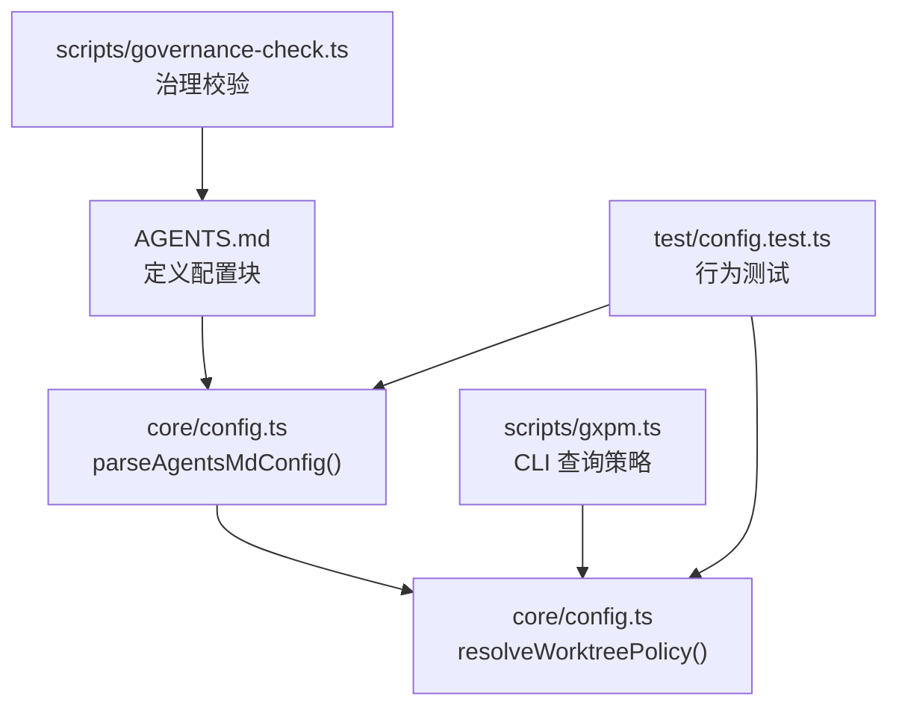
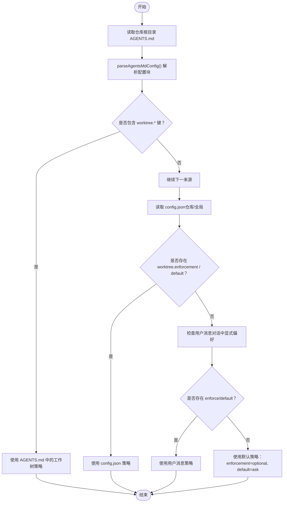
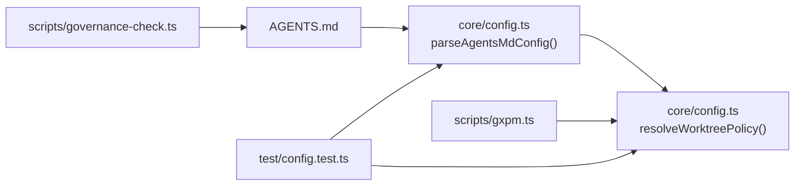

# AGENTS.md 配置

<cite>
**本文引用的文件**
- [AGENTS.md](file://AGENTS.md)
- [core/config.ts](file://core/config.ts)
- [test/config.test.ts](file://test/config.test.ts)
- [scripts/governance-check.ts](file://scripts/governance-check.ts)
- [scripts/gxpm.ts](file://scripts/gxpm.ts)
</cite>

## 目录
1. [简介](#简介)
2. [项目结构](#项目结构)
3. [核心组件](#核心组件)
4. [架构总览](#架构总览)
5. [详细组件分析](#详细组件分析)
6. [依赖关系分析](#依赖关系分析)
7. [性能考量](#性能考量)
8. [故障排查指南](#故障排查指南)
9. [结论](#结论)
10. [附录](#附录)

## 简介
本文件系统性说明 AGENTS.md 中“## gxpm Config”部分的语法规范、解析与验证机制，以及其在工作流中的作用与与其他配置源的关系。重点包括：
- 语法与键值对格式规范
- 解析函数 parseAgentsMdConfig 的行为与边界检测
- 工作流中工作树策略的解析优先级
- 配置验证与错误处理策略
- 完整示例与最佳实践

## 项目结构
与 AGENTS.md 配置相关的关键文件与职责如下：
- AGENTS.md：定义“## gxpm Config”配置块，声明工作树策略等约定
- core/config.ts：实现解析与策略解析逻辑
- test/config.test.ts：覆盖解析与优先级的行为测试
- scripts/governance-check.ts：治理文档校验，确保 AGENTS.md 结构正确
- scripts/gxpm.ts：CLI 调用策略解析，展示策略来源与输出

图表来源
- [AGENTS.md](file://AGENTS.md)
- [core/config.ts](file://core/config.ts)
- [scripts/governance-check.ts](file://scripts/governance-check.ts)
- [scripts/gxpm.ts](file://scripts/gxpm.ts)
- [test/config.test.ts](file://test/config.test.ts)

章节来源
- [AGENTS.md](file://AGENTS.md)
- [core/config.ts](file://core/config.ts)
- [scripts/governance-check.ts](file://scripts/governance-check.ts)
- [scripts/gxpm.ts](file://scripts/gxpm.ts)
- [test/config.test.ts](file://test/config.test.ts)

## 核心组件
- AGENTS.md 中的“## gxpm Config”配置块：声明工作树策略键值对，例如 worktree.enforcement: required
- parseAgentsMdConfig(content)：从 AGENTS.md 文本中提取配置块并解析为配置文档
- resolveWorktreePolicy(input)：按优先级解析工作树策略，来源依次为：config.json（仓库/全局）、用户消息、AGENTS.md、默认值
- 治理校验：scripts/governance-check.ts 确保 AGENTS.md 结构与长度符合要求

章节来源
- [AGENTS.md](file://AGENTS.md)
- [core/config.ts](file://core/config.ts)
- [scripts/governance-check.ts](file://scripts/governance-check.ts)
- [scripts/gxpm.ts](file://scripts/gxpm.ts)
- [test/config.test.ts](file://test/config.test.ts)

## 架构总览
下图展示了 AGENTS.md 配置在策略解析中的位置与优先级：

图表来源
- [core/config.ts](file://core/config.ts)

## 详细组件分析

### “## gxpm Config”语法规范与键值对格式
- 配置块标题：必须为“## gxpm Config”，大小写不敏感
- 行格式：支持带项目符号的条目（如 - key: value）或无符号的键值行（如 key: value）
- 键命名：必须包含点号分隔符（如 worktree.enforcement），且键名以字母开头
- 值类型：支持字符串、布尔、数字；字符串两端可带引号会被去除
- 边界检测：遇到下一个“## ”标题即停止收集该配置块内容
- 返回结果：解析为配置文档（仅包含 recognized 键），未识别或无配置块返回空对象

章节来源
- [AGENTS.md](file://AGENTS.md)
- [core/config.ts](file://core/config.ts)
- [test/config.test.ts](file://test/config.test.ts)

### parseAgentsMdConfig 函数使用说明与解析逻辑
- 输入：AGENTS.md 的完整文本
- 输出：配置文档（ConfigDoc），仅包含 recognized 键
- 关键步骤：
  - 识别“## gxpm Config”标题（大小写不敏感）
  - 收集该标题至下一个“## ”标题之间的所有行
  - 使用正则匹配键值行，提取键与值
  - 将值进行归一化（布尔、数字、去引号）
  - 仅保留包含“.”的键，构建嵌套文档结构
- 边界与容错：
  - 若未找到配置块或内容为空，返回空对象
  - 不识别的行被忽略
  - 键不含“.”的行被忽略

章节来源
- [core/config.ts](file://core/config.ts)
- [test/config.test.ts](file://test/config.test.ts)

### 配置块识别机制与边界检测规则
- 标题识别：正则 /^##\s+gxpm\s+config\s*$/i 匹配“## gxpm Config”
- 内容收集：在进入配置块后，持续收集行，直到遇到新的“## ”标题
- 结束条件：下一个“## ”标题出现即停止收集
- 测试覆盖：包含“带/不带项目符号”的键值行、不存在配置块等情况

章节来源
- [core/config.ts](file://core/config.ts)
- [test/config.test.ts](file://test/config.test.ts)

### 工作流中的作用与与其他配置源的关系
- 优先级（从高到低）：
  1) .gxpm/config.json（仓库级别优先于全局）
  2) 用户消息（当前对话中显式偏好）
  3) AGENTS.md 中的“## gxpm Config”块
  4) 默认值：enforcement=optional, default=ask
- AGENTS.md 的覆盖规则：任何 .gxpm/config.json 中显式设置的键都会覆盖本节配置
- CLI 展示：scripts/gxpm.ts 提供查询策略的命令，输出策略来源与值

章节来源
- [core/config.ts](file://core/config.ts)
- [scripts/gxpm.ts](file://scripts/gxpm.ts)
- [test/config.test.ts](file://test/config.test.ts)

### 配置验证与错误处理策略
- AGENTS.md 结构与长度校验：治理脚本确保 AGENTS.md 与 CLAUDE.md 的存在与长度限制，并要求包含“## Always”、“## Ask First”、“## Never”等边界标题
- 解析容错：parseAgentsMdConfig 对不匹配行与非键值行进行忽略，保证健壮性
- 策略解析容错：resolveWorktreePolicy 在各来源缺失时回退到下一个来源，最终保证有默认策略

章节来源
- [scripts/governance-check.ts](file://scripts/governance-check.ts)
- [core/config.ts](file://core/config.ts)
- [test/config.test.ts](file://test/config.test.ts)

### 完整 AGENTS.md 配置示例与最佳实践
- 示例键值对
  - worktree.enforcement: required
  - worktree.default: ask
- 最佳实践
  - 保持 AGENTS.md 简洁，遵循治理校验的长度限制
  - 仅在需要时覆盖默认策略；默认策略为 optional + ask
  - 任何 .gxpm/config.json 中显式设置的键都会覆盖本节配置
  - 在对话中明确表达偏好时，可通过用户消息覆盖 AGENTS.md 策略（前提是仓库/全局未设置）

章节来源
- [AGENTS.md](file://AGENTS.md)
- [scripts/governance-check.ts](file://scripts/governance-check.ts)
- [core/config.ts](file://core/config.ts)
- [test/config.test.ts](file://test/config.test.ts)

## 依赖关系分析
- AGENTS.md 依赖 core/config.ts 中的解析与策略解析函数
- scripts/governance-check.ts 依赖 AGENTS.md 的存在与结构
- scripts/gxpm.ts 依赖 resolveWorktreePolicy 获取策略并输出
- test/config.test.ts 依赖 parseAgentsMdConfig 与 resolveWorktreePolicy 的行为

图表来源
- [AGENTS.md](file://AGENTS.md)
- [core/config.ts](file://core/config.ts)
- [scripts/governance-check.ts](file://scripts/governance-check.ts)
- [scripts/gxpm.ts](file://scripts/gxpm.ts)
- [test/config.test.ts](file://test/config.test.ts)

## 性能考量
- 解析复杂度：parseAgentsMdConfig 对 AGENTS.md 文本逐行扫描，时间复杂度 O(n)，空间复杂度 O(n)
- 策略解析复杂度：resolveWorktreePolicy 顺序检查多个来源，常数开销极小
- 建议：AGENTS.md 保持较小规模（治理校验限制约 150 行），有助于快速解析与维护

## 故障排查指南
- 问题：解析不到配置
  - 检查标题是否为“## gxpm Config”（大小写不敏感）
  - 确认配置块内每行都是“键: 值”或“- 键: 值”
  - 确认键包含“.”，且值未被注释或包含“#”
- 问题：策略未按预期生效
  - 检查 .gxpm/config.json 是否存在更高优先级的设置
  - 确认用户消息是否传入了 enforce/default
  - 确认 AGENTS.md 是否位于仓库根目录
- 问题：治理校验失败
  - AGENTS.md 缺失边界标题或超长
  - CLAUDE.md 未指向 AGENTS.md 或超长

章节来源
- [core/config.ts](file://core/config.ts)
- [scripts/governance-check.ts](file://scripts/governance-check.ts)
- [test/config.test.ts](file://test/config.test.ts)

## 结论
AGENTS.md 的“## gxpm Config”提供了仓库级的治理约定，通过 parseAgentsMdConfig 与 resolveWorktreePolicy 实现了清晰的解析与优先级控制。结合治理校验与 CLI 查询，能够稳定地在工作流中应用这些约定，并在多源配置中保持一致性与可追溯性。

## 附录
- 相关接口与类型
  - WorktreeEnforcement：required | forbidden | optional | unset
  - WorktreeDefault：use | skip | ask
  - PolicySource：config-repo | config-global | user-message | agents-md | default
  - ResolveWorktreePolicyInput：包含 root、home、userMessage、agentsMdContent

章节来源
- [core/config.ts](file://core/config.ts)