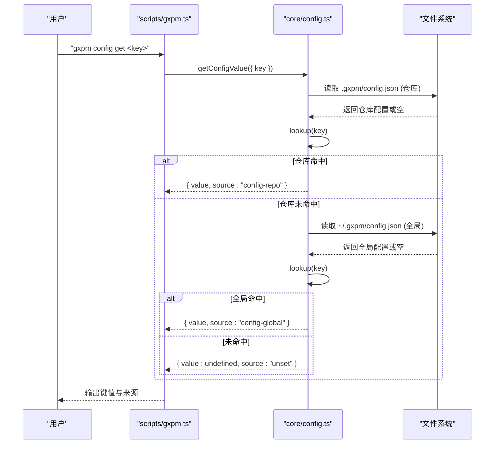
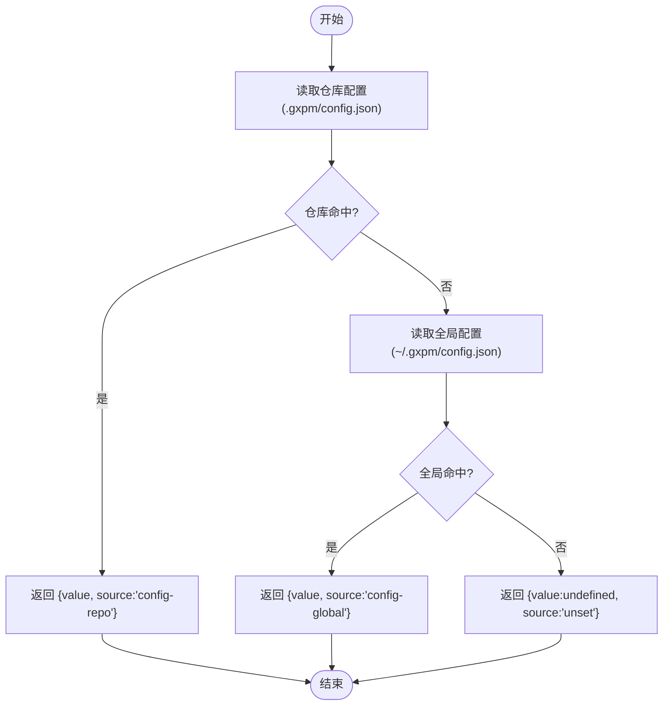
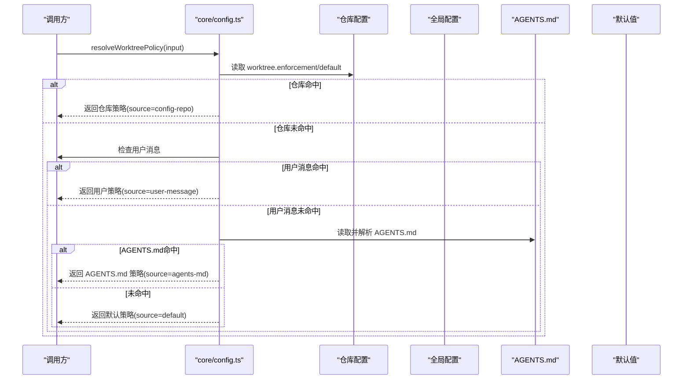
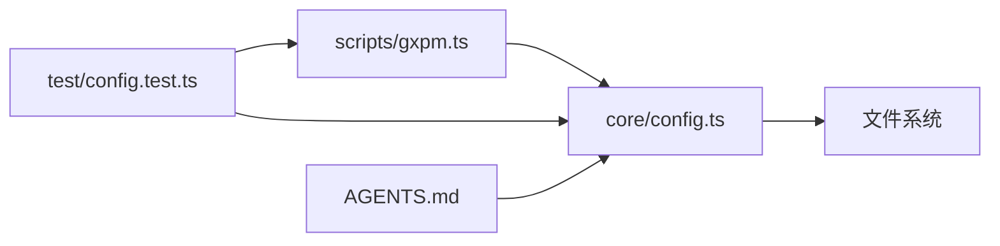

# 多层配置结构

<cite>
**本文引用的文件**
- [core/config.ts](file://core/config.ts)
- [test/config.test.ts](file://test/config.test.ts)
- [scripts/gxpm.ts](file://scripts/gxpm.ts)
- [AGENTS.md](file://AGENTS.md)
- [scripts/host-config.ts](file://scripts/host-config.ts)
</cite>

## 目录
1. [简介](#简介)
2. [项目结构](#项目结构)
3. [核心组件](#核心组件)
4. [架构总览](#架构总览)
5. [详细组件分析](#详细组件分析)
6. [依赖关系分析](#依赖关系分析)
7. [性能考量](#性能考量)
8. [故障排查指南](#故障排查指南)
9. [结论](#结论)
10. [附录](#附录)

## 简介
本文件系统性阐述 gxpm 的多层配置结构与优先级机制，重点覆盖：
- 仓库级配置与全局配置的层次关系与优先级
- 配置读取顺序：仓库配置优先于全局配置
- 配置值的查找算法与嵌套键值解析过程
- 配置文件格式规范与 JSON Schema 验证规则
- 配置项命名约定与数据类型支持
- 使用 getConfigValue 与 setConfigValue API 进行配置管理

## 项目结构
本项目的配置系统围绕核心模块与 CLI 命令展开：
- 核心配置逻辑位于 core/config.ts，提供配置读取、写入、列表、解析 AGENTS.md 中的 gxpm Config 区块以及工作树策略解析等能力
- CLI 命令 scripts/gxpm.ts 提供 gxpm config get/set/list 等子命令，调用核心配置 API
- 测试 test/config.test.ts 验证配置优先级、解析行为与策略解析链路
- 文档 AGENTS.md 展示了工作树策略的默认与覆盖方式
- scripts/host-config.ts 提供主机配置校验，与本节主题相关但侧重点不同

```mermaid
graph TB
subgraph "核心"
CFG["core/config.ts<br/>配置读取/写入/解析/策略"]
end
subgraph "CLI"
CLI["scripts/gxpm.ts<br/>config 子命令"]
end
subgraph "测试"
TST["test/config.test.ts<br/>优先级/解析/策略测试"]
end
subgraph "文档"
DOC["AGENTS.md<br/>工作树策略默认与覆盖说明"]
end
subgraph "辅助"
HCFG["scripts/host-config.ts<br/>主机配置校验"]
end
CLI --> CFG
TST --> CFG
TST --> CLI
DOC --> CFG
HCFG -. 不直接影响配置优先级 .- CFG
```

图表来源
- [core/config.ts:1-229](file://core/config.ts#L1-L229)
- [scripts/gxpm.ts:258-312](file://scripts/gxpm.ts#L258-L312)
- [test/config.test.ts:1-160](file://test/config.test.ts#L1-L160)
- [AGENTS.md:33-38](file://AGENTS.md#L33-L38)
- [scripts/host-config.ts:1-83](file://scripts/host-config.ts#L1-L83)

章节来源
- [core/config.ts:1-229](file://core/config.ts#L1-L229)
- [scripts/gxpm.ts:258-312](file://scripts/gxpm.ts#L258-L312)
- [test/config.test.ts:1-160](file://test/config.test.ts#L1-L160)
- [AGENTS.md:33-38](file://AGENTS.md#L33-L38)
- [scripts/host-config.ts:1-83](file://scripts/host-config.ts#L1-L83)

## 核心组件
- 配置文件位置
  - 仓库级配置：仓库根目录下的 .gxpm/config.json
  - 全局配置：用户主目录下的 ~/.gxpm/config.json
- 配置读取与写入
  - getConfigValue：按仓库优先级查找指定键，返回值与来源
  - setConfigValue：在指定作用域写入键值，自动创建目录与文件
  - listConfig：同时列出仓库与全局配置文档
- 配置解析与策略
  - parseAgentsMdConfig：从 AGENTS.md 中提取 gxpm Config 区块为配置对象
  - resolveWorktreePolicy：按固定优先级链解析工作树策略

章节来源
- [core/config.ts:43-106](file://core/config.ts#L43-L106)
- [core/config.ts:114-195](file://core/config.ts#L114-L195)

## 架构总览
配置系统的控制流如下：
- CLI 解析参数，调用核心 API
- 核心 API 读取仓库与全局配置，按优先级返回结果
- 解析器从 AGENTS.md 中提取配置片段，参与策略解析



图表来源
- [scripts/gxpm.ts:264-274](file://scripts/gxpm.ts#L264-L274)
- [core/config.ts:66-79](file://core/config.ts#L66-L79)
- [core/config.ts:202-210](file://core/config.ts#L202-L210)

## 详细组件分析

### 配置读取与优先级
- 读取顺序
  1) 仓库配置：优先读取仓库 .gxpm/config.json
  2) 全局配置：若仓库未命中，则读取 ~/.gxpm/config.json
  3) 未设置：均未命中时返回 unset
- 查找算法
  - lookup(doc, key) 将 key 按点号分隔，逐层访问对象属性，任一中间非对象即视为未命中
- 命名约定
  - 键名采用点号分隔的层级路径，如 worktree.enforcement
  - 解析器 parseAgentsMdConfig 仅处理包含点号的键
- 数据类型支持
  - 字面量解析：字符串、布尔、整数；其余保持原样
  - 写入时支持任意 JSON 可序列化值



图表来源
- [core/config.ts:66-79](file://core/config.ts#L66-L79)
- [core/config.ts:202-210](file://core/config.ts#L202-L210)

章节来源
- [core/config.ts:66-79](file://core/config.ts#L66-L79)
- [core/config.ts:202-210](file://core/config.ts#L202-L210)
- [test/config.test.ts:31-40](file://test/config.test.ts#L31-L40)

### 配置写入与列表
- setConfigValue
  - 根据 scope 选择仓库或全局路径
  - 读取现有文档，使用 assign(key, value) 写入嵌套键值
  - 自动创建目录并写回 JSON 文件
- listConfig
  - 同时返回仓库与全局配置文档，便于对比与调试

章节来源
- [core/config.ts:81-106](file://core/config.ts#L81-L106)
- [core/config.ts:212-221](file://core/config.ts#L212-L221)

### AGENTS.md 配置解析
- parseAgentsMdConfig
  - 识别标题为 “## gxpm Config” 的区块
  - 解析形如 “- key: value” 或 “key: value” 的行
  - 仅处理包含点号的键，去除引号并标准化值
- 用途
  - 作为工作树策略解析链中的第三级来源（在仓库/全局之后）

章节来源
- [core/config.ts:114-144](file://core/config.ts#L114-L144)
- [test/config.test.ts:54-85](file://test/config.test.ts#L54-L85)
- [AGENTS.md:33-38](file://AGENTS.md#L33-L38)

### 工作树策略解析链
- 优先级链
  1) 仓库配置：worktree.enforcement / worktree.default
  2) 用户消息：当前对话传入的用户偏好
  3) AGENTS.md：仓库文档中的 gxpm Config 区块
  4) 默认：enforcement=optional, default=ask
- 行为验证
  - 仓库配置优先于全局配置
  - 用户消息在无仓库/全局配置时优先于 AGENTS.md
  - 无任何来源时使用默认值



图表来源
- [core/config.ts:153-195](file://core/config.ts#L153-L195)
- [test/config.test.ts:87-159](file://test/config.test.ts#L87-L159)

章节来源
- [core/config.ts:153-195](file://core/config.ts#L153-L195)
- [test/config.test.ts:87-159](file://test/config.test.ts#L87-L159)

### CLI 配置命令
- gxpm config get <key>
  - 调用 getConfigValue，输出键值与来源
- gxpm config set <key> <value> [--global]
  - 调用 setConfigValue，支持仓库或全局作用域
- gxpm config list
  - 调用 listConfig，输出仓库与全局配置

章节来源
- [scripts/gxpm.ts:258-312](file://scripts/gxpm.ts#L258-L312)

## 依赖关系分析
- 组件耦合
  - CLI 仅依赖核心 API，核心 API 依赖文件系统读写
  - 解析器与策略解析相互独立，但共同参与策略决策
- 外部依赖
  - Node.js fs/path/homedir
  - 测试使用 Bun 测试框架



图表来源
- [scripts/gxpm.ts:258-312](file://scripts/gxpm.ts#L258-L312)
- [core/config.ts:1-229](file://core/config.ts#L1-L229)
- [test/config.test.ts:1-160](file://test/config.test.ts#L1-L160)
- [AGENTS.md:33-38](file://AGENTS.md#L33-L38)

章节来源
- [scripts/gxpm.ts:258-312](file://scripts/gxpm.ts#L258-L312)
- [core/config.ts:1-229](file://core/config.ts#L1-L229)
- [test/config.test.ts:1-160](file://test/config.test.ts#L1-L160)
- [AGENTS.md:33-38](file://AGENTS.md#L33-L38)

## 性能考量
- 文件 I/O
  - 读取与写入均为单次 JSON 文件操作，开销极低
  - 写入前确保目录存在，避免多次错误重试
- 查找复杂度
  - lookup 为 O(k) 层级遍历，k 为点号分隔的键层级数，通常很小
- 建议
  - 在高频场景中可考虑缓存最近一次读取结果，减少重复 I/O

## 故障排查指南
- 键未找到
  - 确认键是否包含点号分隔的层级路径
  - 检查仓库与全局配置文件是否存在与可读
- 值类型异常
  - setConfigValue 支持任意 JSON 可序列化值；CLI set 会尝试解析字面量（true/false/整数）
  - 若期望字符串，请在 CLI 中加引号
- 优先级不符合预期
  - 确认仓库配置是否覆盖了全局配置
  - 若需要临时覆盖，可通过用户消息或 AGENTS.md 区块
- AGENTS.md 未生效
  - 确认标题为 “## gxpm Config”
  - 确认键包含点号，且值符合字面量解析规则

章节来源
- [core/config.ts:66-79](file://core/config.ts#L66-L79)
- [core/config.ts:114-144](file://core/config.ts#L114-L144)
- [scripts/gxpm.ts:307-312](file://scripts/gxpm.ts#L307-L312)
- [test/config.test.ts:31-40](file://test/config.test.ts#L31-L40)

## 结论
本配置系统以简洁明确的优先级链与点号分隔的键命名，实现了仓库级优先、易于扩展的多层配置管理。通过 CLI 与核心 API 的清晰分离，既保证了易用性，也便于测试与维护。建议在团队内统一键命名与值类型约定，以提升一致性与可维护性。

## 附录

### 配置文件格式规范
- 文件位置
  - 仓库级：仓库根目录 .gxpm/config.json
  - 全局级：用户主目录 ~/.gxpm/config.json
- 键命名
  - 使用点号分隔的层级路径，如 worktree.enforcement
  - 解析器仅处理包含点号的键
- 值类型
  - 支持任意 JSON 可序列化值
  - CLI set 时会尝试解析字面量：true/false/整数，其余保持原样
- 示例结构
  - 仓库配置与全局配置均为 JSON 对象，键为字符串，值为任意 JSON 类型

章节来源
- [core/config.ts:43-106](file://core/config.ts#L43-L106)
- [core/config.ts:114-144](file://core/config.ts#L114-L144)
- [scripts/gxpm.ts:307-312](file://scripts/gxpm.ts#L307-L312)

### JSON Schema 验证规则
- 通用规则
  - 根对象为 JSON 对象
  - 键为字符串，值为任意 JSON 类型
- 仓库与全局配置
  - 无强制字段；可为空对象
  - 建议遵循团队约定的键命名与值类型
- AGENTS.md 解析
  - 仅识别标题为 “## gxpm Config” 的区块
  - 仅处理包含点号的键行
  - 值两端空白与首尾引号会被清理

章节来源
- [core/config.ts:114-144](file://core/config.ts#L114-L144)
- [test/config.test.ts:54-85](file://test/config.test.ts#L54-L85)

### API 使用说明
- getConfigValue
  - 输入：root、home、key
  - 输出：value 与来源（config-repo、config-global、unset）
- setConfigValue
  - 输入：root、home、scope（repo/global）、key、value
  - 输出：写入的文件路径
- listConfig
  - 输入：root、home
  - 输出：仓库与全局配置文档对象
- CLI
  - gxpm config get <key>
  - gxpm config set <key> <value> [--global]
  - gxpm config list

章节来源
- [core/config.ts:66-106](file://core/config.ts#L66-L106)
- [scripts/gxpm.ts:258-312](file://scripts/gxpm.ts#L258-L312)