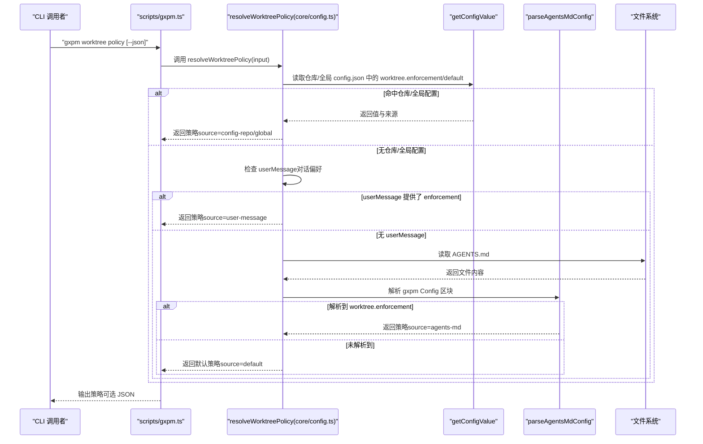

# 工作树策略

<cite>
**本文引用的文件列表**
- [core/config.ts](file://core/config.ts)
- [scripts/gxpm.ts](file://scripts/gxpm.ts)
- [AGENTS.md](file://AGENTS.md)
- [test/config.test.ts](file://test/config.test.ts)
- [core/dispatch.ts](file://core/dispatch.ts)
</cite>

## 目录
1. [简介](#简介)
2. [项目结构](#项目结构)
3. [核心组件](#核心组件)
4. [架构总览](#架构总览)
5. [详细组件分析](#详细组件分析)
6. [依赖关系分析](#依赖关系分析)
7. [性能考量](#性能考量)
8. [故障排查指南](#故障排查指南)
9. [结论](#结论)
10. [附录](#附录)

## 简介
本文件系统化阐述工作树策略的设计与实现，重点包括：
- 强制级别（enforcement）与默认行为（default）的定义、差异与适用场景
- 解析优先级：config.json（仓库/全局） > 用户消息（对话中显式偏好） > AGENTS.md 配置块 > 默认值
- resolveWorktreePolicy 函数的输入参数、返回结构与调用方式
- 实际配置示例与最佳实践

工作树策略围绕“是否强制使用独立工作树（worktree）”以及“默认采用何种行为（使用/跳过/询问）”展开，贯穿仓库约定、用户对话偏好与默认行为，确保在不同环境下保持一致的执行体验。

## 项目结构
与工作树策略直接相关的模块与文件如下：
- 核心解析与配置：core/config.ts
- CLI 命令入口：scripts/gxpm.ts
- 仓库约定文档：AGENTS.md
- 单元测试：test/config.test.ts
- 相关数据结构（用于初始化阶段）：core/dispatch.ts

```mermaid
graph TB
subgraph "核心"
CFG["core/config.ts<br/>解析与配置"]
DIS["core/dispatch.ts<br/>初始化阶段数据结构"]
end
subgraph "CLI"
CLI["scripts/gxpm.ts<br/>命令入口"]
end
subgraph "约定与测试"
AG["AGENTS.md<br/>仓库约定"]
TST["test/config.test.ts<br/>解析优先级与行为测试"]
end
CLI --> CFG
AG --> CFG
TST --> CFG
DIS --> CFG
```

图表来源
- [core/config.ts:153-195](file://core/config.ts#L153-L195)
- [scripts/gxpm.ts:52-63](file://scripts/gxpm.ts#L52-L63)
- [AGENTS.md:33-38](file://AGENTS.md#L33-L38)
- [test/config.test.ts:87-159](file://test/config.test.ts#L87-L159)
- [core/dispatch.ts:1-17](file://core/dispatch.ts#L1-L17)

章节来源
- [core/config.ts:153-195](file://core/config.ts#L153-L195)
- [scripts/gxpm.ts:52-63](file://scripts/gxpm.ts#L52-L63)
- [AGENTS.md:33-38](file://AGENTS.md#L33-L38)
- [test/config.test.ts:87-159](file://test/config.test.ts#L87-L159)
- [core/dispatch.ts:1-17](file://core/dispatch.ts#L1-L17)

## 核心组件
- 强制级别（enforcement）
  - required：必须使用工作树
  - forbidden：禁止使用工作树
  - optional：可选使用工作树
  - unset：未设置（保留给内部使用）
- 默认行为（default）
  - use：默认使用工作树
  - skip：默认跳过工作树
  - ask：默认询问用户
- 策略来源（source）
  - config-repo：来自仓库 .gxpm/config.json
  - config-global：来自全局 ~/.gxpm/config.json
  - user-message：来自当前对话的用户偏好
  - agents-md：来自 AGENTS.md 的 gxpm Config 区块
  - default：默认策略（enforcement=optional, default=ask）

章节来源
- [core/config.ts:5-19](file://core/config.ts#L5-L19)
- [core/config.ts:146-152](file://core/config.ts#L146-L152)

## 架构总览
工作树策略的解析流程遵循严格的优先级链路，最终输出 WorktreePolicy 结构，供上层流程（如 CLI、工作流）依据策略决定行为。



图表来源
- [scripts/gxpm.ts:52-63](file://scripts/gxpm.ts#L52-L63)
- [core/config.ts:153-195](file://core/config.ts#L153-L195)
- [core/config.ts:66-79](file://core/config.ts#L66-L79)
- [core/config.ts:114-144](file://core/config.ts#L114-L144)
- [core/config.ts:197-200](file://core/config.ts#L197-L200)

## 详细组件分析

### 强制级别（enforcement）详解
- required（必需）
  - 场景：需要隔离变更、避免污染主分支或需要多分支并行开发
  - 行为：策略强制使用工作树；若未满足条件，应阻断或提示用户创建工作树
- forbidden（禁止）
  - 场景：环境限制不允许使用工作树，或团队约定禁止
  - 行为：策略禁止使用工作树；任何工作流不应尝试创建或切换工作树
- optional（可选）
  - 场景：允许根据默认行为或用户选择决定是否使用工作树
  - 行为：结合 default 决策；通常默认询问（ask）以尊重用户意图
- unset（未设置）
  - 场景：内部占位，表示未显式设定
  - 行为：不会出现在最终策略中；解析时会被忽略

章节来源
- [core/config.ts:5](file://core/config.ts#L5)
- [AGENTS.md:37-38](file://AGENTS.md#L37-L38)

### 默认行为（default）详解
- use（使用）
  - 场景：默认直接使用工作树进行后续操作
  - 注意：仍受 enforcement 控制；若 enforcement=forbidden，则即使 default=use 也不应使用
- skip（跳过）
  - 场景：默认不使用工作树，直接在主分支或当前分支操作
  - 注意：若 enforcement=required，则策略会强制使用工作树，skip 不生效
- ask（询问）
  - 场景：默认询问用户是否使用工作树
  - 行为：在交互式流程中引导用户确认，避免误操作

章节来源
- [core/config.ts:6](file://core/config.ts#L6)
- [AGENTS.md:35-36](file://AGENTS.md#L35-L36)

### 解析优先级与决策逻辑
- 优先级链路
  1) 仓库 config.json（.gxpm/config.json）：最高优先级，可覆盖全局与约定
  2) 用户消息（userMessage）：当前对话显式偏好，覆盖约定
  3) AGENTS.md 的 gxpm Config 区块：仓库约定
  4) 默认策略：enforcement=optional, default=ask
- 决策要点
  - 若仓库配置存在 enforcement，则返回该值，并将 default 规范化为 ask（若未提供）
  - 若无仓库配置但提供了 userMessage.enforcement，则返回该值与 default（未提供则 ask）
  - 若无仓库配置且无 userMessage，则解析 AGENTS.md 的 gxpm Config 区块，若找到 worktree.enforcement 则返回
  - 否则返回默认策略
- 特殊约定
  - AGENTS.md 中的默认值为 enforcement=optional, default=ask
  - 任何 .gxpm/config.json 中的显式设置都会覆盖 AGENTS.md 的约定

章节来源
- [core/config.ts:146-152](file://core/config.ts#L146-L152)
- [core/config.ts:153-195](file://core/config.ts#L153-L195)
- [AGENTS.md:33-38](file://AGENTS.md#L33-L38)
- [test/config.test.ts:87-159](file://test/config.test.ts#L87-L159)

### resolveWorktreePolicy 函数详解
- 输入参数（ResolveWorktreePolicyInput）
  - root：仓库根目录，默认为当前工作目录
  - home：$HOME 覆盖，默认为系统用户主目录
  - userMessage：当前对话中用户的偏好，包含 enforcement 与 default
  - agentsMdContent：显式传入的 AGENTS.md 内容（用于测试或特殊场景）
- 返回值（WorktreePolicy）
  - enforcement：强制级别
  - default：默认行为
  - source：策略来源（config-repo/global/user-message/agents-md/default）
- 调用方式
  - CLI：gxpm worktree policy（支持 --json 输出）
  - 代码：import { resolveWorktreePolicy } from "../core/config"

章节来源
- [core/config.ts:21-33](file://core/config.ts#L21-L33)
- [core/config.ts:8-12](file://core/config.ts#L8-L12)
- [scripts/gxpm.ts:52-63](file://scripts/gxpm.ts#L52-L63)

### AGENTS.md 与仓库约定
- gxpm Config 区块
  - 默认值：worktree.enforcement: optional
  - 默认值：worktree.default: ask
- 使用说明
  - 如需强制走 worktree-first，将 enforcement 改为 required
  - 如禁用 worktree，将 enforcement 改为 forbidden
  - 任何 .gxpm/config.json 中的显式设置都会覆盖本段

章节来源
- [AGENTS.md:33-38](file://AGENTS.md#L33-L38)

### CLI 与策略输出
- 命令：gxpm worktree policy
- 输出：打印 enforcement、default 与 source
- 可选：--json 输出 JSON 格式

章节来源
- [scripts/gxpm.ts:52-63](file://scripts/gxpm.ts#L52-L63)

### 测试与行为验证
- 仓库/全局配置优先级测试
  - 仓库配置覆盖全局配置
- 用户消息优先级测试
  - 当存在 userMessage.enforcement 时，覆盖 AGENTS.md
- AGENTS.md 解析测试
  - 正确解析 gxpm Config 区块
- 默认策略测试
  - 无任何配置时返回 enforcement=optional, default=ask

章节来源
- [test/config.test.ts:13-52](file://test/config.test.ts#L13-L52)
- [test/config.test.ts:54-85](file://test/config.test.ts#L54-L85)
- [test/config.test.ts:87-159](file://test/config.test.ts#L87-L159)

## 依赖关系分析
- resolveWorktreePolicy 依赖
  - getConfigValue：读取仓库/全局 config.json
  - parseAgentsMdConfig：解析 AGENTS.md 的 gxpm Config 区块
  - 文件系统：读取 AGENTS.md
- CLI 依赖
  - resolveWorktreePolicy：输出策略
- 数据结构
  - WorktreePolicy：策略结果
  - ResolveWorktreePolicyInput：输入参数
  - PolicySource：策略来源枚举

```mermaid
classDiagram
class WorktreePolicy {
+enforcement
+default
+source
}
class ResolveWorktreePolicyInput {
+root
+home
+userMessage
+agentsMdContent
}
class PolicySource {
<<enumeration>>
"config-repo"
"config-global"
"user-message"
"agents-md"
"default"
}
class ConfigModule {
+getConfigValue()
+setConfigValue()
+listConfig()
+parseAgentsMdConfig()
+resolveWorktreePolicy()
}
class ScriptCLI {
+worktree_policy()
}
ScriptCLI --> ConfigModule : "调用"
ConfigModule --> PolicySource : "返回"
ConfigModule --> WorktreePolicy : "返回"
ResolveWorktreePolicyInput --> ConfigModule : "输入"
```

图表来源
- [core/config.ts:8-19](file://core/config.ts#L8-L19)
- [core/config.ts:21-33](file://core/config.ts#L21-L33)
- [core/config.ts:66-79](file://core/config.ts#L66-L79)
- [core/config.ts:114-144](file://core/config.ts#L114-L144)
- [core/config.ts:153-195](file://core/config.ts#L153-L195)
- [scripts/gxpm.ts:52-63](file://scripts/gxpm.ts#L52-L63)

章节来源
- [core/config.ts:66-79](file://core/config.ts#L66-L79)
- [core/config.ts:114-144](file://core/config.ts#L114-L144)
- [core/config.ts:153-195](file://core/config.ts#L153-L195)
- [scripts/gxpm.ts:52-63](file://scripts/gxpm.ts#L52-L63)

## 性能考量
- 解析开销
  - 仓库/全局配置读取：O(1) 文件读取，JSON 解析成本低
  - AGENTS.md 解析：按行扫描，复杂度 O(n)，n 为行数
  - 用户消息：内存结构传递，无 IO
- 优化建议
  - 将仓库配置缓存至进程内，避免重复读取
  - 在批量处理场景下，复用同一 ResolveWorktreePolicyInput
  - AGENTS.md 解析仅在必要时触发（例如首次解析或配置变更后）

## 故障排查指南
- 策略来源不符合预期
  - 检查仓库 .gxpm/config.json 是否存在且键名正确
  - 检查全局 ~/.gxpm/config.json 是否覆盖了仓库配置
  - 检查对话中是否传入了 userMessage
  - 检查 AGENTS.md 的 gxpm Config 区块格式是否正确
- 默认策略始终生效
  - 确认未设置仓库/全局配置，且未传入 userMessage
  - 确认 AGENTS.md 中的 gxpm Config 区块存在且包含 worktree.enforcement
- CLI 输出异常
  - 使用 --json 查看完整策略来源与字段
  - 确认 CLI 路径与 resolveWorktreePolicy 的调用位置

章节来源
- [test/config.test.ts:87-159](file://test/config.test.ts#L87-L159)
- [scripts/gxpm.ts:52-63](file://scripts/gxpm.ts#L52-L63)

## 结论
工作树策略通过清晰的优先级与可配置项，实现了在不同环境与场景下的灵活控制。仓库配置最高优先，对话偏好次之，AGENTS.md 作为约定兜底，最终默认策略保证一致性。resolveWorktreePolicy 提供了简洁稳定的接口，便于 CLI 与上层流程集成。

## 附录

### 实际配置示例与最佳实践
- 示例一：强制使用工作树（CI/生产环境）
  - 仓库 .gxpm/config.json：worktree.enforcement: required
  - 说明：确保所有变更都在独立工作树中进行，避免污染主分支
- 示例二：禁用工作树（受限环境）
  - 仓库 .gxpm/config.json：worktree.enforcement: forbidden
  - 说明：在不允许创建工作树的环境中，避免尝试创建
- 示例三：默认询问（交互式开发）
  - AGENTS.md：worktree.enforcement: optional, worktree.default: ask
  - 说明：在日常开发中尊重用户选择，减少误操作
- 示例四：对话中临时覆盖
  - 通过 userMessage.enforcement/ default 传入当前对话偏好
  - 说明：适用于临时需求或特定任务场景

章节来源
- [AGENTS.md:33-38](file://AGENTS.md#L33-L38)
- [test/config.test.ts:87-159](file://test/config.test.ts#L87-L159)