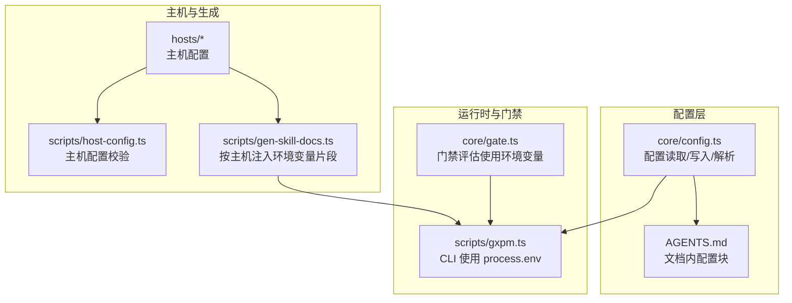
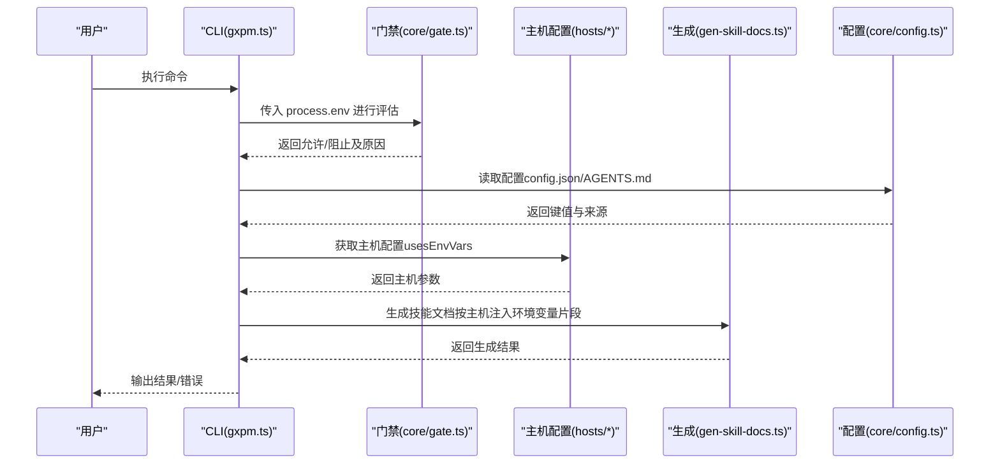
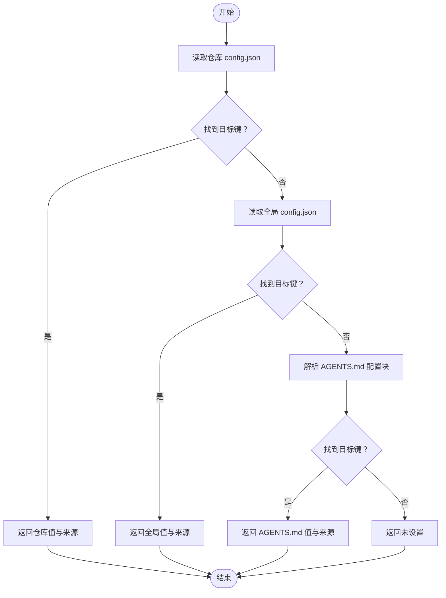
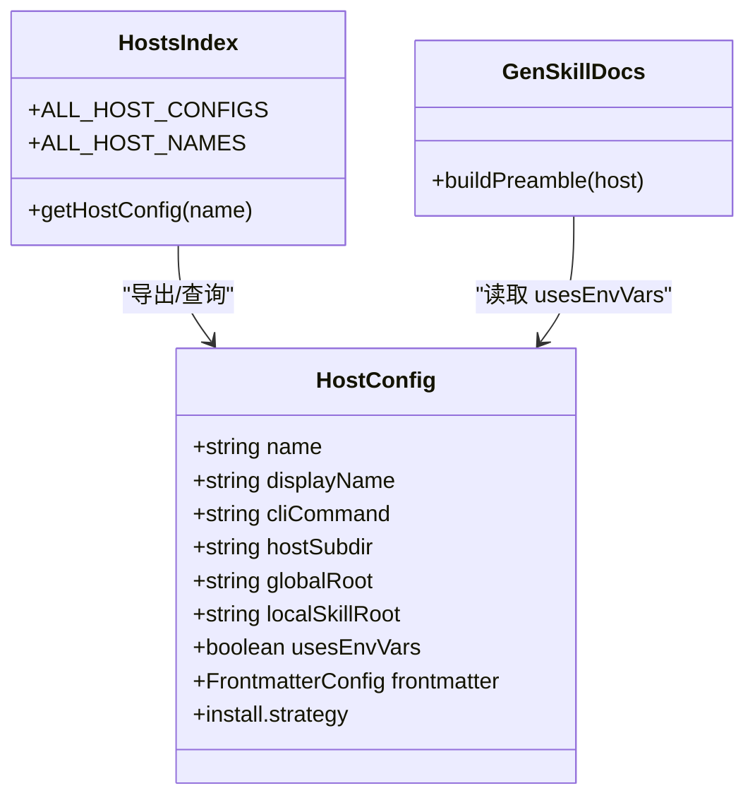
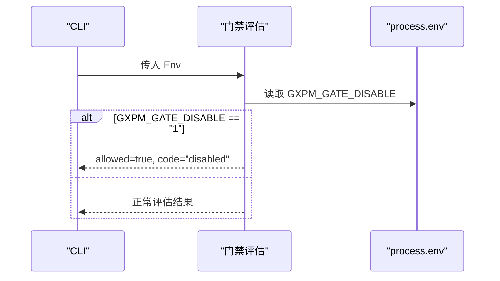
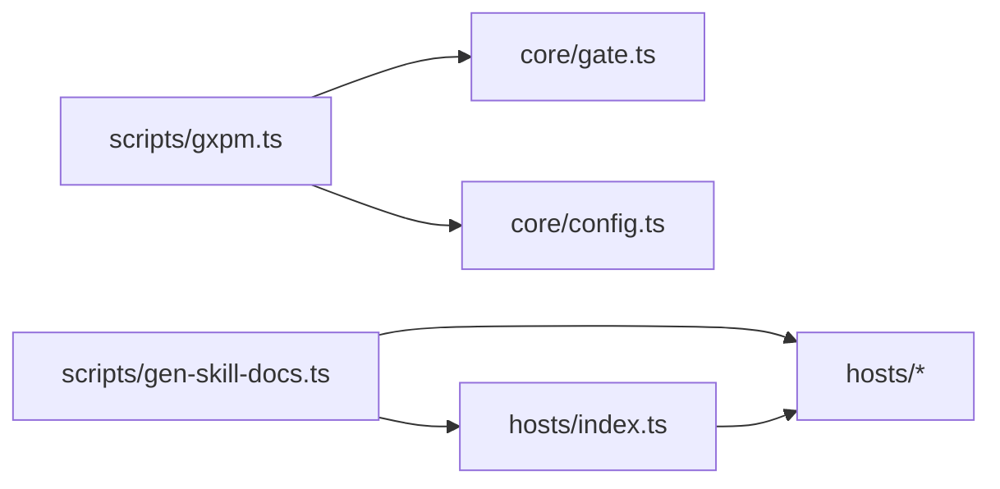

# 环境变量支持

<cite>
**本文引用的文件**
- [core/config.ts](file://core/config.ts)
- [scripts/host-config.ts](file://scripts/host-config.ts)
- [hosts/index.ts](file://hosts/index.ts)
- [hosts/claude.ts](file://hosts/claude.ts)
- [hosts/codex.ts](file://hosts/codex.ts)
- [scripts/gen-skill-docs.ts](file://scripts/gen-skill-docs.ts)
- [core/gate.ts](file://core/gate.ts)
- [scripts/gxpm.ts](file://scripts/gxpm.ts)
- [test/config.test.ts](file://test/config.test.ts)
- [test/gate.test.ts](file://test/gate.test.ts)
- [package.json](file://package.json)
</cite>

## 目录
1. [简介](#简介)
2. [项目结构](#项目结构)
3. [核心组件](#核心组件)
4. [架构总览](#架构总览)
5. [详细组件分析](#详细组件分析)
6. [依赖关系分析](#依赖关系分析)
7. [性能考量](#性能考量)
8. [故障排查指南](#故障排查指南)
9. [结论](#结论)
10. [附录](#附录)

## 简介
本文件系统性阐述本仓库中的“环境变量支持”机制，重点覆盖以下方面：
- 配置系统的环境变量处理与优先级规则
- 环境变量与配置文件（config.json、AGENTS.md）的交互与覆盖逻辑
- 环境变量命名约定与配置键映射规则
- 常见使用场景与实践建议
- 类型转换与验证机制
- 调试配置问题的方法与工具
- 在不同环境中正确设置与使用环境变量的步骤

## 项目结构
围绕“环境变量支持”的关键文件与职责概览如下：
- 核心配置读取与写入：core/config.ts
- 主机配置与环境变量使用开关：scripts/host-config.ts、hosts/*
- 技能文档生成时的环境变量注入：scripts/gen-skill-docs.ts
- Git 钩子门禁对环境变量的响应：core/gate.ts
- CLI 对配置与环境变量的调用入口：scripts/gxpm.ts
- 测试用例：test/config.test.ts、test/gate.test.ts

图表来源
- [core/config.ts:1-229](file://core/config.ts#L1-L229)
- [scripts/host-config.ts:1-83](file://scripts/host-config.ts#L1-L83)
- [hosts/index.ts:1-16](file://hosts/index.ts#L1-L16)
- [hosts/claude.ts:1-18](file://hosts/claude.ts#L1-L18)
- [hosts/codex.ts:1-19](file://hosts/codex.ts#L1-L19)
- [scripts/gen-skill-docs.ts:1-165](file://scripts/gen-skill-docs.ts#L1-L165)
- [core/gate.ts:1-144](file://core/gate.ts#L1-L144)
- [scripts/gxpm.ts:450-649](file://scripts/gxpm.ts#L450-L649)

章节来源
- [core/config.ts:1-229](file://core/config.ts#L1-L229)
- [scripts/host-config.ts:1-83](file://scripts/host-config.ts#L1-L83)
- [hosts/index.ts:1-16](file://hosts/index.ts#L1-L16)
- [hosts/claude.ts:1-18](file://hosts/claude.ts#L1-L18)
- [hosts/codex.ts:1-19](file://hosts/codex.ts#L1-L19)
- [scripts/gen-skill-docs.ts:1-165](file://scripts/gen-skill-docs.ts#L1-L165)
- [core/gate.ts:1-144](file://core/gate.ts#L1-L144)
- [scripts/gxpm.ts:450-649](file://scripts/gxpm.ts#L450-L649)

## 核心组件
- 配置系统（config.json 与 AGENTS.md）
  - 支持从仓库与全局两个层级读取配置，后者可被前者覆盖
  - 支持在 AGENTS.md 中通过特定区块声明配置键值，用于工作流策略等
- 主机配置（usesEnvVars）
  - 指示某主机是否使用环境变量，并据此在技能文档中注入相应的环境变量片段
- 门禁系统（Gate）
  - 通过环境变量 GXPM_GATE_DISABLE 控制是否绕过门禁检查
- CLI
  - 在编辑器选择、门禁执行等环节直接读取 process.env

章节来源
- [core/config.ts:66-106](file://core/config.ts#L66-L106)
- [core/config.ts:114-144](file://core/config.ts#L114-L144)
- [scripts/host-config.ts:11-23](file://scripts/host-config.ts#L11-L23)
- [scripts/gen-skill-docs.ts:84-102](file://scripts/gen-skill-docs.ts#L84-L102)
- [core/gate.ts:40-42](file://core/gate.ts#L40-L42)
- [scripts/gxpm.ts:453-455](file://scripts/gxpm.ts#L453-L455)

## 架构总览
下图展示了“环境变量支持”的整体流程：CLI 与门禁评估读取 process.env；主机配置决定是否在技能文档中注入环境变量片段；配置系统负责从 config.json 与 AGENTS.md 解析键值。

图表来源
- [scripts/gxpm.ts:450-649](file://scripts/gxpm.ts#L450-L649)
- [core/gate.ts:40-130](file://core/gate.ts#L40-L130)
- [scripts/gen-skill-docs.ts:84-102](file://scripts/gen-skill-docs.ts#L84-L102)
- [core/config.ts:66-106](file://core/config.ts#L66-L106)
- [hosts/index.ts:9-15](file://hosts/index.ts#L9-L15)

## 详细组件分析

### 配置系统与环境变量的关系
- 配置来源与优先级
  - 仓库级 config.json > 全局级 config.json > AGENTS.md 配置块 > 默认值
  - 仓库级配置优先于全局级配置
- 键名与路径
  - 配置键采用点号分隔的路径形式（如 worktree.enforcement），内部通过查找/赋值函数实现嵌套对象访问
- 类型转换与规范化
  - 从 AGENTS.md 解析的字符串值会进行基础类型归一化（布尔、数字、字符串）
- 与环境变量的交互
  - 当前配置系统不直接从 process.env 读取键值；但可通过 CLI 的“config get/set/list”操作管理 config.json，并在生成技能文档时根据主机配置注入环境变量片段

图表来源
- [core/config.ts:66-106](file://core/config.ts#L66-L106)
- [core/config.ts:114-144](file://core/config.ts#L114-L144)

章节来源
- [core/config.ts:66-106](file://core/config.ts#L66-L106)
- [core/config.ts:114-144](file://core/config.ts#L114-L144)
- [test/config.test.ts:13-52](file://test/config.test.ts#L13-L52)
- [test/config.test.ts:87-159](file://test/config.test.ts#L87-L159)

### 主机配置与环境变量注入
- usesEnvVars 字段
  - 若为 true，则在生成技能文档时注入环境变量片段（如 GXPM_ROOT、GXPM_STATE_DIR 等）
  - 若为 false，则仅注入最小必要变量
- 前言片段差异
  - usesEnvVars=true 时注入更完整的导出语句
  - usesEnvVars=false 时注入简化的根目录变量
- 主机注册与查询
  - 通过 hosts/index.ts 暴露 ALL_HOST_CONFIGS 与 getHostConfig，供生成脚本使用

图表来源
- [scripts/host-config.ts:11-23](file://scripts/host-config.ts#L11-L23)
- [hosts/index.ts:4-15](file://hosts/index.ts#L4-L15)
- [scripts/gen-skill-docs.ts:84-102](file://scripts/gen-skill-docs.ts#L84-L102)
- [hosts/claude.ts:3-17](file://hosts/claude.ts#L3-L17)
- [hosts/codex.ts:3-18](file://hosts/codex.ts#L3-L18)

章节来源
- [scripts/host-config.ts:11-23](file://scripts/host-config.ts#L11-L23)
- [scripts/gen-skill-docs.ts:84-102](file://scripts/gen-skill-docs.ts#L84-L102)
- [hosts/index.ts:4-15](file://hosts/index.ts#L4-L15)
- [hosts/claude.ts:3-17](file://hosts/claude.ts#L3-L17)
- [hosts/codex.ts:3-18](file://hosts/codex.ts#L3-L18)

### 门禁系统与环境变量
- GXPM_GATE_DISABLE
  - 当该环境变量等于 "1" 时，门禁评估将直接放行（返回 disabled）
  - 适用于临时跳过门禁检查的场景
- 门禁类型
  - pre-commit、commit-msg、pre-push、post-merge
  - CLI 将当前进程环境传递给门禁评估函数

图表来源
- [core/gate.ts:40-42](file://core/gate.ts#L40-L42)
- [core/gate.ts:52-80](file://core/gate.ts#L52-L80)
- [core/gate.ts:82-100](file://core/gate.ts#L82-L100)
- [core/gate.ts:102-130](file://core/gate.ts#L102-L130)
- [scripts/gxpm.ts:571-634](file://scripts/gxpm.ts#L571-L634)

章节来源
- [core/gate.ts:40-42](file://core/gate.ts#L40-L42)
- [test/gate.test.ts:40-46](file://test/gate.test.ts#L40-L46)
- [test/gate.test.ts:77-81](file://test/gate.test.ts#L77-L81)
- [test/gate.test.ts:104-109](file://test/gate.test.ts#L104-L109)
- [scripts/gxpm.ts:571-634](file://scripts/gxpm.ts#L571-L634)

### CLI 与环境变量
- 编辑器选择
  - 通过 EDITOR 或 VISUAL 环境变量确定默认编辑器
- 门禁执行
  - CLI 将 process.env 作为第三个参数传入门禁评估函数
- 版本输出
  - 通过 package.json 的 version 字段输出版本信息

章节来源
- [scripts/gxpm.ts:453-455](file://scripts/gxpm.ts#L453-L455)
- [scripts/gxpm.ts:571-634](file://scripts/gxpm.ts#L571-L634)
- [package.json:1-25](file://package.json#L1-L25)

## 依赖关系分析
- 组件耦合
  - scripts/gxpm.ts 依赖 core/gate.ts 的门禁评估与 core/config.ts 的配置读取
  - scripts/gen-skill-docs.ts 依赖 hosts/* 的主机配置（usesEnvVars）
  - hosts/index.ts 提供主机配置的统一入口
- 外部依赖
  - process.env 作为运行时输入源
  - 文件系统用于读写 config.json 与生成文档

图表来源
- [scripts/gxpm.ts:450-649](file://scripts/gxpm.ts#L450-L649)
- [core/gate.ts:1-144](file://core/gate.ts#L1-L144)
- [core/config.ts:1-229](file://core/config.ts#L1-L229)
- [scripts/gen-skill-docs.ts:1-165](file://scripts/gen-skill-docs.ts#L1-L165)
- [hosts/index.ts:1-16](file://hosts/index.ts#L1-L16)

章节来源
- [scripts/gxpm.ts:450-649](file://scripts/gxpm.ts#L450-L649)
- [core/gate.ts:1-144](file://core/gate.ts#L1-L144)
- [core/config.ts:1-229](file://core/config.ts#L1-L229)
- [scripts/gen-skill-docs.ts:1-165](file://scripts/gen-skill-docs.ts#L1-L165)
- [hosts/index.ts:1-16](file://hosts/index.ts#L1-L16)

## 性能考量
- 配置读取
  - 仓库与全局配置均为本地文件读取，开销极低
  - AGENTS.md 解析仅在需要时触发（如生成文档或策略解析）
- 门禁评估
  - 门禁评估为纯内存计算，受环境变量判断影响较小
- 建议
  - 避免频繁重复读取同一配置文件
  - 在批量操作中复用已解析的配置对象

## 故障排查指南
- 确认配置来源与覆盖
  - 使用 gxpm-config get <key> 查看键值与来源
  - 使用 gxpm-config set <key> <value> 设置值（支持 --global）
  - 使用 gxpm-config list 查看仓库与全局配置内容
- AGENTS.md 配置块
  - 确保配置块标题为“## gxpm Config”
  - 键名必须包含点号分隔符（如 worktree.enforcement）
  - 值会被自动规范化（布尔、数字、字符串）
- 门禁绕过
  - 如需临时绕过门禁，设置 GXPM_GATE_DISABLE=1 后重试
  - 注意：此方法仅用于调试，生产环境应保持默认行为
- 编辑器选择
  - 未设置 EDITOR/VISUAL 时，默认使用 vi；请确保编辑器可用

章节来源
- [test/config.test.ts:13-52](file://test/config.test.ts#L13-L52)
- [test/config.test.ts:54-85](file://test/config.test.ts#L54-L85)
- [test/gate.test.ts:40-46](file://test/gate.test.ts#L40-L46)
- [test/gate.test.ts:77-81](file://test/gate.test.ts#L77-L81)
- [test/gate.test.ts:104-109](file://test/gate.test.ts#L104-L109)
- [scripts/gxpm.ts:275-305](file://scripts/gxpm.ts#L275-L305)
- [scripts/gxpm.ts:453-455](file://scripts/gxpm.ts#L453-L455)

## 结论
- 本仓库的环境变量支持以“显式开关 + 文档注入 + 门禁绕过”为核心设计：
  - usesEnvVars 决定是否在技能文档中注入环境变量片段
  - process.env 用于门禁绕过与编辑器选择
  - 配置系统通过 config.json 与 AGENTS.md 提供稳定的键值来源
- 实践建议
  - 在 CI 环境中通过环境变量控制门禁行为
  - 在开发环境通过 AGENTS.md 快速声明策略键值
  - 通过 CLI 的 config 子命令维护仓库与全局配置

## 附录

### 环境变量命名约定与映射规则
- 门禁绕过
  - 名称：GXPM_GATE_DISABLE
  - 规则：等于 "1" 时绕过门禁
- 编辑器选择
  - 名称：EDITOR、VISUAL
  - 规则：EDITOR 优先于 VISUAL；均未设置时默认 vi
- 技能文档注入
  - 由主机配置的 usesEnvVars 决定是否注入环境变量片段
  - 注入内容包括但不限于 GXPM_ROOT、GXPM_STATE_DIR 等

章节来源
- [core/gate.ts:40-42](file://core/gate.ts#L40-L42)
- [scripts/gxpm.ts:453-455](file://scripts/gxpm.ts#L453-L455)
- [scripts/gen-skill-docs.ts:84-102](file://scripts/gen-skill-docs.ts#L84-L102)
- [hosts/claude.ts:10](file://hosts/claude.ts#L10)
- [hosts/codex.ts:10](file://hosts/codex.ts#L10)

### 配置键与来源优先级
- 来源优先级（高到低）
  - 仓库级 config.json
  - 全局级 config.json
  - AGENTS.md 配置块
  - 默认值
- 键名规范
  - 使用点号分隔的路径形式（如 worktree.enforcement）

章节来源
- [core/config.ts:66-106](file://core/config.ts#L66-L106)
- [core/config.ts:114-144](file://core/config.ts#L114-L144)
- [test/config.test.ts:87-159](file://test/config.test.ts#L87-L159)

### 常见使用场景与示例
- 临时绕过门禁
  - 在 shell 中设置 GXPM_GATE_DISABLE=1 后执行 git commit
- 指定编辑器
  - 设置 EDITOR 或 VISUAL 以改变默认编辑器
- 注入主机环境变量
  - 选择 usesEnvVars=true 的主机（如 codex），生成技能文档时会自动注入环境变量片段
- 维护配置
  - 使用 gxpm config get/set/list 管理仓库与全局配置

章节来源
- [test/gate.test.ts:40-46](file://test/gate.test.ts#L40-L46)
- [scripts/gxpm.ts:453-455](file://scripts/gxpm.ts#L453-L455)
- [scripts/gen-skill-docs.ts:84-102](file://scripts/gen-skill-docs.ts#L84-L102)
- [scripts/gxpm.ts:275-305](file://scripts/gxpm.ts#L275-L305)

### 类型转换与验证机制
- AGENTS.md 值规范化
  - 字符串 "true"/"false" → 布尔
  - 数字格式 → 数字
  - 其他 → 字符串
- 主机配置校验
  - 校验字段格式（名称、命令、相对路径等）
  - 校验安装策略与前言模式

章节来源
- [core/config.ts:223-228](file://core/config.ts#L223-L228)
- [scripts/host-config.ts:29-82](file://scripts/host-config.ts#L29-L82)