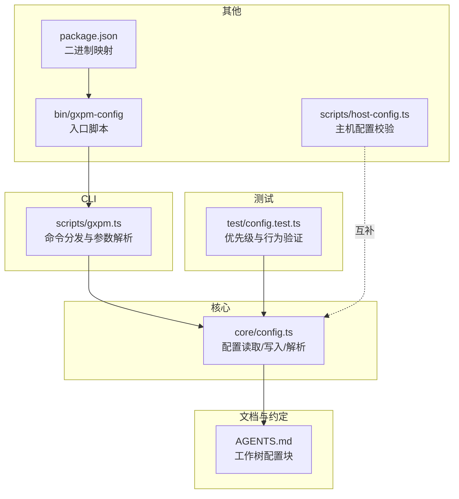
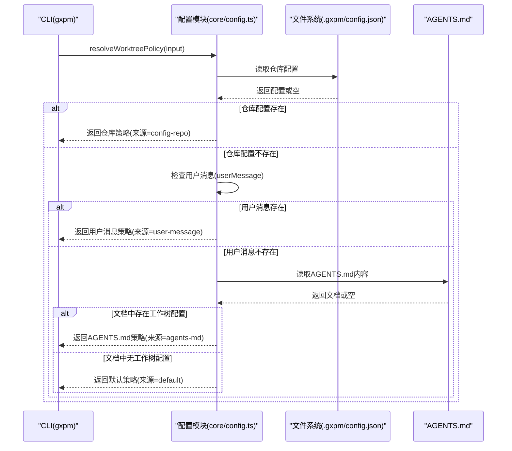
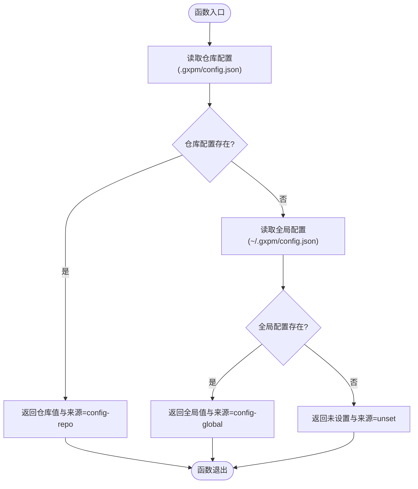
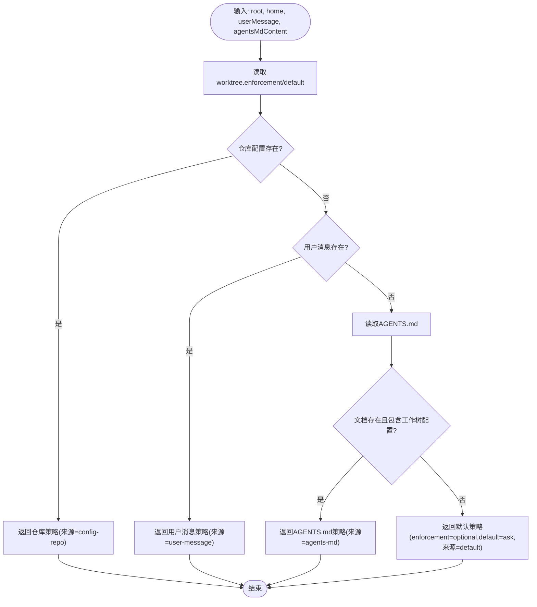
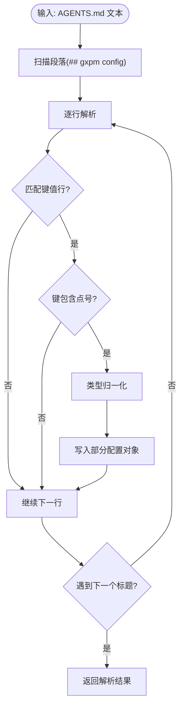
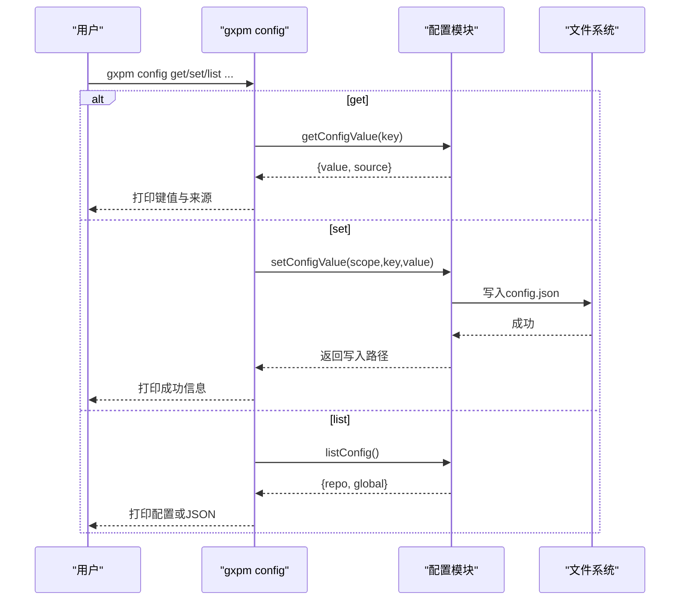
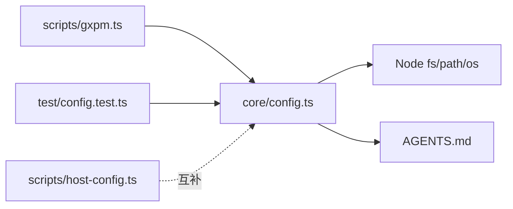

# 配置管理系统

<cite>
**本文引用的文件**
- [core/config.ts](file://core/config.ts)
- [AGENTS.md](file://AGENTS.md)
- [scripts/gxpm.ts](file://scripts/gxpm.ts)
- [test/config.test.ts](file://test/config.test.ts)
- [scripts/host-config.ts](file://scripts/host-config.ts)
- [package.json](file://package.json)
- [bin/gxpm-config](file://bin/gxpm-config)
</cite>

## 目录
1. [简介](#简介)
2. [项目结构](#项目结构)
3. [核心组件](#核心组件)
4. [架构总览](#架构总览)
5. [详细组件分析](#详细组件分析)
6. [依赖关系分析](#依赖关系分析)
7. [性能考量](#性能考量)
8. [故障排查指南](#故障排查指南)
9. [结论](#结论)
10. [附录](#附录)

## 简介
本文件系统性阐述配置管理子系统的设计与实现，重点包括：
- 多层配置结构与优先级机制
- 工作树策略的解析流程与继承规则
- AGENTS.md 配置块的解析与应用
- 环境变量支持与配置覆盖机制
- 配置验证规则与错误处理策略
- 不同使用场景的最佳实践

该系统围绕“工作树策略”展开，提供从仓库级配置、全局配置、AGENTS.md 文档约定到用户消息覆盖的完整优先级链路，并通过 CLI 提供查询、设置与列出配置的能力。

## 项目结构
配置管理相关的核心文件分布如下：
- 核心逻辑：core/config.ts
- CLI 入口与命令分发：scripts/gxpm.ts
- AGENTS.md 示例与约定：AGENTS.md
- 测试用例：test/config.test.ts
- 主机配置校验（与配置系统互补）：scripts/host-config.ts
- 包与二进制入口：package.json、bin/gxpm-config

图表来源
- [core/config.ts:1-229](file://core/config.ts#L1-L229)
- [scripts/gxpm.ts:1-611](file://scripts/gxpm.ts#L1-L611)
- [AGENTS.md:1-85](file://AGENTS.md#L1-L85)
- [test/config.test.ts:1-160](file://test/config.test.ts#L1-L160)
- [package.json:1-25](file://package.json#L1-L25)
- [bin/gxpm-config:1-16](file://bin/gxpm-config#L1-L16)
- [scripts/host-config.ts:1-83](file://scripts/host-config.ts#L1-L83)

章节来源
- [core/config.ts:1-229](file://core/config.ts#L1-L229)
- [scripts/gxpm.ts:1-611](file://scripts/gxpm.ts#L1-L611)
- [AGENTS.md:1-85](file://AGENTS.md#L1-L85)
- [test/config.test.ts:1-160](file://test/config.test.ts#L1-L160)
- [package.json:1-25](file://package.json#L1-L25)
- [bin/gxpm-config:1-16](file://bin/gxpm-config#L1-L16)
- [scripts/host-config.ts:1-83](file://scripts/host-config.ts#L1-L83)

## 核心组件
- 配置文档模型与键空间
  - 使用点号分隔的键（如 worktree.enforcement）支持嵌套结构的读取与写入
  - 支持布尔、数字与字符串的自动类型归一化
- 仓库级与全局级配置
  - 仓库配置位于 .gxpm/config.json
  - 全局配置位于 ~/.gxpm/config.json
  - 仓库配置优先于全局配置
- 工作树策略解析器
  - 解析优先级：仓库配置 > 用户消息 > AGENTS.md 配置块 > 默认值
  - 返回策略来源标识，便于调试与审计
- AGENTS.md 配置块解析
  - 识别 “## gxpm Config” 段落，提取键值对
  - 仅识别包含点号的键，忽略无匹配项
- CLI 配置命令
  - 支持 get、set、list 子命令
  - set 支持 --global 切换作用域
  - list 支持 --json 输出

章节来源
- [core/config.ts:35-106](file://core/config.ts#L35-L106)
- [core/config.ts:146-195](file://core/config.ts#L146-L195)
- [core/config.ts:114-144](file://core/config.ts#L114-L144)
- [scripts/gxpm.ts:258-314](file://scripts/gxpm.ts#L258-L314)

## 架构总览
配置系统采用“分层优先级 + 文档约定 + CLI 管理”的架构模式，确保在不同场景下都能稳定地决定最终策略。

图表来源
- [core/config.ts:146-195](file://core/config.ts#L146-L195)
- [core/config.ts:197-200](file://core/config.ts#L197-L200)

## 详细组件分析

### 组件一：配置读取与写入
- 功能要点
  - 读取与写入 JSON 配置文档，自动创建目录
  - 支持按点号键路径进行嵌套赋值与查找
  - 类型归一化：字符串 "true"/"false" 转布尔，纯数字字符串转数字
- 错误处理
  - 文件不存在返回空文档
  - JSON 解析异常返回空文档，避免中断
- 性能特性
  - 小规模 JSON 文档，I/O 成本低
  - 嵌套赋值与查找均为 O(n)（n 为键层级数）

图表来源
- [core/config.ts:66-79](file://core/config.ts#L66-L79)
- [core/config.ts:52-64](file://core/config.ts#L52-L64)

章节来源
- [core/config.ts:52-106](file://core/config.ts#L52-L106)
- [core/config.ts:202-228](file://core/config.ts#L202-L228)

### 组件二：工作树策略解析器
- 解析流程
  1) 读取仓库配置中的 worktree.enforcement 与 worktree.default
  2) 若未找到，检查用户消息（LLM 传入的当前对话偏好）
  3) 若仍未找到，解析 AGENTS.md 中的 “## gxpm Config” 段落
  4) 若仍为空，使用默认策略
- 策略来源标识
  - config-repo、config-global、user-message、agents-md、default
- 默认策略
  - enforcement=optional，default=ask

图表来源
- [core/config.ts:146-195](file://core/config.ts#L146-L195)

章节来源
- [core/config.ts:146-195](file://core/config.ts#L146-L195)

### 组件三：AGENTS.md 配置块解析
- 解析规则
  - 识别标题 “## gxpm Config”
  - 逐行匹配形如 “- key: value” 或 “key: value” 的键值对
  - 仅保留包含点号的键，去除首尾引号，进行类型归一化
- 适用范围
  - 仅提取工作树相关键（worktree.enforcement、worktree.default）
  - 其他键被忽略，不影响其他配置

图表来源
- [core/config.ts:114-144](file://core/config.ts#L114-L144)

章节来源
- [core/config.ts:114-144](file://core/config.ts#L114-L144)
- [AGENTS.md:33-38](file://AGENTS.md#L33-L38)

### 组件四：CLI 配置命令
- 子命令
  - get <key>：输出键值与来源
  - set <key> <value> [--global]：写入配置，支持全局作用域
  - list [--json]：列出仓库与全局配置
- 参数解析与错误处理
  - set 时对布尔/数字字面量进行归一化
  - list 支持 JSON 输出
  - 未知命令抛出错误并退出

图表来源
- [scripts/gxpm.ts:258-314](file://scripts/gxpm.ts#L258-L314)
- [core/config.ts:66-106](file://core/config.ts#L66-L106)

章节来源
- [scripts/gxpm.ts:258-314](file://scripts/gxpm.ts#L258-L314)
- [core/config.ts:66-106](file://core/config.ts#L66-L106)

### 组件五：配置优先级与继承规则
- 仓库配置优先于全局配置
- 用户消息覆盖 AGENTS.md（在无仓库配置时）
- AGENTS.md 覆盖默认策略
- 默认策略为 enforcement=optional、default=ask

章节来源
- [core/config.ts:146-195](file://core/config.ts#L146-L195)
- [test/config.test.ts:87-159](file://test/config.test.ts#L87-L159)

### 组件六：环境变量支持与覆盖机制
- 环境变量在门控评估等环节被使用（例如预提交/推送/提交信息门）
- 配置系统本身未直接暴露环境变量覆盖键，但可通过 AGENTS.md 的“任何 .gxpm/config.json 显式设置都会覆盖本段”语义间接影响策略来源
- CLI 未提供直接的环境变量注入功能，建议通过仓库配置或 AGENTS.md 来表达期望

章节来源
- [scripts/gxpm.ts:483-575](file://scripts/gxpm.ts#L483-L575)
- [AGENTS.md:38](file://AGENTS.md#L38)

### 组件七：配置验证规则与错误处理策略
- 配置读取
  - 文件不存在或 JSON 解析失败时返回空文档，避免中断
- AGENTS.md 解析
  - 忽略不匹配行与非点号键，保证健壮性
- CLI 行为
  - set 时对布尔/数字字面量进行归一化
  - list 支持 JSON 输出，便于自动化集成
- 主机配置校验（与配置系统互补）
  - 校验主机配置的命名、路径、安装策略等字段
  - 重复字段检测与错误汇总

章节来源
- [core/config.ts:52-64](file://core/config.ts#L52-L64)
- [core/config.ts:114-144](file://core/config.ts#L114-L144)
- [scripts/gxpm.ts:307-312](file://scripts/gxpm.ts#L307-L312)
- [scripts/host-config.ts:29-82](file://scripts/host-config.ts#L29-L82)

## 依赖关系分析
- 模块耦合
  - CLI 依赖配置模块进行策略解析与配置读写
  - 配置模块依赖文件系统读写与 AGENTS.md 文本解析
  - 测试模块依赖配置模块以验证优先级与行为
- 外部依赖
  - Node.js fs、path、os 标准库
  - Bun 运行时（用于 CLI 与测试）
- 可能的循环依赖
  - 未发现直接循环依赖；配置模块为纯工具函数，无反向依赖

图表来源
- [scripts/gxpm.ts:1-611](file://scripts/gxpm.ts#L1-L611)
- [core/config.ts:1-229](file://core/config.ts#L1-L229)
- [test/config.test.ts:1-160](file://test/config.test.ts#L1-L160)
- [scripts/host-config.ts:1-83](file://scripts/host-config.ts#L1-L83)

章节来源
- [scripts/gxpm.ts:1-611](file://scripts/gxpm.ts#L1-L611)
- [core/config.ts:1-229](file://core/config.ts#L1-L229)
- [test/config.test.ts:1-160](file://test/config.test.ts#L1-L160)
- [scripts/host-config.ts:1-83](file://scripts/host-config.ts#L1-L83)

## 性能考量
- I/O 成本
  - 配置读取与写入均为小规模 JSON 文件，I/O 成本极低
- 解析复杂度
  - 键路径查找与嵌套赋值为线性复杂度，适合高频调用
- 建议
  - 在批量操作中尽量合并多次写入
  - 使用 --json 输出减少二次解析成本

## 故障排查指南
- 问题：策略不符合预期
  - 检查仓库配置是否覆盖了 AGENTS.md
  - 使用 gxpm config get worktree.enforcement 查看来源
  - 使用 gxpm worktree policy 查看最终策略与来源
- 问题：AGENTS.md 配置未生效
  - 确认 “## gxpm Config” 段落存在
  - 确认键包含点号（如 worktree.enforcement）
  - 确认未被仓库配置覆盖
- 问题：配置写入后未生效
  - 确认作用域（--global vs 仓库）
  - 确认 CLI 输出的写入路径
- 问题：JSON 解析错误
  - 检查 .gxpm/config.json 是否为合法 JSON
  - 避免手动修改导致格式错误

章节来源
- [scripts/gxpm.ts:258-314](file://scripts/gxpm.ts#L258-L314)
- [core/config.ts:52-64](file://core/config.ts#L52-L64)
- [test/config.test.ts:1-160](file://test/config.test.ts#L1-160)

## 结论
该配置管理系统通过清晰的多层优先级与稳健的解析策略，实现了在不同场景下的可靠配置决策。结合 CLI 的查询与设置能力，用户可以灵活地管理仓库与全局配置，并通过 AGENTS.md 文档约定形成团队共识。建议在团队协作中优先使用仓库配置以确保一致性，并在需要临时覆盖时使用用户消息或 AGENTS.md 的约定段落。

## 附录

### AGENTS.md 配置示例与说明
- 位置：根目录 AGENTS.md
- 关键段落： “## gxpm Config”
- 示例键
  - worktree.enforcement: optional | required | forbidden | unset
  - worktree.default: ask | use | skip
- 说明
  - enforcement 控制是否强制使用独立工作树
  - default 控制默认行为（ask/use/skip）
  - 任何 .gxpm/config.json 中显式设置都会覆盖本段

章节来源
- [AGENTS.md:33-38](file://AGENTS.md#L33-L38)

### CLI 使用示例
- 查询配置
  - gxpm config get worktree.enforcement
- 设置配置
  - gxpm config set worktree.enforcement required
  - gxpm config set worktree.default ask --global
- 列出配置
  - gxpm config list
  - gxpm config list --json

章节来源
- [scripts/gxpm.ts:258-314](file://scripts/gxpm.ts#L258-L314)

### 最佳实践
- 团队协作
  - 在仓库根目录 AGENTS.md 中定义默认工作树策略
  - 使用仓库配置固化关键策略，避免频繁变更
- 个人偏好
  - 使用 --global 保存个人偏好，不影响他人
- 临时覆盖
  - 在对话中通过用户消息临时调整策略
- 可观测性
  - 使用 gxpm worktree policy 查看来源，便于审计
  - 使用 --json 输出便于自动化集成