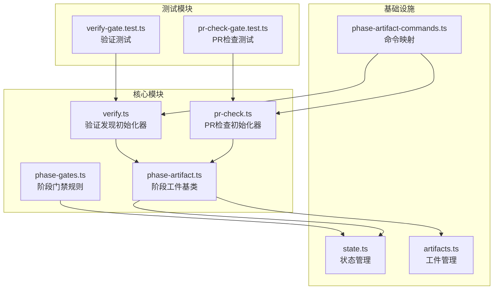
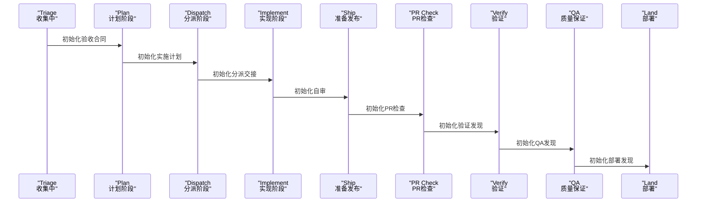
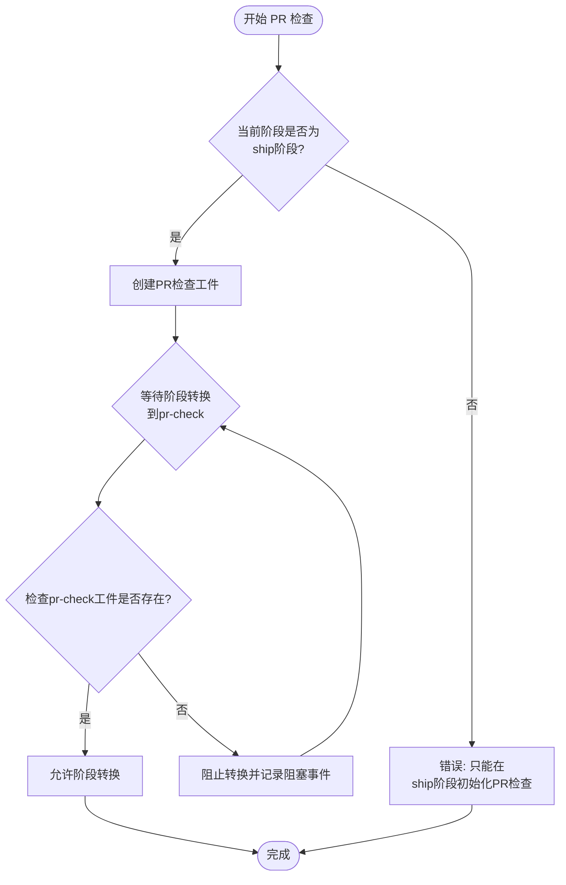
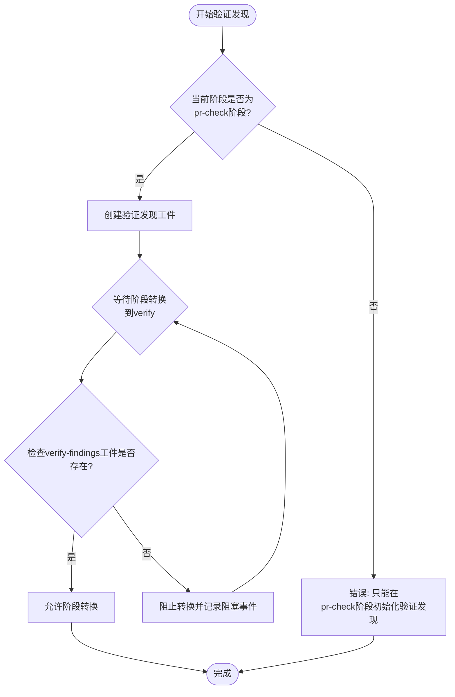
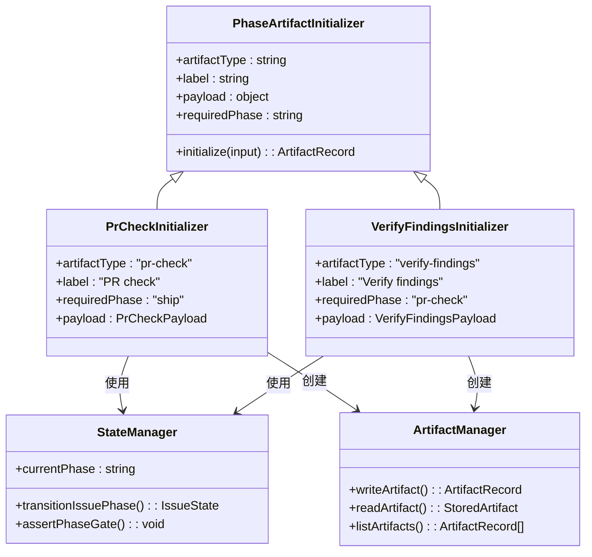

# PR 检查阶段 (PR Check)

<cite>
**本文档引用的文件**
- [pr-check.ts](file://core/pr-check.ts)
- [verify.ts](file://core/verify.ts)
- [phase-artifact.ts](file://core/phase-artifact.ts)
- [phase-gates.ts](file://core/phase-gates.ts)
- [state.ts](file://core/state.ts)
- [artifacts.ts](file://core/artifacts.ts)
- [phase-artifact-commands.ts](file://scripts/phase-artifact-commands.ts)
- [pr-check-gate.test.ts](file://test/pr-check-gate.test.ts)
- [verify-gate.test.ts](file://test/verify-gate.test.ts)
</cite>

## 目录
1. [简介](#简介)
2. [项目结构](#项目结构)
3. [核心组件](#核心组件)
4. [架构概览](#架构概览)
5. [详细组件分析](#详细组件分析)
6. [依赖关系分析](#依赖关系分析)
7. [性能考虑](#性能考虑)
8. [故障排除指南](#故障排除指南)
9. [结论](#结论)

## 简介

PR 检查阶段（PR Check）是 gxpm 工作流中的关键审查阶段，负责在代码合并前进行全面的 Pull Request 审查。该阶段的核心职责包括：

- **Pull Request 审查**：对即将合并的代码变更进行全面的技术审查
- **风险评估**：识别和评估代码变更可能带来的技术风险
- **质量保证**：确保代码符合项目质量标准和安全要求
- **版本标记**：为后续的验证和发布阶段做好准备

PR 检查阶段通过强制性的工件（artifact）机制确保每个审查步骤都得到适当的记录和验证，防止跳过关键的质量控制环节。

## 项目结构

PR 检查阶段相关的代码主要分布在以下模块中：

**图表来源**
- [pr-check.ts:1-16](file://core/pr-check.ts#L1-L16)
- [verify.ts:1-16](file://core/verify.ts#L1-L16)
- [phase-artifact.ts:1-33](file://core/phase-artifact.ts#L1-L33)

**章节来源**
- [pr-check.ts:1-16](file://core/pr-check.ts#L1-L16)
- [verify.ts:1-16](file://core/verify.ts#L1-L16)
- [phase-artifact.ts:1-33](file://core/phase-artifact.ts#L1-L33)

## 核心组件

### PR 检查初始化器

PR 检查初始化器负责创建 PR 检查阶段所需的工件，确保代码只能从 ship 阶段正确进入 PR 检查阶段。

**章节来源**
- [pr-check.ts:3-15](file://core/pr-check.ts#L3-L15)

### 验证发现初始化器

验证发现初始化器创建 verify-findings 工件，这是从 PR 检查阶段进入验证阶段的必要条件。

**章节来源**
- [verify.ts:3-15](file://core/verify.ts#L3-L15)

### 阶段工件基类

提供通用的工件初始化功能，包括阶段验证和工件写入。

**章节来源**
- [phase-artifact.ts:16-32](file://core/phase-artifact.ts#L16-L32)

## 架构概览

PR 检查阶段在整个工作流中的位置如下：

**图表来源**
- [phase-gates.ts:32-99](file://core/phase-gates.ts#L32-L99)

## 详细组件分析

### PR 检查工件结构

PR 检查工件包含以下关键字段：

| 字段名 | 类型 | 描述 | 默认值 |
|--------|------|------|--------|
| pullRequest | string | 关联的 Pull Request 编号 | "" |
| reviewFindings | array | 审查发现列表 | [] |
| risks | array | 识别的风险列表 | [] |
| shipReadinessArtifact | string | 依赖的准备发布工件 | "ship-readiness" |
| status | string | 工件状态 | "draft" |
| summary | string | 审查摘要 | "" |

**章节来源**
- [pr-check.ts:6-13](file://core/pr-check.ts#L6-L13)

### 验证发现工件结构

验证发现工件用于连接 PR 检查和验证阶段：

| 字段名 | 类型 | 描述 | 默认值 |
|--------|------|------|--------|
| acceptanceContractArtifact | string | 依赖的验收合同工件 | "acceptance-contract" |
| findings | array | 验证发现列表 | [] |
| prCheckArtifact | string | 关联的PR检查工件 | "pr-check" |
| risks | array | 识别的风险列表 | [] |
| status | string | 工件状态 | "draft" |
| summary | string | 验证摘要 | "" |

**章节来源**
- [verify.ts:6-13](file://core/verify.ts#L6-L13)

### 阶段门禁机制

PR 检查阶段通过严格的门禁规则确保流程的正确性：

**图表来源**
- [phase-artifact.ts:18-23](file://core/phase-artifact.ts#L18-L23)
- [state.ts:258-302](file://core/state.ts#L258-L302)

**章节来源**
- [phase-gates.ts:75-86](file://core/phase-gates.ts#L75-L86)
- [state.ts:258-302](file://core/state.ts#L258-L302)

### 验证发现门禁机制

验证发现工件同样遵循严格的门禁规则：

**图表来源**
- [verify.ts:19-20](file://core/verify.ts#L19-L20)
- [state.ts:258-302](file://core/state.ts#L258-L302)

**章节来源**
- [phase-gates.ts:82-86](file://core/phase-gates.ts#L82-L86)
- [state.ts:258-302](file://core/state.ts#L258-L302)

## 依赖关系分析

PR 检查阶段的依赖关系图：

**图表来源**
- [phase-artifact.ts:16-32](file://core/phase-artifact.ts#L16-L32)
- [pr-check.ts:3-15](file://core/pr-check.ts#L3-L15)
- [verify.ts:3-15](file://core/verify.ts#L3-L15)
- [state.ts:150-205](file://core/state.ts#L150-L205)

**章节来源**
- [phase-artifact.ts:16-32](file://core/phase-artifact.ts#L16-L32)
- [state.ts:150-205](file://core/state.ts#L150-L205)

## 性能考虑

PR 检查阶段的性能特点：

- **工件创建开销**：工件创建操作的时间复杂度为 O(1)，主要开销在于文件系统写入
- **门禁检查开销**：阶段转换时的门禁检查为 O(1) 操作，仅需检查工件是否存在
- **内存使用**：工件数据存储在磁盘上，内存占用最小化
- **并发安全性**：通过文件系统锁机制确保多个进程同时访问时的数据一致性

## 故障排除指南

### 常见问题及解决方案

#### 1. PR 检查初始化错误
**问题**：尝试在非 ship 阶段初始化 PR 检查
**解决方案**：先将问题状态转换到 ship 阶段，然后执行初始化

**章节来源**
- [pr-check-gate.test.ts:15-17](file://test/pr-check-gate.test.ts#L15-L17)

#### 2. 阶段转换被阻塞
**问题**：从 ship 转换到 pr-check 时报错缺少必需工件
**解决方案**：执行 `gxpm ship pr-check <issue-id>` 初始化 PR 检查工件

**章节来源**
- [pr-check-gate.test.ts:37-47](file://test/pr-check-gate.test.ts#L37-L47)

#### 3. 验证发现初始化错误
**问题**：尝试在非 pr-check 阶段初始化验证发现
**解决方案**：先确保问题处于 pr-check 阶段，然后执行初始化

**章节来源**
- [verify-gate.test.ts:15-17](file://test/verify-gate.test.ts#L15-L17)

#### 4. 验证阶段转换失败
**问题**：从 pr-check 转换到 verify 时报错缺少验证发现工件
**解决方案**：执行 `gxpm pr-check verify <issue-id>` 初始化验证发现工件

**章节来源**
- [verify-gate.test.ts:37-47](file://test/verify-gate.test.ts#L37-L47)

### 最佳实践

#### 1. PR 检查最佳实践
- **及时初始化**：在 ship 阶段完成后立即初始化 PR 检查工件
- **完整审查**：确保所有代码变更都经过充分的技术审查
- **风险评估**：仔细评估每个变更可能带来的技术风险
- **文档记录**：详细记录审查发现和决策依据

#### 2. 验证发现最佳实践
- **工件关联**：确保验证发现工件正确关联到相应的 PR 检查工件
- **验收标准**：明确验证的标准和通过条件
- **证据保存**：保存验证过程中的所有证据和日志
- **及时更新**：根据验证结果及时更新工件状态

#### 3. 常见陷阱避免
- **跳过门禁**：不要试图绕过阶段门禁规则
- **工件缺失**：确保在转换到下一阶段前创建所有必需工件
- **状态不一致**：保持工件状态与实际工作进度一致
- **权限问题**：确保有足够的权限访问和修改工件文件

## 结论

PR 检查阶段是 gxpm 工作流中确保代码质量和安全性的关键环节。通过强制性的工件机制和严格的门禁规则，该阶段有效防止了跳过重要质量控制步骤的情况发生。

**核心要点总结**：
- PR 检查阶段必须从 ship 阶段正确进入
- 验证发现工件是进入验证阶段的必要条件
- 所有阶段转换都受到门禁规则的严格控制
- 工件的创建和管理提供了完整的审计跟踪
- CLI 命令简化了工件初始化和阶段转换操作

通过遵循这些最佳实践和避免常见陷阱，团队可以确保 PR 检查阶段的有效性和可靠性，为后续的验证和发布阶段奠定坚实基础。