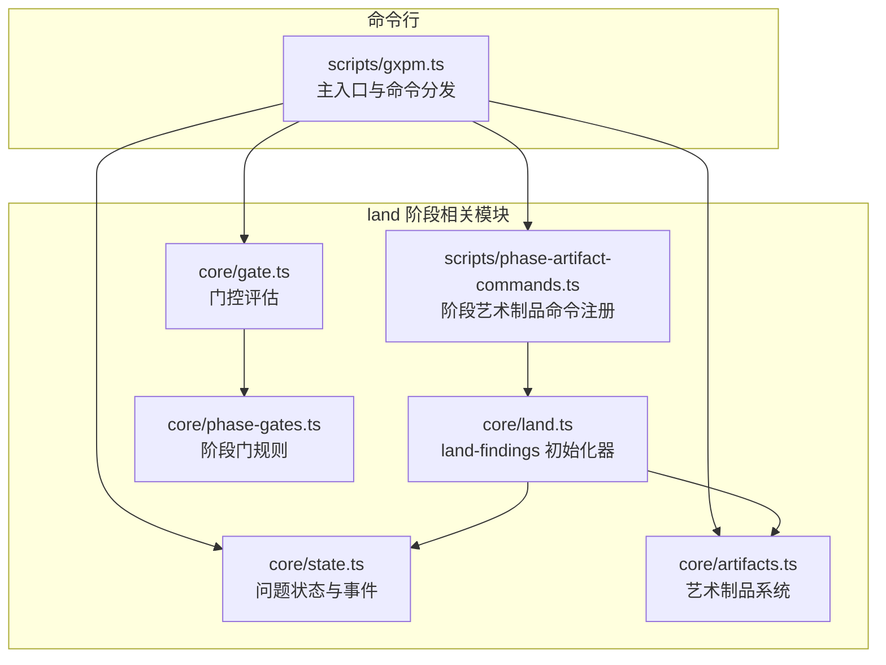
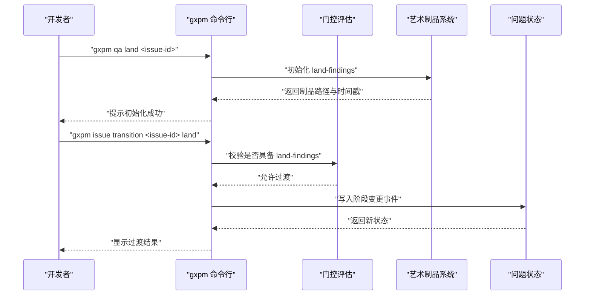
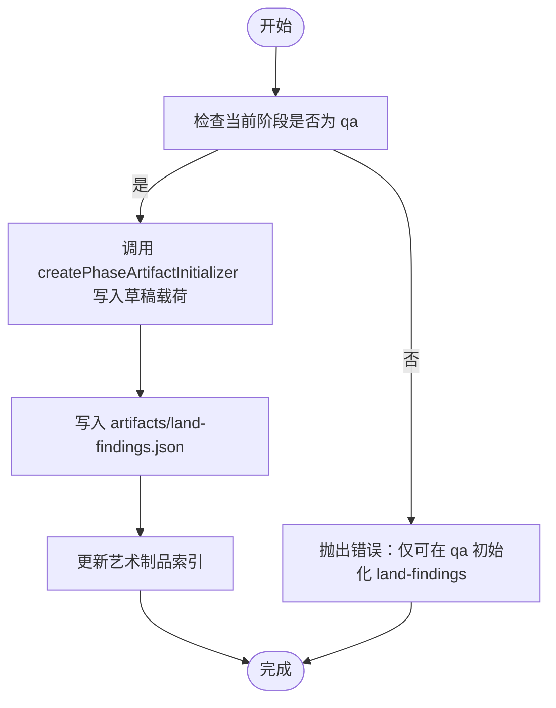
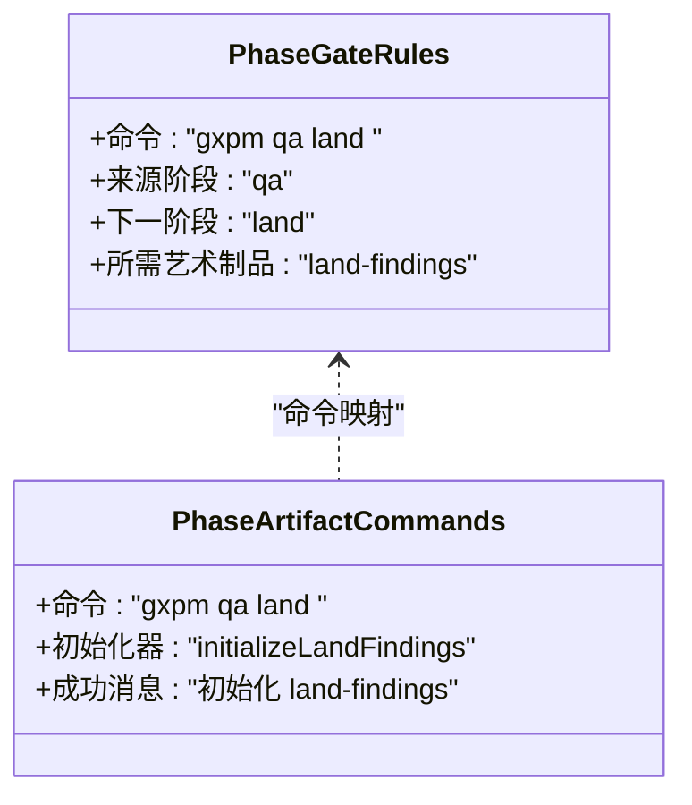
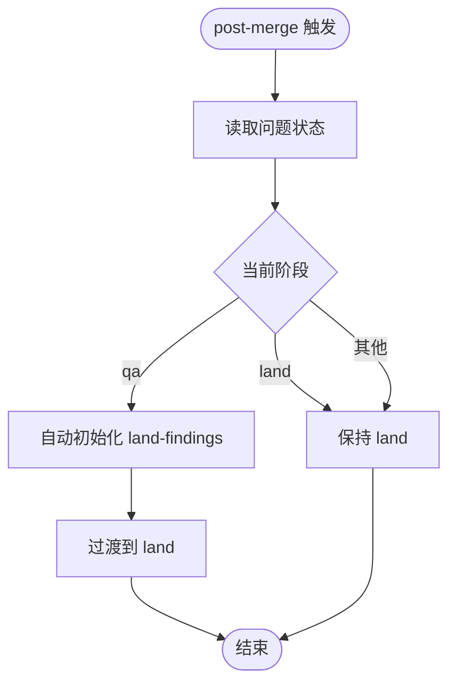
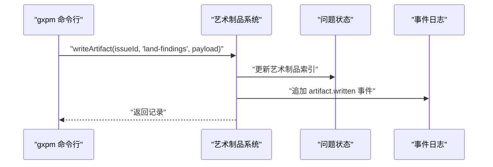
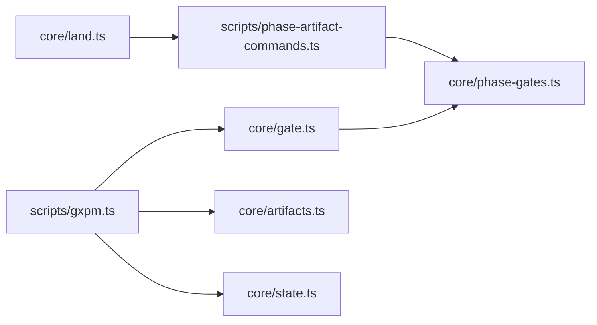

# 上线阶段（Land）

<cite>
**本文引用的文件**
- [core/land.ts](file://core/land.ts)
- [scripts/gxpm.ts](file://scripts/gxpm.ts)
- [core/phase-gates.ts](file://core/phase-gates.ts)
- [core/gate.ts](file://core/gate.ts)
- [scripts/phase-artifact-commands.ts](file://scripts/phase-artifact-commands.ts)
- [core/artifacts.ts](file://core/artifacts.ts)
- [core/state.ts](file://core/state.ts)
- [test/land-gate.test.ts](file://test/land-gate.test.ts)
- [test/phase-gates.test.ts](file://test/phase-gates.test.ts)
- [docs/governance/development-contract.md](file://docs/governance/development-contract.md)
</cite>

## 目录
1. [引言](#引言)
2. [项目结构](#项目结构)
3. [核心组件](#核心组件)
4. [架构总览](#架构总览)
5. [详细组件分析](#详细组件分析)
6. [依赖关系分析](#依赖关系分析)
7. [性能考量](#性能考量)
8. [故障排查指南](#故障排查指南)
9. [结论](#结论)
10. [附录](#附录)

## 引言
本文件面向 gxpm 的上线阶段（Land），系统性阐述 land 阶段的目标、职责与工作流，重点覆盖以下内容：
- land 阶段的核心职责与目标：完成生产部署前的最终准备、风险评估与上线确认。
- 生产部署流程：如何通过 land-findings 艺术品驱动从 QA 到 Land 的过渡，并在合并后自动进入 land 阶段。
- 上线确认与成功标准：确保 land-findings 完整、QA 风险可控、合并策略清晰。
- land 命令使用方法与参数说明：包括初始化 land-findings、读取/编辑/写入艺术制品、过渡到 land 等。
- 成功的生产部署实践：合并策略、发布风险控制、回滚预案与监控联动。
- 常见陷阱与最佳实践：跨阶段依赖遗漏、QA 风险未闭环、提交信息不规范等。

## 项目结构
围绕 land 阶段的关键文件组织如下：
- 核心逻辑
  - land-findings 初始化器：定义 land 阶段所需的艺术品类型、标签与草稿载荷，并限定初始化来源阶段。
  - 阶段门规则：定义从 QA 到 Land 的门控规则与所需艺术制品。
  - 门控评估：在 push 前检查是否具备 land-findings，以及合并后的自动过渡逻辑。
- 命令行接口
  - gxpm 主脚本：解析命令、路由到对应子命令，支持 issue 状态查询、artifact 管理、门控执行与阶段过渡。
  - 阶段艺术制品命令注册：将门控规则映射为可执行的 CLI 子命令（如 qa land）。
- 艺术品与状态
  - 艺术品系统：提供读写/列出/存在性检查等能力。
  - 问题状态与事件：记录阶段变迁、门控结果与艺术制品写入事件。

图表来源
- [core/land.ts:1-16](file://core/land.ts#L1-L16)
- [core/phase-gates.ts:32-99](file://core/phase-gates.ts#L32-L99)
- [core/gate.ts:102-143](file://core/gate.ts#L102-L143)
- [scripts/phase-artifact-commands.ts:66-70](file://scripts/phase-artifact-commands.ts#L66-L70)
- [core/artifacts.ts:10-24](file://core/artifacts.ts#L10-L24)
- [core/state.ts:11-24](file://core/state.ts#L11-L24)
- [scripts/gxpm.ts:262-273](file://scripts/gxpm.ts#L262-L273)

章节来源
- [core/land.ts:1-16](file://core/land.ts#L1-L16)
- [core/phase-gates.ts:32-99](file://core/phase-gates.ts#L32-L99)
- [core/gate.ts:102-143](file://core/gate.ts#L102-L143)
- [scripts/phase-artifact-commands.ts:66-70](file://scripts/phase-artifact-commands.ts#L66-L70)
- [core/artifacts.ts:10-24](file://core/artifacts.ts#L10-L24)
- [core/state.ts:11-24](file://core/state.ts#L11-L24)
- [scripts/gxpm.ts:262-273](file://scripts/gxpm.ts#L262-L273)

## 核心组件
- land-findings 初始化器
  - 类型与标签：定义 land-findings 为 land 阶段的门控艺术制品，标签用于 UI/CLI 展示。
  - 草稿载荷：包含 landReady、mergePlan、qaFindingsArtifact、releaseRisks、status、summary 等字段，作为上线前的“检查清单”。
  - 来源阶段约束：仅允许在 qa 阶段初始化，防止跨阶段误用。
- 阶段门规则
  - 从 qa 到 land 的过渡需要 land-findings 艺术品作为门控条件。
  - 提供 CLI 命令提示（如 gxpm qa land <issue-id>），指导用户生成 land-findings。
- 门控评估
  - pre-push 门控：若当前阶段为 qa，且缺少 land-findings，则阻止推送并提示所需命令。
  - 合并后自动过渡：当从 qa 合并后，自动过渡到 land，无需手动干预。
- 艺术制品与状态
  - 艺术制品系统提供统一的读写/列表/存在性检查能力，保证 land-findings 的持久化与可审计。
  - 问题状态记录阶段变迁与门控事件，便于追溯与排障。

章节来源
- [core/land.ts:3-15](file://core/land.ts#L3-L15)
- [core/phase-gates.ts:94-98](file://core/phase-gates.ts#L94-L98)
- [core/gate.ts:120-127](file://core/gate.ts#L120-L127)
- [core/gate.ts:132-142](file://core/gate.ts#L132-L142)
- [core/artifacts.ts:57-91](file://core/artifacts.ts#L57-L91)
- [core/state.ts:150-200](file://core/state.ts#L150-L200)

## 架构总览
下图展示 land 阶段在整体工作流中的位置与交互：

图表来源
- [scripts/gxpm.ts:262-273](file://scripts/gxpm.ts#L262-L273)
- [scripts/phase-artifact-commands.ts:66-70](file://scripts/phase-artifact-commands.ts#L66-L70)
- [core/gate.ts:120-127](file://core/gate.ts#L120-L127)
- [core/artifacts.ts:57-91](file://core/artifacts.ts#L57-L91)
- [core/state.ts:150-200](file://core/state.ts#L150-L200)

## 详细组件分析

### land-findings 初始化器
- 设计要点
  - 使用统一的 createPhaseArtifactInitializer，避免样板代码重复。
  - 草稿载荷聚焦上线前关键要素：landReady、mergePlan、qaFindingsArtifact、releaseRisks、status、summary。
  - 严格限制初始化来源阶段为 qa，确保上游 QA 已完成。
- 数据结构与复杂度
  - 载荷为 JSON 对象，写入与读取均为 O(1) 文件操作。
  - 艺术制品索引按类型维护，查找与去重开销低。
- 错误处理
  - 在非 qa 阶段尝试初始化会抛出错误，避免跨阶段误用。
- 性能影响
  - 初始化仅涉及本地文件写入，开销极小。

图表来源
- [core/land.ts:3-15](file://core/land.ts#L3-L15)
- [core/artifacts.ts:57-91](file://core/artifacts.ts#L57-L91)

章节来源
- [core/land.ts:3-15](file://core/land.ts#L3-L15)
- [core/artifacts.ts:57-91](file://core/artifacts.ts#L57-L91)

### 阶段门规则与 CLI 映射
- 门规则
  - 从 qa 到 land 的过渡要求 land-findings 作为门控艺术制品。
  - 提供命令提示（如 gxpm qa land <issue-id>），指导用户生成 land-findings。
- CLI 映射
  - scripts/phase-artifact-commands.ts 将门规则映射为可执行的子命令，确保命令顺序与规则一致。
- 测试保障
  - test/phase-gates.test.ts 验证门规则与 CLI 命令的一致性。
  - test/land-gate.test.ts 验证 land-findings 初始化、缺失阻断与过渡行为。

图表来源
- [core/phase-gates.ts:94-98](file://core/phase-gates.ts#L94-L98)
- [scripts/phase-artifact-commands.ts:66-70](file://scripts/phase-artifact-commands.ts#L66-L70)
- [test/phase-gates.test.ts:101-116](file://test/phase-gates.test.ts#L101-L116)

章节来源
- [core/phase-gates.ts:94-98](file://core/phase-gates.ts#L94-L98)
- [scripts/phase-artifact-commands.ts:66-70](file://scripts/phase-artifact-commands.ts#L66-L70)
- [test/phase-gates.test.ts:101-116](file://test/phase-gates.test.ts#L101-L116)
- [test/land-gate.test.ts:63-88](file://test/land-gate.test.ts#L63-L88)

### 门控评估与合并后自动过渡
- pre-push 门控
  - 若当前阶段为 qa 且缺少 land-findings，阻止推送并提示所需命令。
- 合并后自动过渡
  - 从 qa 合并后自动过渡到 land，无需手动干预；若已在 land 则保持不变。
- CLI 行为
  - scripts/gxpm.ts 在 post-merge 钩子中检测并自动初始化 land-findings（若不存在），再进行阶段过渡。

图表来源
- [core/gate.ts:132-142](file://core/gate.ts#L132-L142)
- [scripts/gxpm.ts:665-691](file://scripts/gxpm.ts#L665-L691)

章节来源
- [core/gate.ts:120-127](file://core/gate.ts#L120-L127)
- [core/gate.ts:132-142](file://core/gate.ts#L132-L142)
- [scripts/gxpm.ts:636-663](file://scripts/gxpm.ts#L636-L663)
- [scripts/gxpm.ts:665-691](file://scripts/gxpm.ts#L665-L691)

### 艺术制品与状态管理
- 艺术制品系统
  - 提供写入、读取、列出与存在性检查，确保 land-findings 的可审计与可追踪。
- 问题状态与事件
  - 记录阶段变迁、门控结果与艺术制品写入事件，便于回溯与排障。

图表来源
- [core/artifacts.ts:57-91](file://core/artifacts.ts#L57-L91)
- [core/state.ts:150-200](file://core/state.ts#L150-L200)

章节来源
- [core/artifacts.ts:57-91](file://core/artifacts.ts#L57-L91)
- [core/state.ts:150-200](file://core/state.ts#L150-L200)

## 依赖关系分析
- 组件耦合
  - land.ts 依赖 phase-artifact 初始化器框架，避免重复样板代码。
  - phase-gates.ts 与 phase-artifact-commands.ts 协作，确保 CLI 命令与门规则一致。
  - gate.ts 依赖 phase-gates.ts 的规则进行 pre-push 门控与合并后过渡判断。
  - scripts/gxpm.ts 串联 CLI、门控、艺术制品与状态模块。
- 外部依赖
  - Git 钩子（post-merge）触发自动过渡与初始化。
  - 本地文件系统用于持久化状态、艺术制品与事件日志。

图表来源
- [core/land.ts:1-16](file://core/land.ts#L1-L16)
- [scripts/phase-artifact-commands.ts:66-70](file://scripts/phase-artifact-commands.ts#L66-L70)
- [core/phase-gates.ts:32-99](file://core/phase-gates.ts#L32-L99)
- [core/gate.ts:102-143](file://core/gate.ts#L102-L143)
- [scripts/gxpm.ts:262-273](file://scripts/gxpm.ts#L262-L273)
- [core/artifacts.ts:10-24](file://core/artifacts.ts#L10-L24)
- [core/state.ts:11-24](file://core/state.ts#L11-L24)

章节来源
- [core/land.ts:1-16](file://core/land.ts#L1-L16)
- [scripts/phase-artifact-commands.ts:66-70](file://scripts/phase-artifact-commands.ts#L66-L70)
- [core/phase-gates.ts:32-99](file://core/phase-gates.ts#L32-L99)
- [core/gate.ts:102-143](file://core/gate.ts#L102-L143)
- [scripts/gxpm.ts:262-273](file://scripts/gxpm.ts#L262-L273)
- [core/artifacts.ts:10-24](file://core/artifacts.ts#L10-L24)
- [core/state.ts:11-24](file://core/state.ts#L11-L24)

## 性能考量
- 本地文件 I/O：land-findings 的写入与读取为 O(1) 文件操作，对性能影响可忽略。
- 艺术制品索引：按类型维护，查找与去重成本低。
- 门控评估：仅进行必要规则匹配与存在性检查，开销极小。
- 建议
  - 在大规模批量操作时，尽量合并多次写入为一次，减少事件与索引更新次数。
  - 使用 --json 输出以便工具链集成，避免额外解析成本。

## 故障排查指南
- 常见问题与定位
  - 缺少 land-findings 导致无法过渡到 land：检查 pre-push 门控输出与事件日志，确认是否已执行 gxpm qa land <issue-id>。
  - 非 qa 阶段尝试初始化 land-findings：查看错误信息，确保在 qa 阶段执行。
  - 合并后未自动过渡到 land：确认 post-merge 钩子是否被触发，以及是否存在 land-findings。
- 排查步骤
  - 使用 gxpm issue status <issue-id> 查看当前阶段。
  - 使用 gxpm artifact list <issue-id> 检查 land-findings 是否存在。
  - 使用 gxpm artifact read <issue-id> land-findings 查看草稿载荷。
  - 使用 gxpm issue history <issue-id> 查看事件日志，定位 gate.blocked 或 artifact.written。
- 相关测试参考
  - test/land-gate.test.ts 展示了 land-findings 初始化、缺失阻断与过渡行为的断言。
  - test/phase-gates.test.ts 验证门规则与 CLI 命令一致性。

章节来源
- [test/land-gate.test.ts:33-61](file://test/land-gate.test.ts#L33-L61)
- [test/land-gate.test.ts:63-88](file://test/land-gate.test.ts#L63-L88)
- [test/phase-gates.test.ts:101-116](file://test/phase-gates.test.ts#L101-L116)
- [scripts/gxpm.ts:381-407](file://scripts/gxpm.ts#L381-L407)

## 结论
land 阶段通过 land-findings 艺术品实现“上线前检查”的标准化与自动化：
- 严格的来源阶段约束与门控规则，确保 QA 风险可控。
- 自动化的合并后过渡与 CLI 命令映射，降低人工干预成本。
- 完备的事件与艺术制品追踪，便于审计与排障。
遵循本文的最佳实践与排障建议，可显著提升生产部署的稳定性与效率。

## 附录

### land 命令使用方法与参数说明
- 初始化 land-findings
  - 命令：gxpm qa land <issue-id>
  - 功能：在 qa 阶段生成 land-findings 草稿，包含 landReady、mergePlan、qaFindingsArtifact、releaseRisks、status、summary 等字段。
  - 输出：成功提示与制品路径。
- 读取/编辑/写入艺术制品
  - 读取：gxpm artifact read <issue-id> land-findings
  - 编辑：gxpm artifact edit <issue-id> land-findings（使用 EDITOR/VISUAL）
  - 写入：gxpm artifact write <issue-id> land-findings --json <json> | --from <file> | --stdin
- 列出与检查点
  - 列表：gxpm artifact list <issue-id>
  - 检查点：gxpm issue checkpoint <issue-id> --title <title> --json <json> | --from <file> | --stdin
- 过渡到 land
  - 命令：gxpm issue transition <issue-id> land
  - 触发条件：需已存在 land-findings；否则会被 gate.blocked 阻止。
- 其他常用命令
  - 状态：gxpm issue status <issue-id>
  - 历史：gxpm issue history <issue-id> [--json]
  - 下一步：gxpm issue next <issue-id>

章节来源
- [scripts/gxpm.ts:262-273](file://scripts/gxpm.ts#L262-L273)
- [scripts/gxpm.ts:218-240](file://scripts/gxpm.ts#L218-L240)
- [scripts/gxpm.ts:381-407](file://scripts/gxpm.ts#L381-L407)
- [scripts/gxpm.ts:169-191](file://scripts/gxpm.ts#L169-L191)

### 成功的生产部署实践
- 合并策略
  - 使用快进合并或 squash 合并，确保提交历史整洁；在 land-findings 中明确 mergePlan。
- 发布风险控制
  - 在 land-findings.releaseRisks 中记录所有已知风险与缓解措施，确保评审通过后再合并。
- 回滚预案
  - 记录 mergePlan 与 QA 风险摘要，便于快速回滚与事后复盘。
- 监控联动
  - 在 CI/CD 中集成 gate.pre-push 与 post-merge 钩子，确保每次推送与合并均符合 land 阶段要求。
- 文档与治理
  - 遵循开发契约与失败归因协议，确保问题可追溯、可复现、可验证。

章节来源
- [docs/governance/development-contract.md:30-49](file://docs/governance/development-contract.md#L30-L49)
- [core/land.ts:6-13](file://core/land.ts#L6-L13)