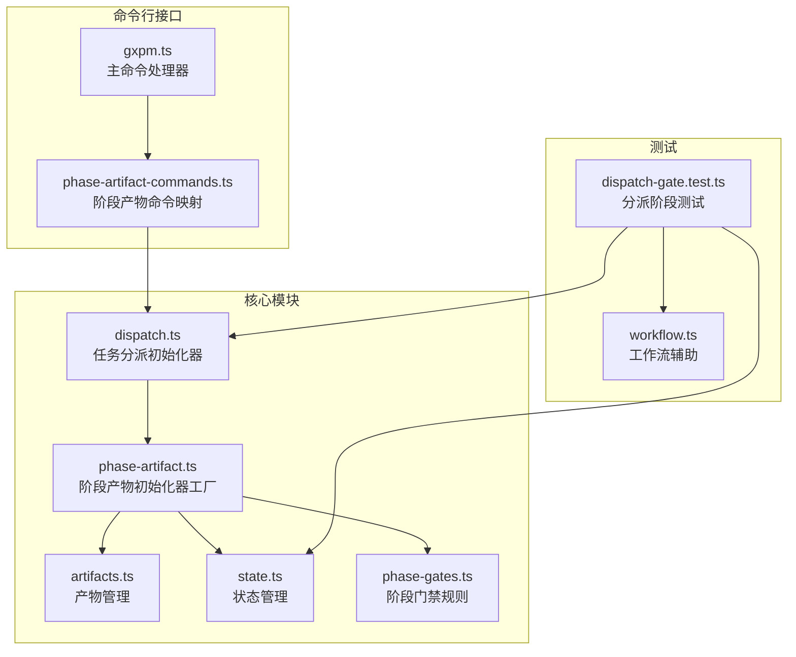
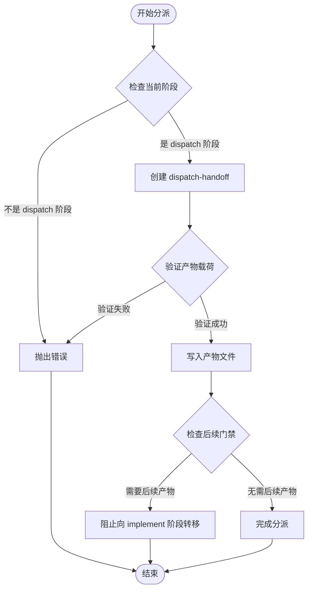
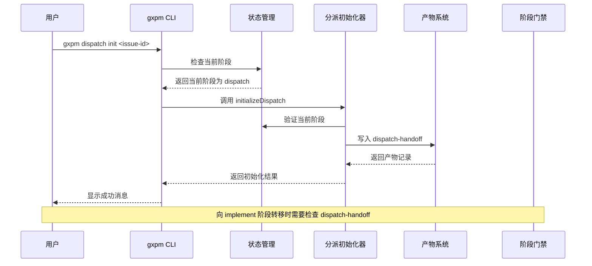
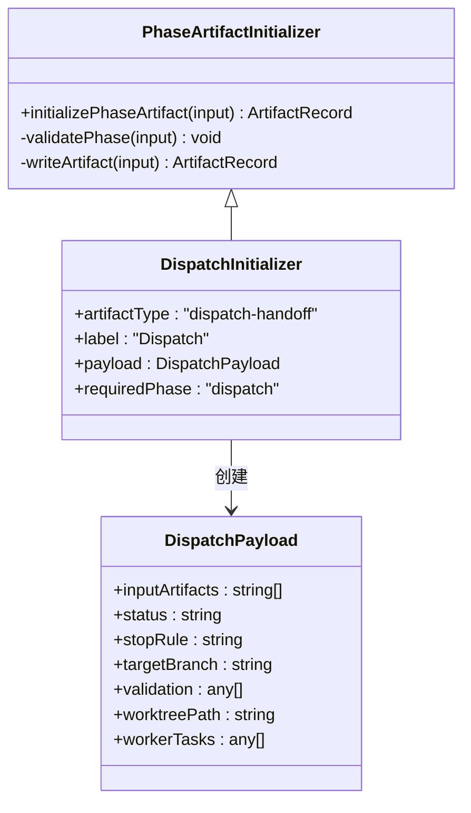
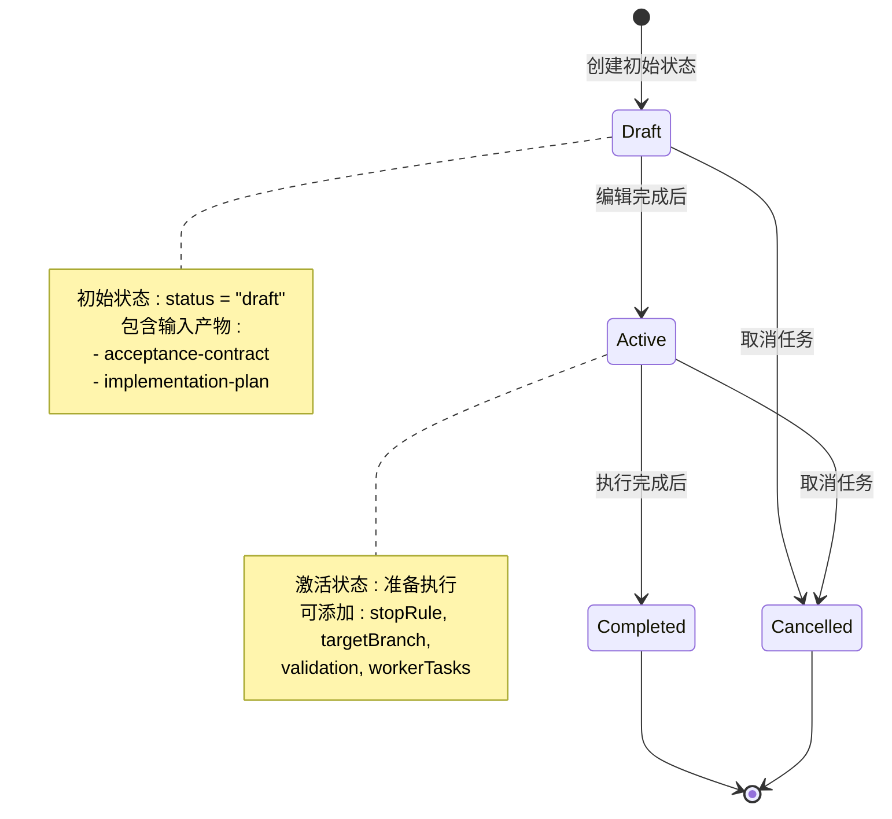
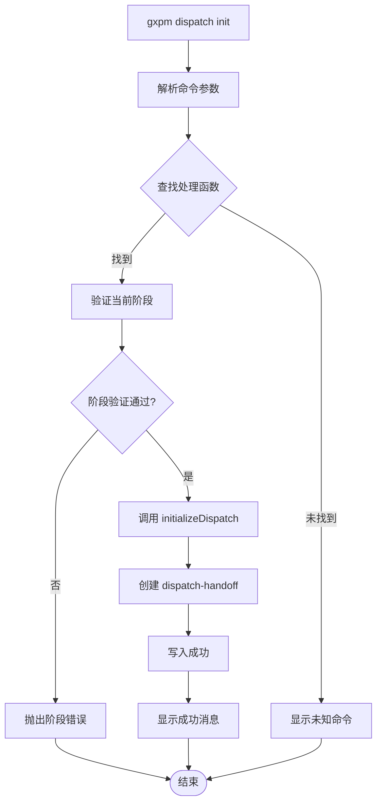
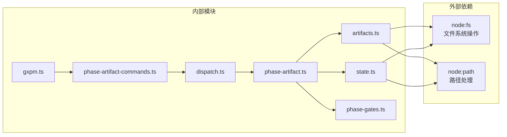

# 任务分派阶段 (Dispatch)

<cite>
**本文档引用的文件**
- [core/dispatch.ts](file://core/dispatch.ts)
- [core/phase-artifact.ts](file://core/phase-artifact.ts)
- [core/artifacts.ts](file://core/artifacts.ts)
- [core/state.ts](file://core/state.ts)
- [core/phase-gates.ts](file://core/phase-gates.ts)
- [scripts/gxpm.ts](file://scripts/gxpm.ts)
- [scripts/phase-artifact-commands.ts](file://scripts/phase-artifact-commands.ts)
- [test/dispatch-gate.test.ts](file://test/dispatch-gate.test.ts)
- [test/helpers/workflow.ts](file://test/helpers/workflow.ts)
</cite>

## 目录
1. [简介](#简介)
2. [项目结构](#项目结构)
3. [核心组件](#核心组件)
4. [架构概览](#架构概览)
5. [详细组件分析](#详细组件分析)
6. [依赖关系分析](#依赖关系分析)
7. [性能考虑](#性能考虑)
8. [故障排除指南](#故障排除指南)
9. [结论](#结论)

## 简介

任务分派阶段（Dispatch）是 gxpm 工作流中的关键环节，负责将经过验收合同和实现计划验证的任务正式移交到执行阶段。该阶段的核心职责包括：

- **任务分解**：将验收合同中的需求转化为可执行的工作项
- **人员分配**：确定负责执行任务的团队成员或技能组
- **进度安排**：制定任务的时间表和里程碑
- **资源协调**：确保执行所需的工具、环境和权限到位

dispatch 阶段的必需产物类型是 'dispatch-handoff'，它作为从分派阶段向执行阶段过渡的门禁令牌，确保任务在进入实际编码前已完成所有必要的准备工作。

## 项目结构

gxpm 采用模块化架构设计，dispatch 功能位于核心模块中，通过清晰的边界与其它阶段分离：



**图表来源**
- [core/dispatch.ts:1-17](file://core/dispatch.ts#L1-L17)
- [core/phase-artifact.ts:1-33](file://core/phase-artifact.ts#L1-L33)
- [scripts/gxpm.ts:262-270](file://scripts/gxpm.ts#L262-L270)

**章节来源**
- [core/dispatch.ts:1-17](file://core/dispatch.ts#L1-L17)
- [core/phase-artifact.ts:1-33](file://core/phase-artifact.ts#L1-L33)
- [scripts/phase-artifact-commands.ts:1-84](file://scripts/phase-artifact-commands.ts#L1-L84)

## 核心组件

### dispatch-handoff 产物定义

dispatch-handoff 是 dispatch 阶段的核心产物，其结构定义如下：

| 字段名 | 类型 | 必需 | 描述 |
|--------|------|------|------|
| inputArtifacts | string[] | 是 | 输入的前置产物类型列表 |
| status | string | 是 | 任务状态（draft/active/completed） |
| stopRule | string | 否 | 停止条件规则 |
| targetBranch | string | 否 | 目标分支名称 |
| validation | any[] | 否 | 验证规则和结果 |
| worktreePath | string | 否 | 工作树路径 |
| workerTasks | any[] | 否 | 分配给工人的任务列表 |

### 阶段门禁机制

dispatch 阶段通过严格的门禁规则确保流程的正确性：



**图表来源**
- [core/dispatch.ts:3-16](file://core/dispatch.ts#L3-L16)
- [core/phase-artifact.ts:16-32](file://core/phase-artifact.ts#L16-L32)

**章节来源**
- [core/dispatch.ts:3-16](file://core/dispatch.ts#L3-L16)
- [core/artifacts.ts:28-41](file://core/artifacts.ts#L28-L41)

## 架构概览

dispatch 阶段在整个 gxpm 工作流中的位置和作用：



**图表来源**
- [scripts/gxpm.ts:262-270](file://scripts/gxpm.ts#L262-L270)
- [core/dispatch.ts:3-16](file://core/dispatch.ts#L3-L16)
- [core/state.ts:150-205](file://core/state.ts#L150-L205)

## 详细组件分析

### 分派初始化器实现

dispatch 初始化器基于通用的阶段产物初始化器工厂模式构建：



**图表来源**
- [core/phase-artifact.ts:9-32](file://core/phase-artifact.ts#L9-L32)
- [core/dispatch.ts:3-16](file://core/dispatch.ts#L3-L16)

### 产物生命周期管理

dispatch-handoff 产物的完整生命周期：



**图表来源**
- [core/dispatch.ts:6-14](file://core/dispatch.ts#L6-L14)
- [core/artifacts.ts:57-91](file://core/artifacts.ts#L57-L91)

**章节来源**
- [core/phase-artifact.ts:16-32](file://core/phase-artifact.ts#L16-L32)
- [core/dispatch.ts:3-16](file://core/dispatch.ts#L3-L16)

### 命令行接口实现

dispatch init 命令的完整实现流程：



**图表来源**
- [scripts/gxpm.ts:262-270](file://scripts/gxpm.ts#L262-L270)
- [scripts/phase-artifact-commands.ts:34-37](file://scripts/phase-artifact-commands.ts#L34-L37)

**章节来源**
- [scripts/gxpm.ts:262-270](file://scripts/gxpm.ts#L262-L270)
- [scripts/phase-artifact-commands.ts:34-37](file://scripts/phase-artifact-commands.ts#L34-L37)

## 依赖关系分析

dispatch 阶段涉及多个核心模块的协作：



**图表来源**
- [core/dispatch.ts:1](file://core/dispatch.ts#L1)
- [core/artifacts.ts:1](file://core/artifacts.ts#L1)
- [core/state.ts:1](file://core/state.ts#L1)

**章节来源**
- [core/dispatch.ts:1-17](file://core/dispatch.ts#L1-L17)
- [core/phase-artifact.ts:1-33](file://core/phase-artifact.ts#L1-L33)
- [core/artifacts.ts:1-169](file://core/artifacts.ts#L1-L169)

## 性能考虑

### 初始化性能优化

dispatch 初始化器采用延迟加载和最小化依赖的设计原则：

- **内存占用**：仅在需要时读取和验证状态信息
- **I/O 操作**：最小化文件系统访问次数
- **错误处理**：快速失败机制避免不必要的计算

### 并发安全性

- **原子性**：产物写入操作保证原子性
- **一致性**：状态更新与事件记录保持一致
- **并发控制**：通过文件锁机制防止竞态条件

## 故障排除指南

### 常见问题及解决方案

#### 1. 阶段验证错误

**问题**：尝试在非 dispatch 阶段初始化分派产物
**症状**：抛出 "Dispatch can only be initialized from dispatch phase" 错误
**解决**：先将问题转移到 dispatch 阶段再执行初始化

#### 2. 门禁规则阻塞

**问题**：向 implement 阶段转移时被阻塞
**症状**：提示缺少 required artifact: dispatch-handoff
**解决**：先执行 `gxpm dispatch init <issue-id>` 创建产物

#### 3. 产物格式错误

**问题**：dispatch-handoff 产物格式不符合规范
**症状**：读取产物时出现 JSON 解析错误
**解决**：检查产物字段完整性，确保必需字段存在

### 调试技巧

#### 使用诊断命令

```bash
# 查看问题状态
gxpm issue status <issue-id>

# 列出所有产物
gxpm artifact list <issue-id>

# 读取特定产物
gxpm artifact read <issue-id> dispatch-handoff

# 查看状态历史
gxpm issue history <issue-id>
```

#### 验证门禁规则

```bash
# 检查下一阶段的门禁要求
gxpm issue next <issue-id>
```

**章节来源**
- [test/dispatch-gate.test.ts:10-92](file://test/dispatch-gate.test.ts#L10-L92)
- [scripts/gxpm.ts:381-407](file://scripts/gxpm.ts#L381-L407)

## 结论

dispatch 阶段通过标准化的产物管理和严格的门禁机制，确保了任务分派过程的规范化和可追溯性。dispatch-handoff 产物作为关键的门禁令牌，不仅承载了任务的基本信息，更重要的是建立了从分派到执行的强制性约束。

### 最佳实践建议

1. **及时初始化**：在进入 dispatch 阶段后立即创建 dispatch-handoff 产物
2. **完整填写**：确保所有必需字段都已正确填充
3. **定期审查**：定期检查任务状态和进度安排
4. **文档记录**：维护任务相关的文档和证据链
5. **自动化集成**：利用 CLI 命令自动化重复性任务

### 常见陷阱避免

- 不要在错误的阶段执行初始化
- 忽视门禁规则导致的转移阻塞
- 产物格式不规范影响后续流程
- 缺乏必要的输入产物依赖
- 忘记更新任务状态和进度

通过遵循这些指导原则，可以确保 dispatch 阶段的有效执行，为整个 gxpm 工作流的成功奠定坚实基础。