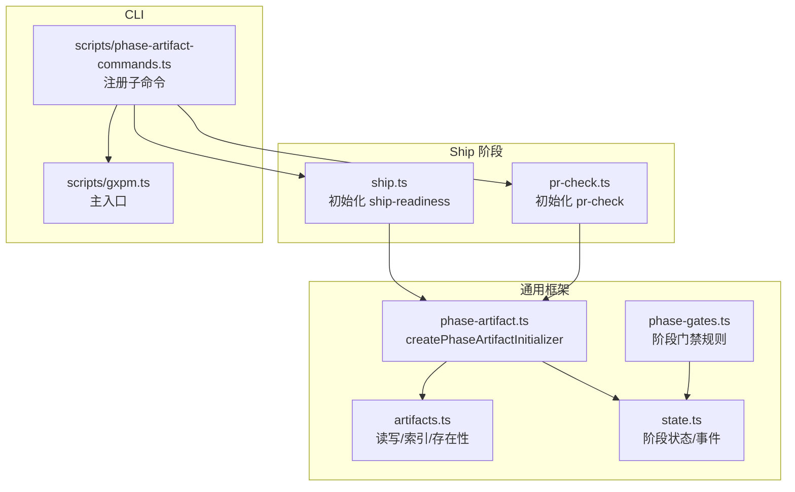
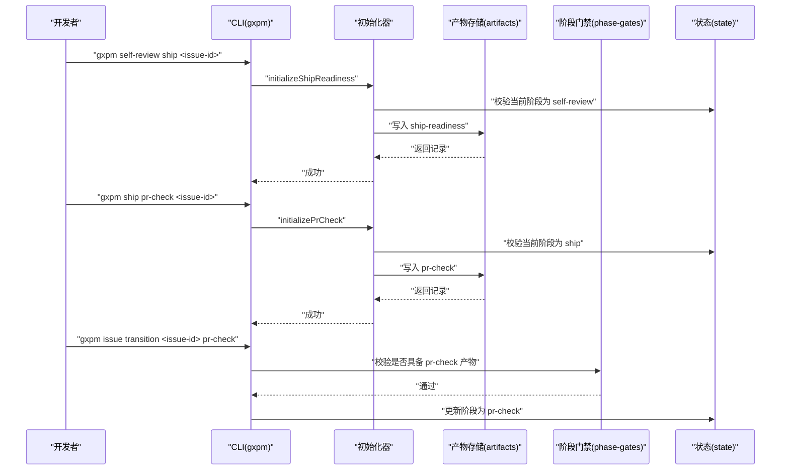
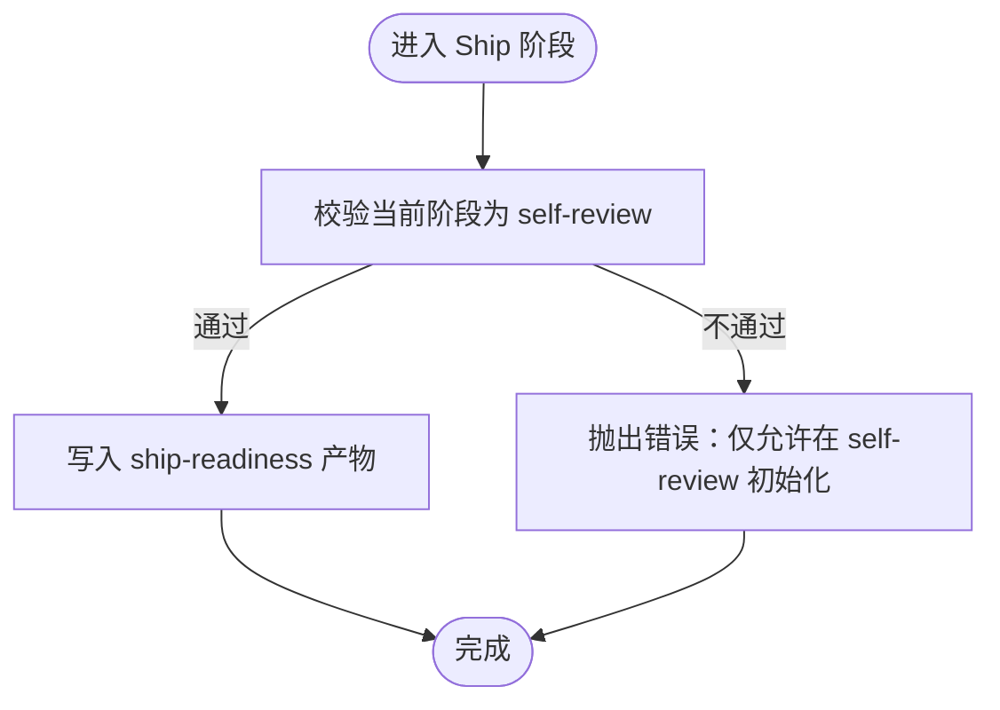
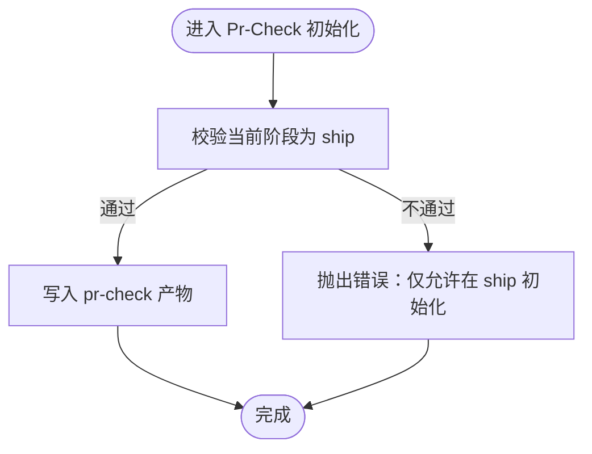
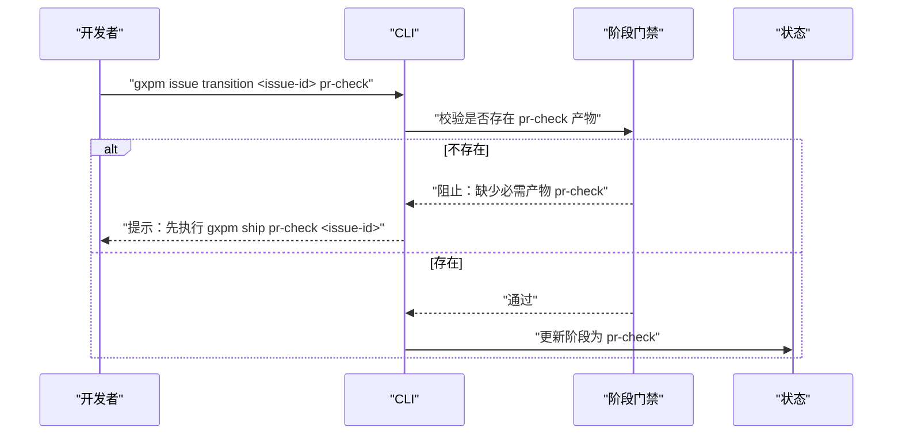
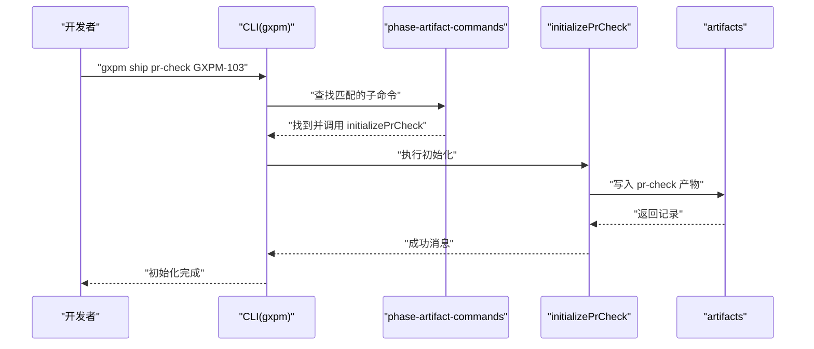
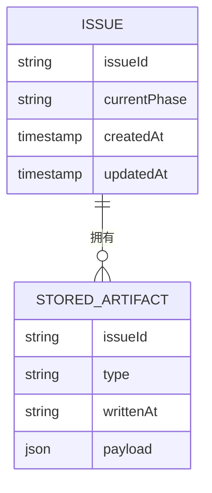
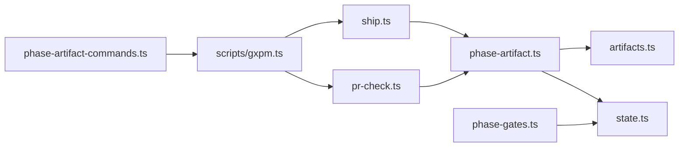

# 发布准备阶段（Ship）

<cite>
**本文引用的文件**
- [core/ship.ts](file://core/ship.ts)
- [core/pr-check.ts](file://core/pr-check.ts)
- [core/phase-artifact.ts](file://core/phase-artifact.ts)
- [core/phase-gates.ts](file://core/phase-gates.ts)
- [core/artifacts.ts](file://core/artifacts.ts)
- [core/state.ts](file://core/state.ts)
- [scripts/gxpm.ts](file://scripts/gxpm.ts)
- [scripts/phase-artifact-commands.ts](file://scripts/phase-artifact-commands.ts)
- [test/ship-gate.test.ts](file://test/ship-gate.test.ts)
- [test/pr-check-gate.test.ts](file://test/pr-check-gate.test.ts)
- [test/helpers/workflow.ts](file://test/helpers/workflow.ts)
- [skills/gxpm/SKILL.md](file://skills/gxpm/SKILL.md)
- [docs/architecture/gxpm-v0-contract.md](file://docs/architecture/gxpm-v0-contract.md)
</cite>

## 目录
1. [简介](#简介)
2. [项目结构](#项目结构)
3. [核心组件](#核心组件)
4. [架构总览](#架构总览)
5. [详细组件分析](#详细组件分析)
6. [依赖关系分析](#依赖关系分析)
7. [性能考量](#性能考量)
8. [故障排查指南](#故障排查指南)
9. [结论](#结论)
10. [附录](#附录)

## 简介
本文件面向 gxpm 发布准备阶段（Ship）的“发布打包、部署准备与上线前检查”职责，系统性阐述该阶段的目标、产物要求与命令用法，重点聚焦必需产物类型“pr-check”的规范与校验机制，并提供可操作的发布准备清单、常见陷阱与最佳实践，帮助团队在 Ship 阶段高质量完成上线前的准备工作。

## 项目结构
围绕 Ship 阶段的关键文件组织如下：
- 初始化器：ship.ts、pr-check.ts 负责在对应阶段创建初始产物
- 通用初始化框架：phase-artifact.ts 提供按阶段初始化产物的统一逻辑
- 阶段门禁规则：phase-gates.ts 定义了从 Ship 到 Pr-Check 的强制产物要求
- CLI 入口：scripts/gxpm.ts 将 phase-artifact-commands.ts 注册为子命令
- 产物存储与校验：artifacts.ts 提供读写、索引与存在性判断；state.ts 提供阶段状态与门禁断言
- 测试与技能文档：test/*.test.ts 与 skills/gxpm/SKILL.md、docs/architecture/gxpm-v0-contract.md 提供行为约束与使用示例

图表来源
- [core/ship.ts:1-17](file://core/ship.ts#L1-L17)
- [core/pr-check.ts:1-16](file://core/pr-check.ts#L1-L16)
- [core/phase-artifact.ts:1-33](file://core/phase-artifact.ts#L1-L33)
- [core/phase-gates.ts:1-118](file://core/phase-gates.ts#L1-L118)
- [core/artifacts.ts:1-169](file://core/artifacts.ts#L1-L169)
- [core/state.ts:1-200](file://core/state.ts#L1-L200)
- [scripts/gxpm.ts:1-699](file://scripts/gxpm.ts#L1-L699)
- [scripts/phase-artifact-commands.ts:1-84](file://scripts/phase-artifact-commands.ts#L1-L84)

章节来源
- [core/ship.ts:1-17](file://core/ship.ts#L1-L17)
- [core/pr-check.ts:1-16](file://core/pr-check.ts#L1-L16)
- [core/phase-artifact.ts:1-33](file://core/phase-artifact.ts#L1-L33)
- [core/phase-gates.ts:1-118](file://core/phase-gates.ts#L1-L118)
- [core/artifacts.ts:1-169](file://core/artifacts.ts#L1-L169)
- [core/state.ts:1-200](file://core/state.ts#L1-L200)
- [scripts/gxpm.ts:1-699](file://scripts/gxpm.ts#L1-L699)
- [scripts/phase-artifact-commands.ts:1-84](file://scripts/phase-artifact-commands.ts#L1-L84)

## 核心组件
- Ship 阶段初始化器：在 self-review 阶段创建 ship-readiness 产物，作为进入 Ship 阶段的前置条件
- Pr-Check 初始化器：在 Ship 阶段创建 pr-check 产物，作为进入 Pr-Check 阶段的前置条件
- 通用初始化器工厂：createPhaseArtifactInitializer 统一实现“仅允许在指定阶段创建”“写入产物并记录事件”的能力
- 阶段门禁规则：PHASE_GATE_RULES 明确“ship -> pr-check”需要 pr-check 产物存在
- CLI 子命令注册：phase-artifact-commands.ts 将各阶段产物初始化命令注册到主 CLI，便于通过 gxpm ship pr-check <issue-id> 使用

章节来源
- [core/ship.ts:3-16](file://core/ship.ts#L3-L16)
- [core/pr-check.ts:3-15](file://core/pr-check.ts#L3-L15)
- [core/phase-artifact.ts:16-32](file://core/phase-artifact.ts#L16-L32)
- [core/phase-gates.ts:75-80](file://core/phase-gates.ts#L75-L80)
- [scripts/phase-artifact-commands.ts:54-57](file://scripts/phase-artifact-commands.ts#L54-L57)

## 架构总览
Ship 阶段是发布准备的关键节点，其职责包括：
- 产出发布打包清单与风险评估
- 准备部署所需信息（如目标分支、发布说明）
- 与上游 self-review 的成果进行关联与复核
- 在进入 Pr-Check 前确保 pr-check 产物完备

图表来源
- [scripts/gxpm.ts:262-270](file://scripts/gxpm.ts#L262-L270)
- [scripts/phase-artifact-commands.ts:54-57](file://scripts/phase-artifact-commands.ts#L54-L57)
- [core/phase-artifact.ts:17-31](file://core/phase-artifact.ts#L17-L31)
- [core/artifacts.ts:57-91](file://core/artifacts.ts#L57-L91)
- [core/phase-gates.ts:75-80](file://core/phase-gates.ts#L75-L80)
- [core/state.ts:150-200](file://core/state.ts#L150-L200)

## 详细组件分析

### Ship 阶段初始化器（ship-readiness）
- 触发时机：仅当当前阶段为 self-review 时允许创建
- 产物内容要点：包含检查清单、发布说明、已评审产物列表、风险、状态、摘要、目标分支等字段
- 作用：作为进入 Ship 阶段的“门卡”，确保发布前准备工作就绪

图表来源
- [core/ship.ts:3-16](file://core/ship.ts#L3-L16)
- [core/phase-artifact.ts:18-23](file://core/phase-artifact.ts#L18-L23)

章节来源
- [core/ship.ts:3-16](file://core/ship.ts#L3-L16)
- [test/ship-gate.test.ts:11-32](file://test/ship-gate.test.ts#L11-L32)
- [test/ship-gate.test.ts:64-89](file://test/ship-gate.test.ts#L64-L89)

### Pr-Check 初始化器（pr-check）
- 触发时机：仅当当前阶段为 ship 时允许创建
- 产物内容要点：包含 PR 编号、评审发现、风险、关联 ship-readiness 引用、状态、摘要等字段
- 作用：作为进入 Pr-Check 阶段的“门卡”，确保上线前审查与风险评估完备

图表来源
- [core/pr-check.ts:3-15](file://core/pr-check.ts#L3-L15)
- [core/phase-artifact.ts:18-23](file://core/phase-artifact.ts#L18-L23)

章节来源
- [core/pr-check.ts:3-15](file://core/pr-check.ts#L3-L15)
- [test/pr-check-gate.test.ts:11-31](file://test/pr-check-gate.test.ts#L11-L31)
- [test/pr-check-gate.test.ts:33-61](file://test/pr-check-gate.test.ts#L33-L61)

### 阶段门禁与过渡规则
- 从 Ship 到 Pr-Check 的过渡必须具备 pr-check 产物，否则 gate 会阻止并提示先执行初始化命令
- CLI 会在过渡失败时给出明确的命令指引，例如“先运行 gxpm ship pr-check <issue-id>”

图表来源
- [core/phase-gates.ts:75-80](file://core/phase-gates.ts#L75-L80)
- [test/pr-check-gate.test.ts:33-61](file://test/pr-check-gate.test.ts#L33-L61)
- [scripts/gxpm.ts:636-663](file://scripts/gxpm.ts#L636-L663)

章节来源
- [core/phase-gates.ts:75-80](file://core/phase-gates.ts#L75-L80)
- [test/pr-check-gate.test.ts:33-61](file://test/pr-check-gate.test.ts#L33-L61)
- [scripts/gxpm.ts:636-663](file://scripts/gxpm.ts#L636-L663)

### CLI 命令与使用方法
- 初始化 pr-check：gxpm ship pr-check <issue-id>
- 初始化 ship-readiness：gxpm self-review ship <issue-id>
- 查看产物：gxpm artifact list <issue-id>、gxpm artifact read <issue-id> <type>
- 过渡到下一阶段：gxpm issue transition <issue-id> pr-check

图表来源
- [scripts/gxpm.ts:262-270](file://scripts/gxpm.ts#L262-L270)
- [scripts/phase-artifact-commands.ts:54-57](file://scripts/phase-artifact-commands.ts#L54-L57)
- [test/pr-check-gate.test.ts:63-88](file://test/pr-check-gate.test.ts#L63-L88)

章节来源
- [scripts/gxpm.ts:262-270](file://scripts/gxpm.ts#L262-L270)
- [scripts/phase-artifact-commands.ts:54-57](file://scripts/phase-artifact-commands.ts#L54-L57)
- [test/pr-check-gate.test.ts:63-88](file://test/pr-check-gate.test.ts#L63-L88)
- [skills/gxpm/SKILL.md:150-163](file://skills/gxpm/SKILL.md#L150-L163)

### 产物类型与数据模型
- 产物类型枚举包含 ship-readiness 与 pr-check
- 产物写入时会更新索引与事件日志，保证可追溯性

图表来源
- [core/artifacts.ts:26-41](file://core/artifacts.ts#L26-L41)
- [core/artifacts.ts:57-91](file://core/artifacts.ts#L57-L91)
- [core/state.ts:28-43](file://core/state.ts#L28-L43)

章节来源
- [core/artifacts.ts:10-24](file://core/artifacts.ts#L10-L24)
- [core/artifacts.ts:57-91](file://core/artifacts.ts#L57-L91)
- [core/state.ts:28-43](file://core/state.ts#L28-L43)

## 依赖关系分析
- Ship 阶段依赖于 self-review 的 ship-readiness 产物
- Pr-Check 阶段依赖于 ship 阶段的 pr-check 产物
- CLI 通过 phase-artifact-commands 将初始化器与命令绑定
- 阶段门禁规则由 phase-gates 提供，state 模块负责断言与事件记录

图表来源
- [core/ship.ts:1-17](file://core/ship.ts#L1-L17)
- [core/pr-check.ts:1-16](file://core/pr-check.ts#L1-L16)
- [core/phase-artifact.ts:1-33](file://core/phase-artifact.ts#L1-L33)
- [core/artifacts.ts:1-169](file://core/artifacts.ts#L1-L169)
- [core/state.ts:1-200](file://core/state.ts#L1-L200)
- [core/phase-gates.ts:1-118](file://core/phase-gates.ts#L1-L118)
- [scripts/phase-artifact-commands.ts:1-84](file://scripts/phase-artifact-commands.ts#L1-L84)
- [scripts/gxpm.ts:1-699](file://scripts/gxpm.ts#L1-L699)

章节来源
- [core/phase-gates.ts:75-80](file://core/phase-gates.ts#L75-L80)
- [scripts/phase-artifact-commands.ts:54-57](file://scripts/phase-artifact-commands.ts#L54-L57)
- [scripts/gxpm.ts:262-270](file://scripts/gxpm.ts#L262-L270)

## 性能考量
- 产物写入采用同步文件 I/O，单次初始化开销极低，适合在本地工作流中频繁执行
- 事件与索引更新为轻量 JSON 写入，建议避免在 CI 中过度并发写入同一 issue 的多个产物
- 若需批量处理，建议在本地聚合后再一次性写入，减少磁盘写入次数

## 故障排查指南
- “仅允许在指定阶段初始化”类错误
  - 症状：尝试在非 self-review 阶段初始化 ship-readiness，或在非 ship 阶段初始化 pr-check
  - 处理：先完成上一阶段的产物并过渡到目标阶段
  - 参考：phase-artifact.ts 的阶段校验逻辑
- “缺少必需产物”类错误
  - 症状：从 Ship 直接过渡到 Pr-Check 失败
  - 处理：先执行 gxpm ship pr-check <issue-id> 初始化 pr-check 产物，再过渡
  - 参考：phase-gates.ts 的门禁规则与测试用例
- CLI 使用问题
  - 症状：命令未识别或参数错误
  - 处理：确认命令格式为 gxpm <phase> <artifact> <issue-id>，并确保 issue 已创建且处于正确阶段
  - 参考：scripts/gxpm.ts 的命令分发逻辑与 phase-artifact-commands.ts 的注册映射

章节来源
- [core/phase-artifact.ts:18-23](file://core/phase-artifact.ts#L18-L23)
- [core/phase-gates.ts:75-80](file://core/phase-gates.ts#L75-L80)
- [test/pr-check-gate.test.ts:33-61](file://test/pr-check-gate.test.ts#L33-L61)
- [scripts/gxpm.ts:262-270](file://scripts/gxpm.ts#L262-L270)

## 结论
Ship 阶段是发布流程中的关键闸门，其核心职责是完成发布打包、部署准备与上线前检查。通过 ship-readiness 与 pr-check 两大产物，配合严格的阶段门禁与 CLI 工具链，能够有效保障发布质量与可追溯性。遵循本文提供的命令用法、产物规范与最佳实践，可显著降低发布风险并提升团队协作效率。

## 附录

### Ship 阶段发布准备清单
- [ ] 完成 self-review 并生成 ship-readiness
- [ ] 在 Ship 阶段初始化 pr-check
- [ ] 校验 pr-check 包含 PR 编号、评审发现、风险与摘要
- [ ] 关联 ship-readiness 引用，确保上下文一致
- [ ] 通过阶段门禁，过渡到 Pr-Check 阶段

章节来源
- [skills/gxpm/SKILL.md:150-163](file://skills/gxpm/SKILL.md#L150-L163)
- [docs/architecture/gxpm-v0-contract.md:230-240](file://docs/architecture/gxpm-v0-contract.md#L230-L240)