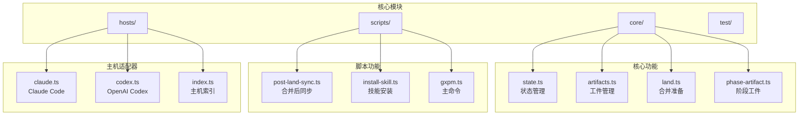
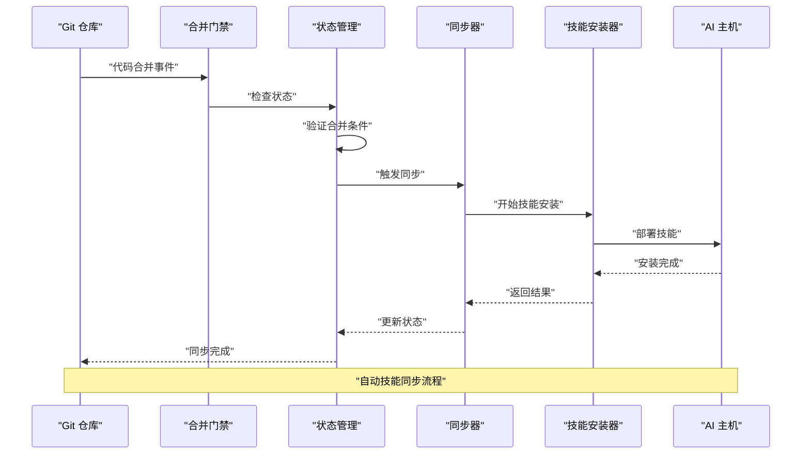
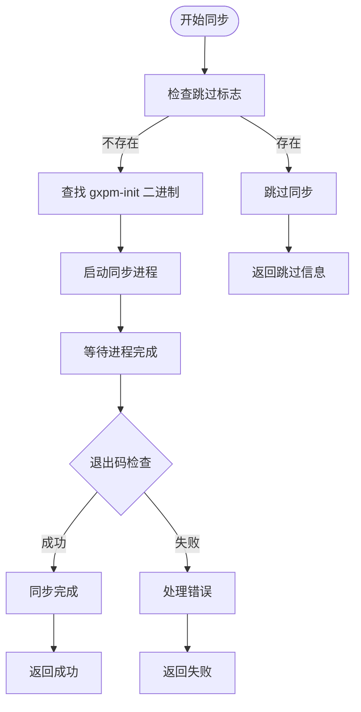
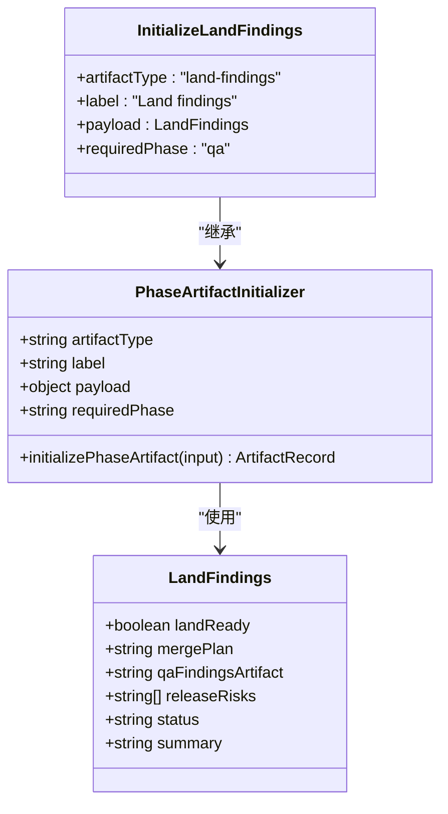
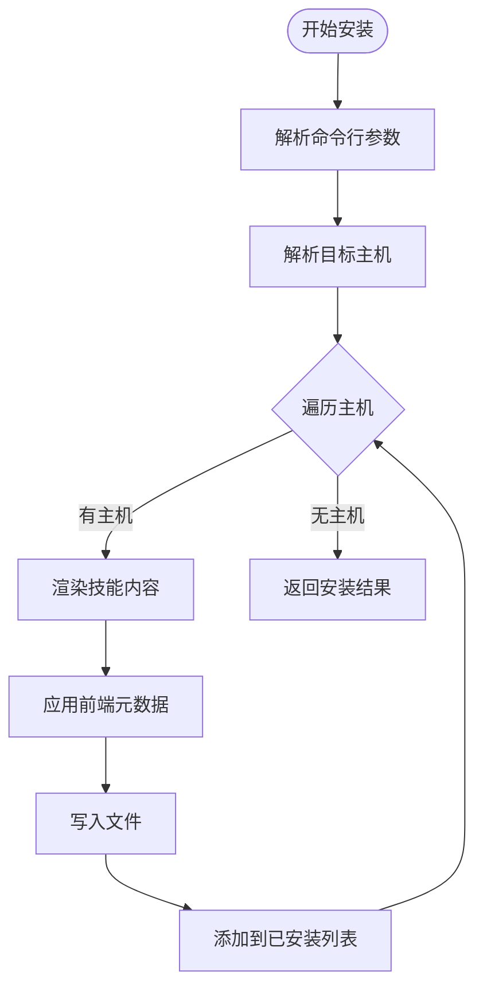
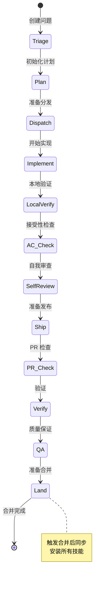
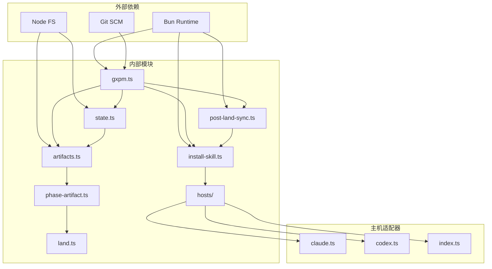

# 合并后同步

<cite>
**本文档引用的文件**
- [package.json](file://package.json)
- [post-land-sync.ts](file://scripts/post-land-sync.ts)
- [gxpm.ts](file://scripts/gxpm.ts)
- [land.ts](file://core/land.ts)
- [phase-artifact.ts](file://core/phase-artifact.ts)
- [artifacts.ts](file://core/artifacts.ts)
- [state.ts](file://core/state.ts)
- [install-skill.ts](file://scripts/install-skill.ts)
- [index.ts](file://hosts/index.ts)
- [host-config.ts](file://scripts/host-config.ts)
- [claude.ts](file://hosts/claude.ts)
- [codex.ts](file://hosts/codex.ts)
- [gxpm](file://bin/gxpm)
</cite>

## 目录
1. [简介](#简介)
2. [项目结构](#项目结构)
3. [核心组件](#核心组件)
4. [架构概览](#架构概览)
5. [详细组件分析](#详细组件分析)
6. [依赖关系分析](#依赖关系分析)
7. [性能考虑](#性能考虑)
8. [故障排除指南](#故障排除指南)
9. [结论](#结论)

## 简介

"合并后同步"是 gxpm（第二代项目管理运行时）中的一个关键功能，用于在代码合并到目标分支后自动同步技能配置。该功能确保当代码被合并到受支持的分支时，相关的 AI 助手技能能够自动安装和配置，从而保持开发环境的一致性和可用性。

gxpm 是一个现代化的项目管理工具，旨在替代传统的 PMC 和 gstack 系统。它提供了完整的开发生命周期管理，包括问题跟踪、阶段转换、工件管理和质量保证等功能。

## 项目结构

gxpm 采用模块化设计，主要包含以下核心目录：

**图表来源**
- [package.json:1-27](file://package.json#L1-L27)
- [post-land-sync.ts:1-47](file://scripts/post-land-sync.ts#L1-L47)
- [gxpm.ts:1-707](file://scripts/gxpm.ts#L1-L707)

**章节来源**
- [package.json:1-27](file://package.json#L1-L27)
- [gxpm.ts:1-707](file://scripts/gxpm.ts#L1-L707)

## 核心组件

### 合并后同步机制

合并后同步功能通过以下核心组件实现：

1. **post-land-sync.ts**: 主要的同步执行器
2. **land.ts**: 合并准备工件初始化
3. **phase-artifact.ts**: 阶段工件创建器
4. **artifacts.ts**: 工件管理系统
5. **state.ts**: 状态跟踪系统

### 技能安装系统

技能安装功能负责在多个 AI 主机上部署 gxpm 技能：

1. **install-skill.ts**: 主要安装逻辑
2. **hosts/index.ts**: 主机配置管理
3. **hosts/claude.ts**: Claude Code 配置
4. **hosts/codex.ts**: OpenAI Codex 配置

**章节来源**
- [post-land-sync.ts:1-47](file://scripts/post-land-sync.ts#L1-L47)
- [install-skill.ts:1-112](file://scripts/install-skill.ts#L1-L112)
- [land.ts:1-17](file://core/land.ts#L1-L17)

## 架构概览

合并后同步系统采用事件驱动的设计模式，通过状态转换触发相应的同步操作：

**图表来源**
- [gxpm.ts:192-206](file://scripts/gxpm.ts#L192-L206)
- [post-land-sync.ts:15-46](file://scripts/post-land-sync.ts#L15-L46)

## 详细组件分析

### 合并后同步执行器

post-land-sync.ts 是整个同步系统的核心执行器，负责协调技能安装过程：

**图表来源**
- [post-land-sync.ts:15-46](file://scripts/post-land-sync.ts#L15-L46)

#### 关键特性

1. **环境变量控制**: 支持 `GXPM_SKIP_POST_LAND_SYNC` 环境变量跳过同步
2. **动态二进制定位**: 自动查找 gxpm-init 可执行文件
3. **进程管理**: 使用 Bun.spawnsync 安全执行外部命令
4. **错误处理**: 提供详细的错误信息和回退机制

**章节来源**
- [post-land-sync.ts:1-47](file://scripts/post-land-sync.ts#L1-L47)

### 合并准备工件

land.ts 定义了合并前必需的工件类型和初始化逻辑：

**图表来源**
- [land.ts:3-16](file://core/land.ts#L3-L16)
- [phase-artifact.ts:16-32](file://core/phase-artifact.ts#L16-L32)

#### 工件属性

每个 land-findings 工件包含以下关键属性：
- `landReady`: 标识是否准备好进行合并
- `mergePlan`: 合并计划描述
- `qaFindingsArtifact`: 质量保证发现工件引用
- `releaseRisks`: 发布风险列表
- `status`: 当前状态（草稿/完成）
- `summary`: 概要信息

**章节来源**
- [land.ts:1-17](file://core/land.ts#L1-L17)
- [phase-artifact.ts:1-33](file://core/phase-artifact.ts#L1-L33)

### 技能安装系统

install-skill.ts 实现了跨平台的技能安装功能：

**图表来源**
- [install-skill.ts:20-38](file://scripts/install-skill.ts#L20-L38)

#### 主机支持

系统支持以下 AI 主机：

| 主机名称 | 配置文件 | 全局根目录 | 本地根目录 |
|---------|----------|------------|------------|
| Claude Code | claude.ts | .claude/skills/gxpm | .claude/skills/gxpm |
| OpenAI Codex | codex.ts | .codex/skills/gxpm | .agents/skills/gxpm |

**章节来源**
- [install-skill.ts:1-112](file://scripts/install-skill.ts#L1-L112)
- [claude.ts:1-18](file://hosts/claude.ts#L1-L18)
- [codex.ts:1-19](file://hosts/codex.ts#L1-L19)

### 状态管理系统

state.ts 提供了完整的状态跟踪和转换机制：

**图表来源**
- [state.ts:13-26](file://core/state.ts#L13-L26)
- [gxpm.ts:199-204](file://scripts/gxpm.ts#L199-L204)

#### 阶段转换规则

系统定义了严格的阶段转换顺序，确保工作流的正确性：

1. **Triage** → **Plan** → **Dispatch** → **Implement** → **LocalVerify** → **AC_Check** → **SelfReview** → **Ship** → **PR_Check** → **Verify** → **QA** → **Land**
2. 每个阶段转换都需要满足前置条件和必要的工件
3. 特殊处理：Land 阶段自动触发技能同步

**章节来源**
- [state.ts:13-305](file://core/state.ts#L13-L305)
- [gxpm.ts:152-206](file://scripts/gxpm.ts#L152-L206)

## 依赖关系分析

### 组件依赖图

**图表来源**
- [package.json:14-25](file://package.json#L14-L25)
- [gxpm.ts:1-34](file://scripts/gxpm.ts#L1-L34)

### 关键依赖关系

1. **Bun 运行时**: 所有 TypeScript 文件都依赖 Bun 的运行时环境
2. **Node.js 文件系统**: 状态管理和工件存储依赖文件系统操作
3. **Git 集成**: 通过 Git 事件触发合并后同步
4. **主机适配器**: 支持多种 AI 主机的技能部署

**章节来源**
- [package.json:14-25](file://package.json#L14-L25)
- [gxpm.ts:1-34](file://scripts/gxpm.ts#L1-L34)

## 性能考虑

### 同步性能优化

1. **异步执行**: 使用 Bun.spawnsync 非阻塞执行外部命令
2. **缓存策略**: 复用已存在的工件避免重复创建
3. **并发处理**: 多主机安装时并行执行减少总时间
4. **资源管理**: 及时清理临时文件和进程资源

### 内存使用优化

1. **流式处理**: 大文件读取使用流式 API
2. **增量更新**: 状态文件采用增量更新策略
3. **对象池**: 复用临时对象减少 GC 压力

## 故障排除指南

### 常见问题及解决方案

#### 同步失败

**症状**: 合并后技能未安装
**原因**:
- 环境变量设置错误
- gxpm-init 二进制不可用
- 权限不足

**解决方法**:
1. 设置 `GXPM_SKIP_POST_LAND_SYNC=0` 强制同步
2. 确认 gxpm-init 在 PATH 中可访问
3. 检查用户权限和文件系统权限

#### 主机配置错误

**症状**: 技能安装到错误位置
**原因**: 主机配置不正确

**解决方法**:
1. 检查 hosts/ 目录下的配置文件
2. 验证主机名称和路径格式
3. 确认前端元数据配置正确

#### 阶段转换错误

**症状**: 状态无法正常转换
**原因**: 缺少必需的工件或前置条件不满足

**解决方法**:
1. 检查 requiredArtifact 是否存在
2. 验证阶段门禁规则
3. 确认工件格式正确

**章节来源**
- [post-land-sync.ts:18-45](file://scripts/post-land-sync.ts#L18-L45)
- [gxpm.ts:299-324](file://scripts/gxpm.ts#L299-L324)

## 结论

合并后同步功能是 gxpm 系统的重要组成部分，它实现了自动化技能部署和状态管理。通过事件驱动的设计和模块化的架构，该系统能够可靠地处理复杂的开发工作流。

### 主要优势

1. **自动化程度高**: 减少手动干预，提高开发效率
2. **可扩展性强**: 支持多种 AI 主机和自定义配置
3. **可靠性好**: 完善的错误处理和回退机制
4. **性能优秀**: 并行处理和资源优化

### 未来发展方向

1. **增强监控**: 添加更详细的日志和指标收集
2. **扩展支持**: 支持更多 AI 主机和服务提供商
3. **智能调度**: 基于项目特征自动选择最优配置
4. **集成优化**: 更深度地集成到 CI/CD 流程中

该系统为现代软件开发提供了一个强大而灵活的基础设施，有助于提高团队协作效率和代码质量。
