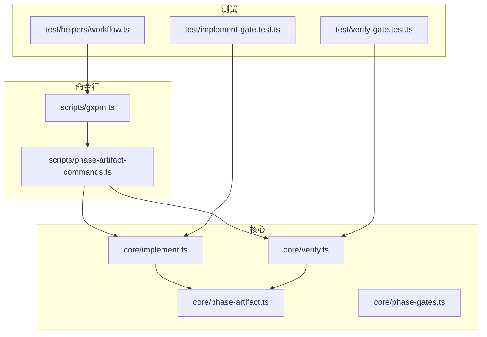
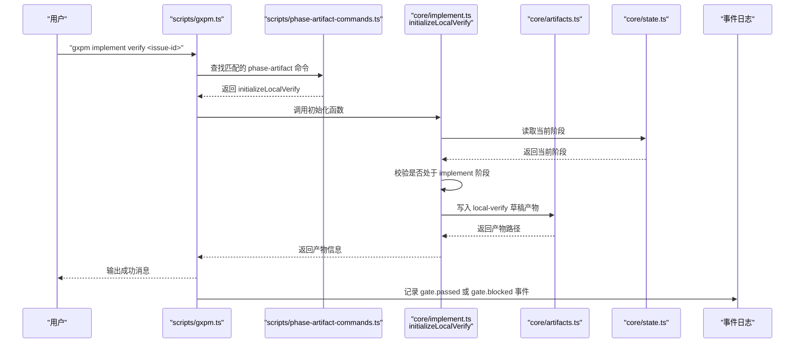
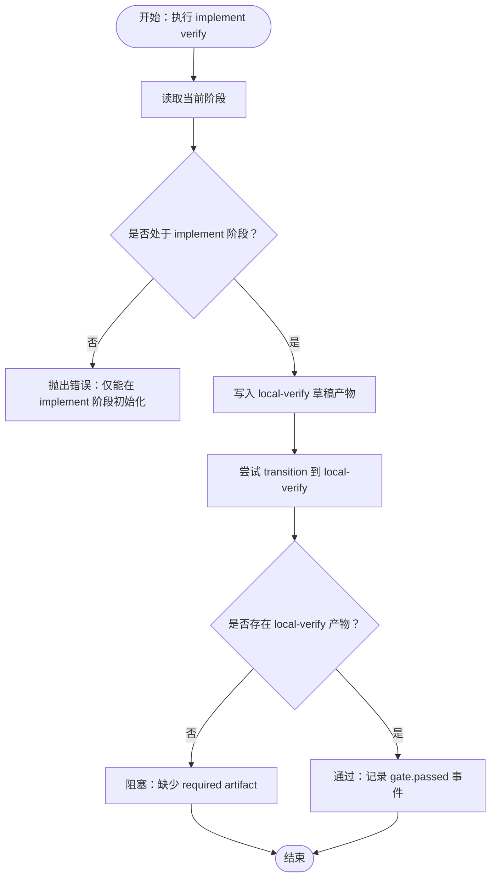
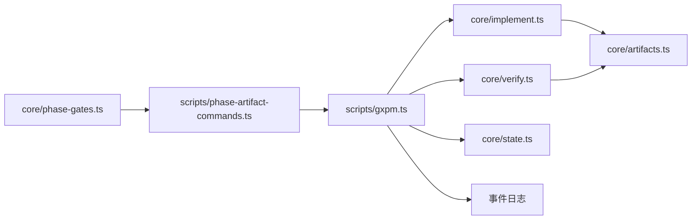

# 实施阶段（Implement）

<cite>
**本文引用的文件**
- [implement.ts](file://core/implement.ts)
- [verify.ts](file://core/verify.ts)
- [phase-artifact.ts](file://core/phase-artifact.ts)
- [phase-gates.ts](file://core/phase-gates.ts)
- [gxpm.ts](file://scripts/gxpm.ts)
- [phase-artifact-commands.ts](file://scripts/phase-artifact-commands.ts)
- [implement-gate.test.ts](file://test/implement-gate.test.ts)
- [verify-gate.test.ts](file://test/verify-gate.test.ts)
- [workflow.ts](file://test/helpers/workflow.ts)
- [gxpm-v0-contract.md](file://docs/architecture/gxpm-v0-contract.md)
- [development-contract.md](file://docs/governance/development-contract.md)
- [README.md](file://README.md)
</cite>

## 目录
1. [简介](#简介)
2. [项目结构](#项目结构)
3. [核心组件](#核心组件)
4. [架构总览](#架构总览)
5. [详细组件分析](#详细组件分析)
6. [依赖分析](#依赖分析)
7. [性能考虑](#性能考虑)
8. [故障排查指南](#故障排查指南)
9. [结论](#结论)
10. [附录](#附录)

## 简介
本文件面向 gxpm 的实施阶段（Implement），系统阐述该阶段的核心职责、目标与产物要求，重点聚焦“local-verify”产物的初始化、校验与过渡规则，并提供“implement verify”命令的使用方法、参数说明与本地验证实践建议。文档同时总结常见陷阱与最佳实践，帮助读者高效、稳健地完成实施阶段的工作。

## 项目结构
- 核心实现位于 core 目录，包含阶段产物初始化器、阶段门禁规则、阶段产物抽象等。
- 命令行入口 scripts/gxpm.ts 提供完整的 CLI 子命令体系，包括 phase-artifact 命令的自动注册与执行。
- 测试 test/ 下包含 gate 测试与工作流辅助工具，确保阶段过渡与产物初始化符合预期。
- 文档 docs/architecture/gxpm-v0-contract.md 明确了各阶段与产物的契约，是理解实施阶段要求的重要依据。

图表来源
- [implement.ts:1-16](file://core/implement.ts#L1-L16)
- [verify.ts:1-16](file://core/verify.ts#L1-L16)
- [phase-artifact.ts:1-33](file://core/phase-artifact.ts#L1-L33)
- [phase-gates.ts:1-118](file://core/phase-gates.ts#L1-L118)
- [gxpm.ts:1-699](file://scripts/gxpm.ts#L1-L699)
- [phase-artifact-commands.ts:1-84](file://scripts/phase-artifact-commands.ts#L1-L84)
- [implement-gate.test.ts:1-92](file://test/implement-gate.test.ts#L1-L92)
- [verify-gate.test.ts:1-90](file://test/verify-gate.test.ts#L1-L90)
- [workflow.ts:1-98](file://test/helpers/workflow.ts#L1-L98)

章节来源
- [README.md:1-46](file://README.md#L1-L46)

## 核心组件
- 阶段产物初始化器工厂：通过 createPhaseArtifactInitializer 统一实现“仅在指定阶段初始化”的约束与“写入产物”的动作。
- implement.local-verify 初始化器：限定于 implement 阶段，写入包含变更文件、命令、证据、结果、风险与状态的草稿 payload。
- pr-check.verify-findings 初始化器：限定于 pr-check 阶段，写入验收合同引用、审查发现、PR 检查引用、风险、状态与摘要的草稿 payload。
- 阶段门禁规则：定义了从 implement 到 local-verify 的过渡条件，要求存在 local-verify 产物。
- CLI 命令体系：scripts/gxpm.ts 与 scripts/phase-artifact-commands.ts 协作，提供“implement verify”等子命令，自动注册并执行对应初始化器。

章节来源
- [implement.ts:1-16](file://core/implement.ts#L1-L16)
- [verify.ts:1-16](file://core/verify.ts#L1-L16)
- [phase-artifact.ts:1-33](file://core/phase-artifact.ts#L1-L33)
- [phase-gates.ts:52-56](file://core/phase-gates.ts#L52-L56)
- [gxpm.ts:262-270](file://scripts/gxpm.ts#L262-L270)
- [phase-artifact-commands.ts:38-41](file://scripts/phase-artifact-commands.ts#L38-L41)

## 架构总览
下图展示了实施阶段到本地验证阶段的关键交互：命令解析、初始化器执行、产物写入与事件记录，以及后续的阶段过渡。

图表来源
- [gxpm.ts:262-270](file://scripts/gxpm.ts#L262-L270)
- [phase-artifact-commands.ts:38-41](file://scripts/phase-artifact-commands.ts#L38-L41)
- [implement.ts:3-15](file://core/implement.ts#L3-L15)
- [phase-artifact.ts:16-32](file://core/phase-artifact.ts#L16-L32)

## 详细组件分析

### 本地验证产物（local-verify）与实施阶段职责
- 产物类型与职责
  - 类型：local-verify
  - 责任：承载实施阶段的本地验证清单，记录变更文件、执行命令、证据、结果与风险，并以草稿状态启动，待后续完善与过渡。
- 初始化约束
  - 仅能在 implement 阶段初始化；若在其他阶段调用，将抛出错误。
  - 初始化时写入草稿 payload，字段包含变更文件、命令、证据、结果、风险与状态。
- 过渡规则
  - 从 implement 到 local-verify 的阶段过渡，要求存在 local-verify 产物；否则阻塞并记录 gate.blocked 事件。
  - 成功过渡后，记录 gate.passed 事件，携带所需产物标识。

图表来源
- [implement.ts:3-15](file://core/implement.ts#L3-L15)
- [phase-artifact.ts:16-32](file://core/phase-artifact.ts#L16-L32)
- [phase-gates.ts:52-56](file://core/phase-gates.ts#L52-L56)
- [implement-gate.test.ts:11-31](file://test/implement-gate.test.ts#L11-L31)

章节来源
- [implement.ts:1-16](file://core/implement.ts#L1-L16)
- [phase-artifact.ts:1-33](file://core/phase-artifact.ts#L1-L33)
- [phase-gates.ts:52-56](file://core/phase-gates.ts#L52-L56)
- [implement-gate.test.ts:1-92](file://test/implement-gate.test.ts#L1-L92)

### 验证发现产物（verify-findings）与 PR 检查阶段职责
- 产物类型与职责
  - 类型：verify-findings
  - 责任：承载 PR 检查阶段的验证发现，引用验收合同与 PR 检查产物，汇总风险、状态与摘要，作为进入 verify 阶段的凭证。
- 初始化约束
  - 仅能在 pr-check 阶段初始化；若在其他阶段调用，将抛出错误。
  - 初始化时写入草稿 payload，字段包含验收合同引用、PR 检查引用、发现、风险、状态与摘要。
- 过渡规则
  - 从 pr-check 到 verify 的阶段过渡，要求存在 verify-findings 产物；否则阻塞并记录 gate.blocked 事件。
  - 成功过渡后，记录 gate.passed 事件，携带所需产物标识。

章节来源
- [verify.ts:1-16](file://core/verify.ts#L1-L16)
- [phase-artifact.ts:1-33](file://core/phase-artifact.ts#L1-L33)
- [phase-gates.ts:82-86](file://core/phase-gates.ts#L82-L86)
- [verify-gate.test.ts:1-90](file://test/verify-gate.test.ts#L1-L90)

### CLI 使用与参数说明
- implement verify 命令
  - 作用：在 implement 阶段初始化 local-verify 产物，生成草稿 payload。
  - 语法：gxpm implement verify <issue-id>
  - 行为：若当前不在 implement 阶段，抛出错误；否则写入产物并输出成功消息。
- 相关命令与产物
  - 产物清单：可通过 gxpm artifact list <issue-id> 查看是否包含 local-verify。
  - 产物读取：可通过 gxpm artifact read <issue-id> local-verify 查看草稿内容。
  - 阶段过渡：完成产物初始化后，执行 gxpm issue transition <issue-id> local-verify 完成阶段过渡。

章节来源
- [gxpm.ts:262-270](file://scripts/gxpm.ts#L262-L270)
- [phase-artifact-commands.ts:38-41](file://scripts/phase-artifact-commands.ts#L38-L41)
- [implement-gate.test.ts:63-90](file://test/implement-gate.test.ts#L63-L90)

### 本地验证实践指南
- 建议流程
  - 在 implement 阶段执行 gxpm implement verify <issue-id> 初始化 local-verify。
  - 使用 gxpm artifact read <issue-id> local-verify 校验草稿字段是否符合预期。
  - 完成本地验证后，执行 gxpm issue transition <issue-id> local-verify 进入 local-verify 阶段。
- 产物字段建议
  - 变更文件：列出受影响的文件路径，便于后续审计与回归。
  - 执行命令：记录实际执行的验证命令，确保可复现。
  - 证据：保存截图、日志片段或测试报告链接，支撑验证结论。
  - 结果：明确通过/失败与关键指标，便于评审与决策。
  - 风险：识别潜在问题与缓解措施，降低过渡风险。
- 与阶段门禁协作
  - 严格遵循阶段门禁规则，确保在进入下一阶段前具备所需产物。
  - 若被 gate.blocked，请先补全产物或修正状态后再尝试过渡。

章节来源
- [gxpm-v0-contract.md:114-114](file://docs/architecture/gxpm-v0-contract.md#L114-L114)
- [phase-gates.ts:52-56](file://core/phase-gates.ts#L52-L56)
- [implement-gate.test.ts:33-61](file://test/implement-gate.test.ts#L33-L61)

## 依赖分析
- 组件耦合
  - implement.ts 与 verify.ts 通过 createPhaseArtifactInitializer 抽象出相同的初始化模式，降低样板代码重复。
  - phase-artifact-commands.ts 将 phase-gates.ts 中的规则与具体初始化器解耦，实现命令注册与执行的自动化。
  - scripts/gxpm.ts 作为 CLI 入口，集中处理命令解析与调用，保证一致性与可扩展性。
- 关键依赖链
  - CLI 子命令 → phase-artifact 命令注册 → 初始化器 → 产物写入 → 阶段过渡 → 事件记录。
- 潜在风险
  - 若阶段门禁规则与初始化器不一致，可能导致 gate.blocked 或初始化失败。
  - 产物字段缺失或格式不符，会影响后续阶段的自动化与人工评审。

图表来源
- [phase-gates.ts:1-118](file://core/phase-gates.ts#L1-L118)
- [phase-artifact-commands.ts:1-84](file://scripts/phase-artifact-commands.ts#L1-L84)
- [gxpm.ts:1-699](file://scripts/gxpm.ts#L1-L699)
- [implement.ts:1-16](file://core/implement.ts#L1-L16)
- [verify.ts:1-16](file://core/verify.ts#L1-L16)

章节来源
- [phase-gates.ts:1-118](file://core/phase-gates.ts#L1-L118)
- [phase-artifact-commands.ts:1-84](file://scripts/phase-artifact-commands.ts#L1-L84)
- [gxpm.ts:1-699](file://scripts/gxpm.ts#L1-L699)

## 性能考虑
- 初始化器为轻量写入操作，性能开销主要取决于文件系统写入与 JSON 序列化。
- CLI 解析与命令查找为 O(n)（n 为阶段门禁规则数量），通常可忽略。
- 建议在本地验证阶段避免冗余写入与重复初始化，减少不必要的事件与日志增长。

## 故障排查指南
- 常见错误与定位
  - “仅能在 implement 阶段初始化”：当前阶段非 implement，需先完成前置阶段或调整工作流。
  - “缺少 required artifact”：未初始化 local-verify 产物即尝试过渡，需先执行 implement verify。
  - “命令不存在或参数错误”：检查命令拼写与 issue-id 是否正确。
- 排查步骤
  - 使用 gxpm issue status <issue-id> 确认当前阶段。
  - 使用 gxpm artifact list <issue-id> 检查产物是否存在。
  - 使用 gxpm artifact read <issue-id> <type> 校验产物内容。
  - 查看事件日志 gxpm issue history <issue-id>，定位 gate.blocked/gate.passed 的触发点。
- 相关测试参考
  - implement-gate.test.ts 与 verify-gate.test.ts 提供了初始化与过渡的断言示例，可作为调试对照。

章节来源
- [implement-gate.test.ts:1-92](file://test/implement-gate.test.ts#L1-L92)
- [verify-gate.test.ts:1-90](file://test/verify-gate.test.ts#L1-L90)
- [workflow.ts:1-98](file://test/helpers/workflow.ts#L1-L98)

## 结论
实施阶段（Implement）的核心在于高质量地完成本地验证，并以标准化的 local-verify 产物为桥梁，顺利过渡到 local-verify 阶段。通过统一的初始化器、严格的阶段门禁与完善的 CLI 支持，gxpm 为本地验证提供了清晰、可追溯的执行路径。遵循本文的使用方法、实践建议与故障排查策略，可显著提升实施阶段的效率与质量。

## 附录
- 相关文档与契约
  - gxpm V0 合同明确了阶段、产物与命令的最小闭环，是理解实施阶段要求的权威依据。
  - 开发契约定义了命令层级、生成物规则与失败归因协议，有助于规范提交与验证流程。
- 相关命令速查
  - gxpm implement verify <issue-id>：初始化 local-verify 草稿。
  - gxpm artifact list <issue-id>：查看产物清单。
  - gxpm artifact read <issue-id> local-verify：查看草稿内容。
  - gxpm issue transition <issue-id> local-verify：过渡到 local-verify 阶段。

章节来源
- [gxpm-v0-contract.md:216-239](file://docs/architecture/gxpm-v0-contract.md#L216-L239)
- [development-contract.md:7-17](file://docs/governance/development-contract.md#L7-L17)
- [gxpm.ts:262-270](file://scripts/gxpm.ts#L262-L270)