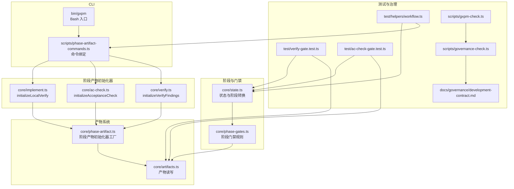
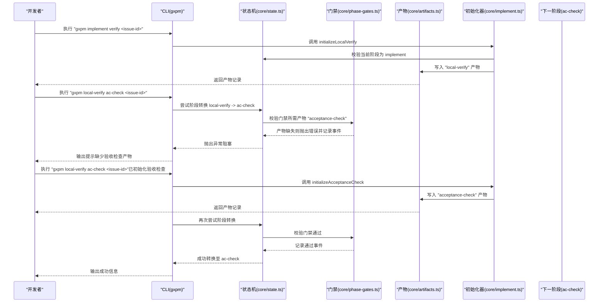
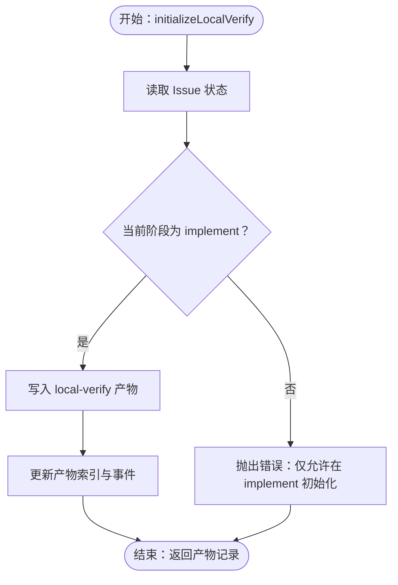
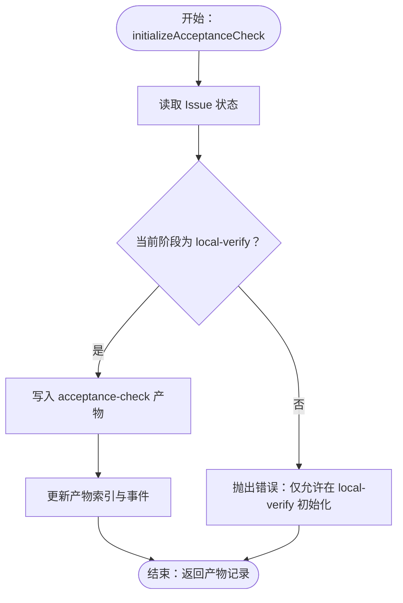
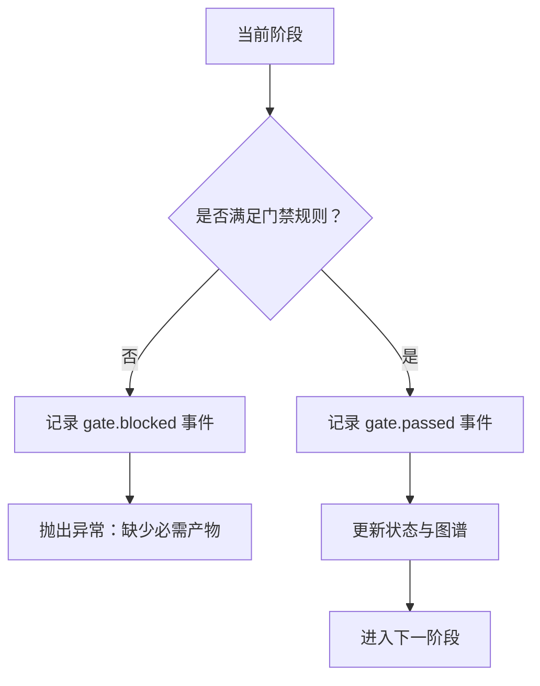
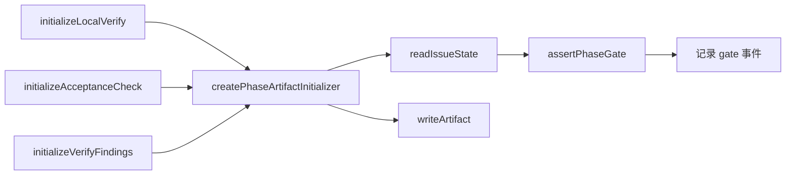

# 本地验证阶段（Local Verify）

<cite>
**本文引用的文件**
- [core/verify.ts](file://core/verify.ts)
- [core/ac-check.ts](file://core/ac-check.ts)
- [core/artifacts.ts](file://core/artifacts.ts)
- [core/phase-artifact.ts](file://core/phase-artifact.ts)
- [core/phase-gates.ts](file://core/phase-gates.ts)
- [core/state.ts](file://core/state.ts)
- [core/implement.ts](file://core/implement.ts)
- [scripts/phase-artifact-commands.ts](file://scripts/phase-artifact-commands.ts)
- [scripts/governance-check.ts](file://scripts/governance-check.ts)
- [scripts/gxpm-check.ts](file://scripts/gxpm-check.ts)
- [bin/gxpm](file://bin/gxpm)
- [test/verify-gate.test.ts](file://test/verify-gate.test.ts)
- [test/ac-check-gate.test.ts](file://test/ac-check-gate.test.ts)
- [test/helpers/workflow.ts](file://test/helpers/workflow.ts)
- [docs/governance/development-contract.md](file://docs/governance/development-contract.md)
</cite>

## 目录
1. [简介](#简介)
2. [项目结构](#项目结构)
3. [核心组件](#核心组件)
4. [架构总览](#架构总览)
5. [详细组件分析](#详细组件分析)
6. [依赖关系分析](#依赖关系分析)
7. [性能考量](#性能考量)
8. [故障排查指南](#故障排查指南)
9. [结论](#结论)
10. [附录](#附录)

## 简介
本地验证阶段（local-verify）是 gxpm 工作流中的关键环节，其核心职责包括：
- 代码质量检查：确保变更符合质量标准，识别潜在问题与风险。
- 性能测试：对关键路径进行本地性能评估，避免引入性能退化。
- 安全验证：扫描安全漏洞与敏感信息泄露风险，保障交付安全。

该阶段产出的必需产物类型为“验收检查”（acceptance-check），用于承载验收标准、检查结果、风险与总结等信息，作为进入下一阶段（ac-check）的门禁凭证。

## 项目结构
本地验证阶段涉及的核心模块与文件如下：
- 产物定义与读写：core/artifacts.ts、core/phase-artifact.ts
- 阶段与门禁规则：core/state.ts、core/phase-gates.ts
- 阶段产物初始化器：core/implement.ts（local-verify）、core/ac-check.ts（acceptance-check）、core/verify.ts（verify-findings）
- CLI 命令绑定：scripts/phase-artifact-commands.ts
- CLI 入口与脚本：bin/gxpm、scripts/gxpm-check.ts、scripts/governance-check.ts
- 测试与工作流辅助：test/*.ts、test/helpers/workflow.ts
- 治理与开发契约：docs/governance/development-contract.md

图表来源
- [core/state.ts:1-303](file://core/state.ts#L1-L303)
- [core/phase-gates.ts:1-118](file://core/phase-gates.ts#L1-L118)
- [core/artifacts.ts:1-169](file://core/artifacts.ts#L1-L169)
- [core/phase-artifact.ts:1-33](file://core/phase-artifact.ts#L1-L33)
- [core/implement.ts:1-15](file://core/implement.ts#L1-L15)
- [core/ac-check.ts:1-15](file://core/ac-check.ts#L1-L15)
- [core/verify.ts:1-16](file://core/verify.ts#L1-L16)
- [scripts/phase-artifact-commands.ts:1-84](file://scripts/phase-artifact-commands.ts#L1-L84)
- [bin/gxpm:1-18](file://bin/gxpm#L1-L18)
- [test/verify-gate.test.ts:1-90](file://test/verify-gate.test.ts#L1-L90)
- [test/ac-check-gate.test.ts:1-90](file://test/ac-check-gate.test.ts#L1-L90)
- [test/helpers/workflow.ts:1-98](file://test/helpers/workflow.ts#L1-L98)
- [scripts/governance-check.ts:1-70](file://scripts/governance-check.ts#L1-L70)
- [scripts/gxpm-check.ts:1-13](file://scripts/gxpm-check.ts#L1-L13)
- [docs/governance/development-contract.md:1-75](file://docs/governance/development-contract.md#L1-L75)

章节来源
- [core/state.ts:1-303](file://core/state.ts#L1-L303)
- [core/phase-gates.ts:1-118](file://core/phase-gates.ts#L1-L118)
- [core/artifacts.ts:1-169](file://core/artifacts.ts#L1-L169)
- [core/phase-artifact.ts:1-33](file://core/phase-artifact.ts#L1-L33)
- [core/implement.ts:1-15](file://core/implement.ts#L1-L15)
- [core/ac-check.ts:1-15](file://core/ac-check.ts#L1-L15)
- [core/verify.ts:1-16](file://core/verify.ts#L1-L16)
- [scripts/phase-artifact-commands.ts:1-84](file://scripts/phase-artifact-commands.ts#L1-L84)
- [bin/gxpm:1-18](file://bin/gxpm#L1-L18)
- [test/verify-gate.test.ts:1-90](file://test/verify-gate.test.ts#L1-L90)
- [test/ac-check-gate.test.ts:1-90](file://test/ac-check-gate.test.ts#L1-L90)
- [test/helpers/workflow.ts:1-98](file://test/helpers/workflow.ts#L1-L98)
- [scripts/governance-check.ts:1-70](file://scripts/governance-check.ts#L1-L70)
- [scripts/gxpm-check.ts:1-13](file://scripts/gxpm-check.ts#L1-L13)
- [docs/governance/development-contract.md:1-75](file://docs/governance/development-contract.md#L1-L75)

## 核心组件
- 阶段产物初始化器工厂：通过统一工厂函数创建各阶段产物，自动校验当前阶段是否允许初始化该产物，并写入标准化的草稿载荷。
- 产物读写系统：提供产物的写入、读取、索引与存在性判断，确保产物一致性与可追溯性。
- 阶段与门禁：定义严格的阶段顺序与门禁规则，任何阶段转换均需满足前置产物的存在性。
- CLI 命令绑定：将阶段产物初始化与阶段转换命令绑定，保证命令与规则一致。

章节来源
- [core/phase-artifact.ts:1-33](file://core/phase-artifact.ts#L1-L33)
- [core/artifacts.ts:1-169](file://core/artifacts.ts#L1-L169)
- [core/phase-gates.ts:1-118](file://core/phase-gates.ts#L1-L118)
- [scripts/phase-artifact-commands.ts:1-84](file://scripts/phase-artifact-commands.ts#L1-L84)

## 架构总览
本地验证阶段的端到端流程如下：

图表来源
- [core/implement.ts:1-15](file://core/implement.ts#L1-L15)
- [core/ac-check.ts:1-15](file://core/ac-check.ts#L1-L15)
- [core/artifacts.ts:1-169](file://core/artifacts.ts#L1-L169)
- [core/state.ts:150-205](file://core/state.ts#L150-L205)
- [core/phase-gates.ts:57-62](file://core/phase-gates.ts#L57-L62)
- [scripts/phase-artifact-commands.ts:38-45](file://scripts/phase-artifact-commands.ts#L38-L45)

## 详细组件分析

### 阶段产物初始化器：local-verify
- 初始化位置：仅允许在 implement 阶段初始化。
- 产物类型：local-verify。
- 草稿载荷字段：变更文件列表、命令清单、证据集合、检查结果、风险列表、状态（草稿）。
- 初始化流程：工厂函数读取当前状态，校验阶段匹配，随后写入产物并更新索引与事件日志。

图表来源
- [core/phase-artifact.ts:17-31](file://core/phase-artifact.ts#L17-L31)
- [core/implement.ts:3-14](file://core/implement.ts#L3-L14)
- [core/artifacts.ts:57-91](file://core/artifacts.ts#L57-L91)

章节来源
- [core/implement.ts:1-15](file://core/implement.ts#L1-L15)
- [core/phase-artifact.ts:1-33](file://core/phase-artifact.ts#L1-L33)
- [core/artifacts.ts:1-169](file://core/artifacts.ts#L1-L169)

### 阶段产物初始化器：acceptance-check
- 初始化位置：仅允许在 local-verify 阶段初始化。
- 产物类型：acceptance-check。
- 草稿载荷字段：验收标准列表、检查发现、关联 local-verify 产物标识、状态（草稿）、摘要。
- 初始化流程：工厂函数读取当前状态，校验阶段匹配，随后写入产物并更新索引与事件日志。

图表来源
- [core/phase-artifact.ts:17-31](file://core/phase-artifact.ts#L17-L31)
- [core/ac-check.ts:3-14](file://core/ac-check.ts#L3-L14)
- [core/artifacts.ts:57-91](file://core/artifacts.ts#L57-L91)

章节来源
- [core/ac-check.ts:1-15](file://core/ac-check.ts#L1-L15)
- [core/phase-artifact.ts:1-33](file://core/phase-artifact.ts#L1-L33)
- [core/artifacts.ts:1-169](file://core/artifacts.ts#L1-L169)

### 阶段产物初始化器：verify-findings
- 初始化位置：仅允许在 pr-check 阶段初始化。
- 产物类型：verify-findings。
- 草稿载荷字段：关联验收合约产物、检查发现、PR 检查产物、风险、状态（草稿）、摘要。
- 初始化流程：工厂函数读取当前状态，校验阶段匹配，随后写入产物并更新索引与事件日志。

章节来源
- [core/verify.ts:1-16](file://core/verify.ts#L1-L16)
- [core/phase-artifact.ts:1-33](file://core/phase-artifact.ts#L1-L33)
- [core/artifacts.ts:1-169](file://core/artifacts.ts#L1-L169)

### 阶段门禁与转换
- 门禁规则：定义了阶段之间的转换条件与所需产物。
- 阶段转换：当尝试从 implement 转换到 local-verify 时，需要存在 local-verify 产物；从 local-verify 转换到 ac-check 时，需要存在 acceptance-check 产物。
- 事件记录：若门禁被触发，系统会记录“gate.blocked”事件；通过时记录“gate.passed”。

图表来源
- [core/phase-gates.ts:107-118](file://core/phase-gates.ts#L107-L118)
- [core/state.ts:253-302](file://core/state.ts#L253-L302)

章节来源
- [core/phase-gates.ts:1-118](file://core/phase-gates.ts#L1-L118)
- [core/state.ts:150-205](file://core/state.ts#L150-L205)

### CLI 命令与工作流
- CLI 入口：bin/gxpm 调用 scripts/gxpm.ts。
- 命令绑定：scripts/phase-artifact-commands.ts 将阶段产物初始化命令与阶段转换命令绑定。
- 测试辅助：test/helpers/workflow.ts 提供工作流辅助函数，按门禁规则顺序自动推进阶段。

章节来源
- [bin/gxpm:1-18](file://bin/gxpm#L1-L18)
- [scripts/phase-artifact-commands.ts:1-84](file://scripts/phase-artifact-commands.ts#L1-L84)
- [test/helpers/workflow.ts:1-98](file://test/helpers/workflow.ts#L1-L98)

## 依赖关系分析
- 组件耦合：阶段产物初始化器高度依赖工厂函数与状态机；产物读写系统为所有阶段产物提供统一接口。
- 直接依赖：local-verify 依赖 implement 阶段；acceptance-check 依赖 local-verify 阶段；verify-findings 依赖 pr-check 阶段。
- 间接依赖：CLI 命令通过 phase-artifact-commands.ts 与门禁规则保持一致，测试通过 helpers/workflow.ts 自动构建工作流。

图表来源
- [core/implement.ts:1-15](file://core/implement.ts#L1-L15)
- [core/ac-check.ts:1-15](file://core/ac-check.ts#L1-L15)
- [core/verify.ts:1-16](file://core/verify.ts#L1-L16)
- [core/phase-artifact.ts:1-33](file://core/phase-artifact.ts#L1-L33)
- [core/state.ts:150-205](file://core/state.ts#L150-L205)

章节来源
- [core/implement.ts:1-15](file://core/implement.ts#L1-L15)
- [core/ac-check.ts:1-15](file://core/ac-check.ts#L1-L15)
- [core/verify.ts:1-16](file://core/verify.ts#L1-L16)
- [core/phase-artifact.ts:1-33](file://core/phase-artifact.ts#L1-L33)
- [core/state.ts:150-205](file://core/state.ts#L150-L205)

## 性能考量
- 产物写入与索引：产物写入采用同步文件操作，建议在本地磁盘上进行，避免网络挂载导致的延迟。
- 事件日志：频繁的阶段转换会产生大量事件日志，建议在 CI 环境中定期清理或归档。
- 测试驱动：通过测试辅助工具按门禁规则顺序推进，减少手工操作带来的重复与错误。

## 故障排查指南
- 缺少验收检查产物导致阶段转换被阻塞：
  - 现象：从 local-verify 转换到 ac-check 时报错，提示缺少 acceptance-check。
  - 排查：确认是否已在 local-verify 阶段初始化 acceptance-check 产物；检查事件日志中是否存在 gate.blocked。
  - 解决：先执行验收检查初始化命令，再进行阶段转换。
- 阶段初始化器被拒绝：
  - 现象：初始化阶段产物时报错，提示仅允许在特定阶段初始化。
  - 排查：确认当前阶段是否正确推进；检查工作流是否按门禁规则顺序执行。
  - 解决：先完成前置阶段的产物初始化与阶段转换，再执行当前阶段初始化。
- CLI 命令不生效：
  - 现象：命令执行后无产物或状态未更新。
  - 排查：确认 CLI 是否正确调用；检查命令与门禁规则是否一致。
  - 解决：使用测试辅助工具或直接调用 phase-artifact-commands.ts 中的绑定命令。

章节来源
- [test/ac-check-gate.test.ts:1-90](file://test/ac-check-gate.test.ts#L1-L90)
- [test/verify-gate.test.ts:1-90](file://test/verify-gate.test.ts#L1-L90)
- [core/state.ts:253-302](file://core/state.ts#L253-L302)
- [scripts/phase-artifact-commands.ts:78-84](file://scripts/phase-artifact-commands.ts#L78-L84)

## 结论
本地验证阶段通过严格的阶段门禁与标准化的产物初始化，确保代码质量、性能与安全在进入下一阶段前得到充分验证。验收检查（acceptance-check）作为关键门禁产物，必须在 local-verify 阶段完成初始化，方可顺利推进到 ac-check 阶段。配合 CLI 命令与测试辅助工具，开发者可以高效、可靠地完成本地验证全流程。

## 附录

### 阶段与产物一览
- implement → local-verify：需要 local-verify 产物
- local-verify → ac-check：需要 acceptance-check 产物
- pr-check → verify：需要 verify-findings 产物

章节来源
- [core/phase-gates.ts:57-62](file://core/phase-gates.ts#L57-L62)
- [core/phase-gates.ts:82-86](file://core/phase-gates.ts#L82-L86)

### local-verify 阶段产物：acceptance-check
- 必需字段：验收标准列表、检查发现、关联 local-verify 产物标识、状态（草稿）、摘要。
- 初始化时机：仅能在 local-verify 阶段初始化。
- 用途：作为进入 ac-check 阶段的门禁凭证，承载验收标准与检查结果。

章节来源
- [core/ac-check.ts:1-15](file://core/ac-check.ts#L1-L15)
- [core/phase-artifact.ts:1-33](file://core/phase-artifact.ts#L1-L33)

### local-verify ac-check 命令使用指南
- 初始化验收检查：
  - 命令：gxpm local-verify ac-check <issue-id>
  - 作用：在 local-verify 阶段初始化 acceptance-check 产物
  - 注意：需先完成 local-verify 阶段的产物初始化
- 阶段转换：
  - 命令：gxpm issue transition <issue-id> ac-check
  - 作用：从 local-verify 转换到 ac-check
  - 注意：需确保 acceptance-check 产物存在

章节来源
- [scripts/phase-artifact-commands.ts:42-45](file://scripts/phase-artifact-commands.ts#L42-L45)
- [core/phase-gates.ts:57-62](file://core/phase-gates.ts#L57-L62)
- [test/ac-check-gate.test.ts:62-88](file://test/ac-check-gate.test.ts#L62-L88)

### 全面本地验证步骤
- 准备阶段：
  - 创建 Issue 并推进到 implement 阶段
  - 初始化 local-verify 产物
- 验证阶段：
  - 执行代码质量检查、性能测试与安全扫描
  - 填写验收标准与检查发现
- 产物与转换：
  - 初始化 acceptance-check 产物
  - 执行阶段转换至 ac-check
- 质量保障：
  - 使用治理检查脚本与开发契约文档核对合规性

章节来源
- [test/helpers/workflow.ts:37-69](file://test/helpers/workflow.ts#L37-L69)
- [scripts/governance-check.ts:1-70](file://scripts/governance-check.ts#L1-L70)
- [docs/governance/development-contract.md:1-75](file://docs/governance/development-contract.md#L1-L75)

### 常见陷阱与最佳实践
- 陷阱：
  - 在错误阶段初始化阶段产物
  - 忽略门禁产物，直接进行阶段转换
  - 忽视事件日志中的 gate.blocked 提示
- 最佳实践：
  - 严格遵循门禁规则顺序推进阶段
  - 使用测试辅助工具自动生成工作流
  - 在 CI 中集成治理检查与产物一致性验证

章节来源
- [test/verify-gate.test.ts:1-90](file://test/verify-gate.test.ts#L1-L90)
- [test/ac-check-gate.test.ts:1-90](file://test/ac-check-gate.test.ts#L1-L90)
- [scripts/governance-check.ts:1-70](file://scripts/governance-check.ts#L1-L70)
- [docs/governance/development-contract.md:1-75](file://docs/governance/development-contract.md#L1-L75)