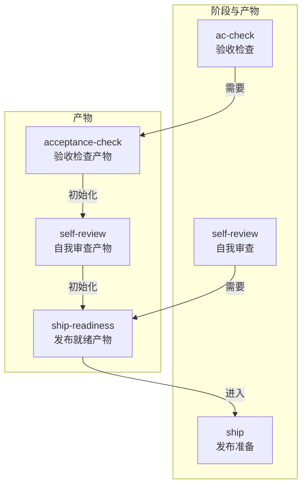
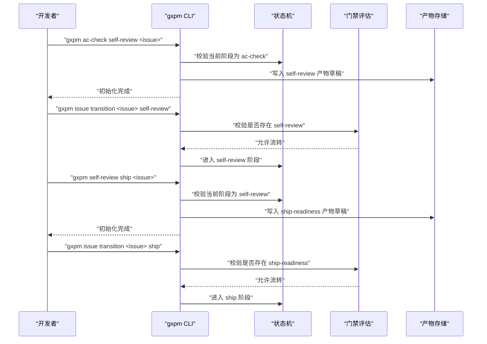
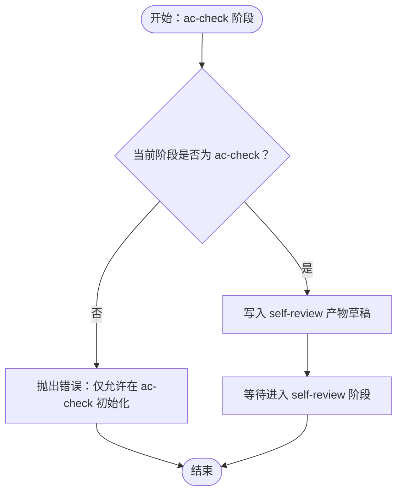
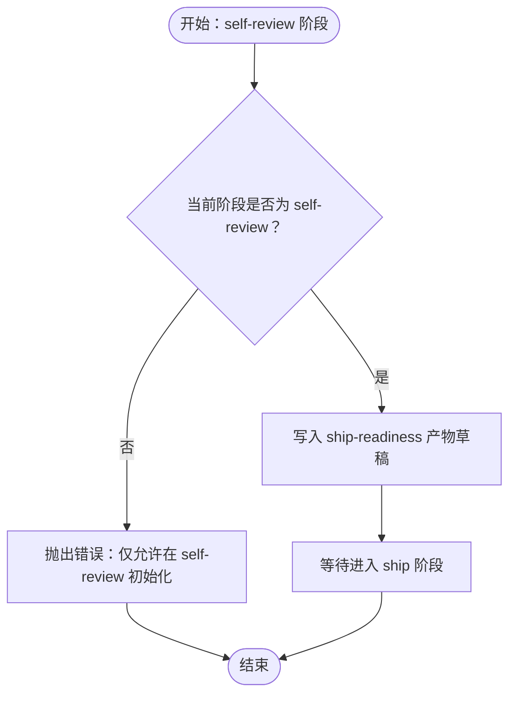
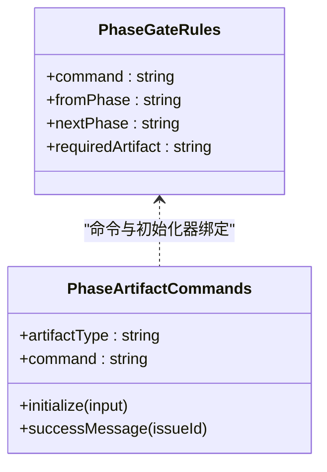
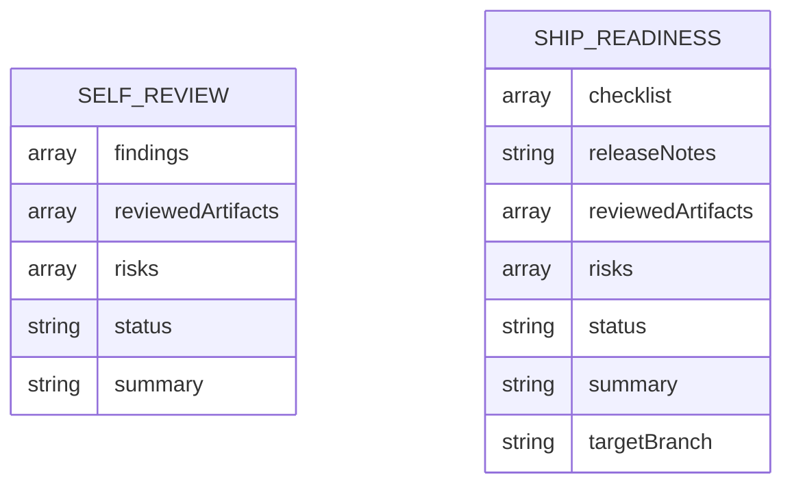
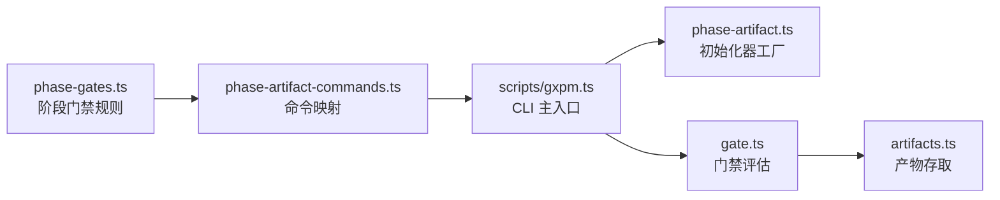

# 自我审查阶段（Self Review）

<cite>
**本文引用的文件**
- [core/self-review.ts](file://core/self-review.ts)
- [core/ship.ts](file://core/ship.ts)
- [core/phase-artifact.ts](file://core/phase-artifact.ts)
- [core/phase-gates.ts](file://core/phase-gates.ts)
- [core/artifacts.ts](file://core/artifacts.ts)
- [core/gate.ts](file://core/gate.ts)
- [scripts/gxpm.ts](file://scripts/gxpm.ts)
- [scripts/phase-artifact-commands.ts](file://scripts/phase-artifact-commands.ts)
- [skills/gxpm/SKILL.md](file://skills/gxpm/SKILL.md)
- [test/self-review-gate.test.ts](file://test/self-review-gate.test.ts)
- [test/ship-gate.test.ts](file://test/ship-gate.test.ts)
- [test/phase-gates.test.ts](file://test/phase-gates.test.ts)
- [docs/governance/development-contract.md](file://docs/governance/development-contract.md)
</cite>

## 目录
1. [简介](#简介)
2. [项目结构](#项目结构)
3. [核心组件](#核心组件)
4. [架构总览](#架构总览)
5. [详细组件分析](#详细组件分析)
6. [依赖关系分析](#依赖关系分析)
7. [性能考量](#性能考量)
8. [故障排查指南](#故障排查指南)
9. [结论](#结论)
10. [附录](#附录)

## 简介
本文件面向 gxpm 的自我审查阶段（Self Review），系统化阐述该阶段的核心职责与目标：在进入发布准备（ship）之前进行内部预审，确保代码质量、验收完成度与风险可控。文档重点覆盖：
- 自我审查阶段的职责与目标
- 产物类型“ship-readiness”的要求与标准
- self-review ship 命令的使用方法与参数说明
- 如何开展全面的自我审查
- 常见陷阱与最佳实践

## 项目结构
围绕自我审查阶段的关键文件组织如下：
- 初始化器与产物定义：core/self-review.ts、core/ship.ts
- 产物初始化器工厂：core/phase-artifact.ts
- 阶段门禁与命令映射：core/phase-gates.ts、scripts/phase-artifact-commands.ts
- 产物存取与类型：core/artifacts.ts
- 门禁评估与状态流转：core/gate.ts、scripts/gxpm.ts
- 使用指引与命令参考：skills/gxpm/SKILL.md
- 测试与一致性校验：test/self-review-gate.test.ts、test/ship-gate.test.ts、test/phase-gates.test.ts
- 治理与生成物规则：docs/governance/development-contract.md

图表来源
- [core/phase-gates.ts:45-74](file://core/phase-gates.ts#L45-L74)
- [core/self-review.ts:3-14](file://core/self-review.ts#L3-L14)
- [core/ship.ts:3-16](file://core/ship.ts#L3-L16)

章节来源
- [core/self-review.ts:1-15](file://core/self-review.ts#L1-L15)
- [core/ship.ts:1-17](file://core/ship.ts#L1-L17)
- [core/phase-artifact.ts:1-33](file://core/phase-artifact.ts#L1-L33)
- [core/phase-gates.ts:1-118](file://core/phase-gates.ts#L1-L118)
- [core/artifacts.ts:1-169](file://core/artifacts.ts#L1-L169)
- [scripts/phase-artifact-commands.ts:1-84](file://scripts/phase-artifact-commands.ts#L1-L84)
- [skills/gxpm/SKILL.md:141-151](file://skills/gxpm/SKILL.md#L141-L151)

## 核心组件
- 自我审查初始化器：在 ac-check 阶段创建 self-review 产物，包含待审产物清单、风险与摘要等字段。
- 发布就绪初始化器：在 self-review 阶段创建 ship-readiness 产物，包含检查清单、发布说明、已审产物、风险与目标分支等字段。
- 阶段门禁规则：定义 ac-check → self-review 与 self-review → ship 的强制产物依赖。
- CLI 与命令映射：通过 phase-artifact-commands 将阶段命令与初始化器绑定，支持交互式初始化与状态流转。

章节来源
- [core/self-review.ts:3-14](file://core/self-review.ts#L3-L14)
- [core/ship.ts:3-16](file://core/ship.ts#L3-L16)
- [core/phase-gates.ts:63-74](file://core/phase-gates.ts#L63-L74)
- [scripts/phase-artifact-commands.ts:46-53](file://scripts/phase-artifact-commands.ts#L46-L53)

## 架构总览
自我审查阶段的控制流与产物依赖如下：

图表来源
- [scripts/gxpm.ts:193-201](file://scripts/gxpm.ts#L193-L201)
- [core/gate.ts:102-130](file://core/gate.ts#L102-L130)
- [core/phase-gates.ts:63-74](file://core/phase-gates.ts#L63-L74)
- [test/self-review-gate.test.ts:62-87](file://test/self-review-gate.test.ts#L62-L87)
- [test/ship-gate.test.ts:64-89](file://test/ship-gate.test.ts#L64-L89)

## 详细组件分析

### 自我审查初始化器（ac-check → self-review）
- 作用：在 ac-check 阶段创建 self-review 产物，作为进入 self-review 阶段的前置条件。
- 关键字段（草稿态）：findings、reviewedArtifacts、risks、status、summary。
- 限制：仅能在 ac-check 阶段初始化，否则抛出错误。
- 产物依赖：self-review 产物的存在是 ac-check → self-review 的必要条件。

图表来源
- [core/self-review.ts:3-14](file://core/self-review.ts#L3-L14)
- [core/phase-artifact.ts:16-32](file://core/phase-artifact.ts#L16-L32)
- [test/self-review-gate.test.ts:11-30](file://test/self-review-gate.test.ts#L11-L30)

章节来源
- [core/self-review.ts:1-15](file://core/self-review.ts#L1-L15)
- [core/phase-artifact.ts:16-32](file://core/phase-artifact.ts#L16-L32)
- [test/self-review-gate.test.ts:11-30](file://test/self-review-gate.test.ts#L11-L30)

### 发布就绪初始化器（self-review → ship）
- 作用：在 self-review 阶段创建 ship-readiness 产物，作为进入 ship 阶段的前置条件。
- 关键字段（草稿态）：checklist、releaseNotes、reviewedArtifacts、risks、status、summary、targetBranch。
- 限制：仅能在 self-review 阶段初始化，否则抛出错误。
- 产物依赖：ship-readiness 产物的存在是 self-review → ship 的必要条件。

图表来源
- [core/ship.ts:3-16](file://core/ship.ts#L3-L16)
- [core/phase-artifact.ts:16-32](file://core/phase-artifact.ts#L16-L32)
- [test/ship-gate.test.ts:11-32](file://test/ship-gate.test.ts#L11-L32)

章节来源
- [core/ship.ts:1-17](file://core/ship.ts#L1-L17)
- [core/phase-artifact.ts:16-32](file://core/phase-artifact.ts#L16-L32)
- [test/ship-gate.test.ts:11-32](file://test/ship-gate.test.ts#L11-L32)

### 阶段门禁与命令映射
- 门禁规则：ac-check → self-review 需要 self-review 产物；self-review → ship 需要 ship-readiness 产物。
- 命令映射：phase-gates.ts 定义了阶段间命令与所需产物；phase-artifact-commands.ts 将命令与初始化器绑定。
- CLI 行为：当缺少所需产物时，pre-push 门禁会阻止推送，并提示相应命令。

图表来源
- [core/phase-gates.ts:25-99](file://core/phase-gates.ts#L25-L99)
- [scripts/phase-artifact-commands.ts:15-76](file://scripts/phase-artifact-commands.ts#L15-L76)

章节来源
- [core/phase-gates.ts:25-99](file://core/phase-gates.ts#L25-L99)
- [scripts/phase-artifact-commands.ts:1-84](file://scripts/phase-artifact-commands.ts#L1-L84)
- [core/gate.ts:102-130](file://core/gate.ts#L102-L130)

### 产物类型与数据模型
- self-review 产物：包含 findings、reviewedArtifacts、risks、status、summary 等字段。
- ship-readiness 产物：包含 checklist、releaseNotes、reviewedArtifacts、risks、status、summary、targetBranch 等字段。
- 产物生命周期：由对应阶段初始化器创建，随后通过 CLI 编辑或写入真实内容，最终在阶段流转时被门禁校验。

图表来源
- [core/self-review.ts:6-12](file://core/self-review.ts#L6-L12)
- [core/ship.ts:6-14](file://core/ship.ts#L6-L14)

章节来源
- [core/artifacts.ts:10-41](file://core/artifacts.ts#L10-L41)
- [core/self-review.ts:1-15](file://core/self-review.ts#L1-L15)
- [core/ship.ts:1-17](file://core/ship.ts#L1-L17)

### self-review ship 命令使用指南
- 命令格式：gxpm self-review ship <issue-id>
- 用途：在 self-review 阶段初始化 ship-readiness 产物，供后续进入 ship 阶段使用。
- 交互流程：
  - 在 self-review 阶段执行命令，初始化 ship-readiness 产物（草稿）。
  - 使用 artifact list/read 查看产物内容。
  - 执行 issue transition <issue-id> ship 完成阶段流转。

章节来源
- [scripts/phase-artifact-commands.ts:50-53](file://scripts/phase-artifact-commands.ts#L50-L53)
- [test/ship-gate.test.ts:64-89](file://test/ship-gate.test.ts#L64-L89)
- [skills/gxpm/SKILL.md:147-151](file://skills/gxpm/SKILL.md#L147-L151)

### 全面自我审查的实施步骤
- 准备阶段
  - 确认已通过 ac-check 与 local-verify，确保验收检查与本地验证已完成。
  - 进入 self-review 阶段，初始化 self-review 产物。
- 内容完善
  - 填写 findings、risks、summary 等字段，确保覆盖关键问题与风险。
  - 在 reviewedArtifacts 中列出已审产物（如 acceptance-check、local-verify）。
- 产物校验
  - 使用 artifact list/read 校验 self-review 产物完整性。
  - 使用 issue next 获取下一步建议。
- 流转准备
  - 初始化 ship-readiness 产物，填写 checklist、releaseNotes、targetBranch 等。
  - 使用 artifact list/read 校验 ship-readiness 产物。
  - 执行 issue transition 进入 ship 阶段。

章节来源
- [skills/gxpm/SKILL.md:141-151](file://skills/gxpm/SKILL.md#L141-L151)
- [test/self-review-gate.test.ts:62-87](file://test/self-review-gate.test.ts#L62-L87)
- [test/ship-gate.test.ts:64-89](file://test/ship-gate.test.ts#L64-L89)

## 依赖关系分析
- 初始化器依赖阶段门禁规则：phase-artifact.ts 工厂函数在初始化时检查当前阶段是否符合 requiredPhase。
- CLI 依赖命令映射：phase-artifact-commands.ts 将阶段命令与初始化器绑定，scripts/gxpm.ts 在解析命令时调用对应初始化器。
- 门禁依赖产物存在性：core/gate.ts 的 pre-push 评估基于 hasArtifact 检查所需产物是否存在。

图表来源
- [core/phase-gates.ts:25-99](file://core/phase-gates.ts#L25-L99)
- [scripts/phase-artifact-commands.ts:1-84](file://scripts/phase-artifact-commands.ts#L1-L84)
- [scripts/gxpm.ts:262-270](file://scripts/gxpm.ts#L262-L270)
- [core/phase-artifact.ts:16-32](file://core/phase-artifact.ts#L16-L32)
- [core/gate.ts:102-130](file://core/gate.ts#L102-L130)
- [core/artifacts.ts:106-125](file://core/artifacts.ts#L106-L125)

章节来源
- [core/phase-gates.ts:1-118](file://core/phase-gates.ts#L1-L118)
- [scripts/phase-artifact-commands.ts:1-84](file://scripts/phase-artifact-commands.ts#L1-L84)
- [scripts/gxpm.ts:262-270](file://scripts/gxpm.ts#L262-L270)
- [core/gate.ts:102-130](file://core/gate.ts#L102-L130)
- [core/artifacts.ts:106-125](file://core/artifacts.ts#L106-L125)

## 性能考量
- 初始化器与门禁评估均为轻量级操作，主要涉及文件系统读写与状态校验，对性能影响可忽略。
- 建议在 CI 或本地钩子中启用门禁，避免在错误阶段反复尝试初始化，减少无效 IO。

## 故障排查指南
- 错误：仅允许在指定阶段初始化
  - 现象：在非 ac-check 或非 self-review 阶段执行初始化命令时报错。
  - 处理：先将状态流转至正确阶段，再执行初始化命令。
  - 参考：phase-artifact.ts 的阶段校验逻辑。
- 错误：缺少所需产物导致阶段流转被阻
  - 现象：执行 issue transition 时提示缺失 required artifact。
  - 处理：先执行对应阶段命令初始化产物，再尝试流转。
  - 参考：gate.ts 的 pre-push 评估与 phase-gates.ts 的门禁规则。
- CLI 使用异常
  - 现象：命令参数错误或输出不符合预期。
  - 处理：使用 issue next 获取下一步建议，或查看 SKILL.md 的命令参考。
  - 参考：scripts/gxpm.ts 的命令解析与输出格式。

章节来源
- [core/phase-artifact.ts:18-23](file://core/phase-artifact.ts#L18-L23)
- [core/gate.ts:120-129](file://core/gate.ts#L120-L129)
- [core/phase-gates.ts:63-74](file://core/phase-gates.ts#L63-L74)
- [scripts/gxpm.ts:193-201](file://scripts/gxpm.ts#L193-L201)
- [skills/gxpm/SKILL.md:141-151](file://skills/gxpm/SKILL.md#L141-L151)

## 结论
自我审查阶段是发布流程中的关键闸门，通过 self-review 与 ship-readiness 产物确保代码与交付物在进入 ship 阶段前达到内部质量标准。遵循阶段门禁、使用 CLI 初始化与校验产物、并在 reviewedArtifacts 中明确列出已审产物，是高质量完成自我审查的关键。配合治理文档与测试用例，可有效降低风险并提升团队协作效率。

## 附录
- 命令参考与使用示例可参阅 SKILL.md 中的“V0 本地命令”与“阶段命令”部分。
- 生成物与治理规则详见 docs/governance/development-contract.md。

章节来源
- [skills/gxpm/SKILL.md:141-151](file://skills/gxpm/SKILL.md#L141-L151)
- [docs/governance/development-contract.md:19-42](file://docs/governance/development-contract.md#L19-L42)