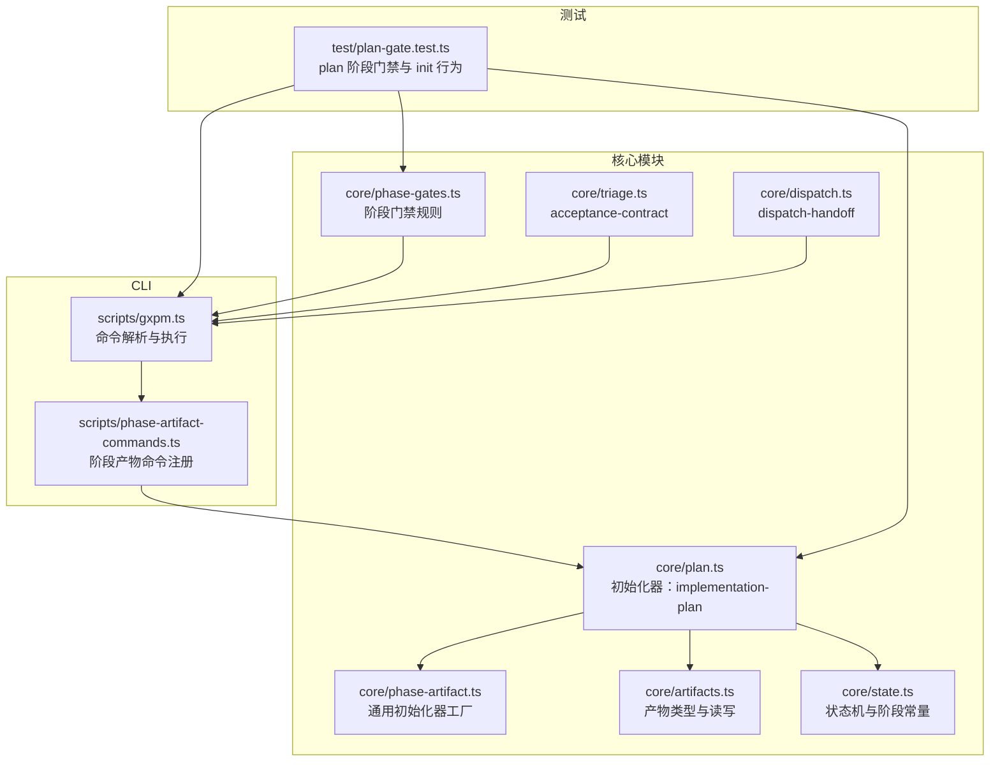
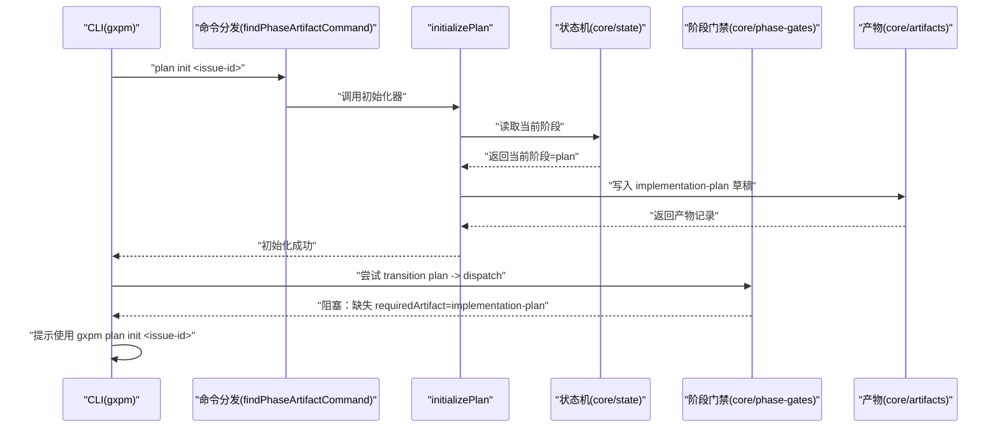
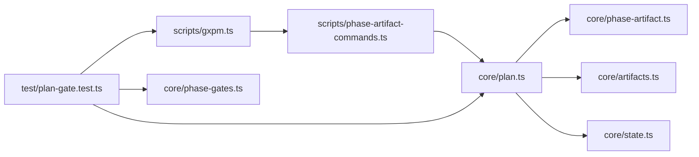

# 计划制定阶段（Plan）

<cite>
**本文引用的文件**
- [core/plan.ts](file://core/plan.ts)
- [core/phase-artifact.ts](file://core/phase-artifact.ts)
- [core/artifacts.ts](file://core/artifacts.ts)
- [core/phase-gates.ts](file://core/phase-gates.ts)
- [scripts/gxpm.ts](file://scripts/gxpm.ts)
- [scripts/phase-artifact-commands.ts](file://scripts/phase-artifact-commands.ts)
- [test/plan-gate.test.ts](file://test/plan-gate.test.ts)
- [core/state.ts](file://core/state.ts)
- [core/triage.ts](file://core/triage.ts)
- [core/dispatch.ts](file://core/dispatch.ts)
- [docs/governance/development-contract.md](file://docs/governance/development-contract.md)
</cite>

## 目录
1. [引言](#引言)
2. [项目结构](#项目结构)
3. [核心组件](#核心组件)
4. [架构总览](#架构总览)
5. [详细组件分析](#详细组件分析)
6. [依赖关系分析](#依赖关系分析)
7. [性能考量](#性能考量)
8. [故障排查指南](#故障排查指南)
9. [结论](#结论)
10. [附录](#附录)

## 引言
本章节面向 gxpm 的“计划制定阶段（Plan）”，系统阐述该阶段的目标、职责与产物要求，并聚焦于“implementation-plan”（实施计划）这一关键产物。文档将解释 plan init 命令的使用方式与参数，说明如何创建一份完整的实施计划，给出常见陷阱与最佳实践，帮助团队在该阶段高质量完成详细规划、资源分配与风险评估。

## 项目结构
围绕“计划制定阶段”的相关代码主要分布在以下模块：
- 初始化器与产物定义：core/plan.ts、core/phase-artifact.ts、core/artifacts.ts
- 阶段门禁规则：core/phase-gates.ts
- CLI 入口与命令分发：scripts/gxpm.ts、scripts/phase-artifact-commands.ts
- 测试与工作流辅助：test/plan-gate.test.ts、test/helpers/workflow.ts
- 状态机与阶段常量：core/state.ts
- 前置阶段与关联产物：core/triage.ts、core/dispatch.ts
- 开发契约与规范：docs/governance/development-contract.md



图表来源
- [core/plan.ts:1-15](file://core/plan.ts#L1-L15)
- [core/phase-artifact.ts:1-33](file://core/phase-artifact.ts#L1-L33)
- [core/artifacts.ts:1-169](file://core/artifacts.ts#L1-L169)
- [core/phase-gates.ts:1-118](file://core/phase-gates.ts#L1-L118)
- [scripts/gxpm.ts:1-611](file://scripts/gxpm.ts#L1-L611)
- [scripts/phase-artifact-commands.ts:1-84](file://scripts/phase-artifact-commands.ts#L1-L84)
- [test/plan-gate.test.ts:1-91](file://test/plan-gate.test.ts#L1-L91)

章节来源
- [core/plan.ts:1-15](file://core/plan.ts#L1-L15)
- [core/phase-artifact.ts:1-33](file://core/phase-artifact.ts#L1-L33)
- [core/artifacts.ts:1-169](file://core/artifacts.ts#L1-L169)
- [core/phase-gates.ts:1-118](file://core/phase-gates.ts#L1-L118)
- [scripts/gxpm.ts:1-611](file://scripts/gxpm.ts#L1-L611)
- [scripts/phase-artifact-commands.ts:1-84](file://scripts/phase-artifact-commands.ts#L1-L84)
- [test/plan-gate.test.ts:1-91](file://test/plan-gate.test.ts#L1-L91)

## 核心组件
- implementation-plan 初始化器：负责在“plan”阶段创建实施计划产物，设置默认草稿字段（如 risks、status、steps、summary、validation），并校验当前阶段是否为“plan”。
- 通用初始化器工厂：createPhaseArtifactInitializer 提供统一的“阶段-产物”初始化模板，封装状态读取、阶段校验与产物写入。
- 产物系统：ARTIFACT_TYPES 明确所有产物类型，writeArtifact/readArtifact/listArtifacts/hasArtifact 提供标准化的读写与索引管理。
- 阶段门禁规则：PHASE_GATE_RULES 将“plan -> dispatch”与 implementation-plan 强绑定，确保在进入下一阶段前必须具备相应产物。
- CLI 命令体系：findPhaseArtifactCommand 将阶段门禁命令映射到具体初始化器，支持 gxpm plan init <issue-id> 等命令。
- 前置与关联：acceptance-contract（triage 阶段）是进入 plan 的前提；dispatch-handoff（dispatch 阶段）会引用 implementation-plan 作为输入之一。

章节来源
- [core/plan.ts:1-15](file://core/plan.ts#L1-L15)
- [core/phase-artifact.ts:1-33](file://core/phase-artifact.ts#L1-L33)
- [core/artifacts.ts:1-169](file://core/artifacts.ts#L1-L169)
- [core/phase-gates.ts:1-118](file://core/phase-gates.ts#L1-L118)
- [scripts/phase-artifact-commands.ts:1-84](file://scripts/phase-artifact-commands.ts#L1-L84)
- [core/triage.ts:1-20](file://core/triage.ts#L1-L20)
- [core/dispatch.ts:1-17](file://core/dispatch.ts#L1-L17)

## 架构总览
下图展示“计划制定阶段”的关键流程：从 issue 创建到 triage 完成后进入 plan，通过 plan init 初始化 implementation-plan，随后 gate 阻断“plan -> dispatch”，直到产物存在后才允许过渡。



图表来源
- [scripts/gxpm.ts:245-253](file://scripts/gxpm.ts#L245-L253)
- [scripts/phase-artifact-commands.ts:78-83](file://scripts/phase-artifact-commands.ts#L78-L83)
- [core/plan.ts:3-14](file://core/plan.ts#L3-L14)
- [core/phase-gates.ts:39-44](file://core/phase-gates.ts#L39-L44)
- [core/artifacts.ts:57-91](file://core/artifacts.ts#L57-L91)
- [core/state.ts:149-200](file://core/state.ts#L149-L200)

## 详细组件分析

### implementation-plan 产物规范
- 产物类型：implementation-plan
- 所属阶段：plan
- 默认草稿字段（示例性描述，具体以实现为准）：
  - risks：风险清单（数组）
  - status：状态（字符串，默认 draft）
  - steps：实施步骤（数组）
  - summary：摘要（字符串）
  - validation：验收验证点（数组）
- 关联门禁：从 plan 过渡到 dispatch 必须存在 implementation-plan。

章节来源
- [core/plan.ts:3-14](file://core/plan.ts#L3-L14)
- [core/artifacts.ts:10-24](file://core/artifacts.ts#L10-L24)
- [core/phase-gates.ts:39-44](file://core/phase-gates.ts#L39-L44)

### 初始化器工厂与 plan 初始化器
- 工厂函数 createPhaseArtifactInitializer 接收配置对象，返回一个闭包用于初始化指定阶段的产物。
- initializePlan 使用工厂，限定 requiredPhase 为 "plan"，并写入默认 payload。
- 初始化器内部会读取当前 issue 状态，若不在 plan 阶段则抛出错误。

```mermaid
classDiagram
class PhaseArtifactInitializer {
+initializePhaseArtifact(input)
}
class PlanInitializer {
+initializePlan(input)
-artifactType = "implementation-plan"
-label = "Plan"
-payload = {risks,status,steps,summary,validation}
-requiredPhase = "plan"
}
PhaseArtifactInitializer <|-- PlanInitializer : "使用工厂创建"
```

图表来源
- [core/phase-artifact.ts:16-32](file://core/phase-artifact.ts#L16-L32)
- [core/plan.ts:3-14](file://core/plan.ts#L3-L14)

章节来源
- [core/phase-artifact.ts:1-33](file://core/phase-artifact.ts#L1-L33)
- [core/plan.ts:1-15](file://core/plan.ts#L1-L15)

### CLI 命令与工作流
- 命令入口：scripts/gxpm.ts 解析命令行参数，识别 phase-artifact 子命令并委托给 findPhaseArtifactCommand。
- 命令注册：scripts/phase-artifact-commands.ts 将 PHASE_GATE_RULES 中的命令与对应初始化器绑定。
- plan init 示例：test/plan-gate.test.ts 展示了从 plan 阶段初始化 implementation-plan 并成功过渡到 dispatch 的完整流程。

章节来源
- [scripts/gxpm.ts:245-253](file://scripts/gxpm.ts#L245-L253)
- [scripts/phase-artifact-commands.ts:72-83](file://scripts/phase-artifact-commands.ts#L72-L83)
- [test/plan-gate.test.ts:64-90](file://test/plan-gate.test.ts#L64-L90)

### 阶段门禁与状态机
- 门禁规则：PHASE_GATE_RULES 定义了“plan -> dispatch”需要 implementation-plan。
- 状态机：core/state.ts 提供 createIssueState、readIssueState、transitionIssuePhase 等能力，transitionIssuePhase 在过渡前调用 assertPhaseGate 校验门禁。
- CLI 辅助：test/helpers/workflow.ts 提供 enterPhase/enterPhaseCli，便于在测试中快速推进到目标阶段。

章节来源
- [core/phase-gates.ts:39-44](file://core/phase-gates.ts#L39-L44)
- [core/state.ts:149-200](file://core/state.ts#L149-L200)
- [test/helpers/workflow.ts:27-59](file://test/helpers/workflow.ts#L27-L59)

### 与其他阶段的关系
- 前置阶段 triage：通过 initializeTriage 创建 acceptance-contract，是进入 plan 的前提。
- 下一阶段 dispatch：initializeDispatch 的 payload 包含 inputArtifacts，其中就包含 "acceptance-contract" 与 "implementation-plan"，体现 plan 阶段产物对后续阶段的重要性。

章节来源
- [core/triage.ts:8-19](file://core/triage.ts#L8-L19)
- [core/dispatch.ts:3-16](file://core/dispatch.ts#L3-L16)

## 依赖关系分析
- initializePlan 依赖：
  - createPhaseArtifactInitializer（工厂）
  - core/artifacts.writeArtifact（写入产物）
  - core/state.readIssueState（阶段校验）
- CLI 依赖：
  - scripts/phase-artifact-commands 将命令与初始化器绑定
  - scripts/gxpm.ts 分发命令并输出提示信息
- 测试依赖：
  - test/plan-gate.test.ts 验证初始化器行为与门禁逻辑
  - test/helpers/workflow.ts 提供工作流辅助



图表来源
- [core/plan.ts:1-15](file://core/plan.ts#L1-L15)
- [core/phase-artifact.ts:1-33](file://core/phase-artifact.ts#L1-L33)
- [core/artifacts.ts:1-169](file://core/artifacts.ts#L1-L169)
- [scripts/phase-artifact-commands.ts:1-84](file://scripts/phase-artifact-commands.ts#L1-L84)
- [scripts/gxpm.ts:1-611](file://scripts/gxpm.ts#L1-L611)
- [test/plan-gate.test.ts:1-91](file://test/plan-gate.test.ts#L1-L91)

章节来源
- [core/plan.ts:1-15](file://core/plan.ts#L1-L15)
- [scripts/phase-artifact-commands.ts:1-84](file://scripts/phase-artifact-commands.ts#L1-L84)
- [scripts/gxpm.ts:1-611](file://scripts/gxpm.ts#L1-L611)
- [test/plan-gate.test.ts:1-91](file://test/plan-gate.test.ts#L1-L91)

## 性能考量
- 初始化器采用一次性写入与索引更新，复杂度近似 O(1) 写操作与 O(n log n) 的索引排序（n 为已存在产物数）。
- CLI 命令解析与命令查找为线性扫描 PHASE_ARTIFACT_COMMANDS，整体开销可忽略。
- 建议在大型仓库中避免在 implementation-plan 中存放超大二进制数据，优先以链接或引用形式指向外部证据。

## 故障排查指南
- 错误：在非 plan 阶段执行 plan init
  - 现象：抛出“只能在 plan 阶段初始化”的错误
  - 处理：先将 issue 推进到 plan 阶段再执行初始化
  - 参考：[core/plan.ts:19-23](file://core/plan.ts#L19-L23)
- 错误：尝试从 plan 直接过渡到 dispatch
  - 现象：被 gate 阻止，提示缺失 implementation-plan
  - 处理：先执行 gxpm plan init <issue-id> 初始化产物，再进行过渡
  - 参考：[core/phase-gates.ts:39-44](file://core/phase-gates.ts#L39-L44)、[test/plan-gate.test.ts:34-62](file://test/plan-gate.test.ts#L34-L62)
- 错误：CLI 参数不正确
  - 现象：命令报错或行为异常
  - 处理：参考 CLI 输出的提示，确保使用正确的子命令与 issue-id
  - 参考：[scripts/gxpm.ts:245-253](file://scripts/gxpm.ts#L245-L253)
- 建议：使用编辑器模式完善产物
  - 使用 gxpm artifact edit <issue-id> <type> 对 implementation-plan 进行交互式编辑
  - 参考：[scripts/gxpm.ts:390-432](file://scripts/gxpm.ts#L390-L432)

章节来源
- [core/plan.ts:19-23](file://core/plan.ts#L19-L23)
- [core/phase-gates.ts:39-44](file://core/phase-gates.ts#L39-L44)
- [test/plan-gate.test.ts:34-62](file://test/plan-gate.test.ts#L34-L62)
- [scripts/gxpm.ts:245-253](file://scripts/gxpm.ts#L245-L253)
- [scripts/gxpm.ts:390-432](file://scripts/gxpm.ts#L390-L432)

## 结论
“计划制定阶段（Plan）”的核心在于产出高质量的 implementation-plan，并以此作为进入 dispatch 的门禁条件。通过统一的初始化器工厂、标准化的产物读写与严格的阶段门禁，gxpm 确保计划阶段的产物完整性与可追溯性。遵循本文提供的命令使用方法、产物规范与最佳实践，可有效降低风险、提升资源分配的准确性与实施路径的可执行性。

## 附录

### plan init 命令使用说明
- 命令格式：gxpm plan init <issue-id>
- 功能：在 plan 阶段初始化 implementation-plan 草稿
- 行为要点：
  - 仅当当前阶段为 plan 时允许初始化
  - 初始化后可在后续步骤中编辑与完善
  - 产物类型为 implementation-plan
- 参考：[scripts/gxpm.ts:245-253](file://scripts/gxpm.ts#L245-L253)、[scripts/phase-artifact-commands.ts:72-76](file://scripts/phase-artifact-commands.ts#L72-L76)、[test/plan-gate.test.ts:73-75](file://test/plan-gate.test.ts#L73-L75)

### 如何创建完整的实施计划
- 步骤建议：
  1) 确保 issue 已创建并处于 plan 阶段
     - 参考：[core/state.ts:86-136](file://core/state.ts#L86-L136)
  2) 执行 gxpm plan init <issue-id> 初始化 implementation-plan
     - 参考：[core/plan.ts:3-14](file://core/plan.ts#L3-L14)
  3) 使用 gxpm artifact edit <issue-id> implementation-plan 编辑草稿
     - 参考：[scripts/gxpm.ts:390-432](file://scripts/gxpm.ts#L390-L432)
  4) 完善 risks、steps、validation 等字段，确保可执行与可验证
  5) 保存并提交后，执行 gxpm issue transition <issue-id> dispatch
     - 参考：[core/phase-gates.ts:39-44](file://core/phase-gates.ts#L39-L44)

### 常见陷阱与最佳实践
- 常见陷阱
  - 在非 plan 阶段执行初始化：会触发阶段校验错误
    - 参考：[core/plan.ts:19-23](file://core/plan.ts#L19-L23)
  - 忽视门禁导致提前过渡：会被 gate 阻止
    - 参考：[core/phase-gates.ts:39-44](file://core/phase-gates.ts#L39-L44)
  - 产物内容不完整：影响后续 dispatch 的输入质量
- 最佳实践
  - 严格遵循开发契约：新增阶段产物初始化器优先使用 createPhaseArtifactInitializer
    - 参考：[docs/governance/development-contract.md:30-41](file://docs/governance/development-contract.md#L30-L41)
  - 使用 CLI 工具链：通过 gxpm artifact list/read/write/edit 管理产物
    - 参考：[scripts/gxpm.ts:186-223](file://scripts/gxpm.ts#L186-L223)
  - 保持产物 schema 清晰：risks、steps、validation 应具体可追踪
  - 与前置阶段衔接：确保 acceptance-contract 已就绪，为 implementation-plan 提供输入