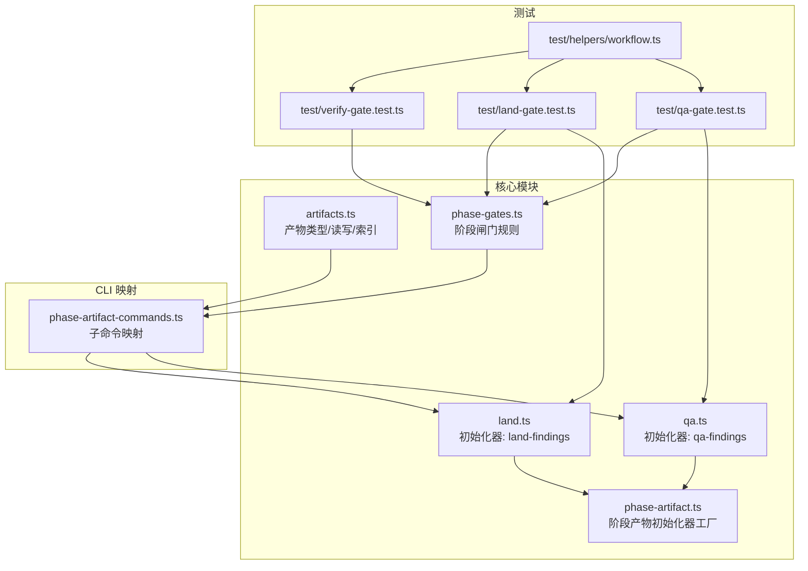
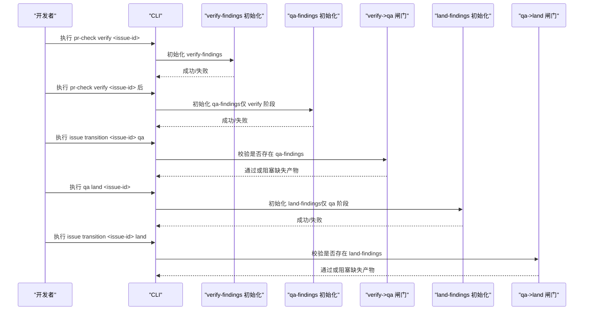
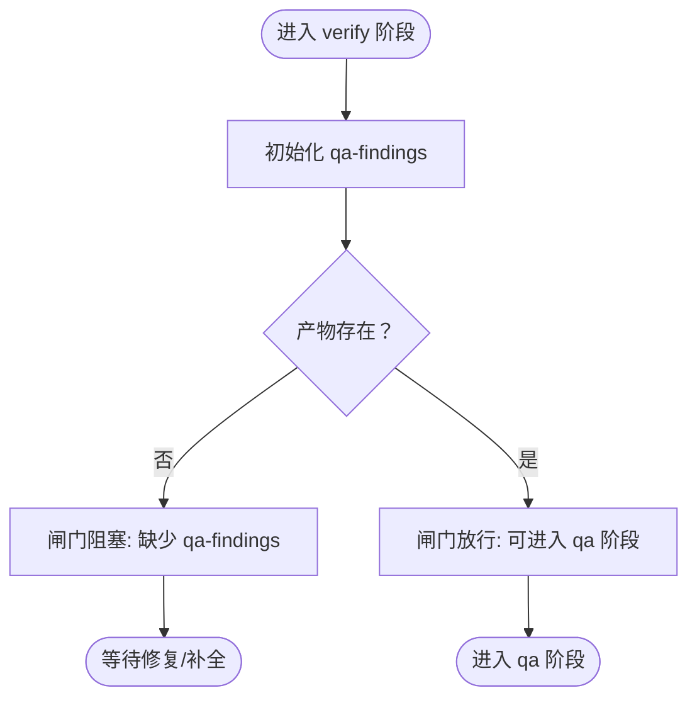
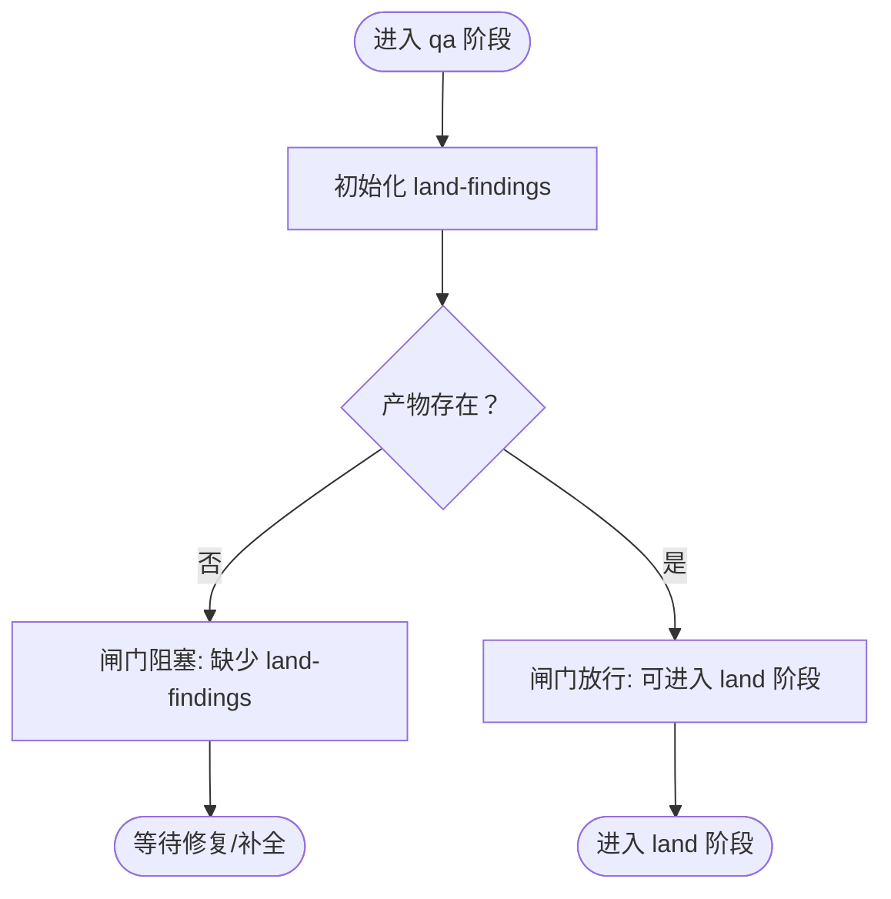
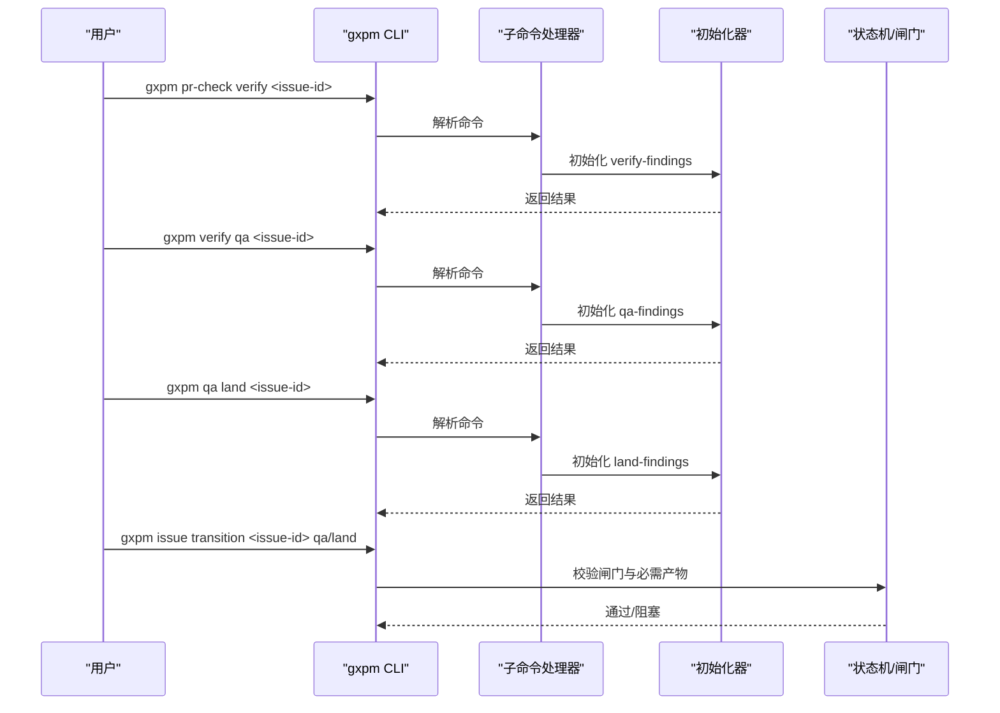
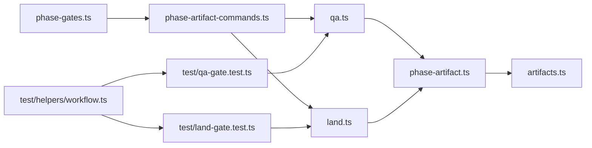

# 质量保证阶段 (QA)

<cite>
**本文引用的文件**
- [core/qa.ts](file://core/qa.ts)
- [core/land.ts](file://core/land.ts)
- [core/phase-artifact.ts](file://core/phase-artifact.ts)
- [core/artifacts.ts](file://core/artifacts.ts)
- [core/phase-gates.ts](file://core/phase-gates.ts)
- [scripts/phase-artifact-commands.ts](file://scripts/phase-artifact-commands.ts)
- [test/qa-gate.test.ts](file://test/qa-gate.test.ts)
- [test/land-gate.test.ts](file://test/land-gate.test.ts)
- [test/verify-gate.test.ts](file://test/verify-gate.test.ts)
- [test/helpers/workflow.ts](file://test/helpers/workflow.ts)
</cite>

## 目录
1. [简介](#简介)
2. [项目结构](#项目结构)
3. [核心组件](#核心组件)
4. [架构总览](#架构总览)
5. [详细组件分析](#详细组件分析)
6. [依赖关系分析](#依赖关系分析)
7. [性能考量](#性能考量)
8. [故障排查指南](#故障排查指南)
9. [结论](#结论)
10. [附录](#附录)

## 简介
本文件面向 gxpm 的质量保证阶段（QA），系统阐述 QA 阶段的核心职责与目标，覆盖系统测试、性能测试与用户体验评估的落地方式；明确 QA 阶段必需的产物“land-findings”的要求与标准；给出 qa land 命令的使用方法与参数说明；并提供全面的质量保证测试流程建议、常见陷阱与最佳实践。

## 项目结构
围绕 QA 阶段的关键文件组织如下：
- 核心初始化器：用于在指定阶段生成 QA 与 Land 的产物
  - [core/qa.ts](file://core/qa.ts)：定义 QA 产物“qa-findings”的初始化器
  - [core/land.ts](file://core/land.ts)：定义 Land 产物“land-findings”的初始化器
- 通用机制：阶段产物初始化器工厂、产物读写、阶段闸门规则
  - [core/phase-artifact.ts](file://core/phase-artifact.ts)：阶段产物初始化器工厂
  - [core/artifacts.ts](file://core/artifacts.ts)：产物类型枚举、读写与索引管理
  - [core/phase-gates.ts](file://core/phase-gates.ts)：阶段闸门规则与命令映射
  - [scripts/phase-artifact-commands.ts](file://scripts/phase-artifact-commands.ts)：CLI 子命令到初始化器的映射
- 测试用例：验证 QA/Land 闸门行为与 CLI 使用
  - [test/qa-gate.test.ts](file://test/qa-gate.test.ts)：QA 阶段闸门与 CLI 行为
  - [test/land-gate.test.ts](file://test/land-gate.test.ts)：Land 阶段闸门与 CLI 行为
  - [test/verify-gate.test.ts](file://test/verify-gate.test.ts)：前置阶段“verify-findings”初始化与闸门
  - [test/helpers/workflow.ts](file://test/helpers/workflow.ts)：测试辅助（CLI 运行、工作流推进）

图表来源
- [core/phase-artifact.ts:1-33](file://core/phase-artifact.ts#L1-L33)
- [core/artifacts.ts:1-169](file://core/artifacts.ts#L1-L169)
- [core/phase-gates.ts:1-118](file://core/phase-gates.ts#L1-L118)
- [core/qa.ts:1-16](file://core/qa.ts#L1-L16)
- [core/land.ts:1-16](file://core/land.ts#L1-L16)
- [scripts/phase-artifact-commands.ts:1-84](file://scripts/phase-artifact-commands.ts#L1-L84)
- [test/qa-gate.test.ts:1-90](file://test/qa-gate.test.ts#L1-L90)
- [test/land-gate.test.ts:1-90](file://test/land-gate.test.ts#L1-L90)
- [test/verify-gate.test.ts:1-90](file://test/verify-gate.test.ts#L1-L90)
- [test/helpers/workflow.ts:1-98](file://test/helpers/workflow.ts#L1-L98)

章节来源
- [core/phase-artifact.ts:1-33](file://core/phase-artifact.ts#L1-L33)
- [core/artifacts.ts:1-169](file://core/artifacts.ts#L1-L169)
- [core/phase-gates.ts:1-118](file://core/phase-gates.ts#L1-L118)
- [scripts/phase-artifact-commands.ts:1-84](file://scripts/phase-artifact-commands.ts#L1-L84)
- [test/qa-gate.test.ts:1-90](file://test/qa-gate.test.ts#L1-L90)
- [test/land-gate.test.ts:1-90](file://test/land-gate.test.ts#L1-L90)
- [test/verify-gate.test.ts:1-90](file://test/verify-gate.test.ts#L1-L90)
- [test/helpers/workflow.ts:1-98](file://test/helpers/workflow.ts#L1-L98)

## 核心组件
- QA 产物“qa-findings”
  - 初始化位置：仅允许在 verify 阶段进行
  - 默认载荷字段：浏览器证据、发现项、风险、状态、摘要、关联的 verify-findings 引用
  - 作用：作为从 verify 到 qa 的闸门产物，确保验证通过后方可进入 QA
- Land 产物“land-findings”
  - 初始化位置：仅允许在 qa 阶段进行
  - 默认载荷字段：是否可上线、合并计划、关联的 qa-findings 引用、发布风险、状态、摘要
  - 作用：作为从 qa 到 land 的闸门产物，确保 QA 完成且风险可控后方可进入 land
- 阶段产物初始化器工厂
  - 校验当前阶段与所需阶段一致，否则抛出错误
  - 写入产物并更新索引与事件记录
- 产物读写与索引
  - 统一的产物类型枚举与校验
  - 写入时生成记录并更新索引，读取时校验存在性
- 阶段闸门规则
  - 定义 verify->qa、qa->land 的必需产物
  - 提供命令模板与反查逻辑，便于 CLI 使用

章节来源
- [core/qa.ts:1-16](file://core/qa.ts#L1-L16)
- [core/land.ts:1-16](file://core/land.ts#L1-L16)
- [core/phase-artifact.ts:1-33](file://core/phase-artifact.ts#L1-L33)
- [core/artifacts.ts:1-169](file://core/artifacts.ts#L1-L169)
- [core/phase-gates.ts:32-99](file://core/phase-gates.ts#L32-L99)

## 架构总览
下图展示 QA 阶段在整体流程中的位置与关键交互：

图表来源
- [core/phase-gates.ts:81-98](file://core/phase-gates.ts#L81-L98)
- [core/qa.ts:1-16](file://core/qa.ts#L1-L16)
- [core/land.ts:1-16](file://core/land.ts#L1-L16)
- [scripts/phase-artifact-commands.ts:58-70](file://scripts/phase-artifact-commands.ts#L58-L70)
- [test/qa-gate.test.ts:63-88](file://test/qa-gate.test.ts#L63-L88)
- [test/land-gate.test.ts:63-88](file://test/land-gate.test.ts#L63-L88)

## 详细组件分析

### QA 产物“qa-findings”
- 初始化约束
  - 仅在 verify 阶段允许初始化
  - 若在其他阶段调用会抛出错误
- 默认载荷要点
  - 状态默认为草稿
  - 关联 verify-findings 的引用
  - 支持后续补充发现项、风险与证据
- 闸门行为
  - 从 verify 到 qa 必须存在 qa-findings
  - 缺失时闸门阻塞并记录事件

图表来源
- [core/phase-artifact.ts:16-32](file://core/phase-artifact.ts#L16-L32)
- [core/phase-gates.ts:87-92](file://core/phase-gates.ts#L87-L92)
- [test/qa-gate.test.ts:11-31](file://test/qa-gate.test.ts#L11-L31)

章节来源
- [core/qa.ts:1-16](file://core/qa.ts#L1-L16)
- [core/phase-artifact.ts:16-32](file://core/phase-artifact.ts#L16-L32)
- [core/phase-gates.ts:87-92](file://core/phase-gates.ts#L87-L92)
- [test/qa-gate.test.ts:11-31](file://test/qa-gate.test.ts#L11-L31)

### Land 产物“land-findings”
- 初始化约束
  - 仅在 qa 阶段允许初始化
  - 若在其他阶段调用会抛出错误
- 默认载荷要点
  - landReady 默认为否
  - 包含 qa-findings 引用与发布风险列表
  - 支持后续补充合并计划与摘要
- 闸门行为
  - 从 qa 到 land 必须存在 land-findings
  - 缺失时闸门阻塞并记录事件

图表来源
- [core/phase-artifact.ts:16-32](file://core/phase-artifact.ts#L16-L32)
- [core/phase-gates.ts:93-98](file://core/phase-gates.ts#L93-L98)
- [test/land-gate.test.ts:11-31](file://test/land-gate.test.ts#L11-L31)

章节来源
- [core/land.ts:1-16](file://core/land.ts#L1-L16)
- [core/phase-artifact.ts:16-32](file://core/phase-artifact.ts#L16-L32)
- [core/phase-gates.ts:93-98](file://core/phase-gates.ts#L93-L98)
- [test/land-gate.test.ts:11-31](file://test/land-gate.test.ts#L11-L31)

### CLI 命令与使用方法
- 初始化命令
  - 初始化 verify-findings：pr-check verify <issue-id>
  - 初始化 qa-findings：verify qa <issue-id>
  - 初始化 land-findings：qa land <issue-id>
- 过渡命令
  - 进入 QA：issue transition <issue-id> qa
  - 进入 Land：issue transition <issue-id> land
- 常见参数
  - issue-id：问题编号，如 GXPM-123
- 使用示例（基于测试）
  - 先在 pr-check 阶段初始化 verify-findings，再在 verify 阶段初始化 qa-findings
  - 在 qa 阶段初始化 land-findings，随后过渡到 land

图表来源
- [scripts/phase-artifact-commands.ts:72-76](file://scripts/phase-artifact-commands.ts#L72-L76)
- [core/phase-gates.ts:81-98](file://core/phase-gates.ts#L81-L98)
- [test/qa-gate.test.ts:63-88](file://test/qa-gate.test.ts#L63-L88)
- [test/land-gate.test.ts:63-88](file://test/land-gate.test.ts#L63-L88)

章节来源
- [scripts/phase-artifact-commands.ts:1-84](file://scripts/phase-artifact-commands.ts#L1-L84)
- [core/phase-gates.ts:81-98](file://core/phase-gates.ts#L81-L98)
- [test/qa-gate.test.ts:63-88](file://test/qa-gate.test.ts#L63-L88)
- [test/land-gate.test.ts:63-88](file://test/land-gate.test.ts#L63-L88)

### QA 阶段测试策略与评估维度
- 系统测试
  - 覆盖 verify-findings 初始化与闸门放行路径
  - 覆盖 qa-findings 初始化与 verify->qa 闸门放行路径
  - 验证在非 verify 阶段初始化 qa-findings 的约束
- 性能测试
  - 针对大型仓库或复杂 PR，评估 verify-findings 生成与 QA 产物初始化的耗时
  - 检查闸门检查与事件记录的开销
- 用户体验评估
  - CLI 输出是否清晰提示缺失产物与正确初始化命令
  - 事件日志是否准确记录闸门阻塞原因

章节来源
- [test/verify-gate.test.ts:1-90](file://test/verify-gate.test.ts#L1-L90)
- [test/qa-gate.test.ts:1-90](file://test/qa-gate.test.ts#L1-L90)
- [test/land-gate.test.ts:1-90](file://test/land-gate.test.ts#L1-L90)

## 依赖关系分析
- 组件耦合
  - 初始化器依赖阶段状态校验与产物写入
  - CLI 子命令映射依赖闸门规则与初始化器
  - 测试依赖工作流辅助推进阶段与读取事件
- 外部依赖
  - 文件系统：产物与索引的持久化
  - CLI 运行环境：Bun spawn 与标准输入输出

图表来源
- [core/phase-gates.ts:32-99](file://core/phase-gates.ts#L32-L99)
- [scripts/phase-artifact-commands.ts:22-76](file://scripts/phase-artifact-commands.ts#L22-L76)
- [core/phase-artifact.ts:16-32](file://core/phase-artifact.ts#L16-L32)
- [core/artifacts.ts:57-91](file://core/artifacts.ts#L57-L91)
- [test/qa-gate.test.ts:1-90](file://test/qa-gate.test.ts#L1-L90)
- [test/land-gate.test.ts:1-90](file://test/land-gate.test.ts#L1-L90)
- [test/helpers/workflow.ts:1-98](file://test/helpers/workflow.ts#L1-L98)

章节来源
- [core/phase-gates.ts:32-99](file://core/phase-gates.ts#L32-L99)
- [scripts/phase-artifact-commands.ts:22-76](file://scripts/phase-artifact-commands.ts#L22-L76)
- [core/phase-artifact.ts:16-32](file://core/phase-artifact.ts#L16-L32)
- [core/artifacts.ts:57-91](file://core/artifacts.ts#L57-L91)
- [test/qa-gate.test.ts:1-90](file://test/qa-gate.test.ts#L1-L90)
- [test/land-gate.test.ts:1-90](file://test/land-gate.test.ts#L1-L90)
- [test/helpers/workflow.ts:1-98](file://test/helpers/workflow.ts#L1-L98)

## 性能考量
- 产物写入与索引更新
  - 单次写入包含文件写入与索引重建，建议批量操作时合并多次写入
- 事件记录
  - 每次写入都会追加事件，大量小步提交可能增加事件文件体积
- 闸门检查
  - 读取索引与事件进行校验，避免在热路径中频繁触发

## 故障排查指南
- 初始化时报错“只能在特定阶段初始化”
  - 检查当前阶段是否为目标阶段
  - 参考命令：先在前置阶段完成对应产物初始化
- 过渡时报错“缺少必需产物”
  - 确认目标阶段的必需产物已初始化
  - 使用 artifact list 查看当前产物清单
- CLI 输出不明确
  - 使用 artifact read 检查产物载荷
  - 参考测试用例中的命令组合，确保顺序正确

章节来源
- [test/qa-gate.test.ts:33-61](file://test/qa-gate.test.ts#L33-L61)
- [test/land-gate.test.ts:33-61](file://test/land-gate.test.ts#L33-L61)
- [test/helpers/workflow.ts:10-35](file://test/helpers/workflow.ts#L10-L35)

## 结论
QA 阶段通过“qa-findings”与“land-findings”两个关键产物串联 verify->qa->land 的流程，借助阶段闸门确保质量门槛。结合系统测试、性能测试与用户体验评估，可形成闭环的质量保障体系。遵循阶段约束与 CLI 命令顺序，是顺利推进到 land 的关键。

## 附录

### QA 阶段必需产物“land-findings”的要求与标准
- 初始化阶段：仅可在 qa 阶段初始化
- 必备字段（默认值）
  - landReady：false
  - mergePlan：空字符串
  - qaFindingsArtifact：指向 qa-findings
  - releaseRisks：空数组
  - status：draft
  - summary：空字符串
- 产出用途
  - 作为 qa->land 的闸门产物，确保上线前的可交付性与风险可控

章节来源
- [core/land.ts:3-15](file://core/land.ts#L3-L15)
- [core/phase-artifact.ts:16-32](file://core/phase-artifact.ts#L16-L32)
- [core/phase-gates.ts:93-98](file://core/phase-gates.ts#L93-L98)

### QA land 命令使用方法与参数说明
- 初始化命令
  - 初始化 land-findings：qa land <issue-id>
- 过渡命令
  - 进入 land：issue transition <issue-id> land
- 参数
  - issue-id：问题编号（如 GXPM-123）

章节来源
- [scripts/phase-artifact-commands.ts:66-70](file://scripts/phase-artifact-commands.ts#L66-L70)
- [core/phase-gates.ts:93-98](file://core/phase-gates.ts#L93-L98)
- [test/land-gate.test.ts:63-88](file://test/land-gate.test.ts#L63-L88)

### 常见陷阱与最佳实践
- 陷阱
  - 在错误阶段初始化 QA/Land 产物导致初始化失败
  - 忽略前置阶段产物，直接尝试过渡到 QA 或 Land
  - 未补充必要字段（如风险、摘要）即提交
- 最佳实践
  - 严格按阶段顺序推进，先完成 verify-findings，再初始化 qa-findings，最后初始化 land-findings
  - 使用 artifact list 与 artifact read 校验产物状态
  - 在 CI 中加入闸门检查与产物完整性校验

章节来源
- [test/verify-gate.test.ts:11-31](file://test/verify-gate.test.ts#L11-L31)
- [test/qa-gate.test.ts:11-31](file://test/qa-gate.test.ts#L11-L31)
- [test/land-gate.test.ts:11-31](file://test/land-gate.test.ts#L11-L31)