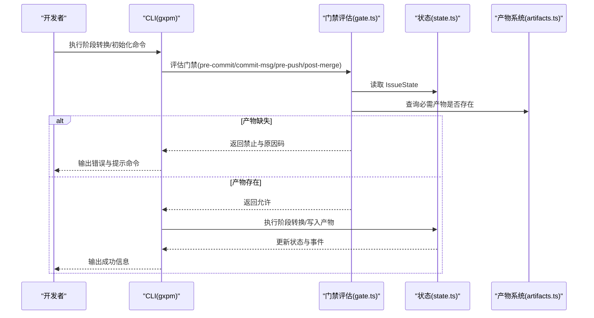
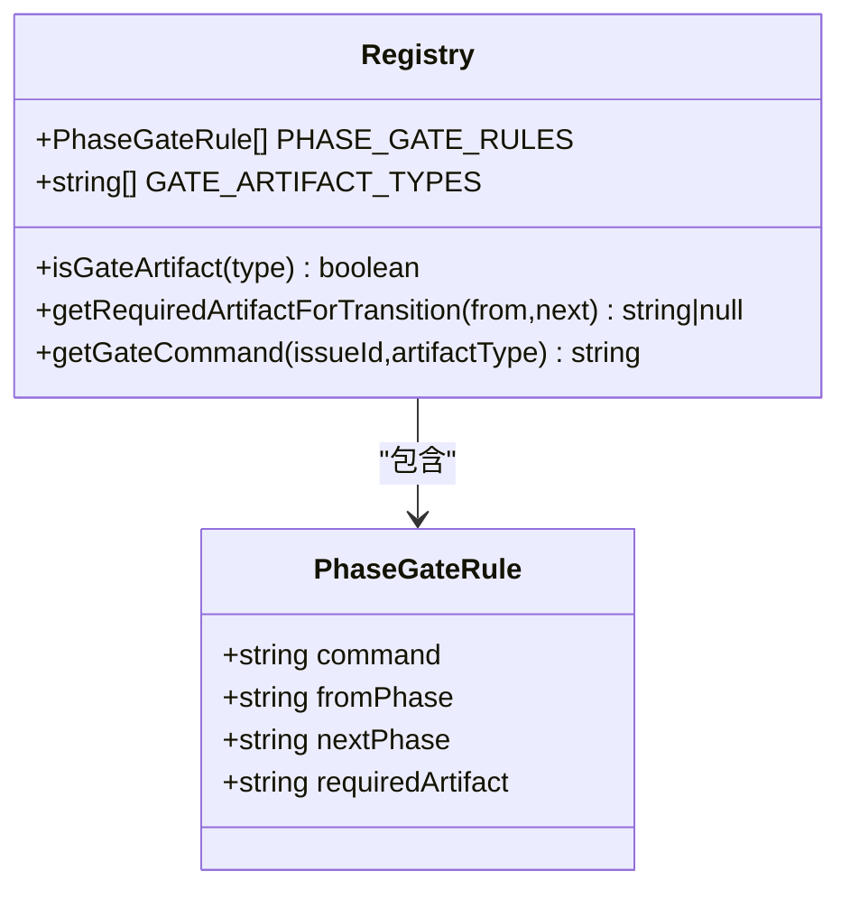
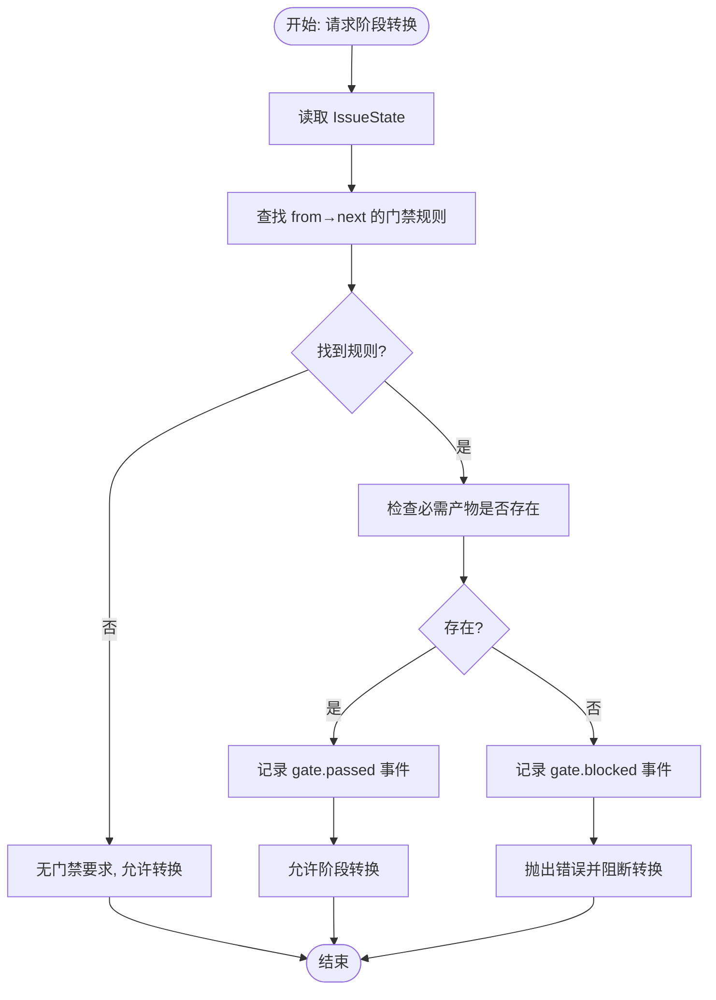
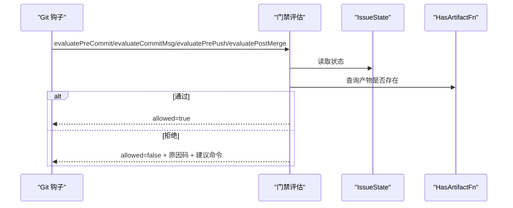
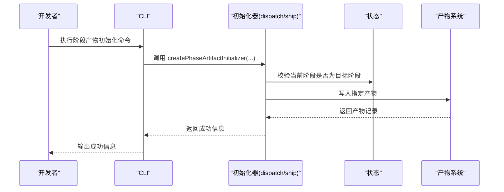
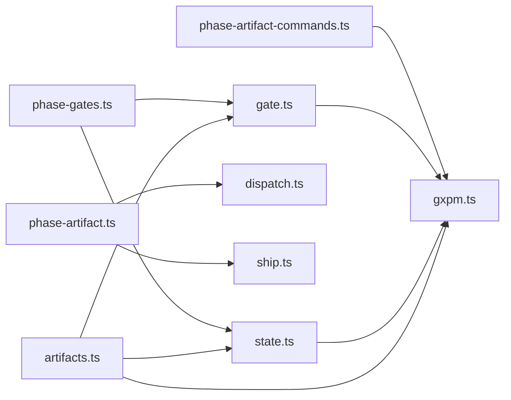

# 门禁规则和验证机制

<cite>
**本文引用的文件**
- [core/phase-gates.ts](file://core/phase-gates.ts)
- [core/gate.ts](file://core/gate.ts)
- [core/state.ts](file://core/state.ts)
- [core/artifacts.ts](file://core/artifacts.ts)
- [core/phase-artifact.ts](file://core/phase-artifact.ts)
- [core/dispatch.ts](file://core/dispatch.ts)
- [core/ship.ts](file://core/ship.ts)
- [scripts/phase-artifact-commands.ts](file://scripts/phase-artifact-commands.ts)
- [scripts/gxpm.ts](file://scripts/gxpm.ts)
- [test/phase-gates.test.ts](file://test/phase-gates.test.ts)
- [test/gate.test.ts](file://test/gate.test.ts)
- [test/dispatch-gate.test.ts](file://test/dispatch-gate.test.ts)
- [test/ship-gate.test.ts](file://test/ship-gate.test.ts)
- [docs/governance/development-contract.md](file://docs/governance/development-contract.md)
</cite>

## 目录
1. [简介](#简介)
2. [项目结构](#项目结构)
3. [核心组件](#核心组件)
4. [架构总览](#架构总览)
5. [详细组件分析](#详细组件分析)
6. [依赖关系分析](#依赖关系分析)
7. [性能考量](#性能考量)
8. [故障排查指南](#故障排查指南)
9. [结论](#结论)
10. [附录](#附录)

## 简介
本文件系统性阐述 gxpm 的门禁规则与验证机制，覆盖以下关键点：
- 门禁系统的核心原理：通过“阶段-产物”门禁规则强制工作流按序推进，并在关键节点进行合规性校验。
- PhaseGateRule 接口的结构与字段含义：定义了从某阶段到下一阶段所需的“命令、来源阶段、目标阶段、必需产物类型”。
- 阶段转换的验证规则与失败处理：包括状态读取、阶段合法性、产物存在性、事件记录与错误抛出。
- 门禁检查的完整流程与错误处理策略：涵盖 pre-commit、commit-msg、pre-push、post-merge 四类钩子的判定逻辑与提示信息。
- 扩展方法与自定义规则配置：如何新增阶段门禁、绑定 CLI 命令、初始化阶段产物。

## 项目结构
围绕门禁与验证的关键文件组织如下：
- 规则与注册：core/phase-gates.ts 定义阶段门禁规则、受保护路径模式、产物类型集合与查询函数。
- 验证器：core/gate.ts 提供四类门禁评估函数（预提交、提交消息、推送前、合并后）与门禁结果类型。
- 状态机与门禁断言：core/state.ts 实现 Issue 状态管理与阶段转换断言，内含 assertPhaseGate 用于强制检查必需产物。
- 产物系统：core/artifacts.ts 提供产物的读写、索引与存在性判断。
- 阶段产物初始化器：core/phase-artifact.ts 抽象统一的阶段产物初始化器工厂；具体阶段如 dispatch、ship 的初始化器位于各自文件。
- CLI 与命令绑定：scripts/gxpm.ts 将门禁评估与阶段产物命令接入 CLI；scripts/phase-artifact-commands.ts 将规则映射为可执行命令。
- 测试与契约：test/*.test.ts 验证规则一致性、门禁行为与 CLI 行为；docs/governance/development-contract.md 规范新增门禁与初始化器的开发流程。

```mermaid
graph TB
subgraph "规则与注册"
PG["core/phase-gates.ts"]
PAC["scripts/phase-artifact-commands.ts"]
end
subgraph "验证器"
G["core/gate.ts"]
S["core/state.ts"]
A["core/artifacts.ts"]
end
subgraph "阶段产物初始化器"
PA["core/phase-artifact.ts"]
D["core/dispatch.ts"]
SH["core/ship.ts"]
end
subgraph "CLI"
CLI["scripts/gxpm.ts"]
end
PG --> G
PG --> S
PG --> PAC
PAC --> CLI
A --> G
A --> S
PA --> D
PA --> SH
CLI --> G
CLI --> S
CLI --> A
```

图表来源
- [core/phase-gates.ts:1-118](file://core/phase-gates.ts#L1-L118)
- [core/gate.ts:1-144](file://core/gate.ts#L1-L144)
- [core/state.ts:1-303](file://core/state.ts#L1-L303)
- [core/artifacts.ts:1-169](file://core/artifacts.ts#L1-L169)
- [core/phase-artifact.ts:1-33](file://core/phase-artifact.ts#L1-L33)
- [core/dispatch.ts:1-17](file://core/dispatch.ts#L1-L17)
- [core/ship.ts:1-17](file://core/ship.ts#L1-L17)
- [scripts/phase-artifact-commands.ts:1-84](file://scripts/phase-artifact-commands.ts#L1-L84)
- [scripts/gxpm.ts:600-699](file://scripts/gxpm.ts#L600-L699)

章节来源
- [core/phase-gates.ts:1-118](file://core/phase-gates.ts#L1-L118)
- [core/gate.ts:1-144](file://core/gate.ts#L1-L144)
- [core/state.ts:1-303](file://core/state.ts#L1-L303)
- [core/artifacts.ts:1-169](file://core/artifacts.ts#L1-L169)
- [core/phase-artifact.ts:1-33](file://core/phase-artifact.ts#L1-L33)
- [core/dispatch.ts:1-17](file://core/dispatch.ts#L1-L17)
- [core/ship.ts:1-17](file://core/ship.ts#L1-L17)
- [scripts/phase-artifact-commands.ts:1-84](file://scripts/phase-artifact-commands.ts#L1-L84)
- [scripts/gxpm.ts:600-699](file://scripts/gxpm.ts#L600-L699)

## 核心组件
- 阶段门禁规则注册表：PHASE_GATE_RULES 列举所有“来源阶段→目标阶段”的门禁链路，每条规则包含命令模板、来源阶段、目标阶段与必需产物类型。
- 门禁类型与结果：GateType 定义门禁钩子类型；GateVerdict 描述允许与否、原因码与附加细节；PostMergeOutcome 描述合并后的自动阶段转换意图。
- 阶段状态与断言：IssueState 记录当前阶段、历史与产物根目录；transitionIssuePhase 在推进阶段前调用 assertPhaseGate 强制检查必需产物是否存在。
- 产物系统：ARTIFACT_TYPES 定义所有产物类型；writeArtifact/readArtifact/listArtifacts/hasArtifact 提供产物生命周期管理与存在性判断。
- 阶段产物初始化器：createPhaseArtifactInitializer 统一生成“仅限特定阶段可初始化、写入指定产物”的初始化器，避免重复样板代码。

章节来源
- [core/phase-gates.ts:25-118](file://core/phase-gates.ts#L25-L118)
- [core/gate.ts:8-32](file://core/gate.ts#L8-L32)
- [core/state.ts:28-57](file://core/state.ts#L28-L57)
- [core/artifacts.ts:10-91](file://core/artifacts.ts#L10-L91)
- [core/phase-artifact.ts:16-32](file://core/phase-artifact.ts#L16-L32)

## 架构总览
门禁系统围绕“规则驱动的阶段转换 + 产物强制校验”展开，整体流程如下：
- 规则层：PHASE_GATE_RULES 明确阶段间转换的“必需产物类型”。
- 验证层：gate.ts 的评估函数在不同 Git 钩子时机进行校验。
- 状态层：state.ts 的 assertPhaseGate 在执行阶段转换前强制检查产物。
- 初始化层：phase-artifact.ts 工厂与各阶段初始化器确保产物按规范生成。
- CLI 层：scripts/gxpm.ts 将门禁评估与阶段产物命令暴露为可执行入口。



图表来源
- [core/gate.ts:48-144](file://core/gate.ts#L48-L144)
- [core/state.ts:150-205](file://core/state.ts#L150-L205)
- [core/artifacts.ts:57-91](file://core/artifacts.ts#L57-L91)
- [scripts/gxpm.ts:600-699](file://scripts/gxpm.ts#L600-L699)

## 详细组件分析

### PhaseGateRule 接口与规则注册
- 字段说明
  - command：阶段转换前需执行的 CLI 命令模板，其中 <issue-id> 会被实际工单号替换。
  - fromPhase：来源阶段，即当前所处阶段。
  - nextPhase：目标阶段，即下一步期望进入的阶段。
  - requiredArtifact：从 fromPhase 过渡到 nextPhase 所必需的产物类型。
- 规则一致性与命令映射
  - PHASE_GATE_RULES 与 PHASE_ARTIFACT_COMMANDS 保持严格一致，保证 CLI 命令与门禁规则一一对应。
  - isGateArtifact 用于区分“仅用于门禁”的产物类型与其它非门禁产物类型。



图表来源
- [core/phase-gates.ts:25-118](file://core/phase-gates.ts#L25-L118)

章节来源
- [core/phase-gates.ts:25-118](file://core/phase-gates.ts#L25-L118)
- [test/phase-gates.test.ts:84-116](file://test/phase-gates.test.ts#L84-L116)
- [scripts/phase-artifact-commands.ts:72-76](file://scripts/phase-artifact-commands.ts#L72-L76)

### 阶段转换的验证规则与失败处理
- 转换断言逻辑
  - transitionIssuePhase 在推进阶段前调用 assertPhaseGate。
  - assertPhaseGate 依据 fromPhase 与 nextPhase 查找所需产物类型，若产物不存在则记录 gate.blocked 事件并抛出错误，阻止阶段转换。
- 错误处理策略
  - 错误消息包含缺失产物类型与建议运行的命令，便于快速修复。
  - 事件日志记录 gate.blocked 与 gate.passed，便于审计与回溯。



图表来源
- [core/state.ts:150-205](file://core/state.ts#L150-L205)
- [core/state.ts:253-302](file://core/state.ts#L253-L302)
- [core/phase-gates.ts:107-112](file://core/phase-gates.ts#L107-L112)

章节来源
- [core/state.ts:150-205](file://core/state.ts#L150-L205)
- [core/state.ts:253-302](file://core/state.ts#L253-L302)

### 门禁检查的完整流程与错误处理策略
- 预提交门禁（pre-commit）
  - 若处于受保护路径变更且当前阶段不允许代码提交，则拒绝；否则放行。
  - 受保护路径由 PROTECTED_PATH_PATTERNS 定义。
- 提交消息门禁（commit-msg）
  - 提交消息必须包含 GXG-NNN 或 GXPM-NNN 引用；否则拒绝。
- 推送前门禁（pre-push）
  - 若当前阶段存在门禁规则且必需产物缺失，则拒绝；否则放行。
  - 拒绝时输出建议命令，帮助用户快速补齐产物。
- 合并后门禁（post-merge）
  - 当从 qa 合并后自动转入 land；若已处于 land 或非触发阶段则无动作。



图表来源
- [core/gate.ts:48-144](file://core/gate.ts#L48-L144)
- [core/state.ts:139-148](file://core/state.ts#L139-L148)
- [core/artifacts.ts:120-125](file://core/artifacts.ts#L120-L125)

章节来源
- [core/gate.ts:48-144](file://core/gate.ts#L48-L144)
- [test/gate.test.ts:21-127](file://test/gate.test.ts#L21-L127)

### 阶段产物初始化器与阶段转换示例
- 初始化器工厂
  - createPhaseArtifactInitializer 统一实现“仅在指定阶段初始化、写入产物”的逻辑。
- 示例：dispatch 与 ship 阶段
  - dispatch：仅在 dispatch 阶段可初始化 dispatch-handoff 产物；缺少该产物时，从 dispatch 转换至 implement 将被门禁阻止。
  - ship：仅在 self-review 阶段可初始化 ship-readiness 产物；缺少该产物时，从 self-review 转换至 ship 将被门禁阻止。



图表来源
- [core/phase-artifact.ts:16-32](file://core/phase-artifact.ts#L16-L32)
- [core/dispatch.ts:3-16](file://core/dispatch.ts#L3-L16)
- [core/ship.ts:1-17](file://core/ship.ts#L1-L17)
- [test/dispatch-gate.test.ts:10-91](file://test/dispatch-gate.test.ts#L10-L91)
- [test/ship-gate.test.ts:10-91](file://test/ship-gate.test.ts#L10-L91)

章节来源
- [core/phase-artifact.ts:16-32](file://core/phase-artifact.ts#L16-L32)
- [core/dispatch.ts:3-16](file://core/dispatch.ts#L3-L16)
- [core/ship.ts:1-17](file://core/ship.ts#L1-L17)
- [test/dispatch-gate.test.ts:10-91](file://test/dispatch-gate.test.ts#L10-L91)
- [test/ship-gate.test.ts:10-91](file://test/ship-gate.test.ts#L10-L91)

### CLI 集成与命令绑定
- 门禁评估 CLI
  - gxpm gate pre-commit/commit-msg/pre-push/post-merge 分别对接 gate.ts 的评估函数。
  - pre-push 会根据规则输出建议命令，帮助用户快速补齐产物。
- 阶段产物命令
  - scripts/phase-artifact-commands.ts 将 PHASE_GATE_RULES 映射为可执行命令，绑定初始化器与成功消息。
  - CLI 调用时若缺少 issueId 或命令未知，会给出明确错误提示。

章节来源
- [scripts/gxpm.ts:234-273](file://scripts/gxpm.ts#L234-L273)
- [scripts/gxpm.ts:600-699](file://scripts/gxpm.ts#L600-L699)
- [scripts/phase-artifact-commands.ts:72-83](file://scripts/phase-artifact-commands.ts#L72-L83)
- [test/gate-cli.test.ts:8-42](file://test/gate-cli.test.ts#L8-L42)

## 依赖关系分析
- 规则与验证
  - gate.ts 依赖 phase-gates.ts 的规则与受保护路径；依赖 artifacts.ts 的产物存在性判断。
- 状态与门禁
  - state.ts 的 assertPhaseGate 依赖 phase-gates.ts 的规则查询与 CLI 命令生成；同时写入事件日志。
- 初始化器与规则
  - phase-artifact.ts 的工厂与具体阶段初始化器（如 dispatch、ship）共同构成“规则→产物”的闭环。
- CLI 与系统
  - gxpm.ts 将门禁评估与阶段产物命令串联，形成端到端的门禁体验。



图表来源
- [core/phase-gates.ts:1-118](file://core/phase-gates.ts#L1-L118)
- [core/gate.ts:1-144](file://core/gate.ts#L1-L144)
- [core/state.ts:1-303](file://core/state.ts#L1-L303)
- [core/artifacts.ts:1-169](file://core/artifacts.ts#L1-L169)
- [core/phase-artifact.ts:1-33](file://core/phase-artifact.ts#L1-L33)
- [core/dispatch.ts:1-17](file://core/dispatch.ts#L1-L17)
- [core/ship.ts:1-17](file://core/ship.ts#L1-L17)
- [scripts/phase-artifact-commands.ts:1-84](file://scripts/phase-artifact-commands.ts#L1-L84)
- [scripts/gxpm.ts:600-699](file://scripts/gxpm.ts#L600-L699)

章节来源
- [core/phase-gates.ts:1-118](file://core/phase-gates.ts#L1-L118)
- [core/gate.ts:1-144](file://core/gate.ts#L1-L144)
- [core/state.ts:1-303](file://core/state.ts#L1-L303)
- [core/artifacts.ts:1-169](file://core/artifacts.ts#L1-L169)
- [core/phase-artifact.ts:1-33](file://core/phase-artifact.ts#L1-L33)
- [core/dispatch.ts:1-17](file://core/dispatch.ts#L1-L17)
- [core/ship.ts:1-17](file://core/ship.ts#L1-L17)
- [scripts/phase-artifact-commands.ts:1-84](file://scripts/phase-artifact-commands.ts#L1-L84)
- [scripts/gxpm.ts:600-699](file://scripts/gxpm.ts#L600-L699)

## 性能考量
- 门禁评估复杂度
  - 预提交与提交消息评估为 O(n)（n 为受保护路径数量），通常 n 很小，开销可忽略。
  - 推送前评估为 O(m)（m 为当前阶段对应的门禁规则数，通常 m≈1），查找规则与检查产物均为常量时间。
- I/O 与事件
  - assertPhaseGate 与产物写入均涉及文件系统操作，建议在 CI 环境中尽量减少频繁切换阶段与写入产物，以降低磁盘压力。
- 缓存与短路
  - GXPM_GATE_DISABLE 环境变量可全局绕过门禁，适用于调试场景；生产环境应避免开启。

## 故障排查指南
- 常见错误码与定位
  - wrong-phase：当前阶段不允许对受保护路径进行代码提交。
  - missing-issue-ref：提交消息未包含 GXG-NNN 或 GXPM-NNN。
  - missing-artifact：从当前阶段向下一阶段转换时缺少必需产物。
  - no-state：当前目录未跟踪该工单，门禁评估无法进行。
- 定位步骤
  - 使用 gxpm issue status <issue-id> 查看当前阶段与产物列表。
  - 使用 gxpm artifact list <issue-id> 确认必需产物是否存在。
  - 根据错误提示运行建议命令初始化产物。
  - 如需临时绕过门禁进行调试，设置 GXPM_GATE_DISABLE=1（不推荐长期使用）。
- 事件审计
  - 查看事件日志 events.jsonl 中的 gate.blocked 与 gate.passed 条目，确认门禁决策轨迹。

章节来源
- [core/gate.ts:10-27](file://core/gate.ts#L10-L27)
- [core/state.ts:253-302](file://core/state.ts#L253-L302)
- [test/gate.test.ts:21-127](file://test/gate.test.ts#L21-L127)

## 结论
gxpm 的门禁系统通过“规则驱动的阶段转换 + 产物强制校验”实现了严格的流程治理。PhaseGateRule 明确了阶段间的必需产物，gate.ts 的评估函数在多个 Git 钩子时机进行拦截，state.ts 的断言确保转换前的合规性，artifacts.ts 提供完整的产物生命周期管理。CLI 与初始化器工厂进一步降低了使用门槛，使团队能够在不依赖外部系统的情况下完成端到端的门禁流程。

## 附录

### PhaseGateRule 字段详解
- command：阶段转换前需执行的 CLI 命令模板，用于生成“建议命令”提示。
- fromPhase：来源阶段，即当前所处阶段。
- nextPhase：目标阶段，即下一步期望进入的阶段。
- requiredArtifact：从 fromPhase 过渡到 nextPhase 所必需的产物类型。

章节来源
- [core/phase-gates.ts:25-30](file://core/phase-gates.ts#L25-L30)

### 开发与扩展最佳实践
- 新增阶段门禁
  - 在 core/phase-gates.ts 中添加一条新的 PhaseGateRule。
  - 在 scripts/phase-artifact-commands.ts 中绑定初始化器与成功消息。
  - 编写对应 gate 与 artifact 的测试，确保 CLI 命令顺序与规则一致。
- 初始化器规范
  - 优先使用 createPhaseArtifactInitializer，避免重复样板代码。
  - 初始化器仅在 requiredPhase 可用，写入指定 payload。
- 文档与契约
  - 遵循 docs/governance/development-contract.md 的开发契约，确保新增门禁与初始化器的一致性与可维护性。

章节来源
- [docs/governance/development-contract.md:30-41](file://docs/governance/development-contract.md#L30-L41)
- [core/phase-artifact.ts:16-32](file://core/phase-artifact.ts#L16-L32)
- [scripts/phase-artifact-commands.ts:22-76](file://scripts/phase-artifact-commands.ts#L22-L76)
- [test/phase-gates.test.ts:84-116](file://test/phase-gates.test.ts#L84-L116)