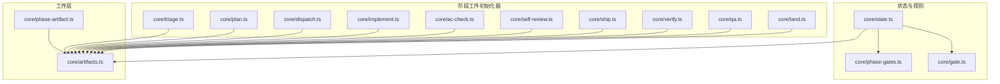
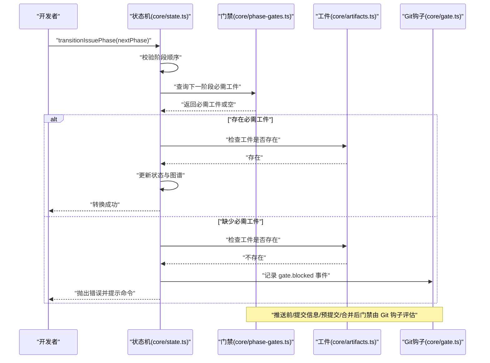
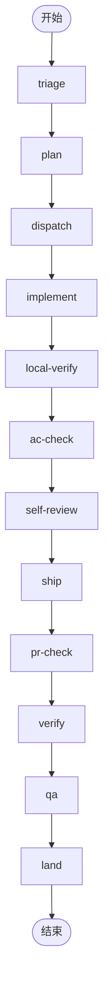
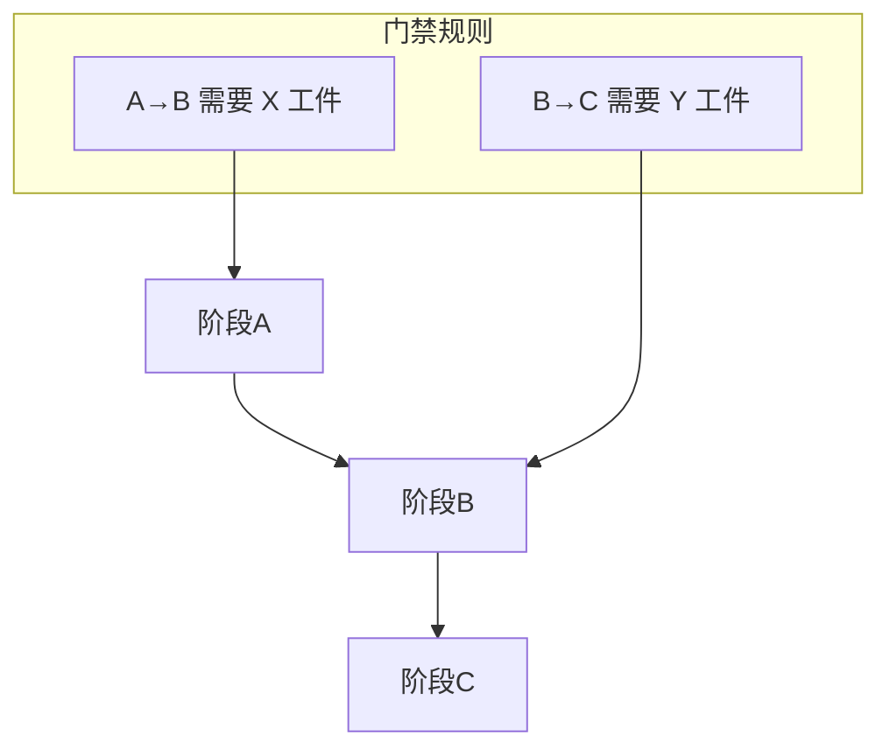
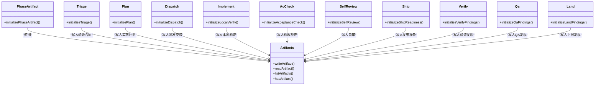
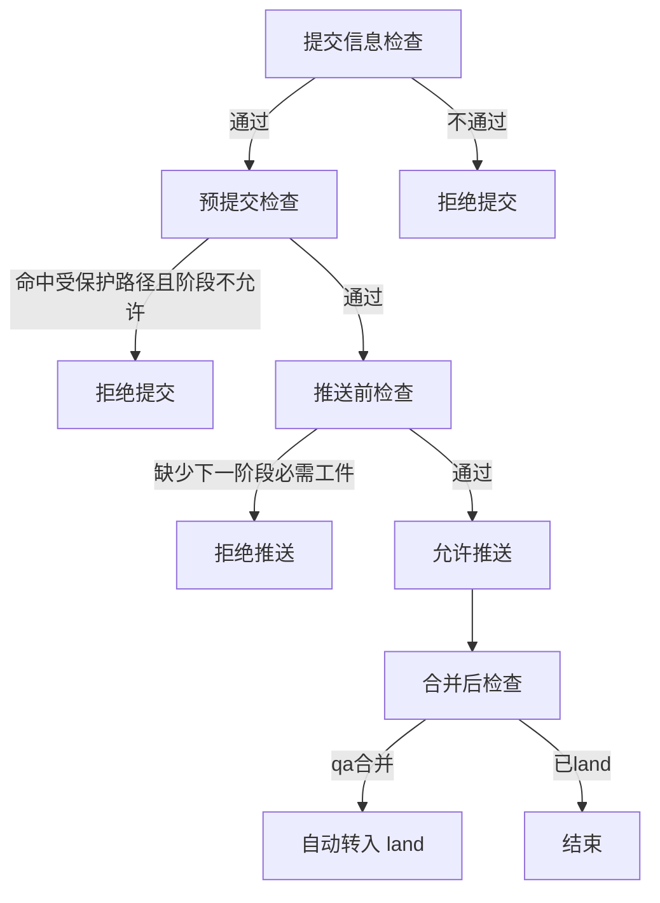
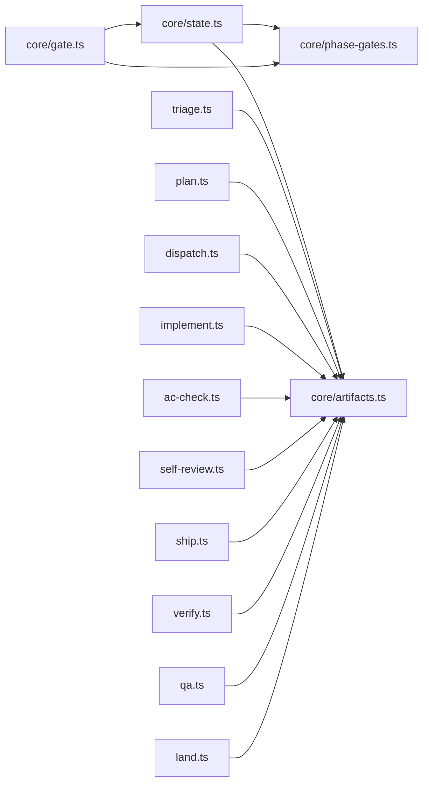

# 阶段和门禁系统

<cite>
**本文引用的文件**
- [core/state.ts](file://core/state.ts)
- [core/phase-gates.ts](file://core/phase-gates.ts)
- [core/gate.ts](file://core/gate.ts)
- [core/artifacts.ts](file://core/artifacts.ts)
- [core/phase-artifact.ts](file://core/phase-artifact.ts)
- [core/triage.ts](file://core/triage.ts)
- [core/plan.ts](file://core/plan.ts)
- [core/dispatch.ts](file://core/dispatch.ts)
- [core/implement.ts](file://core/implement.ts)
- [core/ac-check.ts](file://core/ac-check.ts)
- [core/self-review.ts](file://core/self-review.ts)
- [core/ship.ts](file://core/ship.ts)
- [core/verify.ts](file://core/verify.ts)
- [core/qa.ts](file://core/qa.ts)
- [core/land.ts](file://core/land.ts)
</cite>

## 目录
1. [引言](#引言)
2. [项目结构](#项目结构)
3. [核心组件](#核心组件)
4. [架构总览](#架构总览)
5. [详细组件分析](#详细组件分析)
6. [依赖关系分析](#依赖关系分析)
7. [性能考量](#性能考量)
8. [故障排查指南](#故障排查指南)
9. [结论](#结论)
10. [附录](#附录)

## 引言
本文件面向 gxpm 的“阶段与门禁”系统，系统化阐述项目管理生命周期的各阶段（从需求到上线），解释阶段转换规则、必需产物（工件）与门禁检查机制，给出阶段转换流程图与状态迁移示例，说明门禁规则的验证逻辑与失败处理方式，并总结各阶段最佳实践与常见陷阱。

## 项目结构
- 核心运行时与状态：状态机定义、阶段转换、事件日志、工件索引等集中在 core/state.ts。
- 阶段与门禁规则：定义阶段序列、门禁工件类型、命令提示等在 core/phase-gates.ts。
- Git 钩子门禁评估：预提交、提交信息、推送前、合并后门禁在 core/gate.ts。
- 工件读写与索引：统一的工件类型、读写、索引与事件记录在 core/artifacts.ts。
- 各阶段工件初始化器：以“阶段工件初始化器”模式生成各阶段必需工件在 core/phase-artifact.ts 及其具体实现（如 triage.ts、plan.ts、dispatch.ts 等）。
- 发布与上线：ship、verify、qa、land 等阶段工件初始化器在对应文件中。

图表来源
- [core/state.ts:11-24](file://core/state.ts#L11-L24)
- [core/phase-gates.ts:32-99](file://core/phase-gates.ts#L32-L99)
- [core/gate.ts:8-27](file://core/gate.ts#L8-L27)
- [core/artifacts.ts:10-26](file://core/artifacts.ts#L10-L26)
- [core/phase-artifact.ts:16-32](file://core/phase-artifact.ts#L16-L32)

章节来源
- [core/state.ts:11-24](file://core/state.ts#L11-L24)
- [core/phase-gates.ts:32-99](file://core/phase-gates.ts#L32-L99)
- [core/gate.ts:8-27](file://core/gate.ts#L8-L27)
- [core/artifacts.ts:10-26](file://core/artifacts.ts#L10-L26)
- [core/phase-artifact.ts:16-32](file://core/phase-artifact.ts#L16-L32)

## 核心组件
- 阶段序列与转换
  - 定义了完整的阶段序列，确保严格线性推进。
  - 转换校验通过当前阶段定位允许的下一步阶段；若不匹配则抛出错误。
- 门禁规则与命令提示
  - 每个阶段到下一阶段映射一个“必需工件”，未满足则阻止转换。
  - 提供“执行该阶段门禁所需命令”的提示字符串，便于用户快速修复。
- 工件系统
  - 统一的工件类型枚举、读写、索引与事件记录。
  - 每个阶段工件初始化器负责在正确阶段写入默认结构的工件。
- Git 钩子门禁
  - 预提交：限制受保护路径在特定阶段可编辑。
  - 提交信息：要求包含问题编号引用。
  - 推送前：检查当前阶段是否具备下一阶段所需的工件。
  - 合并后：在特定阶段自动触发后续阶段转换。

章节来源
- [core/state.ts:149-204](file://core/state.ts#L149-L204)
- [core/state.ts:252-301](file://core/state.ts#L252-L301)
- [core/phase-gates.ts:107-117](file://core/phase-gates.ts#L107-L117)
- [core/gate.ts:48-143](file://core/gate.ts#L48-L143)
- [core/artifacts.ts:57-91](file://core/artifacts.ts#L57-L91)

## 架构总览
下图展示从“阶段转换”到“门禁检查”再到“工件产出”的整体流程，以及 Git 钩子如何在不同节点进行拦截与放行。

图表来源
- [core/state.ts:149-204](file://core/state.ts#L149-L204)
- [core/state.ts:252-301](file://core/state.ts#L252-L301)
- [core/phase-gates.ts:107-117](file://core/phase-gates.ts#L107-L117)
- [core/gate.ts:48-143](file://core/gate.ts#L48-L143)

## 详细组件分析

### 阶段序列与转换规则
- 阶段序列
  - triage → plan → dispatch → implement → local-verify → ac-check → self-review → ship → pr-check → verify → qa → land
- 转换规则
  - 仅允许按序前进；跨阶段跳转会触发错误。
  - 转换时会触发门禁检查：若下一阶段需要工件且缺失，则阻止转换并记录事件。
- 事件与历史
  - 每次转换写入事件日志与状态图谱，保留阶段进入时间与来源。

图表来源
- [core/state.ts:11-24](file://core/state.ts#L11-L24)

章节来源
- [core/state.ts:149-204](file://core/state.ts#L149-L204)
- [core/state.ts:226-229](file://core/state.ts#L226-L229)

### 门禁规则与命令提示
- 规则来源
  - 每个阶段到下一阶段映射一个“必需工件”，用于强制阶段性交付。
- 命令提示
  - 当缺少工件时，系统返回“应执行的命令”以生成该工件，帮助用户快速修复。
- 适用范围
  - 该规则在阶段转换与 Git 钩子（推送前）均生效。

图表来源
- [core/phase-gates.ts:32-99](file://core/phase-gates.ts#L32-L99)
- [core/phase-gates.ts:107-117](file://core/phase-gates.ts#L107-L117)

章节来源
- [core/phase-gates.ts:32-99](file://core/phase-gates.ts#L32-L99)
- [core/phase-gates.ts:107-117](file://core/phase-gates.ts#L107-L117)

### 工件系统与阶段工件初始化器
- 工件类型
  - 包含从需求到上线全链路的工件类型集合，如验收合同、实施计划、自检、评审、发布准备、验证发现、QA 发现、上线发现等。
- 工件读写
  - 写入时生成带时间戳的工件记录并更新索引；读取时校验类型与存在性。
- 阶段工件初始化器
  - 以“阶段工件初始化器”模式封装：仅在正确阶段调用，写入默认结构的工件，避免遗漏关键字段。
  - 典型实现：triage、plan、dispatch、implement、ac-check、self-review、ship、verify、qa、land。

图表来源
- [core/artifacts.ts:57-91](file://core/artifacts.ts#L57-L91)
- [core/phase-artifact.ts:16-32](file://core/phase-artifact.ts#L16-L32)
- [core/triage.ts:8-19](file://core/triage.ts#L8-L19)
- [core/plan.ts:3-14](file://core/plan.ts#L3-L14)
- [core/dispatch.ts:3-16](file://core/dispatch.ts#L3-L16)
- [core/implement.ts:3-15](file://core/implement.ts#L3-L15)
- [core/ac-check.ts:3-14](file://core/ac-check.ts#L3-L14)
- [core/self-review.ts:3-14](file://core/self-review.ts#L3-L14)
- [core/ship.ts:3-16](file://core/ship.ts#L3-L16)
- [core/verify.ts:3-15](file://core/verify.ts#L3-L15)
- [core/qa.ts:3-15](file://core/qa.ts#L3-L15)
- [core/land.ts:3-15](file://core/land.ts#L3-L15)

章节来源
- [core/artifacts.ts:10-26](file://core/artifacts.ts#L10-L26)
- [core/artifacts.ts:57-91](file://core/artifacts.ts#L57-L91)
- [core/phase-artifact.ts:16-32](file://core/phase-artifact.ts#L16-L32)
- [core/triage.ts:8-19](file://core/triage.ts#L8-L19)
- [core/plan.ts:3-14](file://core/plan.ts#L3-L14)
- [core/dispatch.ts:3-16](file://core/dispatch.ts#L3-L16)
- [core/implement.ts:3-15](file://core/implement.ts#L3-L15)
- [core/ac-check.ts:3-14](file://core/ac-check.ts#L3-L14)
- [core/self-review.ts:3-14](file://core/self-review.ts#L3-L14)
- [core/ship.ts:3-16](file://core/ship.ts#L3-L16)
- [core/verify.ts:3-15](file://core/verify.ts#L3-L15)
- [core/qa.ts:3-15](file://core/qa.ts#L3-L15)
- [core/land.ts:3-15](file://core/land.ts#L3-L15)

### Git 钩子门禁评估
- 预提交门禁
  - 若当前阶段不允许代码变更（受保护路径），则拒绝提交。
- 提交信息门禁
  - 要求提交信息包含问题编号引用。
- 推送前门禁
  - 若当前阶段有下一阶段门禁且缺少必需工件，则拒绝推送。
- 合并后门禁
  - 在特定阶段（如 qa）合并后自动触发下一阶段转换。

图表来源
- [core/gate.ts:48-143](file://core/gate.ts#L48-L143)

章节来源
- [core/gate.ts:48-143](file://core/gate.ts#L48-L143)

### 各阶段产物与转换要点
- triage（需求采集）
  - 产物：验收合同（acceptance-contract）
  - 关键：明确验收标准，为后续计划奠定基础
- plan（计划制定）
  - 产物：实施计划（implementation-plan）
  - 关键：风险、步骤、验证清单落地
- dispatch（任务分派）
  - 产物：派发交接（dispatch-handoff）
  - 关键：输入工件（验收合同、实施计划）、目标分支、工作树路径等
- implement（实施）
  - 产物：本地验证（local-verify）
  - 关键：变更清单、验证命令、证据与结果
- local-verify（本地验证）
  - 产物：验收检查（acceptance-check）
  - 关键：对照验收标准逐项核验
- ac-check（验收检查）
  - 产物：自审（self-review）
  - 关键：复核本地验证与验收检查
- self-review（自审）
  - 产物：发布准备（ship-readiness）
  - 关键：发布清单、目标分支、风险汇总
- ship（发布准备）
  - 产物：PR 检查（pr-check）
  - 关键：准备 PR 相关材料
- pr-check（PR 检查）
  - 产物：验证发现（verify-findings）
  - 关键：PR 与验收合同、检查结果的对比
- verify（验证）
  - 产物：QA 发现（qa-findings）
  - 关键：浏览器证据、QA 发现与风险
- qa（质量保证）
  - 产物：上线发现（land-findings）
  - 关键：合并计划、发布风险、上线就绪
- land（上线）
  - 产物：完成
  - 关键：合并完成，归档

章节来源
- [core/triage.ts:8-19](file://core/triage.ts#L8-L19)
- [core/plan.ts:3-14](file://core/plan.ts#L3-L14)
- [core/dispatch.ts:3-16](file://core/dispatch.ts#L3-L16)
- [core/implement.ts:3-15](file://core/implement.ts#L3-L15)
- [core/ac-check.ts:3-14](file://core/ac-check.ts#L3-L14)
- [core/self-review.ts:3-14](file://core/self-review.ts#L3-L14)
- [core/ship.ts:3-16](file://core/ship.ts#L3-L16)
- [core/verify.ts:3-15](file://core/verify.ts#L3-L15)
- [core/qa.ts:3-15](file://core/qa.ts#L3-L15)
- [core/land.ts:3-15](file://core/land.ts#L3-L15)

## 依赖关系分析
- 状态机依赖门禁规则与工件系统
  - 转换前查询下一阶段所需工件；若缺失则阻止并记录事件。
- 工件系统被所有阶段工件初始化器依赖
  - 初始化器在正确阶段写入默认结构的工件，确保产物完整性。
- Git 钩子门禁依赖状态与规则
  - 预提交/提交信息/推送前/合并后门禁基于当前阶段与规则判断。

图表来源
- [core/state.ts:149-204](file://core/state.ts#L149-L204)
- [core/phase-gates.ts:32-99](file://core/phase-gates.ts#L32-L99)
- [core/artifacts.ts:57-91](file://core/artifacts.ts#L57-L91)
- [core/gate.ts:48-143](file://core/gate.ts#L48-L143)

章节来源
- [core/state.ts:149-204](file://core/state.ts#L149-L204)
- [core/phase-gates.ts:32-99](file://core/phase-gates.ts#L32-L99)
- [core/artifacts.ts:57-91](file://core/artifacts.ts#L57-L91)
- [core/gate.ts:48-143](file://core/gate.ts#L48-L143)

## 性能考量
- 工件写入与索引更新
  - 每次写入工件都会更新索引文件，建议批量写入或减少频繁小粒度写入以降低磁盘 IO。
- 事件日志追加
  - 事件采用文本行格式追加，建议定期轮转或清理旧事件，避免日志过大影响读取性能。
- 阶段转换校验
  - 转换前的规则查找与文件存在性检查开销较小，但应避免在高频 CI 场景中重复读取同一文件。

## 故障排查指南
- 缺少必需工件导致转换失败
  - 现象：阶段转换报错，提示缺少某工件并显示应执行的命令。
  - 处理：先执行提示命令生成工件，再重试转换。
- 阶段顺序错误
  - 现象：尝试跳过阶段或逆序转换。
  - 处理：按阶段序列逐一推进，或回退到上一阶段补齐缺失工件。
- Git 钩子拒绝
  - 预提交：当前阶段禁止修改受保护路径，需先推进到允许的阶段或调整阶段。
  - 提交信息：提交信息未包含问题编号引用，需补充后重试。
  - 推送前：当前阶段缺少下一阶段必需工件，需先生成工件。
  - 合并后：在 qa 合并后自动转入 land，无需手动干预。
- 事件与状态核对
  - 使用事件日志与状态图谱核对阶段进入时间与来源，定位异常转换点。

章节来源
- [core/state.ts:298-301](file://core/state.ts#L298-L301)
- [core/gate.ts:48-143](file://core/gate.ts#L48-L143)

## 结论
gxpm 的阶段与门禁系统通过“严格的阶段序列 + 明确的阶段门禁 + 统一的工件模型 + Git 钩子门禁”构建了端到端的项目管理闭环。遵循阶段顺序、及时生成必需工件、满足 Git 钩子门禁要求，是确保项目高质量交付的关键。

## 附录
- 最佳实践
  - 每个阶段结束后立即生成并提交下一阶段必需工件，避免阻塞推进。
  - 在受保护路径变更前，确认当前阶段允许代码编辑。
  - 提交信息必须包含问题编号引用，便于追踪。
  - 在 qa 合并后，关注自动转入 land 的提示，及时完成上线流程。
- 常见陷阱
  - 忽视阶段门禁：直接跳过阶段或逆序转换，导致后续阶段无法推进。
  - 忽略 Git 钩子：在不允许的阶段修改受保护路径或提交信息不规范。
  - 工件内容不完整：仅生成工件而未填写关键字段，导致门禁检查失败。