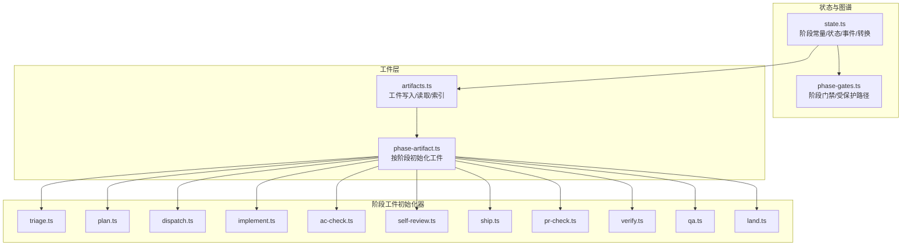
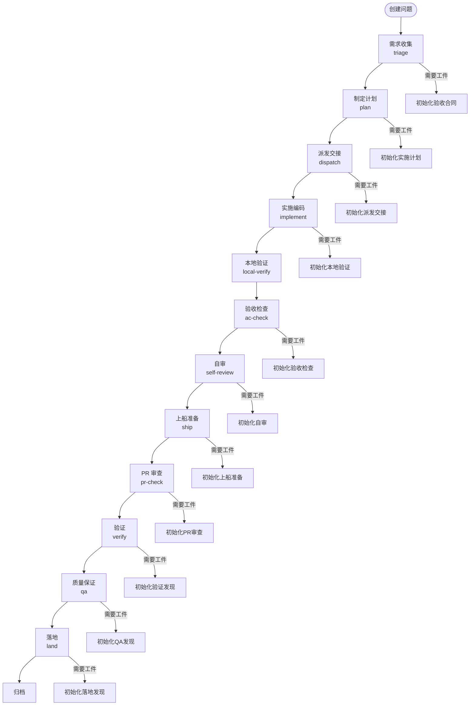
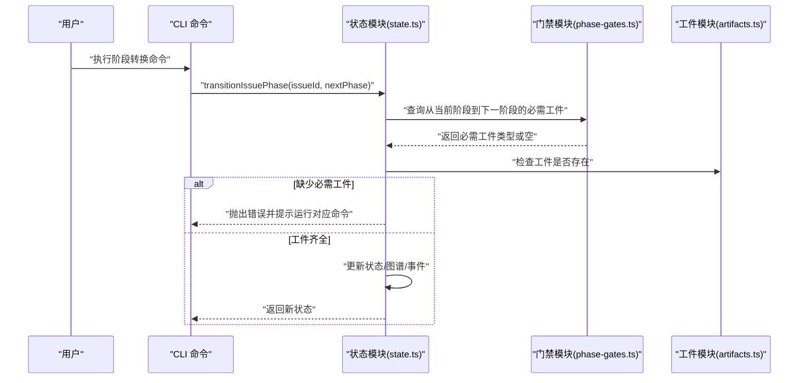
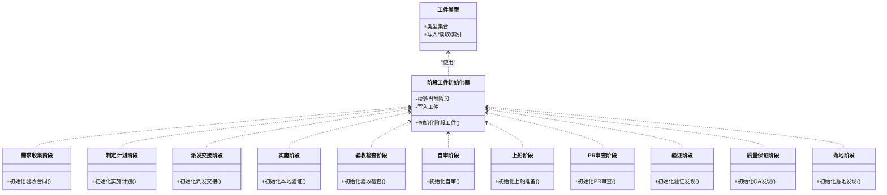
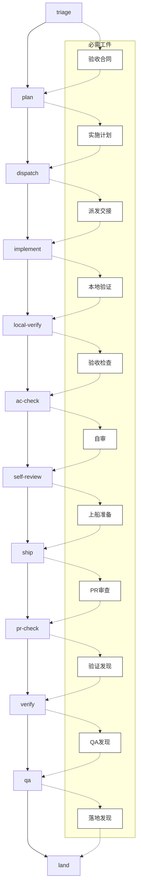
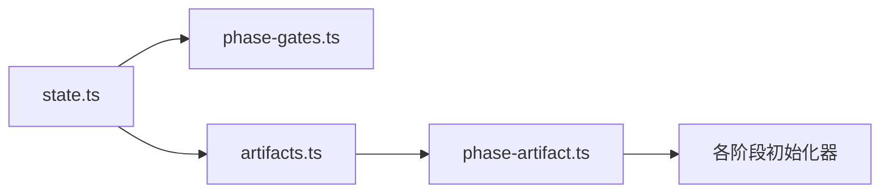

# 阶段生命周期总览

<cite>
**本文引用的文件**
- [core/state.ts](file://core/state.ts)
- [core/phase-gates.ts](file://core/phase-gates.ts)
- [core/artifacts.ts](file://core/artifacts.ts)
- [core/phase-artifact.ts](file://core/phase-artifact.ts)
- [core/triage.ts](file://core/triage.ts)
- [core/plan.ts](file://core/plan.ts)
- [core/dispatch.ts](file://core/dispatch.ts)
- [core/implement.ts](file://core/implement.ts)
- [core/ac-check.ts](file://core/ac-check.ts)
- [core/self-review.ts](file://core/self-review.ts)
- [core/ship.ts](file://core/ship.ts)
- [core/pr-check.ts](file://core/pr-check.ts)
- [core/verify.ts](file://core/verify.ts)
- [core/qa.ts](file://core/qa.ts)
- [core/land.ts](file://core/land.ts)
</cite>

## 目录
1. [引言](#引言)
2. [项目结构](#项目结构)
3. [核心组件](#核心组件)
4. [架构总览](#架构总览)
5. [详细组件分析](#详细组件分析)
6. [依赖分析](#依赖分析)
7. [性能考虑](#性能考虑)
8. [故障排查指南](#故障排查指南)
9. [结论](#结论)
10. [附录](#附录)

## 引言
本文件面向 gxpm 的阶段生命周期，系统化梳理从需求收集到产品上线的完整阶段序列与转换规则，解释阶段间线性关系与转换条件，并重点阐述“受保护路径模式”的作用与重要性。文档同时提供阶段转换流程图、状态迁移示例、最佳实践与常见问题处理建议，帮助读者在不深入源码的情况下高效掌握项目管理生命周期。

## 项目结构
gxpm 将项目管理生命周期抽象为一系列有序阶段，每个阶段以“工件（artifact）”作为质量门禁与可追溯性的载体。核心模块围绕以下职责组织：
- 状态与图谱：维护每个问题的当前阶段、历史轨迹与阶段图谱
- 工件管理：统一写入、读取、索引与校验阶段所需工件
- 质量门禁：定义阶段间转换所需的“必需工件”，并提供命令提示
- 受保护路径：对特定目录前缀进行约束，确保关键路径变更受控

图表来源
- [core/state.ts:11-24](file://core/state.ts#L11-L24)
- [core/phase-gates.ts:15-23](file://core/phase-gates.ts#L15-L23)
- [core/artifacts.ts:10-26](file://core/artifacts.ts#L10-L26)
- [core/phase-artifact.ts:9-14](file://core/phase-artifact.ts#L9-L14)

章节来源
- [core/state.ts:11-24](file://core/state.ts#L11-L24)
- [core/phase-gates.ts:15-23](file://core/phase-gates.ts#L15-L23)
- [core/artifacts.ts:10-26](file://core/artifacts.ts#L10-L26)
- [core/phase-artifact.ts:9-14](file://core/phase-artifact.ts#L9-L14)

## 核心组件
- 阶段序列与状态
  - 阶段常量定义了严格的线性顺序，转换必须遵循该顺序
  - 每个问题实例包含当前阶段、创建/更新时间、阶段历史与工件根路径等信息
- 工件类型与索引
  - 统一的工件类型集合，每个阶段产出或消费的工件均有明确类型
  - 工件写入时自动更新索引文件，支持幂等写入与去重排序
- 质量门禁与命令提示
  - 每次阶段转换前检查是否具备“必需工件”
  - 若缺失，记录“被阻塞”事件并提示应运行的具体命令
- 受保护路径模式
  - 对 apps/、server/、packages/、scripts/、tests/、supabase/、e2e/ 等路径进行匹配约束
  - 用于识别与管控关键代码区域的变更风险

章节来源
- [core/state.ts:11-43](file://core/state.ts#L11-L43)
- [core/artifacts.ts:10-41](file://core/artifacts.ts#L10-L41)
- [core/phase-gates.ts:25-99](file://core/phase-gates.ts#L25-L99)
- [core/phase-gates.ts:15-23](file://core/phase-gates.ts#L15-L23)

## 架构总览
下图展示阶段生命周期的端到端流程：从创建问题开始，依次经历需求收集、计划、派发、实施、本地验证、验收检查、自审、上船、PR 审查、验证、质量保证、落地，最终完成归档。

图表来源
- [core/state.ts:11-24](file://core/state.ts#L11-L24)
- [core/triage.ts:8-19](file://core/triage.ts#L8-L19)
- [core/plan.ts:3-14](file://core/plan.ts#L3-L14)
- [core/dispatch.ts:3-16](file://core/dispatch.ts#L3-L16)
- [core/implement.ts:3-15](file://core/implement.ts#L3-L15)
- [core/ac-check.ts:3-14](file://core/ac-check.ts#L3-L14)
- [core/self-review.ts:3-14](file://core/self-review.ts#L3-L14)
- [core/ship.ts:3-16](file://core/ship.ts#L3-L16)
- [core/pr-check.ts:3-15](file://core/pr-check.ts#L3-L15)
- [core/verify.ts:3-15](file://core/verify.ts#L3-L15)
- [core/qa.ts:3-15](file://core/qa.ts#L3-L15)
- [core/land.ts:3-15](file://core/land.ts#L3-L15)

## 详细组件分析

### 阶段序列与转换规则
- 阶段序列
  - triage → plan → dispatch → implement → local-verify → ac-check → self-review → ship → pr-check → verify → qa → land
- 转换条件
  - 必须按序前进；若目标阶段非下一阶段，将抛出错误
  - 转换前检查“必需工件”是否存在；不存在则记录“被阻塞”事件并提示应运行的命令
- 事件与图谱
  - 每次转换会更新状态文件与阶段图谱，并追加事件日志，便于审计与回溯

图表来源
- [core/state.ts:149-204](file://core/state.ts#L149-L204)
- [core/state.ts:252-301](file://core/state.ts#L252-L301)
- [core/phase-gates.ts:107-117](file://core/phase-gates.ts#L107-L117)
- [core/artifacts.ts:57-91](file://core/artifacts.ts#L57-L91)

章节来源
- [core/state.ts:149-204](file://core/state.ts#L149-L204)
- [core/state.ts:252-301](file://core/state.ts#L252-L301)
- [core/phase-gates.ts:107-117](file://core/phase-gates.ts#L107-L117)
- [core/artifacts.ts:57-91](file://core/artifacts.ts#L57-L91)

### 受保护路径模式
- 模式定义
  - 通过正则表达式匹配关键目录前缀，如 apps/、server/、packages/、scripts/、tests/、supabase/、e2e/
- 作用与重要性
  - 识别高风险变更范围，确保这些路径的变更必须经过严格的质量门禁与评审
  - 为后续自动化策略（如强制 CI、代码审查、安全扫描）提供依据
- 使用场景
  - 在阶段转换前，结合受保护路径匹配结果决定是否触发额外的门禁检查或自动化流程

章节来源
- [core/phase-gates.ts:15-23](file://core/phase-gates.ts#L15-L23)

### 阶段工件初始化器
- 设计原则
  - 每个阶段仅允许在正确的阶段内初始化其专属工件，防止越权写入
  - 初始化时写入预设的工件载荷（payload），并更新索引与事件
- 典型阶段工件
  - triage：验收合同
  - plan：实施计划
  - dispatch：派发交接
  - implement：本地验证
  - ac-check：验收检查
  - self-review：自审
  - ship：上船准备
  - pr-check：PR 审查
  - verify：验证发现
  - qa：QA 发现
  - land：落地发现

图表来源
- [core/artifacts.ts:10-41](file://core/artifacts.ts#L10-L41)
- [core/phase-artifact.ts:16-32](file://core/phase-artifact.ts#L16-L32)
- [core/triage.ts:8-19](file://core/triage.ts#L8-L19)
- [core/plan.ts:3-14](file://core/plan.ts#L3-L14)
- [core/dispatch.ts:3-16](file://core/dispatch.ts#L3-L16)
- [core/implement.ts:3-15](file://core/implement.ts#L3-L15)
- [core/ac-check.ts:3-14](file://core/ac-check.ts#L3-L14)
- [core/self-review.ts:3-14](file://core/self-review.ts#L3-L14)
- [core/ship.ts:3-16](file://core/ship.ts#L3-L16)
- [core/pr-check.ts:3-15](file://core/pr-check.ts#L3-L15)
- [core/verify.ts:3-15](file://core/verify.ts#L3-L15)
- [core/qa.ts:3-15](file://core/qa.ts#L3-L15)
- [core/land.ts:3-15](file://core/land.ts#L3-L15)

章节来源
- [core/artifacts.ts:10-41](file://core/artifacts.ts#L10-L41)
- [core/phase-artifact.ts:16-32](file://core/phase-artifact.ts#L16-L32)
- [core/triage.ts:8-19](file://core/triage.ts#L8-L19)
- [core/plan.ts:3-14](file://core/plan.ts#L3-L14)
- [core/dispatch.ts:3-16](file://core/dispatch.ts#L3-L16)
- [core/implement.ts:3-15](file://core/implement.ts#L3-L15)
- [core/ac-check.ts:3-14](file://core/ac-check.ts#L3-L14)
- [core/self-review.ts:3-14](file://core/self-review.ts#L3-L14)
- [core/ship.ts:3-16](file://core/ship.ts#L3-L16)
- [core/pr-check.ts:3-15](file://core/pr-check.ts#L3-L15)
- [core/verify.ts:3-15](file://core/verify.ts#L3-L15)
- [core/qa.ts:3-15](file://core/qa.ts#L3-L15)
- [core/land.ts:3-15](file://core/land.ts#L3-L15)

### 阶段转换流程图与状态迁移示例
- 流程图
  - 展示从 triage 到 land 的完整线性序列，以及各阶段的必需工件
- 示例
  - 从 triage 进入 plan：需先生成“验收合同”工件
  - 从 implement 进入 local-verify：需先生成“本地验证”工件
  - 从 pr-check 进入 verify：需先生成“验证发现”工件

图表来源
- [core/state.ts:11-24](file://core/state.ts#L11-L24)
- [core/phase-gates.ts:32-99](file://core/phase-gates.ts#L32-L99)

章节来源
- [core/state.ts:11-24](file://core/state.ts#L11-L24)
- [core/phase-gates.ts:32-99](file://core/phase-gates.ts#L32-L99)

## 依赖分析
- 内部耦合
  - state.ts 依赖 phase-gates.ts 提供“必需工件”与命令提示
  - artifacts.ts 与 phase-artifact.ts 协作，确保阶段工件的正确写入与索引更新
- 外部依赖
  - 文件系统：所有状态、图谱、工件与事件均持久化到磁盘
- 循环依赖
  - 未见循环依赖；模块职责清晰，接口边界明确

图表来源
- [core/state.ts:9](file://core/state.ts#L9)
- [core/phase-gates.ts:1-2](file://core/phase-gates.ts#L1-L2)
- [core/artifacts.ts:1-8](file://core/artifacts.ts#L1-L8)
- [core/phase-artifact.ts:1-2](file://core/phase-artifact.ts#L1-L2)

章节来源
- [core/state.ts:9](file://core/state.ts#L9)
- [core/phase-gates.ts:1-2](file://core/phase-gates.ts#L1-L2)
- [core/artifacts.ts:1-8](file://core/artifacts.ts#L1-L8)
- [core/phase-artifact.ts:1-2](file://core/phase-artifact.ts#L1-L2)

## 性能考虑
- I/O 模式
  - 状态、图谱与事件均为小文件，写入频率低，性能开销可忽略
  - 工件索引采用简单 JSON 文件，幂等写入与去重排序成本可控
- 并发与一致性
  - 当前实现未显式处理并发写入；在多任务场景下建议串行化阶段转换
- 扩展建议
  - 对大型仓库可引入增量索引与缓存机制，减少重复解析
  - 对频繁读取的阶段图谱可考虑内存缓存

## 故障排查指南
- 常见错误与定位
  - “无效阶段转换”：当前阶段与下一阶段不连续，检查阶段序列与转换调用
  - “缺少必需工件”：根据提示运行相应命令生成工件后再尝试转换
  - “工件类型无效”：确认工件类型是否在预定义集合中
  - “问题状态不存在”：确认问题 ID 是否正确且已创建
- 排查步骤
  - 查看事件日志（events.jsonl）定位最近一次转换与阻塞点
  - 检查工件索引（artifacts/index.json）确认所需工件是否已生成
  - 核对阶段图谱（graph.json）确认当前阶段与历史轨迹
- 建议
  - 在自动化流水线中捕获并记录“被阻塞”事件，便于告警与重试
  - 对受保护路径变更增加前置校验，避免跨阶段风险

章节来源
- [core/state.ts:156-162](file://core/state.ts#L156-L162)
- [core/state.ts:298-301](file://core/state.ts#L298-L301)
- [core/artifacts.ts:163-168](file://core/artifacts.ts#L163-L168)
- [core/state.ts:142-147](file://core/state.ts#L142-L147)

## 结论
gxpm 的阶段生命周期通过“阶段序列 + 工件门禁 + 事件审计 + 受保护路径”构建了严谨、可追溯、可扩展的项目管理框架。遵循线性阶段与必需工件约束，可在交付过程中有效降低风险、提升质量。建议在团队内固化阶段转换流程与工件模板，配合自动化工具实现端到端的可观察性与合规性。

## 附录
- 最佳实践
  - 在每个阶段结束时及时生成并提交工件，避免阻塞后续阶段
  - 对受保护路径的变更建立强制评审与测试策略
  - 使用事件日志与阶段图谱定期审计项目健康度
- 常见问题
  - 忘记初始化工件导致转换失败：在 CI 中加入“必需工件检查”步骤
  - 阶段顺序错误：在 CLI 中增加阶段合法性校验与提示
  - 工件覆盖冲突：采用幂等写入与去重逻辑，避免重复提交