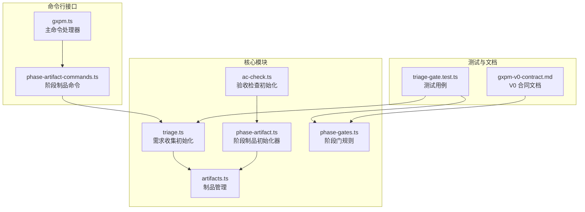
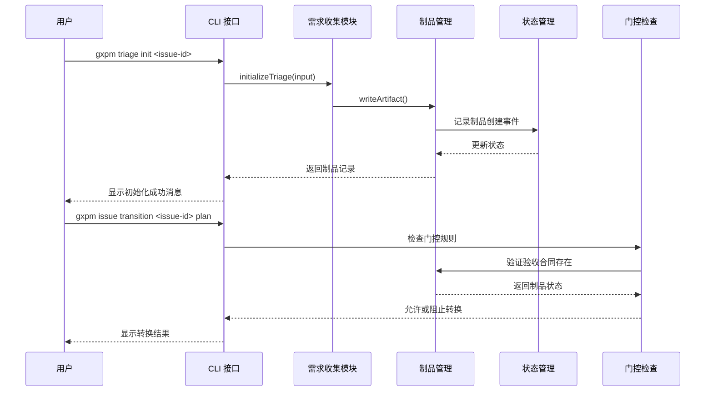
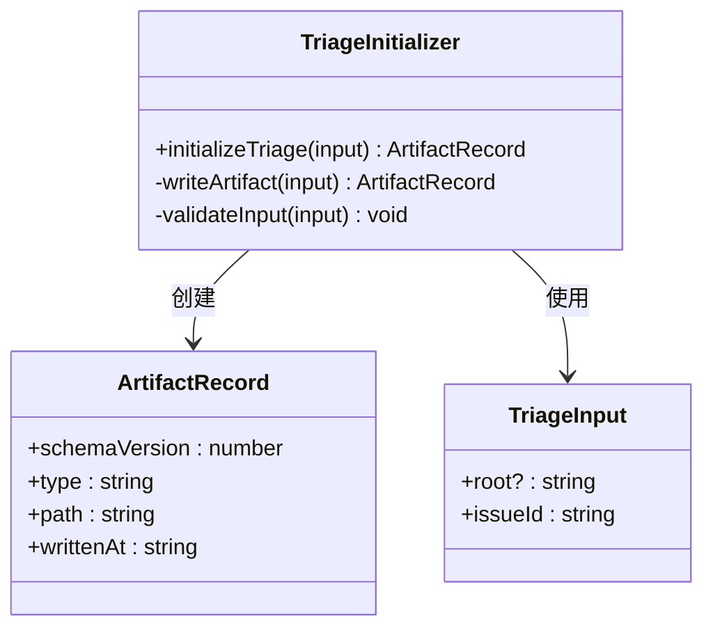
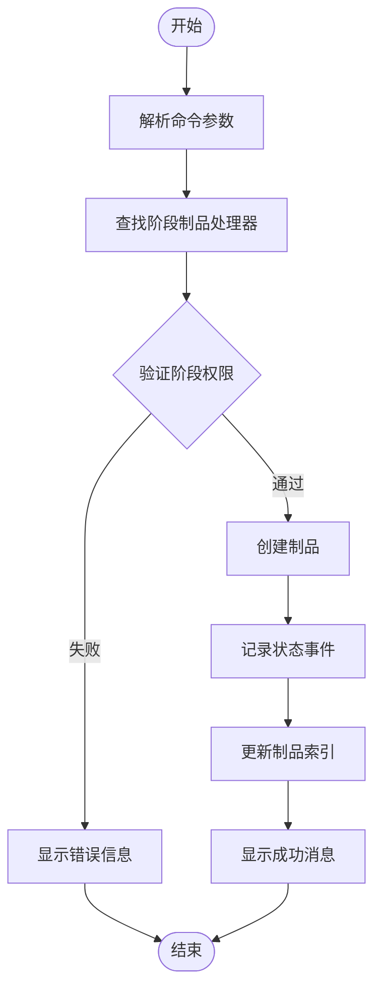
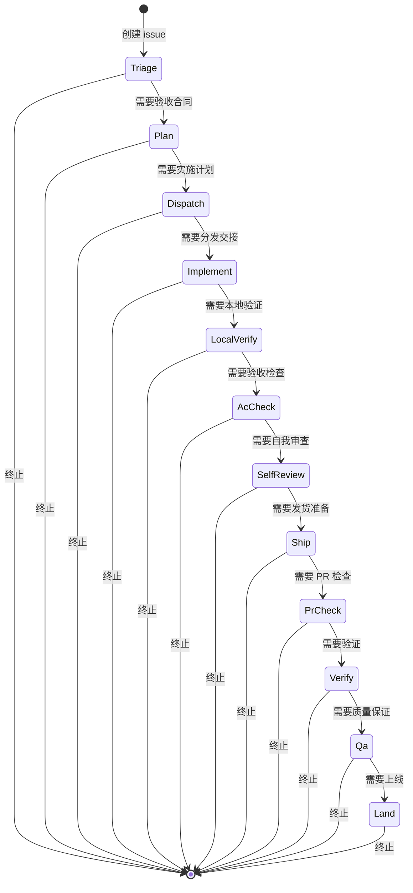
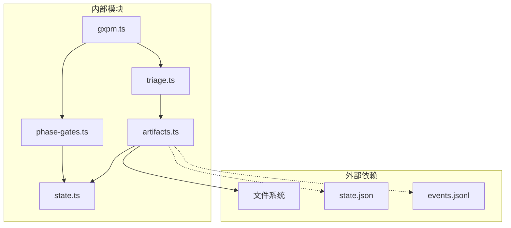

# 需求收集阶段（Triage）

<cite>
**本文档引用的文件**
- [triage.ts](file://core/triage.ts)
- [ac-check.ts](file://core/ac-check.ts)
- [phase-artifact.ts](file://core/phase-artifact.ts)
- [phase-artifact-commands.ts](file://scripts/phase-artifact-commands.ts)
- [gxpm.ts](file://scripts/gxpm.ts)
- [triage-gate.test.ts](file://test/triage-gate.test.ts)
- [gxpm-v0-contract.md](file://docs/architecture/gxpm-v0-contract.md)
- [phase-gates.ts](file://core/phase-gates.ts)
- [artifacts.ts](file://core/artifacts.ts)
</cite>

## 目录
1. [引言](#引言)
2. [项目结构](#项目结构)
3. [核心组件](#核心组件)
4. [架构概览](#架构概览)
5. [详细组件分析](#详细组件分析)
6. [依赖分析](#依赖分析)
7. [性能考虑](#性能考虑)
8. [故障排除指南](#故障排除指南)
9. [结论](#结论)
10. [附录](#附录)

## 引言
需求收集阶段（Triage）是 gxpm 工作流中的第一个正式阶段，负责对新发现的问题进行初步评估和分类。本阶段的核心职责包括问题识别、优先级评估和初步分析，为后续的详细规划奠定基础。通过严格的验收合同（acceptance-contract）机制，确保每个问题都具备明确的验收标准和完成条件。

## 项目结构
gxpm 将需求收集阶段的功能组织在核心模块中，主要涉及以下关键文件：

**图表来源**
- [triage.ts:1-20](file://core/triage.ts#L1-L20)
- [phase-artifact.ts:1-33](file://core/phase-artifact.ts#L1-L33)
- [phase-artifact-commands.ts:1-84](file://scripts/phase-artifact-commands.ts#L1-L84)

**章节来源**
- [triage.ts:1-20](file://core/triage.ts#L1-L20)
- [phase-artifact.ts:1-33](file://core/phase-artifact.ts#L1-L33)
- [phase-artifact-commands.ts:1-84](file://scripts/phase-artifact-commands.ts#L1-L84)

## 核心组件
需求收集阶段由多个相互协作的组件构成，每个组件都有明确的职责和接口规范。

### 验收合同（Acceptance Contract）
验收合同是需求收集阶段的核心产物，定义了问题的验收标准和完成条件。其标准结构包括：
- **criteria**: 验收标准数组，用于量化评估问题解决程度
- **notes**: 说明性文本，指导如何填写验收标准
- **status**: 合同状态，默认为 "draft"

### 阶段制品初始化器
通过统一的初始化器模式，确保制品创建的一致性和正确性：
- 自动验证当前阶段是否符合要求
- 生成标准化的制品载荷
- 记录制品创建事件到状态追踪中

### CLI 命令集成
提供完整的命令行接口，支持自动化工作流：
- `gxpm triage init <issue-id>`: 初始化验收合同
- `gxpm issue transition <issue-id> plan`: 跳转到规划阶段
- `gxpm artifact list <issue-id>`: 查看制品清单
- `gxpm artifact read <issue-id> acceptance-contract`: 读取验收合同

**章节来源**
- [triage.ts:8-19](file://core/triage.ts#L8-L19)
- [phase-artifact.ts:16-32](file://core/phase-artifact.ts#L16-L32)
- [gxpm.ts:245-253](file://scripts/gxpm.ts#L245-L253)

## 架构概览
需求收集阶段在整个 gxpm 架构中扮演着关键的入口角色，通过严格的门控机制确保工作流的有序进行。

**图表来源**
- [triage.ts:8-19](file://core/triage.ts#L8-L19)
- [artifacts.ts:57-91](file://core/artifacts.ts#L57-L91)
- [triage-gate.test.ts:30-39](file://test/triage-gate.test.ts#L30-L39)

## 详细组件分析

### 需求收集初始化器
需求收集初始化器是专门处理入口阶段制品创建的组件，具有以下特点：

**图表来源**
- [triage.ts:3-19](file://core/triage.ts#L3-L19)
- [artifacts.ts:28-41](file://core/artifacts.ts#L28-L41)

#### 初始化流程
1. **输入验证**: 检查 issueId 的有效性
2. **制品创建**: 生成验收合同制品
3. **状态更新**: 记录制品创建事件
4. **返回结果**: 提供制品访问信息

#### 验收合同标准结构
验收合同采用标准化的数据结构，确保跨阶段的一致性：
- **criteria**: 空数组，待填充具体的验收标准
- **notes**: 指导文本，提醒在需求收集阶段填写验收标准
- **status**: 默认 "draft"，表示合同处于草稿状态

**章节来源**
- [triage.ts:8-19](file://core/triage.ts#L8-L19)
- [triage.ts:13-17](file://core/triage.ts#L13-L17)

### 阶段制品命令系统
通过统一的命令系统，实现阶段制品的标准化创建和管理：

**图表来源**
- [phase-artifact-commands.ts:78-83](file://scripts/phase-artifact-commands.ts#L78-L83)
- [phase-artifact.ts:16-32](file://core/phase-artifact.ts#L16-L32)

#### 命令注册机制
系统通过配置化的处理器映射，实现命令的动态注册：
- **处理器映射**: 将制品类型映射到对应的初始化函数
- **命令构建**: 自动生成 CLI 命令格式
- **成功消息**: 定制化的操作反馈信息

**章节来源**
- [phase-artifact-commands.ts:22-70](file://scripts/phase-artifact-commands.ts#L22-L70)
- [phase-artifact.ts:16-32](file://core/phase-artifact.ts#L16-L32)

### 门控检查机制
门控机制确保工作流的正确顺序和必需条件的满足：

**图表来源**
- [phase-gates.ts:32-99](file://core/phase-gates.ts#L32-L99)
- [triage-gate.test.ts:11-28](file://test/triage-gate.test.ts#L11-L28)

#### 门控规则配置
每个阶段转换都有明确的规则约束：
- **必需制品**: 指定转换所需的前置制品类型
- **命令提示**: 提供正确的初始化命令
- **阶段验证**: 确保制品在正确的阶段创建

**章节来源**
- [phase-gates.ts:32-99](file://core/phase-gates.ts#L32-L99)
- [triage-gate.test.ts:11-28](file://test/triage-gate.test.ts#L11-L28)

## 依赖分析
需求收集阶段的依赖关系体现了模块化设计的优势，各组件职责清晰、耦合度低。

**图表来源**
- [triage.ts:1](file://core/triage.ts#L1)
- [artifacts.ts:1](file://core/artifacts.ts#L1)
- [gxpm.ts:1](file://scripts/gxpm.ts#L1)

### 关键依赖关系
1. **制品管理依赖**: 需求收集功能完全依赖制品管理系统
2. **状态管理集成**: 通过状态文件维护制品的生命周期
3. **CLI 接口**: 提供用户友好的交互界面
4. **门控规则**: 确保工作流的正确顺序

**章节来源**
- [triage.ts:1](file://core/triage.ts#L1)
- [artifacts.ts:1](file://core/artifacts.ts#L1)
- [gxpm.ts:1](file://scripts/gxpm.ts#L1)

## 性能考虑
需求收集阶段的设计注重性能和可靠性，主要体现在以下几个方面：

### 轻量级数据结构
- **最小化载荷**: 验收合同仅包含必要的字段，减少存储开销
- **标准化格式**: 使用 JSON 格式确保跨平台兼容性
- **增量更新**: 通过索引机制支持高效的制品查询

### 并发安全性
- **原子操作**: 制品创建采用原子写入，避免数据损坏
- **状态一致性**: 通过事件日志维护状态的完整历史
- **幂等设计**: 初始化操作可以安全地重复执行

### 扩展性设计
- **插件化架构**: 新的制品类型可以通过配置快速添加
- **标准化接口**: 统一的初始化器模式简化新功能开发
- **配置驱动**: 通过配置文件管理门控规则和命令映射

## 故障排除指南

### 常见问题及解决方案

#### 问题：无法从需求收集阶段跳转到规划阶段
**症状**: 执行 `gxpm issue transition <issue-id> plan` 报错
**原因**: 缺少验收合同制品
**解决方案**: 
1. 运行 `gxpm triage init <issue-id>` 创建验收合同
2. 验证制品存在: `gxpm artifact list <issue-id>`
3. 重新尝试阶段转换

#### 问题：CLI 命令无法识别
**症状**: `gxpm triage init` 命令不存在
**原因**: CLI 版本过旧或安装问题
**解决方案**:
1. 检查 gxpm 版本: `gxpm --version`
2. 重新安装最新版本
3. 验证命令可用性: `gxpm help`

#### 问题：制品内容不符合预期
**症状**: 验收合同缺少预期字段
**原因**: 初始化器版本不匹配
**解决方案**:
1. 检查当前版本的验收合同结构
2. 更新到最新版本
3. 重新初始化制品

**章节来源**
- [triage-gate.test.ts:11-28](file://test/triage-gate.test.ts#L11-L28)
- [triage-gate.test.ts:41-65](file://test/triage-gate.test.ts#L41-L65)

### 最佳实践建议

#### 验收合同创建最佳实践
1. **及时初始化**: 在创建 issue 后立即运行 `gxpm triage init`
2. **明确标准**: 在验收合同中定义清晰、可测量的验收标准
3. **定期更新**: 随着需求演进及时更新验收标准
4. **团队共识**: 确保验收标准得到相关方认可

#### 常见陷阱避免
1. **忽略门控检查**: 不要绕过阶段门控机制
2. **延迟制品创建**: 避免在后期才创建必需的制品
3. **不一致的状态**: 确保制品内容与实际工作进展保持一致
4. **缺乏验证**: 在转换到下一阶段前验证所有必需条件

#### 质量保证措施
1. **自动化测试**: 利用现有的测试套件验证工作流正确性
2. **状态监控**: 定期检查 issue 状态和制品完整性
3. **文档更新**: 保持相关文档与实际实现同步
4. **团队培训**: 确保团队成员了解正确的使用流程

## 结论
需求收集阶段（Triage）通过严格的验收合同机制和门控检查，为整个 gxpm 工作流奠定了坚实的基础。该阶段的设计体现了模块化、标准化和可扩展性的原则，既保证了工作流的正确性，又为未来的功能扩展提供了良好的基础。

通过本文档的详细分析，团队可以更好地理解和应用需求收集阶段的各项功能，确保项目管理工作高效、有序地进行。建议在实际使用中遵循最佳实践，充分利用系统的自动化特性，提高整体工作效率。

## 附录

### CLI 命令参考
- `gxpm triage init <issue-id>`: 初始化需求收集阶段的验收合同
- `gxpm issue transition <issue-id> plan`: 跳转到规划阶段
- `gxpm artifact list <issue-id>`: 查看 issue 下的所有制品
- `gxpm artifact read <issue-id> acceptance-contract`: 读取验收合同内容

### 验收合同字段说明
- **criteria**: 验收标准数组，用于量化评估问题解决程度
- **notes**: 说明性文本，指导如何填写验收标准
- **status**: 合同状态，支持 "draft"、"approved"、"rejected" 等状态

### 相关文档链接
- [V0 合同文档](docs/architecture/gxpm-v0-contract.md)
- [阶段门控规则](core/phase-gates.ts)
- [制品管理](core/artifacts.ts)