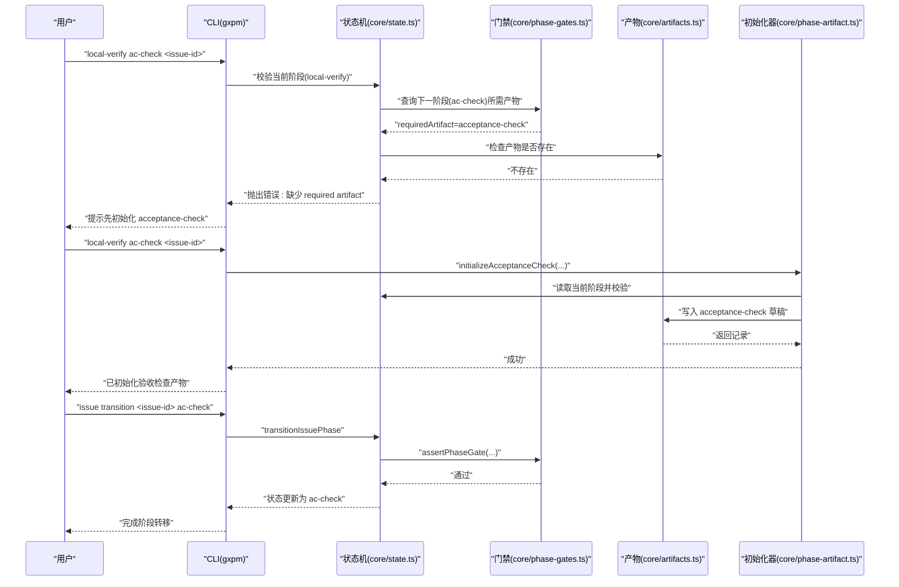
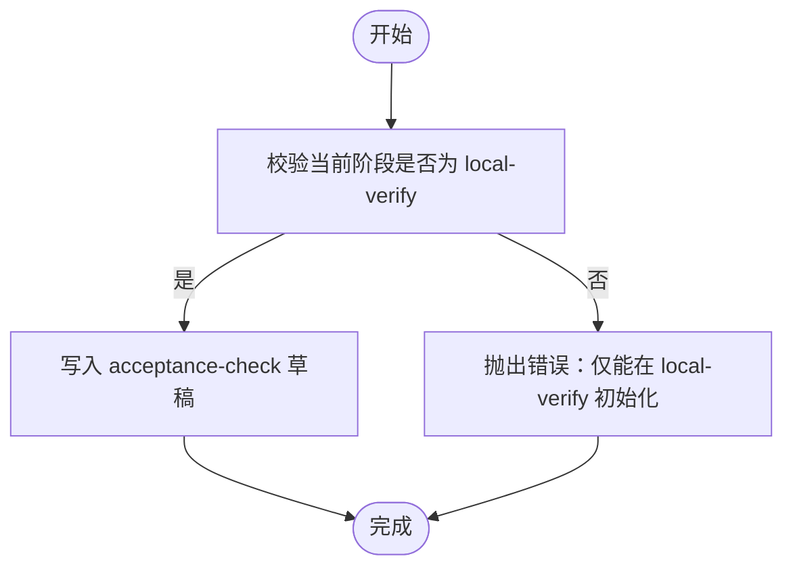
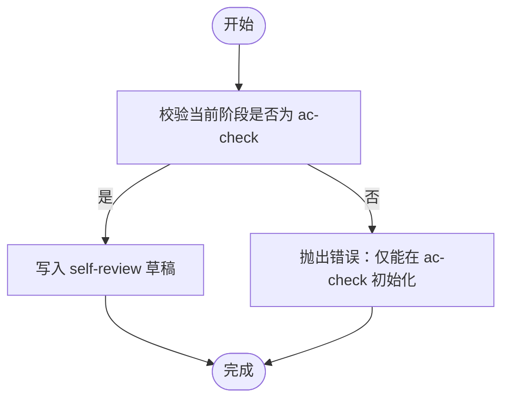
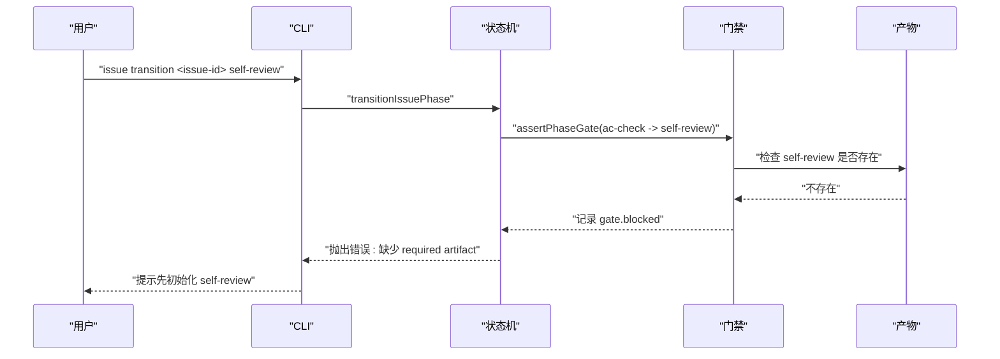
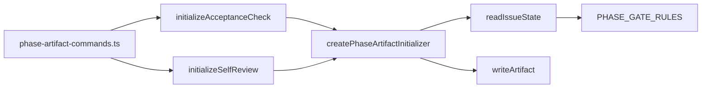

# 验收检查阶段（AC Check）

<cite>
**本文引用的文件**
- [core/ac-check.ts](file://core/ac-check.ts)
- [core/self-review.ts](file://core/self-review.ts)
- [core/phase-artifact.ts](file://core/phase-artifact.ts)
- [core/artifacts.ts](file://core/artifacts.ts)
- [core/state.ts](file://core/state.ts)
- [core/phase-gates.ts](file://core/phase-gates.ts)
- [scripts/phase-artifact-commands.ts](file://scripts/phase-artifact-commands.ts)
- [test/ac-check-gate.test.ts](file://test/ac-check-gate.test.ts)
- [test/self-review-gate.test.ts](file://test/self-review-gate.test.ts)
- [docs/architecture/gxpm-v0-contract.md](file://docs/architecture/gxpm-v0-contract.md)
- [docs/governance/development-contract.md](file://docs/governance/development-contract.md)
- [bin/gxpm](file://bin/gxpm)
- [package.json](file://package.json)
</cite>

## 目录
1. [简介](#简介)
2. [项目结构](#项目结构)
3. [核心组件](#核心组件)
4. [架构总览](#架构总览)
5. [详细组件分析](#详细组件分析)
6. [依赖关系分析](#依赖关系分析)
7. [性能考量](#性能考量)
8. [故障排查指南](#故障排查指南)
9. [结论](#结论)
10. [附录](#附录)

## 简介
本文件面向 gxpm 的验收检查阶段（ac-check），系统性阐述该阶段的核心职责与目标，包括功能完整性检查、用户故事验证与验收标准确认；并重点说明该阶段必需的产物类型“self-review”的要求与标准；提供 ac-check self-review 命令的使用方法与参数说明；解释如何进行有效的验收检查；最后总结常见陷阱与最佳实践。

## 项目结构
围绕验收检查阶段的关键文件组织如下：
- 初始化器：负责在正确阶段生成对应产物
  - acceptance-check 初始化器：[core/ac-check.ts](file://core/ac-check.ts)
  - self-review 初始化器：[core/self-review.ts](file://core/self-review.ts)
- 通用初始化框架：统一校验阶段并写入产物
  - [core/phase-artifact.ts](file://core/phase-artifact.ts)
- 产物存储与索引
  - [core/artifacts.ts](file://core/artifacts.ts)
- 状态机与阶段门禁
  - [core/state.ts](file://core/state.ts)
  - [core/phase-gates.ts](file://core/phase-gates.ts)
- CLI 绑定与命令注册
  - [scripts/phase-artifact-commands.ts](file://scripts/phase-artifact-commands.ts)
- 合同与治理文档
  - [docs/architecture/gxpm-v0-contract.md](file://docs/architecture/gxpm-v0-contract.md)
  - [docs/governance/development-contract.md](file://docs/governance/development-contract.md)
- CLI 入口
  - [bin/gxpm](file://bin/gxpm)
  - [package.json](file://package.json)

```mermaid
graph TB
subgraph "阶段与产物"
AC["acceptance-check<br/>验收检查产物"]
SR["self-review<br/>自检产物"]
end
subgraph "初始化器"
InitAC["initializeAcceptanceCheck<br/>core/ac-check.ts"]
InitSR["initializeSelfReview<br/>core/self-review.ts"]
BaseInit["createPhaseArtifactInitializer<br/>core/phase-artifact.ts"]
end
subgraph "状态与门禁"
State["transitionIssuePhase<br/>core/state.ts"]
Gates["PHASE_GATE_RULES<br/>core/phase-gates.ts"]
end
subgraph "CLI"
CLI["gxpm<br/>bin/gxpm"]
Reg["phase-artifact-commands.ts"]
end
InitAC --> BaseInit
InitSR --> BaseInit
BaseInit --> State
State --> Gates
Reg --> InitAC
Reg --> InitSR
CLI --> Reg
AC -. "required by" .- Gates
SR -. "required by" .- Gates
```

图表来源
- [core/ac-check.ts:1-15](file://core/ac-check.ts#L1-L15)
- [core/self-review.ts:1-15](file://core/self-review.ts#L1-L15)
- [core/phase-artifact.ts:16-32](file://core/phase-artifact.ts#L16-L32)
- [core/state.ts:150-205](file://core/state.ts#L150-L205)
- [core/phase-gates.ts:32-99](file://core/phase-gates.ts#L32-L99)
- [scripts/phase-artifact-commands.ts:22-76](file://scripts/phase-artifact-commands.ts#L22-L76)
- [bin/gxpm:17](file://bin/gxpm#L17)

章节来源
- [core/ac-check.ts:1-15](file://core/ac-check.ts#L1-L15)
- [core/self-review.ts:1-15](file://core/self-review.ts#L1-L15)
- [core/phase-artifact.ts:16-32](file://core/phase-artifact.ts#L16-L32)
- [core/state.ts:150-205](file://core/state.ts#L150-L205)
- [core/phase-gates.ts:32-99](file://core/phase-gates.ts#L32-L99)
- [scripts/phase-artifact-commands.ts:22-76](file://scripts/phase-artifact-commands.ts#L22-L76)
- [bin/gxpm:17](file://bin/gxpm#L17)

## 核心组件
- acceptance-check 初始化器
  - 类型：验收检查产物
  - 所属阶段：local-verify
  - 草稿载荷字段：criteria、findings、localVerifyArtifact、status、summary
  - 关键约束：仅能在 local-verify 阶段初始化
- self-review 初始化器
  - 类型：自检产物
  - 所属阶段：ac-check
  - 草稿载荷字段：findings、reviewedArtifacts、risks、status、summary
  - 关键约束：仅能在 ac-check 阶段初始化
- 通用初始化框架
  - 作用：读取当前阶段、校验所需阶段、写入产物并更新索引与事件
- 阶段门禁与状态机
  - 作用：定义阶段间转移规则与所需产物，触发 gate.blocked/gate.passed 事件
- CLI 绑定
  - 作用：将阶段产物初始化命令与阶段门禁规则绑定，提供用户可执行命令

章节来源
- [core/ac-check.ts:3-14](file://core/ac-check.ts#L3-L14)
- [core/self-review.ts:3-14](file://core/self-review.ts#L3-L14)
- [core/phase-artifact.ts:16-32](file://core/phase-artifact.ts#L16-L32)
- [core/state.ts:253-302](file://core/state.ts#L253-L302)
- [core/phase-gates.ts:107-117](file://core/phase-gates.ts#L107-L117)
- [scripts/phase-artifact-commands.ts:22-76](file://scripts/phase-artifact-commands.ts#L22-L76)

## 架构总览
验收检查阶段（ac-check）位于“local-verify -> ac-check -> self-review”的链路中，其职责是：
- 功能完整性检查：基于验收标准对实现结果进行核验
- 用户故事验证：确保交付符合验收条件
- 验收标准确认：产出验收检查产物，作为进入下一阶段的门禁凭证



图表来源
- [core/state.ts:150-205](file://core/state.ts#L150-L205)
- [core/state.ts:253-302](file://core/state.ts#L253-L302)
- [core/phase-gates.ts:107-117](file://core/phase-gates.ts#L107-L117)
- [core/phase-artifact.ts:16-32](file://core/phase-artifact.ts#L16-L32)
- [core/artifacts.ts:57-91](file://core/artifacts.ts#L57-L91)
- [test/ac-check-gate.test.ts:32-60](file://test/ac-check-gate.test.ts#L32-L60)

## 详细组件分析

### acceptance-check 初始化器（ac-check）
- 职责
  - 在 local-verify 阶段生成验收检查产物草稿
  - 作为“local-verify -> ac-check”的门禁凭证
- 草稿载荷
  - criteria：验收标准清单
  - findings：检查发现
  - localVerifyArtifact：关联的 local-verify 产物名
  - status：草稿/待评审/通过等状态
  - summary：摘要
- 初始化流程
  - 通过 createPhaseArtifactInitializer 创建
  - 校验当前阶段必须为 local-verify
  - 写入 artifacts/acceptance-check.json
- CLI 使用
  - 命令：gxpm local-verify ac-check <issue-id>
  - 作用：初始化 acceptance-check 草稿，随后可进入 ac-check 阶段



图表来源
- [core/phase-artifact.ts:18-30](file://core/phase-artifact.ts#L18-L30)
- [core/ac-check.ts:3-14](file://core/ac-check.ts#L3-L14)

章节来源
- [core/ac-check.ts:3-14](file://core/ac-check.ts#L3-L14)
- [core/phase-artifact.ts:16-32](file://core/phase-artifact.ts#L16-L32)
- [test/ac-check-gate.test.ts:11-30](file://test/ac-check-gate.test.ts#L11-L30)

### self-review 初始化器（ac-check -> self-review）
- 职责
  - 在 ac-check 阶段生成自检产物草稿
  - 作为“ac-check -> self-review”的门禁凭证
- 草稿载荷
  - findings：自检发现
  - reviewedArtifacts：被评审的产物列表（如 acceptance-check、local-verify）
  - risks：识别的风险
  - status：草稿/待评审/通过等状态
  - summary：摘要
- 初始化流程
  - 通过 createPhaseArtifactInitializer 创建
  - 校验当前阶段必须为 ac-check
  - 写入 artifacts/self-review.json
- CLI 使用
  - 命令：gxpm ac-check self-review <issue-id>
  - 作用：初始化 self-review 草稿，随后可进入 self-review 阶段



图表来源
- [core/phase-artifact.ts:18-30](file://core/phase-artifact.ts#L18-L30)
- [core/self-review.ts:3-14](file://core/self-review.ts#L3-L14)

章节来源
- [core/self-review.ts:3-14](file://core/self-review.ts#L3-L14)
- [core/phase-artifact.ts:16-32](file://core/phase-artifact.ts#L16-L32)
- [test/self-review-gate.test.ts:11-30](file://test/self-review-gate.test.ts#L11-L30)

### 阶段门禁与状态机
- 阶段序列（节选）
  - triage -> plan -> dispatch -> implement -> local-verify -> ac-check -> self-review -> ship -> pr-check -> verify -> qa -> land
- 门禁规则（节选）
  - local-verify -> ac-check：需要 acceptance-check
  - ac-check -> self-review：需要 self-review
- 状态转移
  - transitionIssuePhase 负责校验下一阶段合法性与门禁产物存在性
  - 若缺少门禁产物，抛出错误并记录 gate.blocked 事件



图表来源
- [core/state.ts:150-205](file://core/state.ts#L150-L205)
- [core/state.ts:253-302](file://core/state.ts#L253-L302)
- [core/phase-gates.ts:107-117](file://core/phase-gates.ts#L107-L117)
- [test/self-review-gate.test.ts:32-60](file://test/self-review-gate.test.ts#L32-L60)

章节来源
- [core/state.ts:150-205](file://core/state.ts#L150-L205)
- [core/state.ts:253-302](file://core/state.ts#L253-L302)
- [core/phase-gates.ts:32-99](file://core/phase-gates.ts#L32-L99)
- [test/self-review-gate.test.ts:32-60](file://test/self-review-gate.test.ts#L32-L60)

### CLI 命令与绑定
- 命令注册
  - scripts/phase-artifact-commands.ts 将各阶段产物初始化命令与 PHASE_GATE_RULES 绑定
  - ac-check self-review 对应命令为 gxpm ac-check self-review <issue-id>
- CLI 入口
  - bin/gxpm 作为 Bash 入口，转发到 scripts/gxpm.ts
  - package.json 定义了 gxpm 可执行入口

章节来源
- [scripts/phase-artifact-commands.ts:22-76](file://scripts/phase-artifact-commands.ts#L22-L76)
- [bin/gxpm:17](file://bin/gxpm#L17)
- [package.json:7-12](file://package.json#L7-L12)

## 依赖关系分析
- 初始化器依赖
  - initializeAcceptanceCheck 依赖 createPhaseArtifactInitializer
  - initializeSelfReview 依赖 createPhaseArtifactInitializer
- 通用框架
  - createPhaseArtifactInitializer 依赖 readIssueState 与 writeArtifact
- 状态与门禁
  - transitionIssuePhase 依赖 PHASE_GATE_RULES 与事件记录
- CLI 绑定
  - phase-artifact-commands.ts 依赖各初始化器与 PHASE_GATE_RULES



图表来源
- [core/ac-check.ts:1-15](file://core/ac-check.ts#L1-L15)
- [core/self-review.ts:1-15](file://core/self-review.ts#L1-L15)
- [core/phase-artifact.ts:16-32](file://core/phase-artifact.ts#L16-L32)
- [core/state.ts:150-205](file://core/state.ts#L150-L205)
- [core/phase-gates.ts:32-99](file://core/phase-gates.ts#L32-L99)
- [scripts/phase-artifact-commands.ts:22-76](file://scripts/phase-artifact-commands.ts#L22-L76)

章节来源
- [core/ac-check.ts:1-15](file://core/ac-check.ts#L1-L15)
- [core/self-review.ts:1-15](file://core/self-review.ts#L1-L15)
- [core/phase-artifact.ts:16-32](file://core/phase-artifact.ts#L16-L32)
- [core/state.ts:150-205](file://core/state.ts#L150-L205)
- [core/phase-gates.ts:32-99](file://core/phase-gates.ts#L32-L99)
- [scripts/phase-artifact-commands.ts:22-76](file://scripts/phase-artifact-commands.ts#L22-L76)

## 性能考量
- 初始化器为轻量写入操作，主要开销来自文件系统写入与事件追加
- 阶段门禁检查为 O(1) 查表操作，性能可忽略
- 建议在 CI 中批量运行测试以减少重复 IO 开销

## 故障排查指南
- 错误：仅能在某阶段初始化
  - 现象：调用初始化命令时报错，提示仅能在特定阶段初始化
  - 排查：确认当前阶段是否为目标阶段；若非，请先完成前置阶段
  - 参考
    - [core/phase-artifact.ts:18-23](file://core/phase-artifact.ts#L18-L23)
    - [test/ac-check-gate.test.ts:11-17](file://test/ac-check-gate.test.ts#L11-L17)
    - [test/self-review-gate.test.ts:11-17](file://test/self-review-gate.test.ts#L11-L17)
- 错误：缺少 required artifact
  - 现象：阶段转移时报错，提示缺少门禁产物
  - 排查：先执行相应初始化命令生成产物；查看 events.jsonl 中 gate.blocked 记录
  - 参考
    - [core/state.ts:299-301](file://core/state.ts#L299-L301)
    - [test/ac-check-gate.test.ts:32-60](file://test/ac-check-gate.test.ts#L32-L60)
    - [test/self-review-gate.test.ts:32-60](file://test/self-review-gate.test.ts#L32-L60)
- CLI 使用异常
  - 现象：命令执行失败或输出不符合预期
  - 排查：确认命令格式与 issue-id 正确；检查 artifacts 目录与索引文件
  - 参考
    - [scripts/phase-artifact-commands.ts:78-83](file://scripts/phase-artifact-commands.ts#L78-L83)
    - [bin/gxpm:17](file://bin/gxpm#L17)

章节来源
- [core/phase-artifact.ts:18-23](file://core/phase-artifact.ts#L18-L23)
- [core/state.ts:299-301](file://core/state.ts#L299-L301)
- [scripts/phase-artifact-commands.ts:78-83](file://scripts/phase-artifact-commands.ts#L78-L83)
- [bin/gxpm:17](file://bin/gxpm#L17)
- [test/ac-check-gate.test.ts:11-17](file://test/ac-check-gate.test.ts#L11-L17)
- [test/self-review-gate.test.ts:11-17](file://test/self-review-gate.test.ts#L11-L17)

## 结论
验收检查阶段（ac-check）通过“acceptance-check”产物确保功能与验收标准一致，再通过“self-review”产物完成内部自检与风险识别，最终推动进入“self-review”阶段。该流程由阶段门禁与初始化器共同保障，CLI 提供清晰的命令路径。遵循本文的使用方法与最佳实践，可有效避免常见陷阱并提升验收效率。

## 附录

### ac-check self-review 命令使用与参数说明
- 命令
  - gxpm ac-check self-review <issue-id>
- 用途
  - 在 ac-check 阶段初始化 self-review 草稿，随后可进入 self-review 阶段
- 参数
  - issue-id：目标问题标识符
- 行为
  - 校验当前阶段为 ac-check
  - 写入 artifacts/self-review.json 草稿
  - 输出成功消息并提示后续 transition

章节来源
- [scripts/phase-artifact-commands.ts:46-49](file://scripts/phase-artifact-commands.ts#L46-L49)
- [test/self-review-gate.test.ts:62-87](file://test/self-review-gate.test.ts#L62-L87)

### 如何进行有效的验收检查
- 准备工作
  - 确保已完成 local-verify 并生成 local-verify 产物
  - 确认验收标准（criteria）已明确并可执行
- 执行步骤
  - 初始化 acceptance-check：gxpm local-verify ac-check <issue-id>
  - 进入 ac-check 阶段：gxpm issue transition <issue-id> ac-check
  - 初始化 self-review：gxpm ac-check self-review <issue-id>
  - 进入 self-review 阶段：gxpm issue transition <issue-id> self-review
- 验收要点
  - criteria 与 findings 对齐
  - reviewedArtifacts 明确列出关联产物
  - risks 清晰可追踪
  - summary 覆盖关键结论

章节来源
- [docs/architecture/gxpm-v0-contract.md:116-118](file://docs/architecture/gxpm-v0-contract.md#L116-L118)
- [test/ac-check-gate.test.ts:62-88](file://test/ac-check-gate.test.ts#L62-L88)
- [test/self-review-gate.test.ts:62-87](file://test/self-review-gate.test.ts#L62-L87)

### 常见陷阱与最佳实践
- 常见陷阱
  - 在错误阶段初始化产物（如在 triage 初始化 acceptance-check）
  - 忽略门禁产物导致阶段转移失败
  - 忽略 events.jsonl 中的 gate.blocked 记录
- 最佳实践
  - 严格按阶段门禁顺序推进
  - 在 CI 中自动校验阶段转移与产物存在性
  - 使用 CLI 命令生成草稿并及时 transition
  - 在 self-review 中明确列出 reviewedArtifacts 与 risks

章节来源
- [docs/governance/development-contract.md:30-41](file://docs/governance/development-contract.md#L30-L41)
- [test/ac-check-gate.test.ts:11-17](file://test/ac-check-gate.test.ts#L11-L17)
- [test/self-review-gate.test.ts:11-17](file://test/self-review-gate.test.ts#L11-L17)