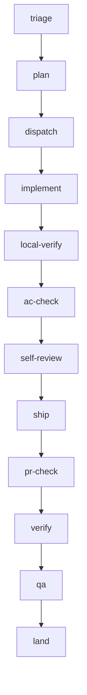
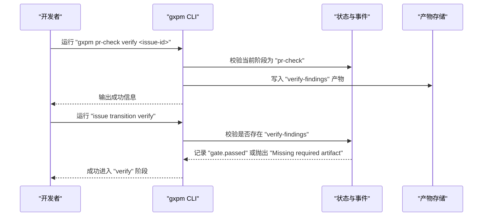
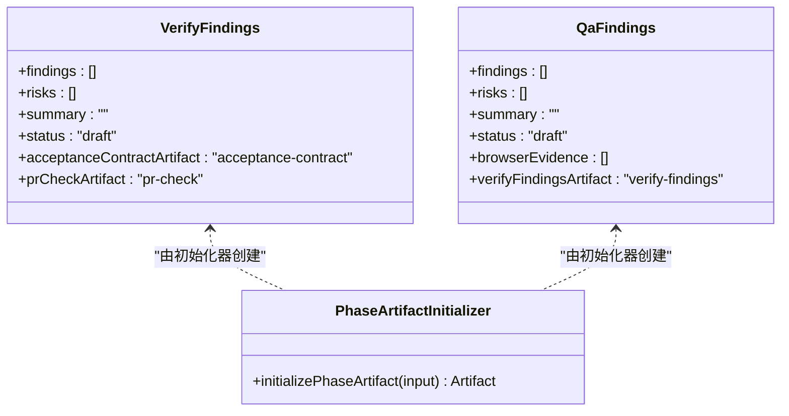
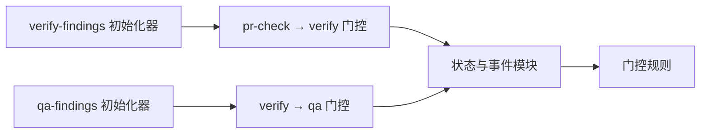

# 验证阶段（Verify）

<cite>
**本文引用的文件**
- [core/verify.ts](file://core/verify.ts)
- [core/qa.ts](file://core/qa.ts)
- [core/phase-artifact.ts](file://core/phase-artifact.ts)
- [core/phase-gates.ts](file://core/phase-gates.ts)
- [core/state.ts](file://core/state.ts)
- [scripts/phase-artifact-commands.ts](file://scripts/phase-artifact-commands.ts)
- [test/verify-gate.test.ts](file://test/verify-gate.test.ts)
- [test/qa-gate.test.ts](file://test/qa-gate.test.ts)
- [test/helpers/workflow.ts](file://test/helpers/workflow.ts)
- [core/implement.ts](file://core/implement.ts)
- [core/ac-check.ts](file://core/ac-check.ts)
- [core/self-review.ts](file://core/self-review.ts)
</cite>

## 目录
1. [引言](#引言)
2. [项目结构](#项目结构)
3. [核心组件](#核心组件)
4. [架构总览](#架构总览)
5. [详细组件分析](#详细组件分析)
6. [依赖关系分析](#依赖关系分析)
7. [性能考量](#性能考量)
8. [故障排查指南](#故障排查指南)
9. [结论](#结论)
10. [附录](#附录)

## 引言
本文件面向 gxpm 的验证阶段（Verify），系统性阐述该阶段在整体工作流中的职责与目标，重点覆盖以下方面：
- 验证阶段的核心职责：功能验证、回归测试与质量确认
- 必需产物类型“verify-findings”的结构、字段与标准
- verify 与 qa 两个子阶段的命令用法与参数说明
- 如何进行全流程的功能验证
- 常见陷阱与最佳实践

## 项目结构
验证阶段位于“pr-check”之后、“qa”之前，是质量把关的关键环节。其产物“verify-findings”作为进入“verify”阶段的门控条件，同时被后续“qa”阶段引用。

图表来源
- [core/phase-gates.ts:32-99](file://core/phase-gates.ts#L32-L99)

章节来源
- [core/phase-gates.ts:1-118](file://core/phase-gates.ts#L1-L118)

## 核心组件
- verify-findings 初始化器：限定在“pr-check”阶段创建，用于承载验证阶段的质量发现与风险评估
- qa-findings 初始化器：限定在“verify”阶段创建，用于承载 QA 阶段的浏览器证据与进一步发现
- 阶段门控规则：定义了从“pr-check”到“verify”需要“verify-findings”，从“verify”到“qa”需要“qa-findings”
- 状态与事件：在状态转换时校验门控产物是否存在，并记录“gate.blocked/gate.passed”事件

章节来源
- [core/verify.ts:1-16](file://core/verify.ts#L1-L16)
- [core/qa.ts:1-16](file://core/qa.ts#L1-L16)
- [core/phase-artifact.ts:1-33](file://core/phase-artifact.ts#L1-L33)
- [core/phase-gates.ts:32-99](file://core/phase-gates.ts#L32-L99)
- [core/state.ts:253-302](file://core/state.ts#L253-L302)

## 架构总览
验证阶段的产物与命令由统一的“阶段产物初始化器”机制驱动，CLI 通过“阶段门控命令”提示用户按顺序完成各阶段产物的创建。

图表来源
- [scripts/phase-artifact-commands.ts:58-61](file://scripts/phase-artifact-commands.ts#L58-L61)
- [core/phase-gates.ts:81-86](file://core/phase-gates.ts#L81-L86)
- [core/state.ts:253-302](file://core/state.ts#L253-L302)

## 详细组件分析

### verify-findings 产物规范
- 类型：verify-findings
- 所属阶段：pr-check → verify 的门控产物
- 关联引用：
  - acceptance-contract：验收契约
  - pr-check：PR 检查产物
- 字段概览（草稿态）：
  - findings：数组，存放验证发现
  - risks：数组，存放验证风险
  - summary：字符串，验证摘要
  - status：字符串，状态（默认 draft）
- 初始化约束：
  - 仅能在“pr-check”阶段创建
  - 创建后方可从“pr-check”向“verify”阶段推进

章节来源
- [core/verify.ts:3-15](file://core/verify.ts#L3-L15)
- [core/phase-artifact.ts:16-32](file://core/phase-artifact.ts#L16-L32)
- [core/phase-gates.ts:81-86](file://core/phase-gates.ts#L81-L86)

### qa-findings 产物规范
- 类型：qa-findings
- 所属阶段：verify → qa 的门控产物
- 关联引用：
  - verify-findings：验证阶段产物
- 字段概览（草稿态）：
  - findings：数组，存放 QA 发现
  - risks：数组，存放 QA 风险
  - summary：字符串，QA 摘要
  - browserEvidence：数组，存放浏览器证据
  - status：字符串，状态（默认 draft）
- 初始化约束：
  - 仅能在“verify”阶段创建
  - 创建后方可从“verify”向“qa”阶段推进

章节来源
- [core/qa.ts:3-15](file://core/qa.ts#L3-L15)
- [core/phase-artifact.ts:16-32](file://core/phase-artifact.ts#L16-L32)
- [core/phase-gates.ts:87-92](file://core/phase-gates.ts#L87-L92)

### 阶段门控与命令映射
- 门控规则：
  - pr-check → verify：需要 verify-findings
  - verify → qa：需要 qa-findings
- CLI 命令提示：
  - 当缺少门控产物时，状态模块会返回错误并提示应运行的具体命令
- 命令与产物映射：
  - “gxpm pr-check verify <issue-id>” 初始化 verify-findings
  - “gxpm verify qa <issue-id>” 初始化 qa-findings

章节来源
- [core/phase-gates.ts:81-92](file://core/phase-gates.ts#L81-L92)
- [core/state.ts:253-302](file://core/state.ts#L253-L302)
- [scripts/phase-artifact-commands.ts:58-65](file://scripts/phase-artifact-commands.ts#L58-L65)

### 验证阶段命令用法与参数
- 初始化 verify-findings
  - 命令：gxpm pr-check verify <issue-id>
  - 作用：在“pr-check”阶段创建 verify-findings 产物
  - 输出：成功消息，包含 issue 编号
- 初始化 qa-findings
  - 命令：gxpm verify qa <issue-id>
  - 作用：在“verify”阶段创建 qa-findings 产物
  - 输出：成功消息，包含 issue 编号
- 跳转到 verify/qa 阶段
  - 命令：issue transition verify / issue transition qa
  - 作用：在满足门控条件下推进到下一阶段
  - 注意：若缺少对应产物，将提示缺失并给出初始化命令

章节来源
- [test/verify-gate.test.ts:63-88](file://test/verify-gate.test.ts#L63-L88)
- [test/qa-gate.test.ts:63-88](file://test/qa-gate.test.ts#L63-L88)
- [core/state.ts:299-301](file://core/state.ts#L299-L301)

### 全流程功能验证方法
- 步骤一：确保已创建 PR 检查产物（pr-check），方可初始化 verify-findings
- 步骤二：在“pr-check”阶段执行初始化命令，生成 verify-findings
- 步骤三：执行“issue transition verify”，进入验证阶段
- 步骤四：在验证阶段执行功能验证与回归测试，完善 findings、risks、summary
- 步骤五：在“verify”阶段执行初始化命令，生成 qa-findings
- 步骤六：执行“issue transition qa”，进入 QA 阶段
- 步骤七：在 QA 阶段补充浏览器证据与进一步发现，完成质量确认

章节来源
- [core/phase-gates.ts:81-92](file://core/phase-gates.ts#L81-L92)
- [test/verify-gate.test.ts:10-61](file://test/verify-gate.test.ts#L10-L61)
- [test/qa-gate.test.ts:10-61](file://test/qa-gate.test.ts#L10-L61)

### 验证阶段类图（对象模型）

图表来源
- [core/verify.ts:3-15](file://core/verify.ts#L3-L15)
- [core/qa.ts:3-15](file://core/qa.ts#L3-L15)
- [core/phase-artifact.ts:16-32](file://core/phase-artifact.ts#L16-L32)

## 依赖关系分析
- verify-findings 依赖：
  - pr-check 阶段状态
  - 验收契约（acceptance-contract）引用
- qa-findings 依赖：
  - verify 阶段状态
  - verify-findings 引用
- 门控规则与状态模块耦合：
  - 状态模块在阶段转换时读取门控规则，校验产物存在性并记录事件

图表来源
- [core/phase-gates.ts:81-92](file://core/phase-gates.ts#L81-L92)
- [core/state.ts:253-302](file://core/state.ts#L253-L302)
- [core/verify.ts:3-15](file://core/verify.ts#L3-L15)
- [core/qa.ts:3-15](file://core/qa.ts#L3-L15)

章节来源
- [core/phase-gates.ts:1-118](file://core/phase-gates.ts#L1-L118)
- [core/state.ts:1-303](file://core/state.ts#L1-L303)

## 性能考量
- 产物写入与事件追加均为本地文件操作，开销极低
- 门控校验仅检查目标产物文件是否存在，复杂度为 O(1)
- 建议在 CI 中复用相同的工作流步骤，避免重复初始化

## 故障排查指南
- 错误：在非“pr-check”阶段初始化 verify-findings
  - 现象：抛出异常，提示只能在“pr-check”阶段初始化
  - 处理：先完成“pr-check”，再执行初始化命令
- 错误：从“pr-check”直接跳转到“verify”未创建 verify-findings
  - 现象：提示缺失门控产物，并给出初始化命令
  - 处理：先执行初始化命令，再尝试跳转
- 错误：在非“verify”阶段初始化 qa-findings
  - 现象：抛出异常，提示只能在“verify”阶段初始化
  - 处理：先完成“verify”，再执行初始化命令
- 错误：从“verify”直接跳转到“qa”未创建 qa-findings
  - 现象：提示缺失门控产物，并给出初始化命令
  - 处理：先执行初始化命令，再尝试跳转

章节来源
- [test/verify-gate.test.ts:11-61](file://test/verify-gate.test.ts#L11-L61)
- [test/qa-gate.test.ts:11-61](file://test/qa-gate.test.ts#L11-L61)
- [core/state.ts:299-301](file://core/state.ts#L299-L301)

## 结论
验证阶段（Verify）是 gxpm 工作流中承上启下的关键节点，通过“verify-findings”和“qa-findings”两个门控产物，确保功能验证与质量确认的有序开展。遵循阶段门控规则与命令提示，可有效避免跨阶段推进的风险；配合完善的发现与风险记录，有助于形成可追溯的质量闭环。

## 附录
- 相关阶段与产物速览
  - pr-check → verify：verify-findings
  - verify → qa：qa-findings
- 参考命令
  - gxpm pr-check verify <issue-id>
  - gxpm verify qa <issue-id>
  - issue transition verify / issue transition qa

章节来源
- [core/phase-gates.ts:81-92](file://core/phase-gates.ts#L81-L92)
- [scripts/phase-artifact-commands.ts:58-65](file://scripts/phase-artifact-commands.ts#L58-L65)