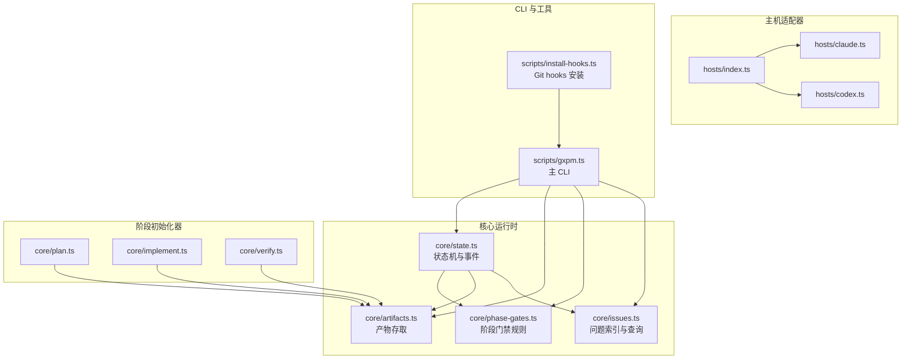
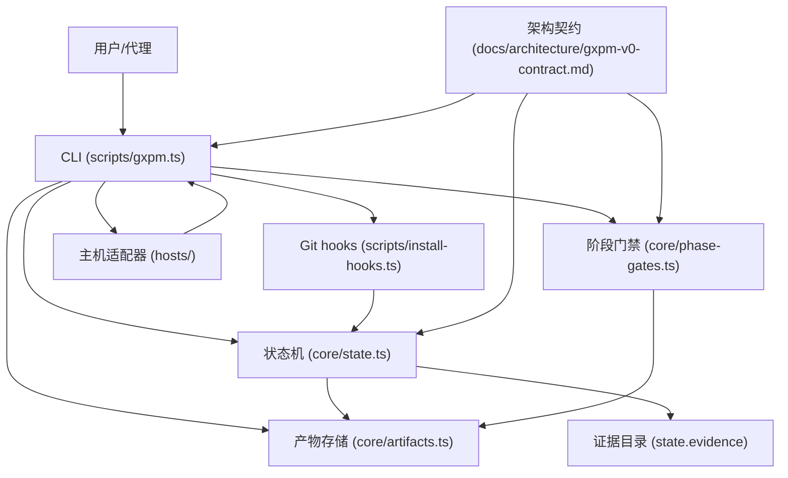
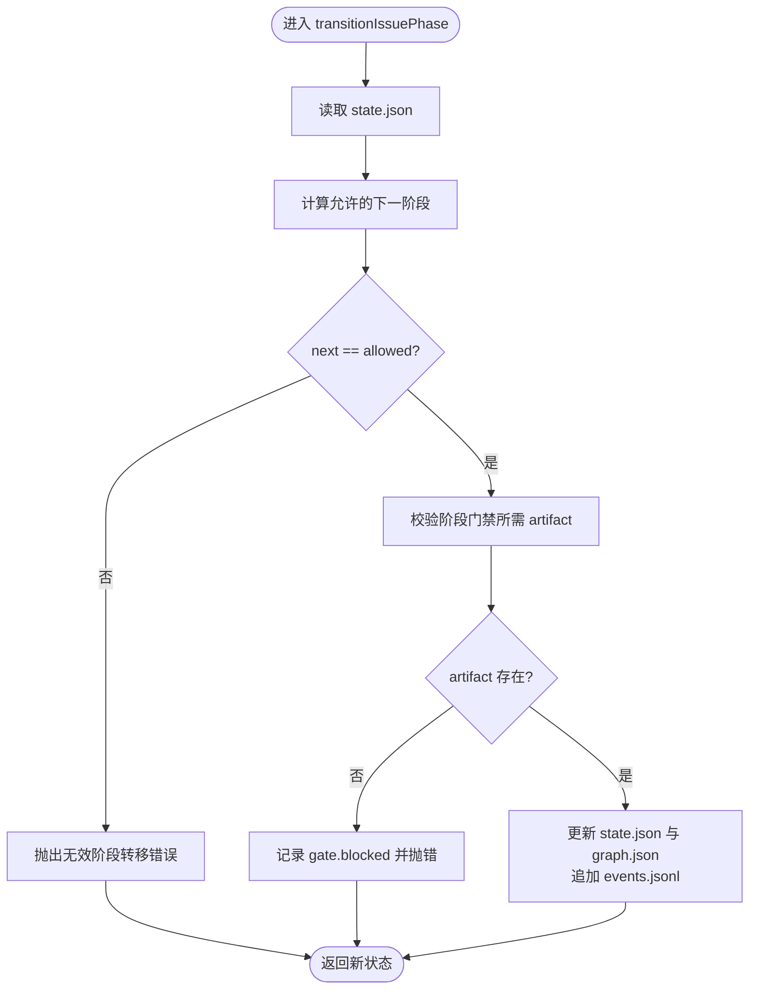
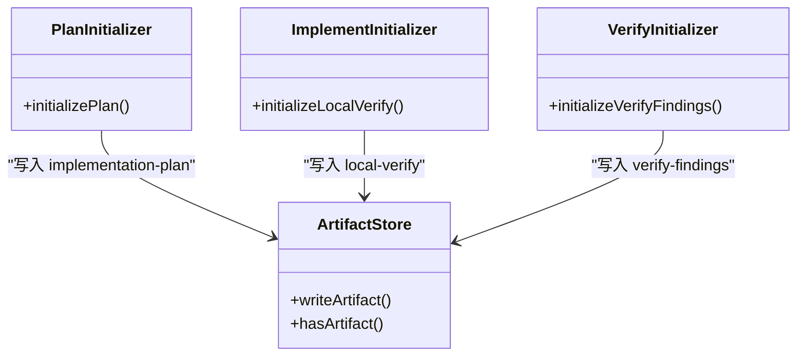
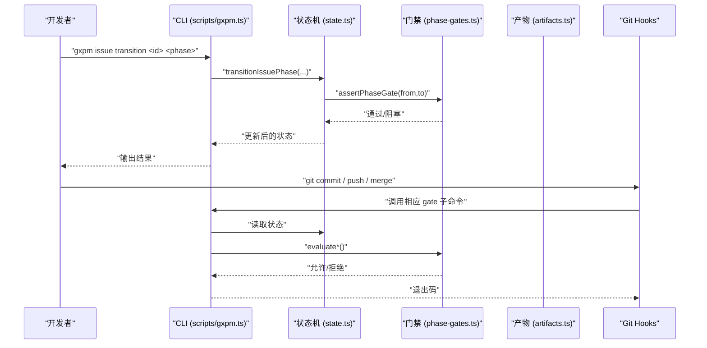
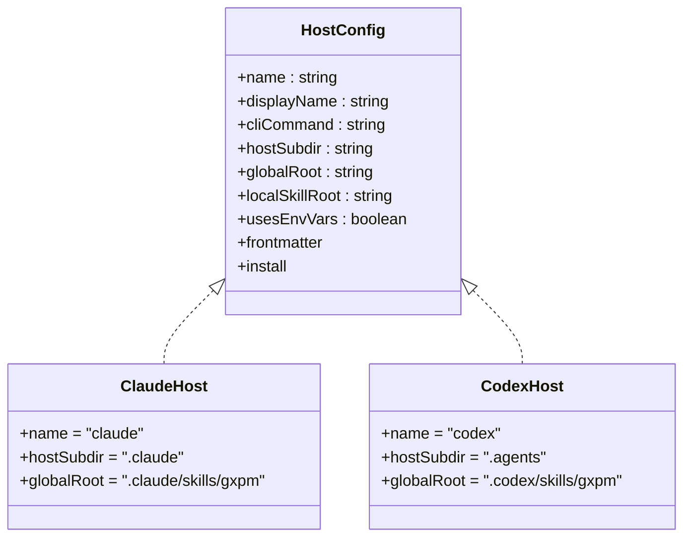
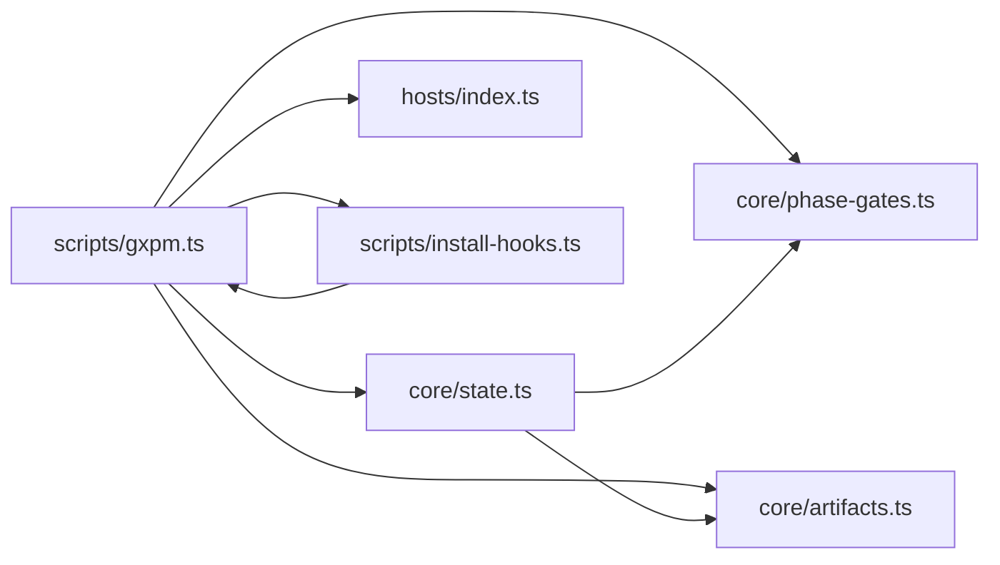

# 项目概述

<cite>
**本文引用的文件**
- [package.json](file://package.json)
- [AGENTS.md](file://AGENTS.md)
- [CLAUDE.md](file://CLAUDE.md)
- [docs/research/pmc-gstack-skill-study.md](file://docs/research/pmc-gstack-skill-study.md)
- [docs/roadmap/initial-roadmap.md](file://docs/roadmap/initial-roadmap.md)
- [docs/architecture/gxpm-v0-contract.md](file://docs/architecture/gxpm-v0-contract.md)
- [core/state.ts](file://core/state.ts)
- [core/plan.ts](file://core/plan.ts)
- [core/implement.ts](file://core/implement.ts)
- [core/verify.ts](file://core/verify.ts)
- [hosts/index.ts](file://hosts/index.ts)
- [hosts/claude.ts](file://hosts/claude.ts)
- [hosts/codex.ts](file://hosts/codex.ts)
- [scripts/gxpm.ts](file://scripts/gxpm.ts)
- [scripts/install-hooks.ts](file://scripts/install-hooks.ts)
</cite>

## 目录
1. [引言](#引言)
2. [项目结构](#项目结构)
3. [核心组件](#核心组件)
4. [架构总览](#架构总览)
5. [详细组件分析](#详细组件分析)
6. [依赖分析](#依赖分析)
7. [性能考虑](#性能考虑)
8. [故障排查指南](#故障排查指南)
9. [结论](#结论)
10. [附录](#附录)

## 引言
gxpm 是第二代项目管理运行时，旨在替代 PMC 与 gstack，提供统一的状态机驱动项目生命周期、可审计的产物存储、证据库与治理门禁，并通过技能框架与主机适配器实现跨代理（Claude、Codex 等）的一致体验。其核心价值在于：
- 将 Linear issue、阶段状态、执行代理、验证证据、浏览器 QA、评审、发布收口与上下文恢复整合到同一原生系统
- 以“产物即真值”的 artifact-first 设计，确保可恢复、可审计、可复核
- 通过 Git hooks 与 CLI 门禁，保证阶段推进的合规性与安全性
- 以能力运行时（capability runtime）抽象 PMC/gstack 的能力，形成可演进的产品架构

## 项目结构
项目采用按职责域划分的模块化组织方式，核心包括：
- 核心运行时：状态机、阶段门禁、产物与证据存储、事件日志
- 主机适配器：对 Claude、Codex 等代理的安装与配置抽象
- 脚本与工具：CLI、Git hooks 安装、健康检查、技能文档生成
- 文档与路线图：架构契约、研究对比、初始路线图

图表来源
- [core/state.ts:1-302](file://core/state.ts#L1-L302)
- [core/plan.ts:1-15](file://core/plan.ts#L1-L15)
- [core/implement.ts:1-16](file://core/implement.ts#L1-L16)
- [core/verify.ts:1-16](file://core/verify.ts#L1-L16)
- [hosts/index.ts:1-16](file://hosts/index.ts#L1-L16)
- [hosts/claude.ts:1-18](file://hosts/claude.ts#L1-L18)
- [hosts/codex.ts:1-19](file://hosts/codex.ts#L1-L19)
- [scripts/gxpm.ts:1-611](file://scripts/gxpm.ts#L1-L611)
- [scripts/install-hooks.ts:1-106](file://scripts/install-hooks.ts#L1-L106)

章节来源
- [package.json:1-25](file://package.json#L1-L25)
- [docs/roadmap/initial-roadmap.md:1-54](file://docs/roadmap/initial-roadmap.md#L1-L54)

## 核心组件
- 状态机与阶段门禁：定义标准阶段序列与阶段间必需产物，确保阶段推进的确定性与可审计性
- 产物与证据存储：以 JSON artifact 为核心，配套证据目录（如截图）
- 事件日志：记录阶段转换、产物写入、门禁通过/阻塞等事件，便于回溯
- CLI 与门禁：提供 issue 生命周期管理、artifact 读写、阶段推进与 Git hooks 门禁
- 主机适配器：抽象 Claude/Codex 的安装路径、全局/本地技能根目录、环境变量与前置元信息
- 路线图与契约：明确 V0 的最小可运行闭环与后续演进方向

章节来源
- [docs/architecture/gxpm-v0-contract.md:1-226](file://docs/architecture/gxpm-v0-contract.md#L1-L226)
- [core/state.ts:1-302](file://core/state.ts#L1-L302)
- [scripts/gxpm.ts:1-611](file://scripts/gxpm.ts#L1-L611)
- [hosts/index.ts:1-16](file://hosts/index.ts#L1-L16)

## 架构总览
gxpm 的架构以“统一状态机 + 能力运行时 + 产物证据库 + 主机适配器 + Git hooks”为核心，形成从 issue intake 到 land 的闭环。

图表来源
- [scripts/gxpm.ts:1-611](file://scripts/gxpm.ts#L1-L611)
- [core/state.ts:1-302](file://core/state.ts#L1-L302)
- [core/phase-gates.ts](file://core/phase-gates.ts)
- [core/artifacts.ts](file://core/artifacts.ts)
- [scripts/install-hooks.ts:1-106](file://scripts/install-hooks.ts#L1-L106)
- [hosts/index.ts:1-16](file://hosts/index.ts#L1-L16)
- [docs/architecture/gxpm-v0-contract.md:1-226](file://docs/architecture/gxpm-v0-contract.md#L1-L226)

## 详细组件分析

### 状态机与阶段门禁
- 阶段序列：triage → plan → dispatch → implement → local-verify → ac-check → self-review → ship → pr-check → verify → qa → land
- 门禁规则：每个阶段推进前，必须具备上一阶段生成的必需 artifact；否则记录 gate.blocked 并阻止推进
- 事件日志：记录 issue.created、phase.transitioned、artifact.written、gate.passed/blocked 等事件
- 产物与证据：state.json、graph.json、events.jsonl、artifacts/*、evidence/screenshots/

图表来源
- [core/state.ts:149-301](file://core/state.ts#L149-L301)

章节来源
- [core/state.ts:1-302](file://core/state.ts#L1-L302)
- [docs/architecture/gxpm-v0-contract.md:75-117](file://docs/architecture/gxpm-v0-contract.md#L75-L117)

### 阶段初始化器（Phase Artifact Initializer）
- 作用：为特定阶段生成标准化的 draft artifact，作为阶段推进的必要条件
- 示例：
  - plan 初始化 implementation-plan
  - implement 初始化 local-verify
  - pr-check 初始化 verify-findings
- 通过统一的 createPhaseArtifactInitializer 工具函数实现，确保 payload 结构一致

图表来源
- [core/plan.ts:1-15](file://core/plan.ts#L1-L15)
- [core/implement.ts:1-16](file://core/implement.ts#L1-L16)
- [core/verify.ts:1-16](file://core/verify.ts#L1-L16)
- [core/artifacts.ts](file://core/artifacts.ts)

章节来源
- [core/plan.ts:1-15](file://core/plan.ts#L1-L15)
- [core/implement.ts:1-16](file://core/implement.ts#L1-L16)
- [core/verify.ts:1-16](file://core/verify.ts#L1-L16)

### CLI 与门禁（Git hooks 集成）
- CLI 命令族：issue 管理、artifact 读写、阶段推进、配置、健康检查、工作树策略
- Git hooks 门禁：pre-commit、commit-msg、pre-push、post-merge，分别在不同时机进行合规性检查
- 安装脚本：将 gxpm 特定 hook 安装至 .githooks，并设置 core.hooksPath，同时生成顶层 dispatcher

图表来源
- [scripts/gxpm.ts:176-184](file://scripts/gxpm.ts#L176-L184)
- [core/state.ts:149-204](file://core/state.ts#L149-L204)
- [core/phase-gates.ts](file://core/phase-gates.ts)
- [scripts/install-hooks.ts:1-106](file://scripts/install-hooks.ts#L1-L106)

章节来源
- [scripts/gxpm.ts:1-611](file://scripts/gxpm.ts#L1-L611)
- [scripts/install-hooks.ts:1-106](file://scripts/install-hooks.ts#L1-L106)

### 主机适配器（Host Adapter）
- 目标：为不同代理（Claude、Codex 等）提供统一的安装路径、全局/本地技能根目录、环境变量与前置元信息
- 关键点：名称、显示名、CLI 命令、宿主子目录、全局/本地技能根、是否使用环境变量、frontmatter 策略、安装策略

图表来源
- [hosts/index.ts:1-16](file://hosts/index.ts#L1-L16)
- [hosts/claude.ts:1-18](file://hosts/claude.ts#L1-L18)
- [hosts/codex.ts:1-19](file://hosts/codex.ts#L1-L19)

章节来源
- [hosts/index.ts:1-16](file://hosts/index.ts#L1-L16)
- [hosts/claude.ts:1-18](file://hosts/claude.ts#L1-L18)
- [hosts/codex.ts:1-19](file://hosts/codex.ts#L1-L19)

### 技术栈与差异化优势
- 技术栈：Bun（运行时）、TypeScript（类型安全）、Node fs/path（文件系统与路径）、Git hooks（本地门禁）
- 与 PMC 的差异：
  - 将 QA 从“合同层”扩展为“可验证证据”，并以 artifact-first 形式固化
  - 以门禁驱动阶段推进，避免凭聊天记忆判断阶段
  - 以本地 state 为真值优先级，Linear 仅为协作前门
- 与 gstack 的差异：
  - 抽象为跨宿主协议，而非绑定特定代理
  - 将浏览器 QA 能力以 adapter/gate 形式定义，而非散落于 prompt
  - 以统一 state graph 与能力运行时整合 review/qa/ship 等能力

章节来源
- [docs/research/pmc-gstack-skill-study.md:1-123](file://docs/research/pmc-gstack-skill-study.md#L1-L123)
- [docs/architecture/gxpm-v0-contract.md:1-226](file://docs/architecture/gxpm-v0-contract.md#L1-L226)

## 依赖分析
- 组件耦合：
  - CLI 依赖状态机、门禁、产物存储与主机适配器
  - 状态机依赖门禁规则与产物存储
  - Git hooks 通过 CLI 子命令参与门禁评估
- 外部依赖：
  - Git hooks 与 Git 配置
  - 代理 CLI（Claude、Codex）用于技能安装与执行
- 潜在环路：
  - 通过接口与工具函数解耦，避免直接循环依赖

图表来源
- [scripts/gxpm.ts:1-611](file://scripts/gxpm.ts#L1-L611)
- [core/state.ts:1-302](file://core/state.ts#L1-L302)
- [core/phase-gates.ts](file://core/phase-gates.ts)
- [core/artifacts.ts](file://core/artifacts.ts)
- [hosts/index.ts:1-16](file://hosts/index.ts#L1-L16)
- [scripts/install-hooks.ts:1-106](file://scripts/install-hooks.ts#L1-L106)

章节来源
- [scripts/gxpm.ts:1-611](file://scripts/gxpm.ts#L1-L611)
- [scripts/install-hooks.ts:1-106](file://scripts/install-hooks.ts#L1-L106)

## 性能考虑
- 文件系统访问：状态、图谱与事件日志均以 JSON 文件形式存储，I/O 成本低、易备份
- 门禁评估：在本地进行，避免远程调用开销
- Git hooks：短小精悍的门禁逻辑，尽量减少对提交/推送的延迟
- 建议：
  - 合理组织 artifact 目录，避免过多小文件
  - 在 CI 中复用本地门禁逻辑，减少重复计算

## 故障排查指南
- 常见问题与处理：
  - 阶段推进失败：检查 required artifact 是否已生成；使用 gxpm issue next 获取下一步指引
  - 门禁阻塞：根据 gate.blocked 事件定位缺失 artifact，按提示初始化并重试
  - Git hooks 拒绝提交：查看 gxpm gate 输出，修复受保护文件或调整提交消息
  - 代理集成异常：确认主机适配器配置与技能根目录，使用 gxpm doctor 检查环境
- 建议流程：
  - 使用 gxpm doctor 输出环境与状态摘要
  - 查看 events.jsonl 的 gate.* 事件，定位阻塞原因
  - 通过 artifact list/read/edit 确认产物状态

章节来源
- [scripts/gxpm.ts:362-388](file://scripts/gxpm.ts#L362-L388)
- [core/state.ts:252-301](file://core/state.ts#L252-L301)

## 结论
gxpm 以“统一状态机 + 能力运行时 + 产物证据库 + 主机适配器 + Git hooks”构建第二代项目管理运行时，既继承 PMC 的阶段治理与 artifact-first 思想，又吸收 gstack 的技能框架与浏览器 QA 能力，形成可演进、可审计、可复核的交付闭环。通过 CLI 与门禁保障阶段推进的确定性，通过主机适配器实现跨代理一致性，为初学者提供清晰的入门路径，同时为有经验的开发者提供足够的技术深度与扩展空间。

## 附录
- 目标受众与使用场景：
  - 初学者：通过 gxpm doctor 与 issue next 快速上手，按阶段指引完成任务
  - 有经验开发者：利用 artifact 与事件日志进行审计与回溯，通过 hooks 与配置强化合规
- 关键特性总结：
  - 基于状态机的项目管理生命周期
  - 阶段门禁与产物驱动的推进机制
  - Git hooks 集成与本地真值优先
  - 主机适配器与技能框架
  - 证据库与可审计的产物存储

章节来源
- [AGENTS.md:1-85](file://AGENTS.md#L1-L85)
- [docs/roadmap/initial-roadmap.md:1-54](file://docs/roadmap/initial-roadmap.md#L1-L54)
- [docs/architecture/gxpm-v0-contract.md:1-226](file://docs/architecture/gxpm-v0-contract.md#L1-L226)