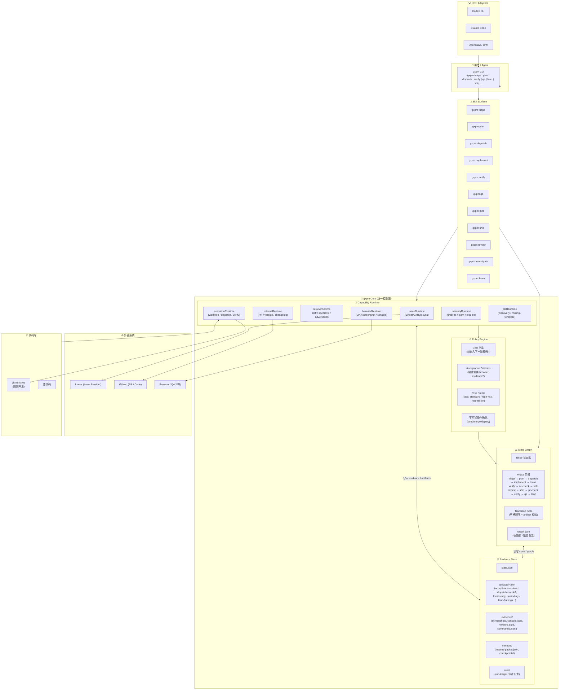
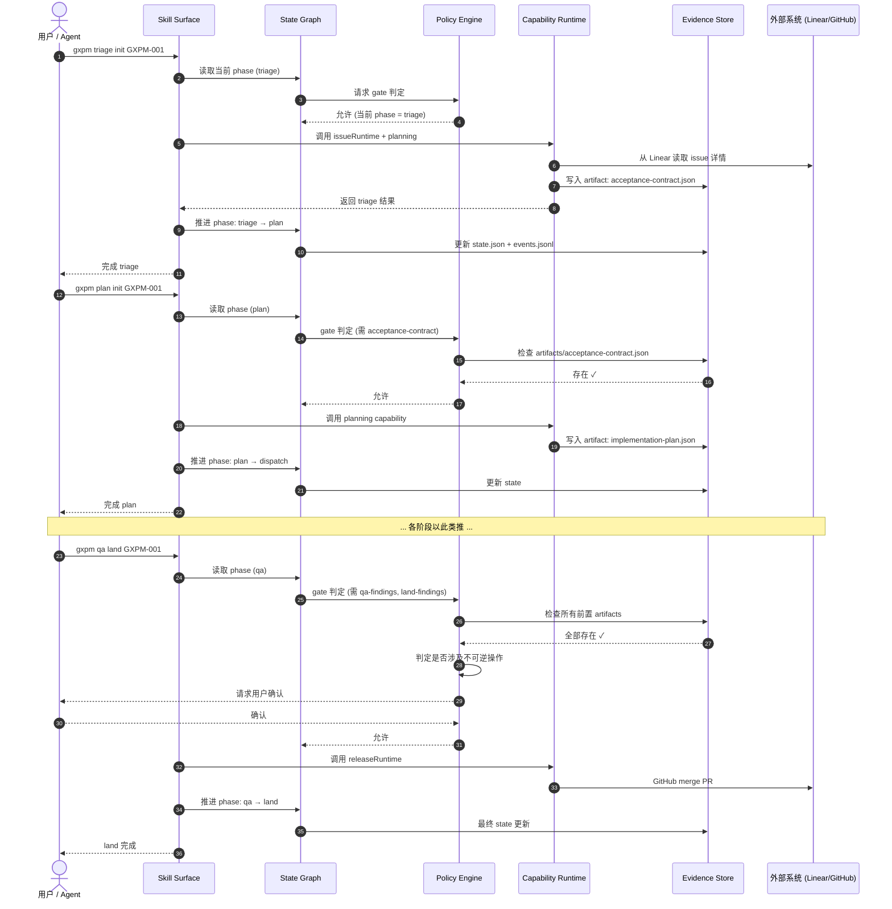

# gxpm 架构图

> 基于 `gxpm-replacement-architecture.md` 和 `gxpm-v0-contract.md` 绘制

---

## 1. 顶层公式

```text
gxpm = State Graph + Capability Runtime + Evidence Store + Policy Engine + Skill Surface
```

---

## 2. 整体架构图 (Mermaid)



---

## 3. 核心数据流



---

## 4. V0 本地目录结构 (Evidence Store 实体)

```text
.gxpm/
└── issues/<issue-id>/
    ├── state.json              ← 状态机真值
    ├── graph.json              ← 依赖/阻塞关系
    ├── events.jsonl            ← 阶段转换审计日志
    ├── artifacts/
    │   ├── index.json
    │   ├── acceptance-contract.json
    │   ├── implementation-plan.json
    │   ├── dispatch-handoff.json
    │   ├── local-verify.json
    │   ├── acceptance-check.json
    │   ├── self-review.json
    │   ├── ship-readiness.json
    │   ├── pr-check.json
    │   ├── verify-findings.json
    │   ├── qa-findings.json
    │   └── land-findings.json
    ├── reports/                ← (未来) Markdown 渲染视图
    ├── evidence/
    │   ├── command-logs/
    │   ├── browser-snapshots/
    │   ├── browser-screenshots/
    │   ├── browser-console/
    │   ├── browser-errors/
    │   ├── investigations/
    │   ├── review/
    │   ├── release/
    │   └── screenshots/        ← 兼容旧路径
    ├── memory/
    │   ├── resume-packet.json  ← 会话恢复入口
    │   └── checkpoints/
    │       └── 20260427-044500-handoff.md
    └── runs/
        └── run-20260428123000-1a2b3c4d.json
```

---

## 5. 真值优先级金字塔

```text
        ┌─────────────────┐
        │  phase JSON     │  ← 最高真值
        │  artifacts      │
        ├─────────────────┤
        │   state.json    │
        ├─────────────────┤
        │ resume-packet   │
        ├─────────────────┤
        │ rendered md     │
        │ reports         │
        ├─────────────────┤
        │ Linear comments │
        │ PR body         │
        │ chat history    │  ← 最低真值
        └─────────────────┘
```

---

## 6. 与上游项目的关系

```text
┌─────────────────────────────────────────────────────────────┐
│                        gxpm (二代产品)                       │
│  ┌─────────────┐  ┌──────────────┐  ┌─────────────────────┐ │
│  │  State Graph │  │ Capability   │  │   Evidence Store    │ │
│  │  (统一状态机)│  │ Runtime      │  │   (统一证据层)       │ │
│  └─────────────┘  │ (统一能力)   │  └─────────────────────┘ │
│                   └──────────────┘                          │
│                           ▲                                 │
│         ┌─────────────────┴─────────────────┐               │
│         ▼                                   ▼               │
│   ┌─────────────┐                   ┌─────────────┐         │
│   │    PMC      │  ── 吸收/迁移 ──▶ │  gxpm Core  │         │
│   │(phase gate, │                   │ (native)    │         │
│   │ checkpoint) │                   │             │         │
│   └─────────────┘                   └─────────────┘         │
│   ┌─────────────┐                   ┌─────────────┐         │
│   │   gstack    │  ── 吸收/迁移 ──▶ │  gxpm Core  │         │
│   │(browser QA, │                   │ (native)    │         │
│   │ review,ship)│                   │             │         │
│   └─────────────┘                   └─────────────┘         │
│                                                             │
│   原则：PMC/gstack 是上游研究对象与能力来源，不是长期运行时依赖   │
└─────────────────────────────────────────────────────────────┘
```

---

*生成时间: 2026-05-02*
*来源文档: `docs/architecture/gxpm-replacement-architecture.md`, `docs/architecture/gxpm-v0-contract.md`*
