# gxpm 当前系统架构图（v0）

> 绘制日期：2026-05-02
> 目的：可视化当前 gxpm 的组件关系与数据流，作为重构规划的基线

---

## 1. 系统分层架构图

```mermaid
graph TB
    subgraph "External Systems"
        LINEAR["Linear<br/>Issue Tracker"]
        GRAPH["code-review-graph<br/>MCP Server"]
        GIT["Git Repository"]
    end

    subgraph "Host Layer"
        CODEX["Codex CLI<br/>OpenAI"]
        CLAUDE["Claude Code<br/>Anthropic"]
    end

    subgraph "Skill Layer"
        direction TB
        SKILL_GXPM["skills/gxpm/<br/>SKILL.md.tmpl"]
        SKILL_GEN["scripts/<br/>gen-skill-docs.ts"]
        SKILL_OUT["skills/gxpm/<br/>SKILL.md<br/>(generated)"]
        SKILL_INST["scripts/<br/>install-skill.ts"]
        SKILL_DEV["scripts/<br/>dev-skill.ts"]
        SKILL_ORPHAN[".claude/skills/<br/>*.md<br/>(4 orphans)"]
    end

    subgraph "Hook Layer"
        GIT_HOOKS[".githooks/<br/>pre-commit, commit-msg,<br/>pre-push, post-merge"]
        CODEX_HOOKS[".codex/hooks/<br/>SessionStart,<br/>UserPromptSubmit"]
    end

    subgraph "CLI Layer (bin/)"
        CLI_MAIN["gxpm<br/>main CLI"]
        CLI_INIT["gxpm-init<br/>install skill + hooks"]
        CLI_INV["gxpm-investigate<br/>browser evidence"]
        CLI_CFG["gxpm-config<br/>config mgmt"]
        CLI_OTHERS["gxpm-update-check<br/>gxpm-global-discover<br/>gxpm-uninstall"]
    end

    subgraph "Core Runtime (core/)"
        direction TB

        subgraph "Issue & State"
            ISSUES["issues.ts<br/>CRUD"]
            STATE["state.ts<br/>state machine"]
            SESSION["session.ts<br/>ownership"]
            CHECKPOINT["checkpoint.ts<br/>handoff"]
            RUNS["runs.ts<br/>execution ledger"]
        end

        subgraph "Phase Engine"
            PHASE_GATES["phase-gates.ts<br/>gate definitions"]
            PHASE_ART["phase-artifact.ts<br/>artifact mapping"]
            TRIAGE["triage.ts"]
            PLAN["plan.ts"]
            DISPATCH["dispatch.ts"]
            IMPLEMENT["implement.ts"]
            AC_CHECK["ac-check.ts"]
            SELF_REVIEW["self-review.ts"]
            SHIP["ship.ts"]
            PR_CHECK["pr-check.ts"]
            VERIFY["verify.ts"]
            QA["qa.ts"]
            LAND["land.ts"]
            GATE["gate.ts<br/>enforcement"]
        end

        subgraph "Workspace & Orchestration"
            WORKSPACE["workspace-runtime.ts"]
            ORCH["orchestrator.ts<br/>tick dispatch"]
            READINESS["issue-readiness.ts"]
        end

        subgraph "Artifact & Evidence"
            ARTIFACTS["artifacts.ts"]
            EVIDENCE["evidence.ts"]
        end

        subgraph "Knowledge & Wiki"
            WIKI["wiki.ts"]
            WIKI_NATIVE["wiki-native.ts<br/>first-party"]
        end

        subgraph "Config & Capabilities"
            CONFIG["config.ts<br/>resolution chain"]
            CAPS["capabilities.ts<br/>registry"]
            PROBE["command-probe.ts"]
            PLAN_LINT["plan-lint.ts"]
        end
    end

    subgraph "Storage Layer (.gxpm/)"
        ISSUE_STATE[".gxpm/issues/<id>/<br/>state + artifacts"]
        LOCAL_RUN[".gxpm/local/<br/>workspaces + runs"]
        WIKI_STORE[".gxpm/wiki/<br/>native index + content"]
        CONFIG_STORE[".gxpm/config.json"]
    end

    %% Host → Skill
    CODEX --> |"loads"| SKILL_OUT
    CLAUDE --> |"loads"| SKILL_ORPHAN

    %% Skill generation flow
    SKILL_GXPM --> |"renderTemplate<br/>PHASE_GATE_RULES"| SKILL_GEN
    SKILL_GEN --> SKILL_OUT
    SKILL_OUT --> |"copy to host"| SKILL_INST
    SKILL_INST --> |"installs to"| CODEX
    SKILL_DEV --> |"watch"| SKILL_GXPM

    %% CLI → Core
    CLI_MAIN --> ISSUES
    CLI_MAIN --> STATE
    CLI_MAIN --> ARTIFACTS
    CLI_MAIN --> GATE
    CLI_MAIN --> WIKI
    CLI_MAIN --> CONFIG
    CLI_INIT --> SKILL_INST
    CLI_INIT --> GIT_HOOKS
    CLI_INIT --> CODEX_HOOKS
    CLI_INV --> EVIDENCE

    %% Core → Storage
    ISSUES --> ISSUE_STATE
    STATE --> ISSUE_STATE
    ARTIFACTS --> ISSUE_STATE
    RUNS --> LOCAL_RUN
    WORKSPACE --> LOCAL_RUN
    WIKI_NATIVE --> WIKI_STORE
    CONFIG --> CONFIG_STORE

    %% Core → External
    ISSUES -.-> |"sync"| LINEAR
    QODER_MOD -.-> |"optional link"| QODER
    ORCH -.-> |"dispatch"| CODEX

    %% Hooks → Core
    GIT_HOOKS --> |"calls"| GATE
    CODEX_HOOKS --> |"inject context"| STATE

    %% Graph skill (orphan path)
    SKILL_ORPHAN -.-> |"uses MCP"| GRAPH
```

---

## 2. 关键观察

### 2.1 Skill 层是"单点 + 孤儿"结构

- **主 skill**：`skills/gxpm/SKILL.md.tmpl` → `SKILL.md`（673 行，所有能力塞在一起）
- **孤儿 skill**：`.claude/skills/*.md`（4 个 graph skill，手写、不走 gen:skill-docs、不被 install-skill 管理）
- **生成管道**：`discoverTemplates()` 虽支持递归发现，但 `install-skill.ts` 和 `dev-skill.ts` 硬编码只处理 `skills/gxpm/SKILL.md.tmpl`

### 2.2 Core 是按 Phase 组织的，但 Skill 是平铺的

- Core 有清晰的 phase 文件：`triage.ts`, `plan.ts`, `dispatch.ts` ... `land.ts`
- 但 Skill 把所有 phase 的指引塞进一个文件，导致 progressive disclosure 失效

### 2.3 Host 适配层只处理安装路径，不处理 skill 内容分发

- `hosts/codex.ts` 定义了 `globalRoot: ".codex/skills/gxpm"`
- `hosts/claude.ts` 定义了 `globalRoot: ".claude/skills/gxpm"`
- 但 4 个 graph skill 只在 `.claude/skills/` 存在，Codex 宿主看不到它们

### 2.4 外部系统集成是"可选依赖"模式

- Linear：协作前门，同步 issue，但不替代本地 state
- code-review-graph：MCP 工具，Claude Code 专用，Codex 不用
