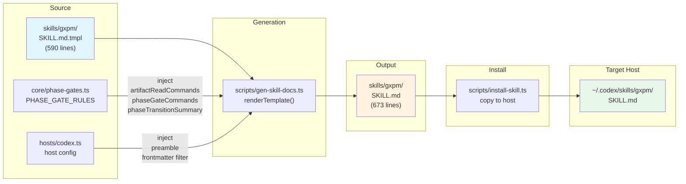
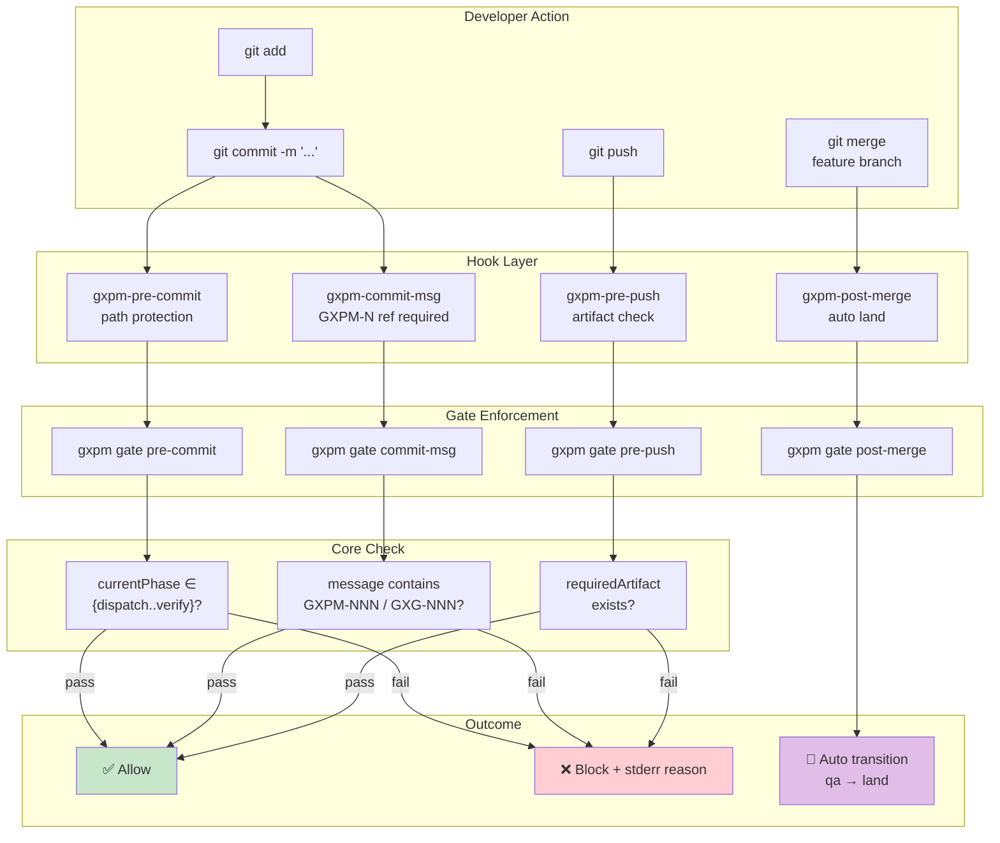
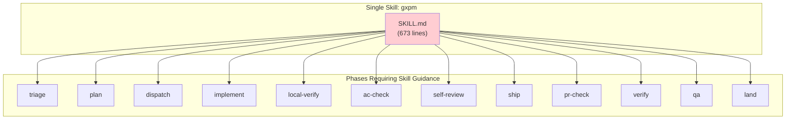
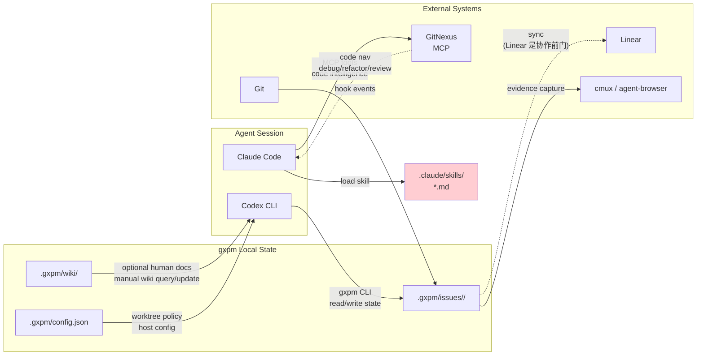

# gxpm 当前业务流程图（v0）

> 绘制日期：2026-05-02
> 覆盖：Skill 生命周期、Issue 交付生命周期、Git 提交生命周期

---

## 1. Skill 生命周期（当前）

### 关键问题

- **单点故障**：只有一个 tmpl → 一个输出 → 一个安装目标
- **代码智能 skill**：`skills/gxpm-*`（GitNexus 驱动）在项目生命周期内维护；旧 Claude-only 图谱 skill 已归档
- **无版本管理**：生成产物 SKILL.md 入 git，但 install 目标在用户 home 目录

---

## 2. Issue 交付生命周期（当前 12 Phase）

```mermaid
flowchart LR
    subgraph "Intake"
        CREATE["gxpm issue create<br/>--auto-id"]
        LINEAR["Linear Issue<br/>(optional upstream)"]
    end

    subgraph "Phase Pipeline"
        direction TB
        TRIAGE["1. triage<br/>acceptance-contract"]
        PLAN["2. plan<br/>implementation-plan"]
        DISPATCH["3. dispatch<br/>dispatch-handoff"]
        IMPLEMENT["4. implement<br/>(code changes)"]
        LOCAL_VERIFY["5. local-verify<br/>local-verify artifact"]
        AC_CHECK["6. ac-check<br/>acceptance-check"]
        SELF_REVIEW["7. self-review<br/>ship-readiness"]
        SHIP["8. ship<br/>pr-check"]
        PR_CHECK["9. pr-check<br/>verify-findings"]
        VERIFY["10. verify<br/>qa-findings"]
        QA["11. qa<br/>land-findings"]
        LAND["12. land<br/>cleanup"]
    end

    subgraph "Gates"
        GATE_T["gate:<br/>triage→plan"]
        GATE_P["gate:<br/>plan→dispatch"]
        GATE_D["gate:<br/>dispatch→implement"]
        GATE_I["gate:<br/>implement→local-verify"]
        GATE_LV["gate:<br/>local-verify→ac-check"]
        GATE_AC["gate:<br/>ac-check→self-review"]
        GATE_SR["gate:<br/>self-review→ship"]
        GATE_S["gate:<br/>ship→pr-check"]
        GATE_PC["gate:<br/>pr-check→verify"]
        GATE_V["gate:<br/>verify→qa"]
        GATE_Q["gate:<br/>qa→land"]
    end

    CREATE --> TRIAGE
    LINEAR -.-> |"sync"| CREATE

    TRIAGE --> |"transition"| GATE_T --> PLAN
    PLAN --> |"transition"| GATE_P --> DISPATCH
    DISPATCH --> |"transition"| GATE_D --> IMPLEMENT
    IMPLEMENT --> |"transition"| GATE_I --> LOCAL_VERIFY
    LOCAL_VERIFY --> |"transition"| GATE_LV --> AC_CHECK
    AC_CHECK --> |"transition"| GATE_AC --> SELF_REVIEW
    SELF_REVIEW --> |"transition"| GATE_SR --> SHIP
    SHIP --> |"transition"| GATE_S --> PR_CHECK
    PR_CHECK --> |"transition"| GATE_PC --> VERIFY
    VERIFY --> |"transition"| GATE_V --> QA
    QA --> |"transition"| GATE_Q --> LAND

    style TRIAGE fill:#e3f2fd
    style PLAN fill:#e3f2fd
    style DISPATCH fill:#e3f2fd
    style IMPLEMENT fill:#fff3e0
    style LOCAL_VERIFY fill:#e8f5e9
    style AC_CHECK fill:#e8f5e9
    style SELF_REVIEW fill:#fce4ec
    style SHIP fill:#fce4ec
    style PR_CHECK fill:#fce4ec
    style VERIFY fill:#f3e5f5
    style QA fill:#f3e5f5
    style LAND fill:#f3e5f5
```

### Phase 颜色分类

| 颜色 | 阶段 | 负责方 | 关键产出 |
|------|------|--------|---------|
| 🔵 蓝 | Intake & Plan | Agent + User | acceptance-contract, implementation-plan |
| 🟡 黄 | Implement | Agent | 代码变更 |
| 🟢 绿 | Local Verify | Agent | 本地验证证据 |
| 🔴 红 | Review & Ship | Agent | ship-readiness, pr-check |
| 🟣 紫 | External Verify | Agent / External | qa-findings, land-findings |

---

## 3. Git 提交生命周期（Hook 防御层）

---

## 4. Skill 与 Phase 的映射关系（当前）

### 问题可视化

**一个大 skill 承载了 12 个 phase 的指引**， progressive disclosure 完全失效。每次 Codex 加载时，不管当前处于哪个 phase，都要把 673 行全塞进上下文。

---

## 5. 外部系统集成数据流

### 关键问题

- **Agent 代码智能** 应统一走 GitNexus MCP，用于 code nav、debug、refactor、review。
- **gxpm wiki** 是可选人类说明书，用于 onboarding 和治理/CLI 导览；不作为 SessionStart 默认上下文，也不替代 GitNexus。
- **Codex CLI** 仍通过 gxpm CLI 读写 issue state；代码理解能力应通过 GitNexus skills 暴露，而不是扩大 wiki 职责。
