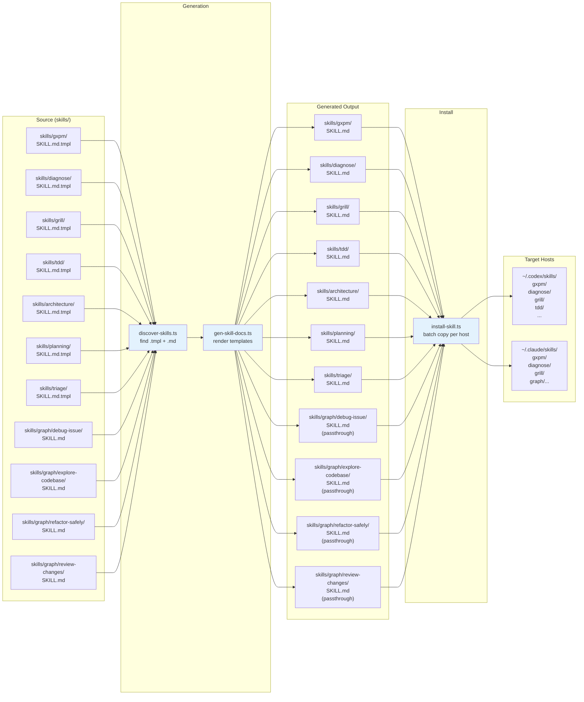
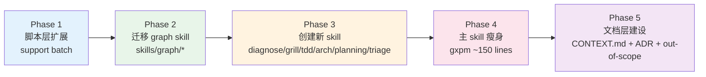

# gxpm 目标系统架构图（v1 — Skill 拆分 + Matt 吸收）

> 绘制日期：2026-05-02
> 基于当前 v0 架构的重构目标

---

## 1. 设计原则

1. **One skill, one responsibility** — 每个 skill 只负责一个工程纪律或一个 phase 簇
2. **Progressive disclosure** — 宿主只加载当前需要的 skill，不加载全部
3. **统一生命周期** — 所有 skill（生成的 + 手写的）走同一套 `gen:skill-docs` + `install-skill` 管道
4. **Host parity** — Codex 和 Claude 获得对等的核心能力，差异仅在于宿主特定的交互模式
5. **Matt 吸收，gxpm 统一** — 将 Matt Pocock 的纪律融入 gxpm phase gate，不保留平行流程

---

## 2. 目标分层架构图

```mermaid
graph TB
    subgraph "External Systems"
        LINEAR["Linear<br/>Issue Tracker"]
        GITNEXUS["GitNexus<br/>MCP Server"]
        GIT["Git Repository"]
    end

    subgraph "Host Layer"
        CODEX["Codex CLI<br/>OpenAI"]
        CLAUDE["Claude Code<br/>Anthropic"]
    end

    subgraph "Skill Layer (Unified)"
        direction TB

        subgraph "Core Runtime"
            SKILL_GXPM["skills/gxpm/<br/>SKILL.md.tmpl<br/>(~150 lines, slim)"]
        end

        subgraph "Engineering Disciplines<br/>(absorbed from Matt)"
            SKILL_DIAGNOSE["skills/diagnose/<br/>SKILL.md.tmpl<br/>feedback loop → fix"]
            SKILL_GRILL["skills/grill/<br/>SKILL.md.tmpl<br/>alignment + CONTEXT.md"]
            SKILL_TDD["skills/tdd/<br/>SKILL.md.tmpl<br/>red-green-refactor"]
            SKILL_ARCH["skills/architecture/<br/>SKILL.md.tmpl<br/>deepening + seams"]
            SKILL_PLANNING["skills/planning/<br/>SKILL.md.tmpl<br/>PRD + vertical slices"]
            SKILL_TRIAGE["skills/triage/<br/>SKILL.md.tmpl<br/>state machine + briefs"]
        end

        subgraph "Code Intelligence<br/>(migrated from .claude/skills)"
            SKILL_DEBUG["skills/graph/debug-issue/<br/>SKILL.md"]
            SKILL_EXPLORE["skills/graph/explore-codebase/<br/>SKILL.md"]
            SKILL_REFACTOR["skills/graph/refactor-safely/<br/>SKILL.md"]
            SKILL_REVIEW["skills/graph/review-changes/<br/>SKILL.md"]
        end
    end

    subgraph "Skill Toolchain"
        DISCOVER["scripts/discover-skills.ts<br/>recursive discovery"]
        GEN["scripts/gen-skill-docs.ts<br/>renderTemplate()"]
        INST["scripts/install-skill.ts<br/>batch install"]
        DEV["scripts/dev-skill.ts<br/>watch all templates"]
    end

    subgraph "Hook Layer"
        GIT_HOOKS[".githooks/<br/>pre-commit, commit-msg,<br/>pre-push, post-merge"]
        CODEX_HOOKS[".codex/hooks/<br/>SessionStart,<br/>UserPromptSubmit"]
        GIT_GUARD[".codex/hooks/<br/>PreToolUse<br/>block dangerous git"]
    end

    subgraph "CLI Layer (bin/)"
        CLI_MAIN["gxpm<br/>main CLI"]
        CLI_INIT["gxpm-init<br/>install all skills + hooks"]
        CLI_INV["gxpm-investigate<br/>browser evidence"]
        CLI_CFG["gxpm-config<br/>config mgmt"]
    end

    subgraph "Core Runtime (core/)"
        direction TB

        subgraph "Issue & State"
            ISSUES["issues.ts"]
            STATE["state.ts"]
            SESSION["session.ts"]
            CHECKPOINT["checkpoint.ts"]
            RUNS["runs.ts"]
        end

        subgraph "Phase Engine"
            PHASE_GATES["phase-gates.ts"]
            PHASE_ART["phase-artifact.ts"]
            TRIAGE["triage.ts"]
            PLAN["plan.ts"]
            DISPATCH["dispatch.ts"]
            IMPLEMENT["implement.ts"]
            AC_CHECK["ac-check.ts"]
            SELF_REVIEW["self-review.ts"]
            SHIP["ship.ts"]
            PR_CHECK["pr-check.ts"]
            VERIFY["verify.ts"]
            QA["qa.ts"]
            LAND["land.ts"]
            GATE["gate.ts"]
        end

        subgraph "Workspace & Orchestration"
            WORKSPACE["workspace-runtime.ts"]
            ORCH["orchestrator.ts"]
            READINESS["issue-readiness.ts"]
        end

        subgraph "Artifact & Evidence"
            ARTIFACTS["artifacts.ts"]
            EVIDENCE["evidence.ts"]
        end

        subgraph "Knowledge & Wiki"
            WIKI["wiki.ts"]
            WIKI_NATIVE["wiki-native.ts"]
        end

        subgraph "Config & Capabilities"
            CONFIG["config.ts"]
            CAPS["capabilities.ts"]
            PROBE["command-probe.ts"]
        end
    end

    subgraph "Storage Layer (.gxpm/)"
        ISSUE_STATE[".gxpm/issues/<id>/"]
        LOCAL_RUN[".gxpm/local/"]
        WIKI_STORE[".gxpm/wiki/"]
        CONFIG_STORE[".gxpm/config.json"]
        OOS_STORE[".gxpm/out-of-scope/<br/>(new)"]
    end

    subgraph "Project Docs"
        CONTEXT["CONTEXT.md<br/>(new: shared language)"]
        ADRS["docs/adr/<br/>(architecture decisions)"]
        AGENTS["AGENTS.md<br/>(rules only)"]
    end

    %% Unified Skill Discovery & Generation
    DISCOVER --> |"find all<br/>SKILL.md.tmpl + SKILL.md"| GEN
    SKILL_GXPM --> GEN
    SKILL_DIAGNOSE --> GEN
    SKILL_GRILL --> GEN
    SKILL_TDD --> GEN
    SKILL_ARCH --> GEN
    SKILL_PLANNING --> GEN
    SKILL_TRIAGE --> GEN

    GEN --> |"generated output"| INST
    INST --> |"install to host"| CODEX
    INST --> |"install to host"| CLAUDE
    DEV --> |"watch all templates"| DISCOVER

    %% Host loads skills on demand
    CODEX --> |"loads by phase"| SKILL_GXPM
    CODEX --> |"loads by intent"| SKILL_DIAGNOSE
    CODEX --> |"loads by intent"| SKILL_GRILL
    CODEX --> |"loads by intent"| SKILL_TDD
    CODEX --> |"loads by intent"| SKILL_ARCH
    CODEX --> |"loads by intent"| SKILL_PLANNING
    CODEX --> |"loads by intent"| SKILL_TRIAGE

    CLAUDE --> |"loads by phase"| SKILL_GXPM
    CLAUDE --> |"loads by intent"| SKILL_DIAGNOSE
    CLAUDE --> |"loads by intent"| SKILL_GRILL
    CLAUDE --> |"loads by intent"| SKILL_TDD
    CLAUDE --> |"loads by intent"| SKILL_ARCH
    CLAUDE --> |"loads by intent"| SKILL_PLANNING
    CLAUDE --> |"loads by intent"| SKILL_TRIAGE
    CLAUDE --> |"loads by intent"| SKILL_DEBUG
    CLAUDE --> |"loads by intent"| SKILL_EXPLORE
    CLAUDE --> |"loads by intent"| SKILL_REFACTOR
    CLAUDE --> |"loads by intent"| SKILL_REVIEW

    %% Core & Storage
    CLI_MAIN --> ISSUES
    CLI_MAIN --> STATE
    CLI_MAIN --> ARTIFACTS
    CLI_MAIN --> GATE
    CLI_MAIN --> WIKI
    CLI_MAIN --> CONFIG

    ISSUES --> ISSUE_STATE
    STATE --> ISSUE_STATE
    ARTIFACTS --> ISSUE_STATE
    RUNS --> LOCAL_RUN
    WORKSPACE --> LOCAL_RUN
    WIKI_NATIVE --> WIKI_STORE
    CONFIG --> CONFIG_STORE

    %% External
    ISSUES -.-> LINEAR
    QODER_MOD -.-> QODER
    ORCH -.-> CODEX

    %% Hooks
    GIT_HOOKS --> GATE
    CODEX_HOOKS --> STATE
    GIT_GUARD --> |"blocks dangerous<br/>git commands"| CODEX

    %% Docs
    SKILL_GRILL -.-> |"reads/writes"| CONTEXT
    SKILL_GRILL -.-> |"reads/writes"| ADRS
    SKILL_ARCH -.-> |"reads"| CONTEXT
    SKILL_ARCH -.-> |"reads"| ADRS
    SKILL_TRIAGE -.-> |"reads"| OOS_STORE

    %% Graph skills use GitNexus MCP
    SKILL_DEBUG -.-> |"MCP"| GITNEXUS
    SKILL_EXPLORE -.-> |"MCP"| GITNEXUS
    SKILL_REFACTOR -.-> |"MCP"| GITNEXUS
    SKILL_REVIEW -.-> |"MCP"| GITNEXUS

    style SKILL_GXPM fill:#e3f2fd
    style SKILL_DIAGNOSE fill:#e8f5e9
    style SKILL_GRILL fill:#e8f5e9
    style SKILL_TDD fill:#e8f5e9
    style SKILL_ARCH fill:#e8f5e9
    style SKILL_PLANNING fill:#e8f5e9
    style SKILL_TRIAGE fill:#e8f5e9
    style SKILL_DEBUG fill:#fff3e0
    style SKILL_EXPLORE fill:#fff3e0
    style SKILL_REFACTOR fill:#fff3e0
    style SKILL_REVIEW fill:#fff3e0
    style CONTEXT fill:#f3e5f5
    style OOS_STORE fill:#f3e5f5
```

---

## 3. 目标 Skill → Phase 映射

```mermaid
flowchart TB
    subgraph "Skill Registry"
        GXPM["gxpm<br/>(core runtime)"]
        TRIAGE_SKILL["triage<br/>(Matt absorbed)"]
        GRILL["grill<br/>(Matt absorbed)"]
        PLANNING["planning<br/>(Matt absorbed)"]
        TDD["tdd<br/>(Matt absorbed)"]
        DIAGNOSE["diagnose<br/>(Matt + gxpm)"]
        ARCH["architecture<br/>(Matt absorbed)"]
        GITNEXUS_SKILLS["gitnexus<br/>(code intelligence skills)"]
    end

    subgraph "Phase Pipeline"
        TRIAGE["1. triage"]
        PLAN["2. plan"]
        DISPATCH["3. dispatch"]
        IMPLEMENT["4. implement"]
        LOCAL_VERIFY["5. local-verify"]
        AC_CHECK["6. ac-check"]
        SELF_REVIEW["7. self-review"]
        SHIP["8. ship"]
        PR_CHECK["9. pr-check"]
        VERIFY["10. verify"]
        QA["11. qa"]
        LAND["12. land"]
    end

    GXPM --> TRIAGE
    GXPM --> PLAN
    GXPM --> DISPATCH
    GXPM --> IMPLEMENT
    GXPM --> LOCAL_VERIFY
    GXPM --> AC_CHECK
    GXPM --> SELF_REVIEW
    GXPM --> SHIP
    GXPM --> PR_CHECK
    GXPM --> VERIFY
    GXPM --> QA
    GXPM --> LAND

    TRIAGE_SKILL --> TRIAGE
    GRILL --> TRIAGE
    GRILL --> PLAN
    PLANNING --> PLAN
    TDD --> IMPLEMENT
    DIAGNOSE --> IMPLEMENT
    DIAGNOSE --> QA
    ARCH --> SELF_REVIEW
    ARCH --> LAND

    style GXPM fill:#e3f2fd
    style TRIAGE_SKILL fill:#e8f5e9
    style GRILL fill:#e8f5e9
    style PLANNING fill:#e8f5e9
    style TDD fill:#e8f5e9
    style DIAGNOSE fill:#e8f5e9
    style ARCH fill:#e8f5e9
```

### 映射规则

| Phase | 主 Skill | 辅助 Skill | 职责分工 |
|-------|---------|-----------|---------|
| triage | `gxpm` + `triage` | `grill` | gxpm 管 gate，triage 管状态机，grill 管术语对齐 |
| plan | `gxpm` + `planning` | `grill` | gxpm 管 artifact，planning 管 PRD/切片，grill 管决策记录 |
| dispatch | `gxpm` | — | worktree、handoff、claim |
| implement | `gxpm` + `tdd` + `diagnose` | `architecture` | gxpm 管执行，tdd 管测试纪律，diagnose 管调试 |
| local-verify | `gxpm` | `tdd` | 回归测试验证 |
| ac-check | `gxpm` | — | 验收合约检查 |
| self-review | `gxpm` + `architecture` | `graph/review-changes` | 代码审查 + 架构审视 |
| ship | `gxpm` | — | PR 准备 |
| pr-check | `gxpm` | `graph/review-changes` | PR 风险评审 |
| verify | `gxpm` | — | 独立验证 |
| qa | `gxpm` + `diagnose` | `graph/debug-issue` | bug 调试 + 图谱诊断 |
| land | `gxpm` + `architecture` | — | 清理 + 架构复盘建议 |

---

## 4. 目标 Skill 生命周期（批量管道）

---

## 5. 目标 vs 当前：变更摘要

| 维度 | 当前 v0 | 目标 v1 |
|------|---------|---------|
| **Skill 数量** | 1 大 skill + 4 孤儿 | 1 核心 + 6 工程纪律 + 4 图谱 = 11 独立 skill |
| **Skill 管理** | 两套体系（生成 vs 手写） | 统一管道：所有 skill 走 `discover` → `gen` → `install` |
| **主 skill 大小** | 673 行 | ~150 行（只保留核心运行时） |
| **术语管理** | AGENTS.md 静态 | AGENTS.md + CONTEXT.md 动态维护 |
| **Out-of-scope** | 无 | `.gxpm/out-of-scope/` 知识库 |
| **调试** | 图谱导航（Claude only） | diagnose skill：反馈循环纪律 + 图谱导航（双宿主） |
| **TDD** | 无明确纪律 | tdd skill：垂直切片 + 红绿重构 |
| **架构审视** | 无 | architecture skill：deletion test + deepening |
| **Git 防护** | git hooks only | git hooks + PreToolUse guard（Matt 吸收） |
| **安装命令** | `gxpm-init --install-skill --host all` | `gxpm-init --install-skills --host all`（批量） |

---

## 6. 实施阶段（与代码重构对应）

